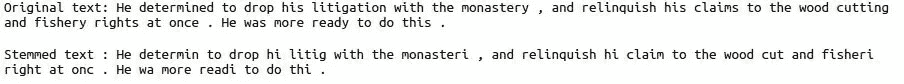
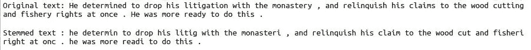
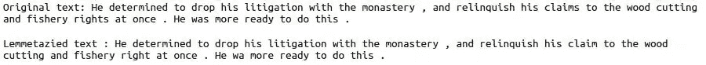
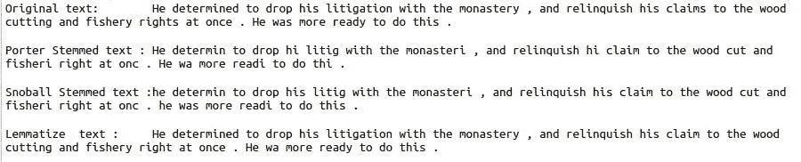

# 如何以及为什么从 NLTK 实现词干化和词汇化

> 原文：<https://pub.towardsai.net/how-and-why-to-implement-stemming-and-lemmatization-from-nltk-5f0cc69d2af?source=collection_archive---------0----------------------->

## 在本文中，我们试图通过实现词干化和词汇化来解决 NLP 的一个问题


资料来源:pixxabay.com

英语词汇中有一百多万个单词。目前大约有 17 万台在使用。这些词按照语法规则组合成一个句子。由于逻辑上的原因，句子使用不同形式的单词，如 plays、played 和 playing。

在处理自然语言处理(NLP)模型和问题时，这些单词没有多大帮助。NLP 问题的主要焦点是用更少的单词获得结果。解决这个问题节省了大量的处理时间和磁盘空间。

在本文中，我们试图通过实现词干化和词汇化来解决这个 NLP 问题。这两种方法都将派生单词转换成它们的基本单词。

但是，这两种方法使用的算法不同，不尽相同；本文我们将讨论这些差异和自然语言工具包(NLTK)的实现。

# 堵塞物

词干提取通过删除单词的最后一个字母来获得词根。这些词根也被称为词干。但是词干并不总是成为词根。这个句子变得毫无意义。词干也会降低模型的准确性。

有不同类型的词干算法。在本文中，我们只使用波特算法和滚雪球算法。这些算法比其他算法更有效。

波特斯特梅尔的 NLTK 实现。

```
import nltkporter_stemmer = nltk.PorterStemmer()text = f” He determined to drop his litigation with the monastery, and relinquish”\
    f” his claims to the wood cutting and fishery rights at once. “\
    f”He was more ready to do this.”text_without_stopword = [porter_stemmer.stem(word) for word in text.split()]print(f”Original text: {text} \n”)
print(f”Stemmed text : {‘ ‘.join(text_without_stopword)}”)
```



这种方法将单词“ready”和“thi”转换成“readi”和“thi ”,使句子变得毫无意义。此外，在单词“his”转换为“hi”后，句子的意思也发生了变化。我不建议用这种方法来构建任何关键项目。这种方法仅用于学习目的。

雪球斯特梅尔是波特梗的改进版本。这种方法在大型数据集上非常精确。

雪球斯特梅尔的 NLTK 实现。

```
import nltksnowball_stemmer = nltk.SnowballStemmer(‘english’)text = f” He determined to drop his litigation with the monastery, and relinquish”\
    f” his claims to the wood cutting and fishery rights at once. “\
    f”He was more ready to do this.”text_without_stopword = [snowball_stemmer.stem(word) for word in text.split()]print(f”Original text: {text} \n”)
print(f”Stemmed text : {‘ ‘.join(text_without_stopword)}”)
```



这个方法不能把单词转换成 hi。字母被恰当地从单词切割、声明和权利中切掉。我们可以说有所改善。但是将单词“once”和“monastry”转换成“onc”和“monastri”使这个句子变得毫无意义。

# 词汇化

词汇化方法通过分析词的结构、词与词之间的关系以及词类来准确识别词根。词性标记和词汇单词有助于返回单词的词典形式。但是与词干法相比，这需要大量的处理时间和磁盘空间。该方法中 NLP 模型的精度较高。这个词根被称为一个引理。

引理化的 NLTK 实现。

```
from nltk.stem import WordNetLemmatizerlemmatizer = WordNetLemmatizer()text = f” He determined to drop his litigation with the monastery, and relinquish”\
    f” his claims to the wood cutting and fishery rights at once. “\
    f”He was more ready to do this.”text_without_stopword = [lemmatizer.lemmatize(word) for word in text.split()]print(f”Original text: {text} \n”)
print(f”Lemmetazied text : {‘ ‘.join(text_without_stopword)}”)
```



词汇化方法将单词“claims”和“rights”转换为“claim”和“right”其他单词不受影响。句子的意思是完整的。

**区分词汇化和词干化的代码**

```
import nltk
from nltk.stem import WordNetLemmatizerlemmatizer = WordNetLemmatizer()
ps = nltk.PorterStemmer()
stemmer = nltk.SnowballStemmer(‘english’)text = f”He determined to drop his litigation with the monastery, and relinquish”\
    f” his claims to the wood cutting and fishery rights at once. “\
    f”He was more ready to do this.”porter_stem_text = [ps.stem(word) for word in text.split()]
snowball_stem_text = [stemmer.stem(word) for word in text.split()]
lemmatize_stem_text = [lemmatizer.lemmatize(word) for word in text.split()]print(f”Original text: {text} \n”)
print(f”Porter Stemmed text : {‘ ‘.join(porter_stem_text)}\n”)
print(f”Snoball Stemmed text :{‘ ‘.join(snowball_stem_text)}\n”)
print(f”Lemmatize text : {‘ ‘.join(lemmatize_stem_text)}\n”)
```



波特和斯诺鲍词干法将一些单词转换成非词典单词。这种单词转换限制了波特和滚雪球词干法在搜索引擎、n 元语法上下文和文本分类问题中的使用。

词汇化可用于段落/文档摘要、单词/句子预测、情感分析等。

# 结论

词干化或词汇化的选择完全取决于项目需求。对于关键项目和句子结构像语言应用程序一样重要的项目，术语化是强制性的。词干化或词汇化确实会影响精确度和召回率。词干处理降低了精度性能，提高了召回性能。

希望这篇文章能帮助你解决 NLP 模型和问题。

**作者的其他文章**

1.  [EDA 的第一步:描述性统计分析](https://medium.com/analytics-vidhya/first-step-in-eda-descriptive-statistics-analysis-f49ca309da15)
2.  [Reddit Post:text blob 和 VADER](https://towardsdatascience.com/automate-sentiment-analysis-process-for-reddit-post-textblob-and-vader-8a79c269522f) 的自动化情感分析流程
3.  [使用罗伯塔模型发现 Reddit 子群的情绪](https://towardsdatascience.com/discover-the-sentiment-of-reddit-subgroup-using-roberta-model-10ab9a8271b8)