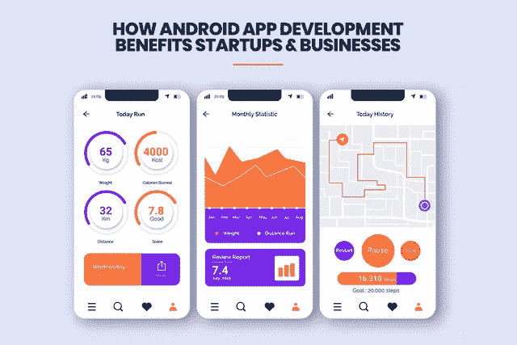
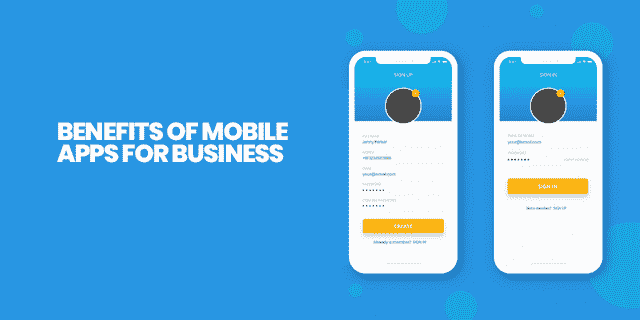

# Android 应用程序开发如何惠及初创公司和企业。

> 原文：<https://pub.towardsai.net/how-android-app-development-benefits-startups-businesses-7586b4f58cc0?source=collection_archive---------1----------------------->

## 你知道吗，手机用户 87%的时间花在各种移动应用上，而花在网络应用上的时间只有 13%。

> Android 作为使用最广泛的手机操作系统，是手机应用程序开发公司创建应用程序的首选。

随着智能手机的普及，世界各地的女性、男性和儿童也以数字方式联系在一起。这些智能手机不仅让我们能够与我们亲近的人交流，还能帮助我们从互联网上获取大量信息，只需点击几下鼠标就能让它们工作。现在手机用户可以买卖产品和服务。得益于移动应用，获得不同类型的服务和购买所需产品的能力现在就在你的手掌中。

## 智能手机用户稳步增长:

根据 Statista2018 年 1 月 [**的一份报告，全球有超过 37 亿手机用户。除此之外，智能手机约占全球互联网总使用量的 50%。有几份报告显示，全球智能手机用户的数量仍在以指数速度增长。**](https://www.statista.com/)

随着智能手机用户数量的增加，手机应用已经成为企业运营的一个重要方面。手机应用程序只是为 iOS、Android 等移动应用程序开发的软件程序。今天，几乎所有规模的公司都在网上保持竞争力；因此，他们需要移动应用程序在这方面提供帮助。

## 移动应用为企业带来的好处:

商人可以通过推出一个独特的移动应用程序获得广泛的好处，最好是由优质的应用程序开发公司创建的。

> 企业移动应用的一些优势如下:

## 1.创建和增加您的订户:

应用程序是与潜在客户、新客户和现有客户建立直接、持续关系的绝佳方式。

## 2.提高品牌知名度:

大量的人使用移动应用；因此，雇佣一家声誉好的公司进行 Android 或[iOS 应用程序开发](https://www.xicom.biz/offerings/iphone-development/) 有助于提高品牌知名度，并获得大量客户群。用户一天要花几个小时在手机屏幕上。因此，它是提高你的品牌识别度和知名度的有效途径。

## 3.网上购物的简单方法:

这些应用程序允许企业主发送报价，使用户能够全天候快速购物。

## 4.持续的客户连接:

商店和购物中心的传统购物范围正在日益缩小，移动应用程序开始出现，人们可以在这里购物，还可以获得优惠。应用程序将客户与服务提供商联系起来，并在家门口提供产品/服务。

# 移动应用给客户带来的好处:

***由最可靠、最高效的应用开发公司提供的移动应用让客户受益匪浅。***

> 以下是对客户的一些重要好处。

## 1.顺利销售:

现在，通过应用程序购物比传统的在线购物更受欢迎。顾客不必每次在网上购物时都填写相关信息。这些应用程序还记录了消费者的偏好。

## 2.持续沟通:

现在，使用由 [**android 应用程序开发公司**](https://www.xicom.biz/offerings/android-development/) 或 iOS 应用程序开发公司提供的移动应用程序已经成为持续沟通的来源，因为企业主可以将激动人心的事件和有吸引力的优惠直接发送到客户的手机上。与传统的促销和营销方法相比，这是一种有效的促销方法。

## 3.易于访问:

应用程序是客户购买产品和接受服务的最快和最好的方式。应用程序的存在对于您的企业提高效率至关重要。该应用还减少了消费者订单的处理时间。因此，从一家可靠的公司获得 app 开发服务已经成为必要。

# 为什么选择 Android 应用开发？

近年来，Android 移动应用程序得到了广泛使用，并成为全球最可靠的应用程序之一，因为大量公司正在使用根据其特定业务需求定制的移动应用程序。最近的分析和研究表明，商业专业人士优先考虑 Android 应用程序开发，以满足他们的各种业务需求。因此，Android 应用程序开发服务变得非常重要。

# 为什么选择 Android 应用程序开发选项？

移动应用为这个竞争激烈的市场开辟了一条新的道路。如今，公司找到了一种更好的方式来与潜在客户沟通，并通过移动应用程序及时向他们通报产品和服务。

> **一个重要的决策是为业务驱动的移动应用选择理想的平台。**

> 以下是 Android 移动应用程序开发的一些优势:

*   市场份额最大、最受欢迎的平台
*   最可行、收入最大的平台
*   一致、流畅的用户体验
*   以业务为中心的平台
*   简单快速的应用程序开发
*   适合高回报的投资
*   兼容所有基于 Android 的设备。
*   尖端工作
*   更好的保护
*   Android 应用程序是全球商业的最佳选择

# 下面详细讨论一下 Android 应用开发的一些好处:

## 大量的机会

世界各地的智能手机用户每天都会从 Google play 商店下载数百万个 Android 应用程序。这表明用户正在寻找更具创新性的应用程序，能够以更简单快捷的方式满足他们的需求。

大多数公司都在雇佣 Android 应用程序开发人员来开发针对他们业务的应用程序。如果初创公司通过安装适当的资源来专注于 Android 应用程序开发，并展示他们使用 Android 平台进行创新的能力，那么市场上可能会有大量的机会。

## 高投资回报

由于 Android 是一个平台，开发成本非常低，因为移动应用程序开发人员可以免费访问 SDK 和各种开发工具。

不仅如此，市场上还有大量拥有更新技能的 Android [**移动应用开发者**](https://www.xicom.biz/offerings/hire-mobile-developers/) 。创业公司进行资源和移动应用营销所需的投资。作为回报，这款应用提供了更大的盈利机会。

## 更高的生产率

移动应用程序开发人员可以使用 Android 应用程序开发平台来节省他们的精力，因为有大量的代码库可供广泛使用。这种现成的脚本需要运行，从而节省了创建特定功能的大量时间。因此，印度的应用程序开发人员可以实现更高的工作效率，并在市场上更快地推出移动应用程序，从而缩短产品营销时间。

## 全球开放应用分发

Android 手机应用在全球最大的开放市场谷歌 Play 商店上销售和分销。

> 在 Q1，2017 年超过[111 亿应用程序从谷歌 Play 商店下载](http://www.techtimes.com/articles/151617/20160420/google-play-store-on-the-rise-more-than-11-1-billion-downloads-in-q1-2016.htm)。

这有助于您控制发布移动应用程序的方式，无论何时，只要您愿意。您可以决定是在特定目标区域还是在全球发布移动应用程序。

这让您可以决定是以成本价还是免费出售移动应用程序。由于你拥有营销手机应用的所有控制权，你可以用自己的方式经营业务。

## 功能丰富的应用程序

Android 移动应用程序开发平台提供简单的内部定制，使您的移动应用程序更加动态，以满足业务需求。有了开源代码库和一套开发工具，应用程序可以变得具有交互性和丰富的功能。手机应用程序以用户友好的设计提供的功能越多，越多的客户喜欢下载这些功能。

## 互用性

每个企业都有许多不同的程序来管理其运营流程。为了同时管理不同的任务，许多系统都是亲自动手，需要创建与跨平台运行的第三方应用程序具有差异化和兼容性的企业级移动应用程序。

> 除此之外，Android 已被证明是成功创建企业级移动应用的最佳平台，这些应用可以与跨平台的移动应用进行互操作。

## 容易获得的资源

不仅 Android 应用程序开发 SDK 很容易获得，而且专业的 Android 应用程序开发人员现在也很容易。这有助于初创公司在更短的时间内招聘必要的技能并开始工作。即使在依附方面，创业公司也可以很容易地找到替代者。因此，如果你选择一个 Android 移动应用程序开发平台，那么人力资源技能需求可以很容易地得到满足。

**宣传&顾客到达**

这是 Android 应用程序业务的主要优势之一，您可以在 Google Play 上获得公开推广。每天都有数百万人访问 Google Play，这为您的移动应用提供了观看机会。你也可以选择谷歌 Play 商店上的营销计划来推广你的移动应用并获得高下载量。

移动应用初创公司的资源和预算有限，需要战略性地使用这些资源和预算，以实现最佳产出。因此，Android app 平台是创建和维护 [**移动应用**](https://www.xicom.biz/offerings/mobile-app-development/) 的最佳开发平台。除此之外，Android 移动应用市场正在蓬勃发展，这使得 Android 成为在市场上推出移动应用的更受欢迎的平台。将您的移动应用程序安装在 Android 平台上可以让您更广泛地接触全球客户。因此，如果你有一家移动应用初创公司，那么专注于 Android 平台可以成为你的盈利工具。

# **让我们总结一下:**

智能手机应用程序是执行各种业务功能的绝佳方式。这些可以是非正式 App，娱乐 App，美妆 App，商业 App，洗衣服务 App，家居服务 App 等。

这些移动应用程序有助于购买如此多的东西。几乎每个企业都在转向网上，以占据市场的重要份额，因为大多数人更喜欢使用移动电话来购买或销售产品。智能手机移动应用为各种类型的企业(无论规模大小)提供了便利和效率，以管理他们的客户并提高整体销售额。

一般两大平台 Android 和 iOS 占据整个市场份额。但是，平台的选择取决于消费者的人口统计数据。