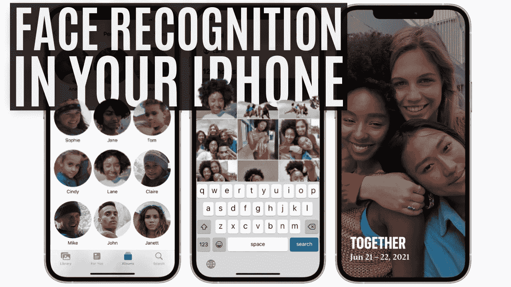
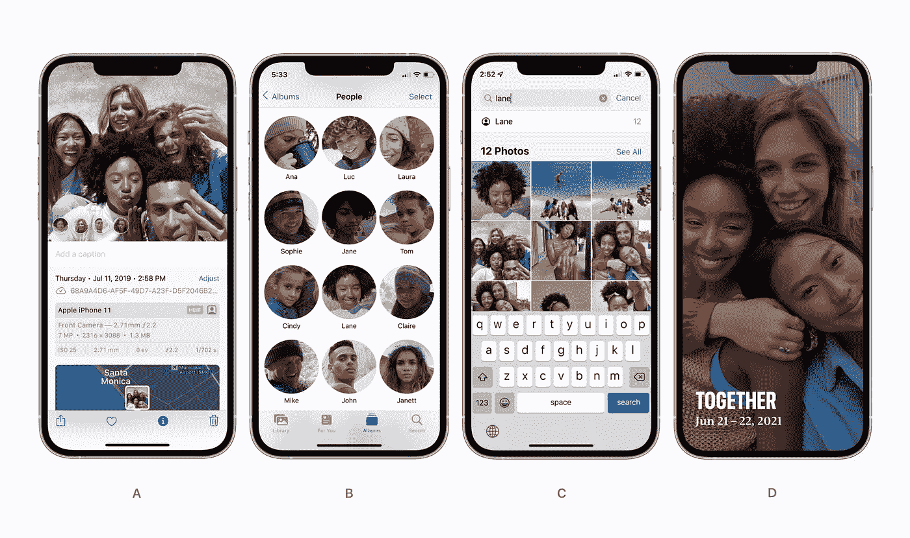
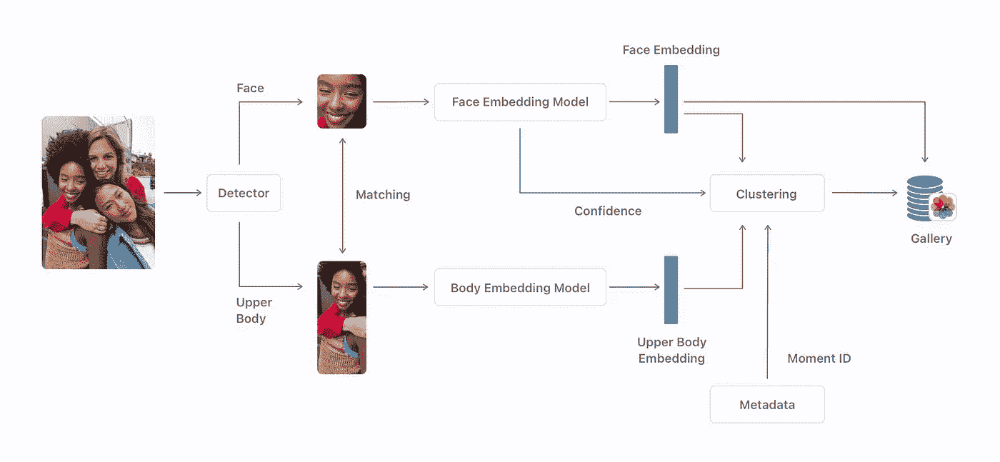
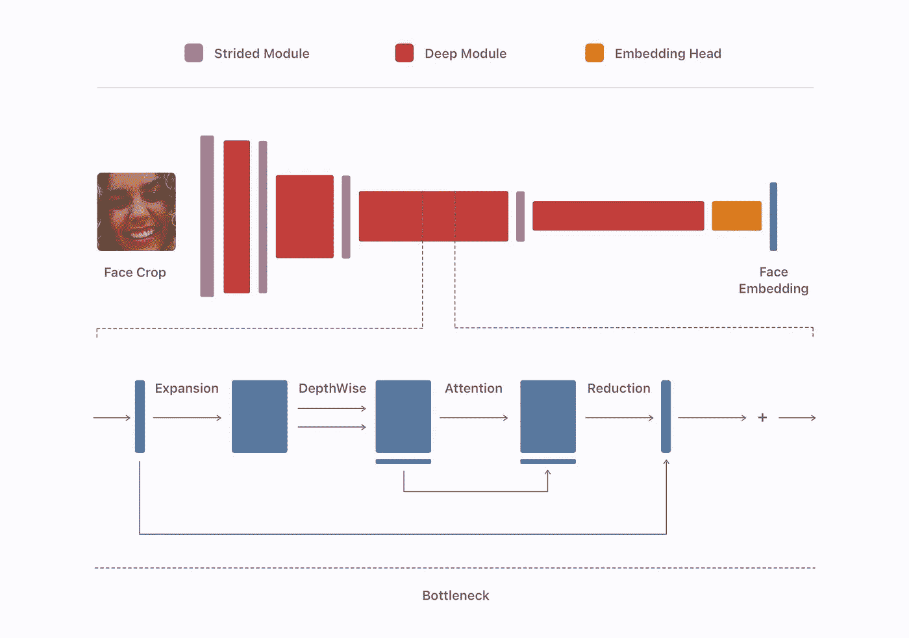
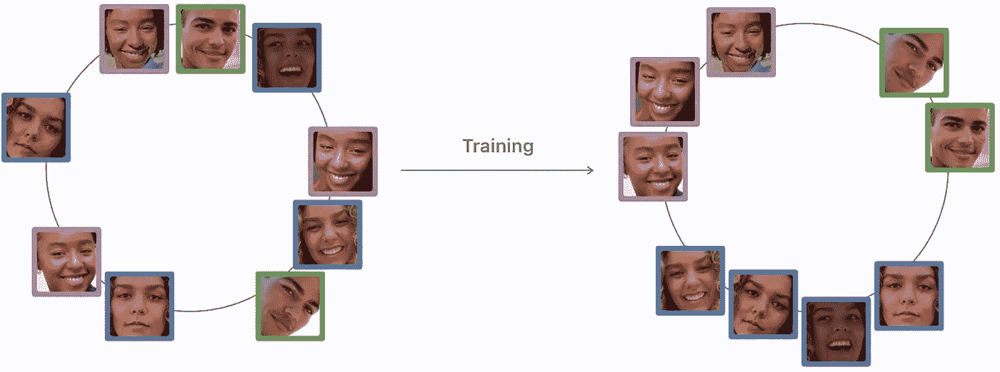

# Apple Photos 如何使用机器学习识别私人照片中的人

> 原文：<https://pub.towardsai.net/how-apple-photos-recognizes-people-in-private-photos-using-machine-learning-8c7f4d60f914?source=collection_archive---------3----------------------->

## [机器学习](https://towardsai.net/p/category/machine-learning)

## 使用多种基于机器学习的算法在你的设备上私下运行，苹果允许你在 iOS 15 上准确地管理和组织你的图像和视频。

> 原载于 [louisbouchard.ai](https://www.louisbouchard.ai/how-apple-photos-recognizes-people/) ，前两天在[我的博客](https://www.louisbouchard.ai/how-apple-photos-recognizes-people/)上看到的！

听听这个故事…

在最近的一份出版物中，苹果解释了他们如何使用机器学习直接识别 iPhones 和 iPads 上私人照片中的人，而无需访问你的图像来训练他们的算法。对于那些使用苹果产品的人，你可以通过照片应用程序中的人进行研究。

事实上，使用我将在本文中介绍的多种基于机器学习的算法，在你的设备上私下运行，你可以在 iOS 15 上准确地管理和组织你的图像和视频。它可以识别不同的人，让你在照片中搜索这个人出现的地方。如果你像我一样有成千上万的照片，你将会有不同的聚类，每个聚类代表不同的人。例如，一个这样的聚类可以是你的朋友 John 所在的所有照片，这样你可以将其命名为“John ”,然后在你的照片中搜索 John 的图像，使它们自动出现。它甚至可以识别同一个人频繁出现的照片，即使它不认识这些人或者没有直接受过训练，并使用它来分享记忆，如这里所示的“在一起”功能。这是苹果公司的一个超级酷的内置应用程序，最好的是，它甚至可以在人脸被遮挡或侧身时工作，正如我们将看到的那样。

a)左下方显示已识别人员的图片。b)人物相册。c)复合人员查询搜索。d)显示个人特定记忆的记忆窗格。图片来自[苹果公司，“通过私人设备上的机器学习识别照片中的人”，(2021)](https://machinelearning.apple.com/research/recognizing-people-photos)

就像我说的，这看起来很有效。它完全在你的设备上秘密运行，他们总是在改进算法，但知道它是如何工作的更酷，所以让我们深入了解它！从你自己的照片中识别人物的任务极具挑战性，因为你的照片会有可变性。不同的人，不同的角度，不同的尺度，不同的光线，遮挡，因为你的朋友正在抓一个足球，甚至从其他相机。如果我们严格地以这个人的脸为基础，这将是非常不完整的，因为我们在活动现场拍摄的大多数照片都不是你的朋友在镜头前微笑的完美照片。当您键入 John 时，您会希望看到 John 通过接球赢得比赛的这些事件。

为了解决这个问题，他们首先使用第一种检测算法来定位图像中可见的人的面部和上身。该算法在许多标注了身体和面部位置的人类样本上进行训练。这意味着他们用发送的图像作为输入训练了一个深度神经网络，输出只是带有人的身体或面部的图像的裁剪版本。这是通过向网络提供许多例子来完成的，帮助它显示在哪里用正确识别的部分来集中它的注意力。这样，如果我们在训练过程中给它展示足够多的例子，它可以反复学习自己找到这个身体部位。

在图像集中识别人物。图片来自[苹果公司，“通过私人设备上的机器学习识别照片中的人”，(2021)](https://machinelearning.apple.com/research/recognizing-people-photos)

然后，他们将每个人的身体和面部进行匹配，以获得更多关于这个人的数据，以防两者中只有一个出现在未来的图像中。你可以看到，身体和面部都被发送到一个单独的模型中，该模型对信息进行编码，创建嵌入。这些嵌入仅仅是关于人的面部和身体的最有价值的信息。这里，我们使用另一个网络来编码信息，因为我们希望我们的嵌入对于同一个人是相似的，而对于不同的个人是不同的。这又是用另一个模型完成的，看起来像这样，受移动网络的启发，我在[我的卷积神经网络文章](/state-of-the-art-convolutional-neural-networks-cnns-explained-densenets-451819d32ced)中谈到过。这是一个轻量级的卷积神经网络，可以非常高效地运行，是为移动而不是 GPU 制作的。如果你不熟悉 CNN，我强烈邀请你阅读[我写的简单解释他们的文章](/how-ai-understand-images-in-simple-terms-957286d3486c)。基本上，它采用裁剪后的图像，并在更小的空间内压缩信息，专注于个人最有趣的细节。这是可能的，因为这种模型是在大量图像上训练出来的，正是为了做到这一点。然后，这些嵌入会被合并并保存在您手机的图库中，除非它们的响应不佳。这些不良反应可能来自不清楚的面部或上身，会被自动过滤掉。

人脸嵌入网络架构。图片来自[苹果，“通过私人设备上的机器学习识别照片中的人”，(2021)](https://machinelearning.apple.com/research/recognizing-people-photos)

对你的所有图片重复这一过程，从这些嵌入中创建聚类。这些集群将是不同的人识别。它将所有相似的嵌入合并成小组，每个小组都是一个特定的个体。这一步，所有约翰被认出的照片都被放入画廊。更酷的是，当你睡觉时手机充电，它会在夜间自动运行，并不断改善你的照片。

训练前后人脸嵌入的分布。图片来自[苹果公司，“通过私人设备上的机器学习识别照片中的人”，(2021)](https://machinelearning.apple.com/research/recognizing-people-photos)

因此，一旦这些集群被创建，你的包含人的新照片被发送到相同的深度网络，以创建图像中每个人的新嵌入。这种新的嵌入将要么加入一个集群，如果他们找到一个匹配，或创建一个新的基于你的手机中的嵌入和新图片的嵌入之间的差异。

在这里，为了发现是否是同一个人，他们主要关注面部。如果有遮挡或者有侧边，它会使用上半身和我们从面部获得的信息，并考虑照片的时间来衡量衣服是否相同或不同。正如你可能怀疑的那样，上半身并不总是有用的。正如他们所说，“我们已经仔细调整了面部和上身距离阈值的设置，以便在不影响整体准确性的情况下最大限度地利用上身嵌入。”这就是照片如何在你不知情的情况下在应用程序中重组你的朋友！

另一个问题是，他们希望为所有苹果用户提供相同的体验，无论摄影对象的肤色、年龄或性别如何。很棒的是，他们不断改进泛化能力，并努力使用尽可能广泛的数据集和数据扩充来消除算法中的这些偏差，从而为训练图像添加变化。如果你有 iPhone 或 iPad，请让我知道你对 Photos 应用程序中的这个功能有什么看法，以及它的效果如何！

感谢您的阅读！

## 观看视频——在 YouTube 上支持我

如果你喜欢我的工作，并想与人工智能保持同步，你绝对应该关注我的其他社交媒体账户( [LinkedIn](https://www.linkedin.com/in/whats-ai/) 、 [Twitter](https://twitter.com/Whats_AI) )并订阅我的每周人工智能[简讯](http://eepurl.com/huGLT5) ！

## 支持我:

*   支持我的最好方式是成为这个网站的成员，或者如果你喜欢视频格式，在[**YouTube**](https://www.youtube.com/channel/UCUzGQrN-lyyc0BWTYoJM_Sg)**上订阅我的频道。**
*   **在经济上支持我在 T21 的工作**
*   **跟我来这里上 [**中**](https://whats-ai.medium.com/)**

## **参考资料:**

*   **苹果，“通过私人设备上的机器学习识别照片中的人”，(2021)，[https://Machine Learning . apple . com/research/recognized-People-Photos](https://machinelearning.apple.com/research/recognizing-people-photos)**

 **[## 中等

### 编辑描述

whats-ai.medium.com](https://whats-ai.medium.com/subscribe)**