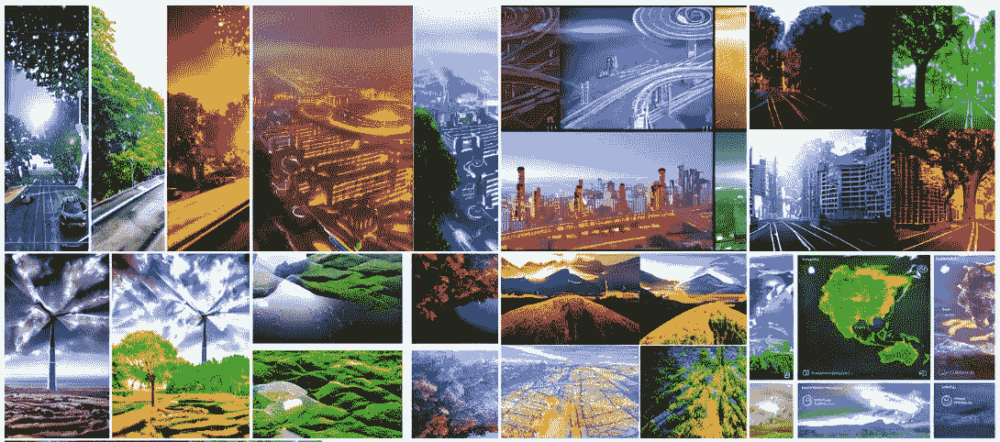
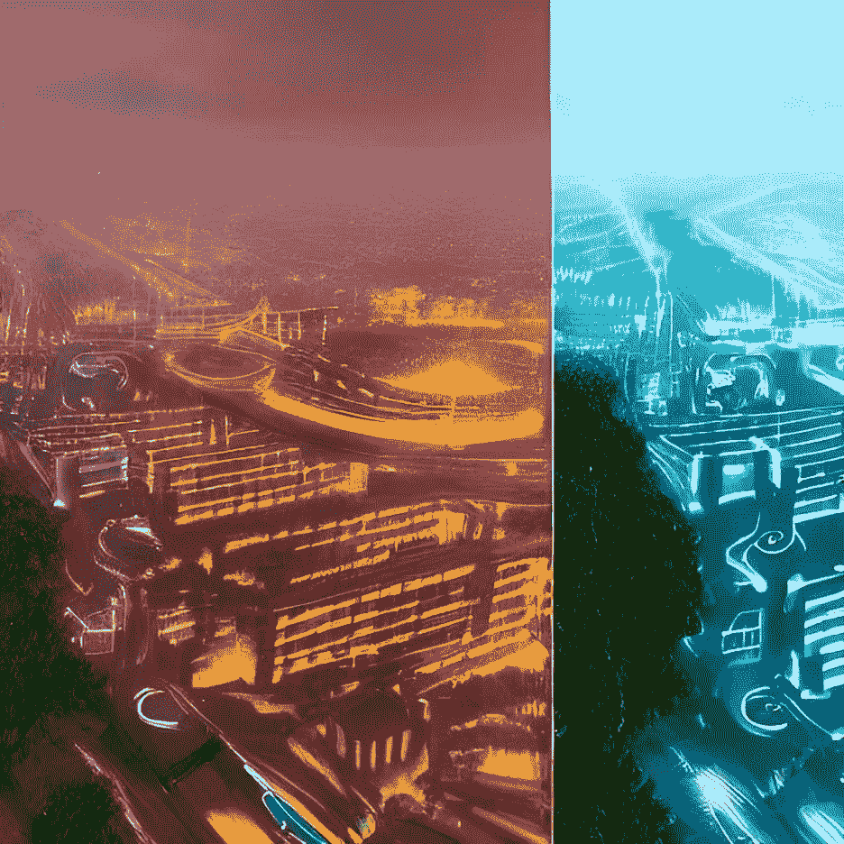
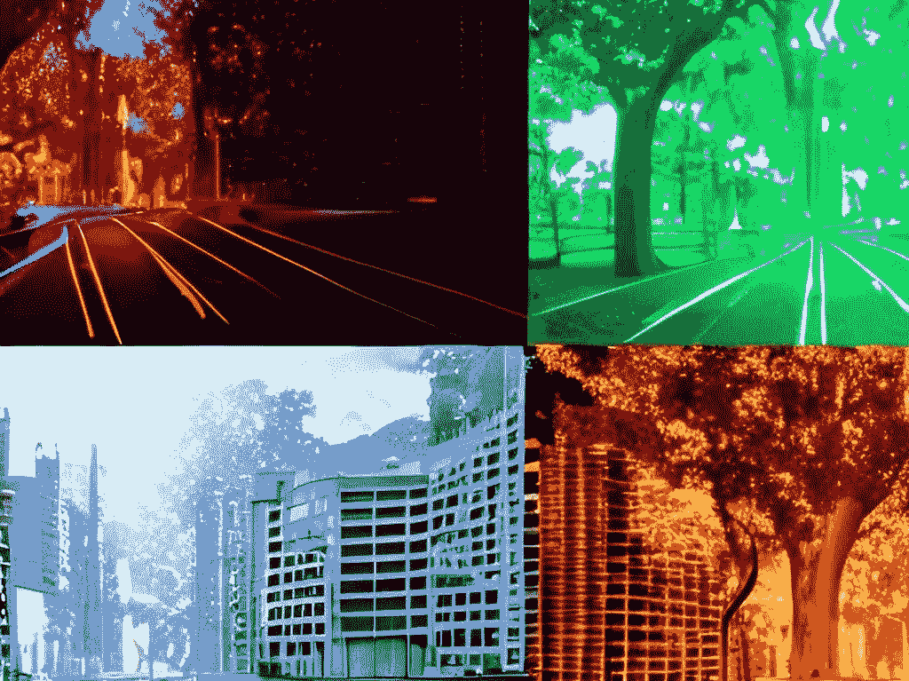
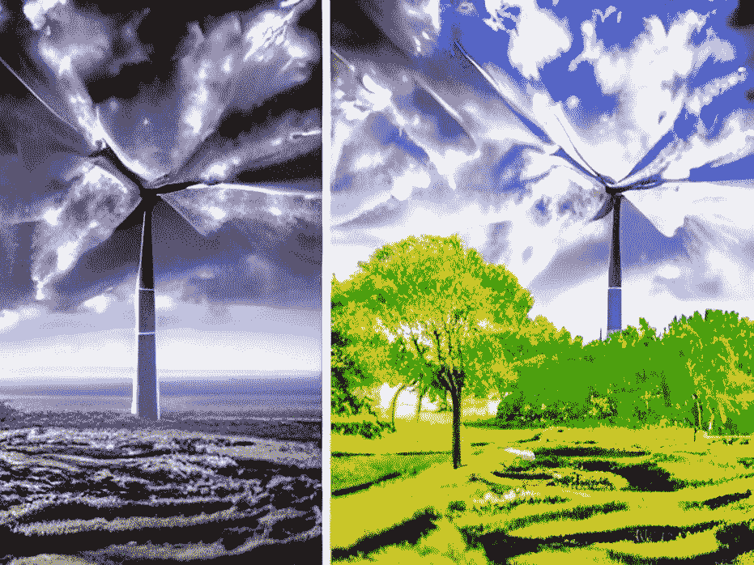
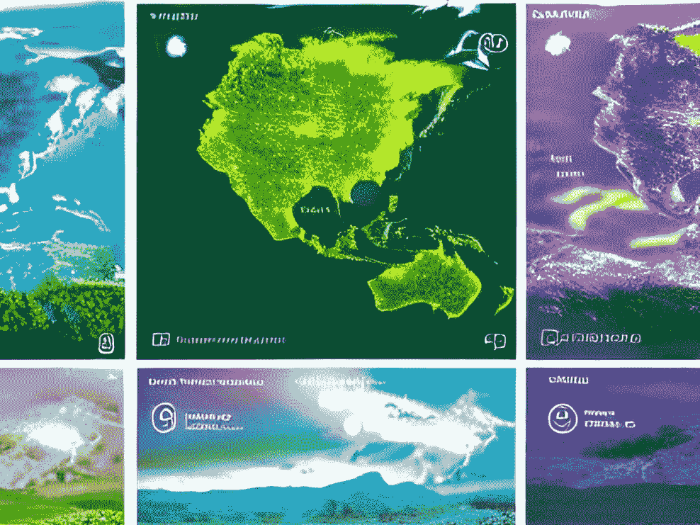

# 人工智能如何帮助世界减少碳排放

> 原文：<https://pub.towardsai.net/how-artificial-intelligence-could-help-the-world-reduce-carbon-emissions-4b6712a8a48b?source=collection_archive---------3----------------------->

这就是人工智能如何重新想象气候变化和碳排放——来源:[我的稳定扩散创作](https://www.instagram.com/mystablediffusioncreations/)。

## 敦促企业和政府关注人工智能，以防止气候变化的最严重影响。

众所周知，世界正面临气候危机。碳排放量逐年攀升，地球变得越来越暖。

如果我们不马上采取行动，情况可能会变得更糟。自然灾害将变得更加普遍，破坏性更大。

气候变化的影响可能会在全球变得更加广泛。海平面将上升，导致比我们现在看到的飓风、龙卷风和地震更大的破坏。那么未来如何才能减少碳排放呢？

人工智能有潜力在许多方面帮助我们，这就是为什么企业和政府现在利用这项技术如此重要，以免为时过晚。

这就是人工智能如何重新想象气候变化和碳排放——来源:[我的稳定扩散创作](https://www.instagram.com/mystablediffusioncreations/)。

# 人工智能如何帮助减少碳排放

人工智能已经对直接涉及能源生产和消费的行业产生了巨大影响。这包括电力部门和石油天然气行业。

人工智能还可以优化其他公司和行业的能源消耗，这有助于减少碳排放。

据估计，到 2035 年，人工智能可以帮助减少超过 140 亿吨的碳排放。

人工智能有潜力以许多不同的方式帮助减少碳排放，商业领袖和政府必须以远见和积极的态度探索这些机会。

同样值得注意的是，人工智能在未来有潜力做更多的事情。例如，它可以帮助解决其他环境问题，包括保护生物多样性、水质和污染。

让我们来看看人工智能可以对减排产生重大影响的主要行业:

这就是 AI 如何重新想象气候变化和碳排放——来源:[我的稳定扩散创作](https://www.instagram.com/mystablediffusioncreations/)。

# 运输

人工智能技术已经在交通领域得到了大规模应用，例如，它们可以帮助交通基础设施的规划和调度。

人工智能还可以优化交通网络上的车辆、货物或人员的流动。

通过使用人工智能来优化交通和预测交通状况，城市可以更好地管理交通，从而减少排放。

现代城市已经在使用人工智能优化公共交通，让通勤者知道他们的下一辆火车或公共汽车何时到来。他们已经在应用人工智能来优化他们的交通基础设施，例如，使用人工智能来优化道路网络上电动汽车的充电。因此，充电站可以通过监控用电量进行优化，以确保不浪费能源。

这就是人工智能如何重新想象气候变化和碳排放——来源:[我的稳定扩散创作](https://www.instagram.com/mystablediffusioncreations/)。

# 无人驾驶汽车排放更少

自动驾驶汽车代表着帮助减少碳排放的最大机会之一。

比如**当**我们有对人类司机有严格规定的地方，公司就会用自动驾驶车辆运送员工。

这一交通模式的突破性变化将有助于减少碳排放，因为它不再需要员工开车。

它还可以降低运营成本，因为燃料或维护成本将大幅降低。

此外，自动驾驶汽车有可能通过鼓励更多人使用公共交通来减少碳排放。这将导致碳排放的减少，因为路上行驶的汽车将会减少。

这就是 AI 如何重新想象气候变化和碳排放——来源:[我的稳定扩散创作](https://www.instagram.com/mystablediffusioncreations/)。

# 制造业和建筑业

使用人工智能来优化制造和建筑也有很大的机会。

通过使用人工智能优化工作流程，制造公司可以通过优化工厂和建筑工地的流程来减少碳排放。

人工智能还可以用于优化能源使用，减少建筑物和基础设施生产和建设中的废物量。通过将传感器集成到建筑物和基础设施中，可以优化它们的能源使用。

人工智能还可以通过减少用于维护建筑物的化石燃料能源来帮助减少碳排放。

例如，AI 可以优化温度控制系统，找到加热和冷却建筑物所需的最佳能源，并分析数千种可能的组合。

此外，人工智能预测性维护可以通过预测和优化所需的必要维护来帮助减少运营和维护建筑物所需的能源…

这就是人工智能如何重新想象气候变化和碳排放——来源:[我的稳定扩散创作](https://www.instagram.com/mystablediffusioncreations/)。

# 通过优化可再生能源减少碳排放

随着人工智能技术的不断改进，它们也将变得更具成本效益和效率，并可用于优化可再生能源生产。

使用人工智能优化电力生产，可以通过减少化石燃料能源的使用量来减少碳排放。

此外，人工智能还可以用于优化可再生能源的生产，包括风能、太阳能、水能、地热和生物燃料。

人工智能可以帮助能源供应链的部分自动化，从发电到向客户交付电力。在某些情况下，它甚至可以减少化石燃料能源的使用量。

通过优化电力使用，人工智能可以帮助减少碳排放，这对环境和该地区的每个人都有好处。

这就是人工智能如何重新想象气候变化和碳排放——来源:[我的稳定扩散创作](https://www.instagram.com/mystablediffusioncreations/)。

# 食品供应链和农业

人工智能还可以帮助优化食品供应链，减少农业造成的碳排放。

人工智能可以通过优化传感器和数据，降低效率和成本，显著影响食品供应链。

人工智能可以帮助确保食物在最佳温度下储存和运输。它还可以帮助识别产品何时到达其有效期，以便尽早将其从流通中移除。

人工智能还可以帮助农民优化他们的作物，提高产量，减少浪费。从长远来看，人工智能可以通过减少浪费和提高效率来实现更可持续的食品系统。

然而，这需要仔细考虑伦理问题，以及如何平衡技术进步与维护人类尊严。

人工智能有可能造福社会中的每个人——从努力与大公司竞争的小农到想要可靠食物来源的消费者。因此，我们都需要以开放的心态对待人工智能，并采取措施确保它惠及所有人，而不仅仅是食物链顶端的人。

这就是人工智能如何重新想象气候变化和碳排放——来源:[我的稳定扩散创作](https://www.instagram.com/mystablediffusioncreations/)。

# 通过使用智能设备和物联网

智能设备和物联网日益融入我们的日常生活。从智能手机到恒温器和笔记本电脑，一系列联网设备可用于自动化任务或监控环境。

这些设备可以传输信息和收集数据，这是通过优化能源使用和监控能源消耗来帮助减少碳排放的关键因素。

例如，智能恒温器可以根据入住率自动调节室内温度。

此外，智能照明可以通过减少用电量来提高能效。此外，智能电器可以监测和控制家庭的能源使用，并在需要补充能源时通知用户。

通过利用这些设备的特性和优势，可以减少碳排放，同时提高能源效率。

这就是人工智能如何重新想象气候变化和碳排放——来源:[我的稳定扩散创作](https://www.instagram.com/mystablediffusioncreations/)。

# 结论

正如我们所见，人工智能有可能在许多方面帮助减少碳排放。

可以用来优化能源使用和粮食生产，也可以用来优化交通和贴近我们日常生活的建筑；它可以帮助我们优化我们的活动和消费，最终反映在我们的碳足迹上。

总的来说，这些技术已经在世界许多地方得到应用，它们有潜力在 2035 年前帮助减少超过 140 亿吨的碳排放。

如果企业和政府不开始使用人工智能来减少碳排放，那么阻止气候变化的最严重影响可能为时已晚。

企业、政府和我们每个人都必须立即开始利用这些技术。

# 你可能想读的其他文章。

*   [**快速浏览稳定扩散开源架构的引擎盖下。**](https://medium.com/codex/a-quick-look-under-the-hood-of-stable-diffusion-open-source-architecture-2f07fc1e729)
*   [**我们正在见证人工智能的下一次进化吗？**](/are-we-witnessing-the-next-evolution-of-artificial-intelligence-264f251ea06d)
*   [**这 10 种算法可以改变你的生活——如果你与数据打交道**](/these-10-algorithms-can-change-your-life-if-you-work-with-data-ff544657922d)
*   [**这 9 篇研究论文正在改变我今年对人工智能的看法。**](https://medium.com/illumination/these-9-research-papers-are-changing-how-i-see-artificial-intelligence-this-year-cd8ba548f785)
*   **5 个非常实用的方法可以帮助你提高公司的生产力**

# **你愿意支持我吗？**

**为了获得无限的故事，你还可以考虑注册**成为中等会员，只需 5 美元。此外，如果您使用我的链接* [*注册*](https://medium.com/@jairribeiro/membership) *，我将收到一小笔佣金(无需您额外付费)。****

*** [## 通过我的推荐链接加入媒体- Jair Ribeiro

### 阅读我分享的每一个故事(以及媒体上成千上万的其他作者)。你的会员费直接支持其他…

medium.com](https://medium.com/@jairribeiro/membership)***