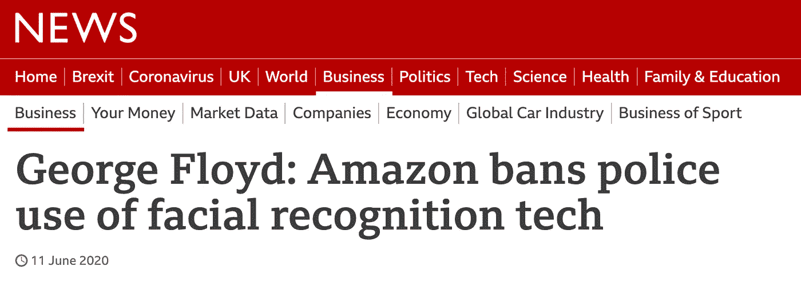
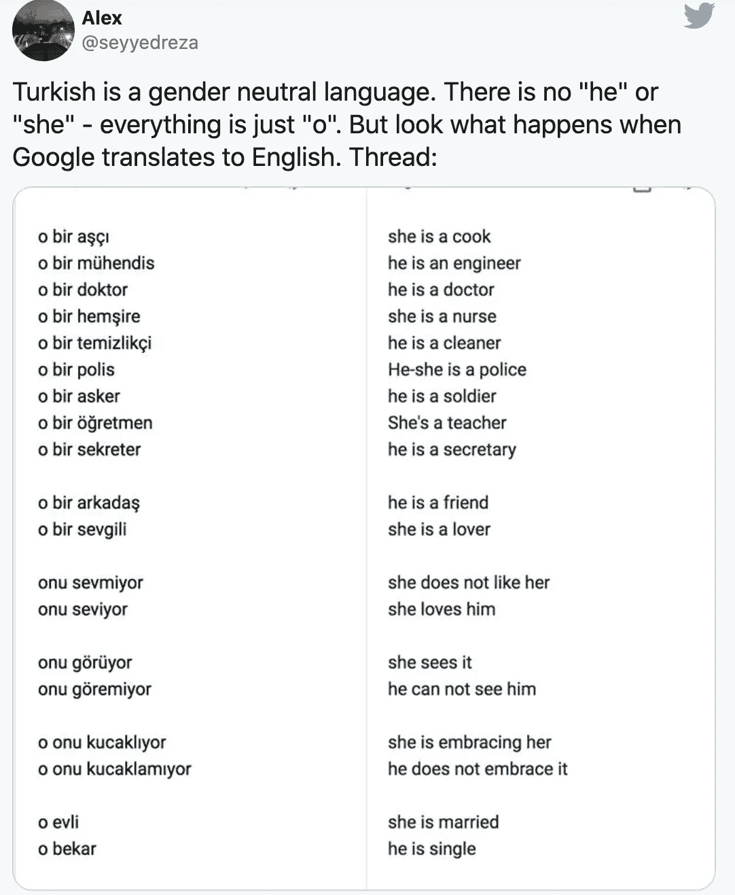

# 人工智能如何助长种族主义

> 原文：<https://pub.towardsai.net/how-artificial-intelligence-is-fuelling-racism-sexism-b46115b6b4a1?source=collection_archive---------2----------------------->

## [意见](https://towardsai.net/p/category/opinion)

## 人工智能每天都在指数级地变得更加复杂——也越来越具有歧视性。

来自 [Pexels](https://www.pexels.com/photo/woman-holding-a-sign-in-protest-4613880/?utm_content=attributionCopyText&utm_medium=referral&utm_source=pexels) 的[生活要紧](https://www.pexels.com/@life-matters-3043471?utm_content=attributionCopyText&utm_medium=referral&utm_source=pexels)照片

人工智能(AI)被描述为 21 世纪最重要的创新之一。不仅以各种可以想象的方式，而且几乎作为一种迫在眉睫、不可阻挡的力量，具有革新和改变世界的潜力。

每一个行业都将由人工智能演变，随着采用的增加，将导致[增强各自市场的竞争优势](https://www.forbes.com/sites/forbesbusinessdevelopmentcouncil/2020/02/05/ai-for-a-competitive-advantage/?sh=428525df402b)，不仅如此，创新生产这种技术的大型科技公司将**获得巨大的财务回报**。

> 换句话说，人工智能不可避免

在这种情况下，继乔治·弗洛伊德的暴行之后，为什么技术公司一个接一个地慢慢开始拆除面部识别(人工智能的应用)并评估他们内部的人工智能创新计划？

# 后黑人的命也是命时代的艾

人工智能的全球应用在 2015 年至 2019 年间增长了 270%，预计到 2025 年该市场将产生 1190 亿美元的收入。

此外，人工智能的使用不是一个富有想象力的概念——今天，90%的美国人已经在日常生活中使用人工智能产品，甚至不知道。

然而，在震惊全球的大范围黑人的命也是命抗议之后，大科技转向了。IBM [取消了面部识别项目](https://techcrunch.com/2020/06/08/ibm-ends-all-facial-recognition-work-as-ceo-calls-out-bias-and-inequality/)以关注警务和执法中的种族平等。[亚马逊暂停涉及警方使用其 Rekognition 软件](https://techcrunch.com/2020/06/10/amazon-rekognition-moratorium/)的合同一年，以重新评估和规范该技术的使用，以便“管理(他们的)面部识别技术的道德使用”

> **恐惧**可能是 IBM 和亚马逊等大型科技公司取消和暂停人工智能项目的原因。

# 害怕历史重演

在一个取消文化的时代，一个种族歧视在大多数人(更重要的是潜在顾客)的头脑中根深蒂固的时代，品牌不能冒险被视为任何形式的歧视。

> 种族主义、性别歧视、同性恋恐惧症等。现在作为一个品牌会导致不可逆转的损害。

对许多人来说，这种恐惧是深刻的，因为他们对人工智能驱动的算法表达对有色人种或女性的偏见的经历记忆犹新。

例如，2014 年，亚马逊发现[一种内部开发的自动猎头人工智能算法](https://slate.com/business/2018/10/amazon-artificial-intelligence-hiring-discrimination-women.html)，出售给招聘公司等，以寻找潜在的强有力的候选人，**教会了自己性别歧视**。人工智能自学了男性申请者比女性申请者更受欢迎。它甚至不赞成简历中包含“女性”一词，比如“女性法律协会主席”。

更令人担忧的是，当这个问题被标记给亚马逊，并在多年努力修复和消除偏见后，亚马逊据称“失去了希望”，并在 2017 年放弃了这个项目。

最近，[2019 年，美国国家标准与技术研究所(NIST)](https://www.nist.gov/news-events/news/2019/12/nist-study-evaluates-effects-race-age-sex-face-recognition-software) 的一项研究在近 200 项面部识别算法测试中发现了种族偏见的明显证据。

此外，2018 年一位[麻省理工学院的研究人员发现，AI 驱动的面部识别软件在识别肤色较深的人脸方面远没有那么准确，“浅肤色男性的错误率为 0.8%，深肤色女性为 34.7%”。](https://news.mit.edu/2018/study-finds-gender-skin-type-bias-artificial-intelligence-systems-0212)

# 真实世界的影响

许多技术专家担心，虽然人工智能被引入是为了自动化人类决策，但它可能会演变成 T2，意味着自动化人类偏见。

我们可能生活在这样一个世界里，法官在刑事司法系统中使用的算法推动对黑人的[惩罚比白人更严厉。](https://www.propublica.org/article/machine-bias-risk-assessments-in-criminal-sentencing)

或者，世界上最大的搜索引擎可能会在所有搜索中宣扬性别歧视，加剧性别平等问题。

鸣谢: [@seyyedreza](https://twitter.com/seyyedreza) 在推特上

# 歧视的滴答声

照片由[像素](https://www.pexels.com/photo/clear-glass-with-red-sand-grainer-39396/?utm_content=attributionCopyText&utm_medium=referral&utm_source=pexels)的 [Pixabay](https://www.pexels.com/@pixabay?utm_content=attributionCopyText&utm_medium=referral&utm_source=pexels) 拍摄

从本质上讲，人工智能通过对庞大数据集的永恒分析来学习发现模式并做出决策，这些数据集的核心可能往往是社会歧视本身的反映。随着时间的推移，人工智能在这种模式识别和决策方面变得更加有效，以至于歧视可能在行为中根深蒂固。

许多技术专家旨在通过向受到法律、政治和社会学等社会科学影响的学生教授人工智能来解决这个问题，但现在说它是否有前途还为时过早。

当采用人工智能成为商业生存的必要条件时，为了不失去竞争优势，包括招聘、营销和客户行为预测等目标，这种偏见问题需要迅速根除。亚马逊试图修复其招聘软件中根深蒂固的性别偏见，这突显出利用这种技术而不产生意想不到的后果是复杂的。

如果像亚马逊这样的公司，拥有无限的技术专家质量和资本预算资源，一旦算法被释放，都无法解决这个问题，那么几乎不可能想象数百万技术不太先进的软件公司能够，一旦他们生产并向市场发布他们的人工智能产品。

今天需要考虑和解决这个问题。否则，我们将生活在一个人工智能不仅占据主导地位，而且会延续当今存在于商业、社会和司法各个层面的偏见和歧视行为的世界，并带来不可逆转的损害。

*由新浪萨德扎德撰写*

*在* [*LinkedIn*](https://www.linkedin.com/in/sinasadrzadeh/) 上联系我

*听我的* [*创业播客*](https://linktr.ee/TheMillennialEntrepreneur)

 [## 新一代的人工智能

### 什么是 OpenAI 的 GPT-3，它将如何取代诗人、记者和作家。

medium.com](https://medium.com/illumination/the-new-breed-of-artificial-intelligence-c998dec7412b)  [## ♻区块链如何为可持续发展提供动力

### 区块链不仅仅适用于比特币——它可以帮助拯救环境，影响生活；它现在正在这么做。

medium.com](https://medium.com/the-innovation/how-blockchain-can-power-sustainability-1d01d8c0abeb)  [## 我如何用 90 美元创建排名前 30 的播客

### 是小细节推动你进入排行榜

entrepreneurshandbook.co](https://entrepreneurshandbook.co/how-i-created-a-top-30-rated-podcast-for-90-48ae3a0cc3b1)