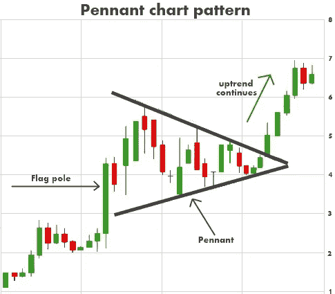

# 人工智能如何扼杀技术分析

> 原文：<https://pub.towardsai.net/how-artificial-intelligence-killed-technical-analysis-968856a20983?source=collection_archive---------0----------------------->

## 然后它取代了它的位置

对于主动管理的股票投资组合，有两种主要的方法来分析和创建投资组合，基本面分析和技术分析。基本面分析是关于评估一家公司的财务报表，它所属的市场，以及整体经济，以确定股票的价值。用普林斯顿经济学家伯顿·马尔基尔的话说，“技术分析本质上是制作和解读股票图表。因此，它的实践者，一个小规模但专注的邪教，被称为宪章派或技术人员。他们研究过去——普通股价格和交易量的变动——寻找未来变化方向的线索。许多图表分析师认为，市场只有 10%是逻辑的，90%是心理的。”

有效市场假说认为，股价反映了所有可获得的信息，战胜市场的唯一方法是拥有内幕信息或运气好。这意味着，如果有人发现一只股票被低估，他们会出去购买这只股票，推动其价格回到适当的水平(类似的逻辑适用于高估的股票)。想象一下，即使只有少数人知道股票价格明天会涨到 100 美元，它也会使今天的价格涨到 100 美元，他们有信心快速赚钱，他们会对明天将为他们带来利润的股票进行竞标。因此，股价的唯一变动应该发生在新信息到达市场的时候。虽然有效市场假说可能不是绝对正确的，但随着编程和机器学习的进步，交易股票变得越来越不主观，越来越基于规则和过程。程序员和数据科学家竞相寻找赚钱最多的过程，让我们越来越接近有效市场假说。

那么，为什么技术分析取代了基本面分析呢？技术分析对于机器学习模型来说更容易理解。技术分析师只依赖于一段时间内的股价和交易量，只有两个变量的机器学习模型很容易优化。在基本面分析中，有很多变量、数据集和分析方法是没人考虑过的。这使得基本面分析更加难以优化。

数据模式是技术分析的基础，在机器学习之前，这些模式必须非常基本，因为人类必须能够在图表中直观地发现它们。这些模式，像三角旗(如下图)，或楔形，或杯柄，或任何其他模式，都应该是一致的信号，无论公司是什么，你都可以采取行动。

[https://stock market video . com/trial/technical-analysis-video-library/introduction-to-chart-patterns/page/2/](https://stockmarketvideo.com/trial/technical-analysis-video-library/introduction-to-chart-patterns/page/2/)

我认为技术分析如此受欢迎的原因是这些模式很容易被发现。大胆的、有一些容易理解的“逻辑”的预测，才是得到关注的预测。相比之下，当深度[自回归](https://en.wikipedia.org/wiki/Autoregressive_model)神经网络根据股市数据进行训练时，它们通常会推荐一些接近随机游走的东西(这意味着它们对未来的最佳预测只是当前价格)。这意味着对这些模型来说，所有的价格变动都是未知的。如果一个复杂的深度学习模型不能仅根据过去的价格预测价格，那么技术分析就没有机会。

所以我已经解释了为什么 AI 在技术分析方面比大多数技术人员做得更好。但实际情况如何呢？好吧，2017 年，贝莱德(世界上最大的资金管理公司)[解雇了人类选股人](https://fortune.com/2017/03/30/blackrock-robots-layoffs-artificial-intelligence-ai-hedge-fund/)，转而支持人工智能。

新闻经常谈论自动化将如何冲击蓝领工作，因为这对大量观众来说是一种警告，并且有切实的例子显示机器人正在做人们曾经做过的工作。如果有一股力量推动卡车运输和快餐业等许多行业的低工资工作实现自动化，想象一下让一位年薪 10 亿美元的对冲基金经理的工作实现自动化背后的兴奋。因此，我认为这里最大的收获是，从亿万富翁对冲基金经理到最低工资工人，每份工作都可能因人工智能和自动化而不稳定。即使你的工作不是你可以想象机器人做的体力劳动，如果它可以量化，并且通常有一个程序(就像技术分析师那样)，那么它就有可能被取代。