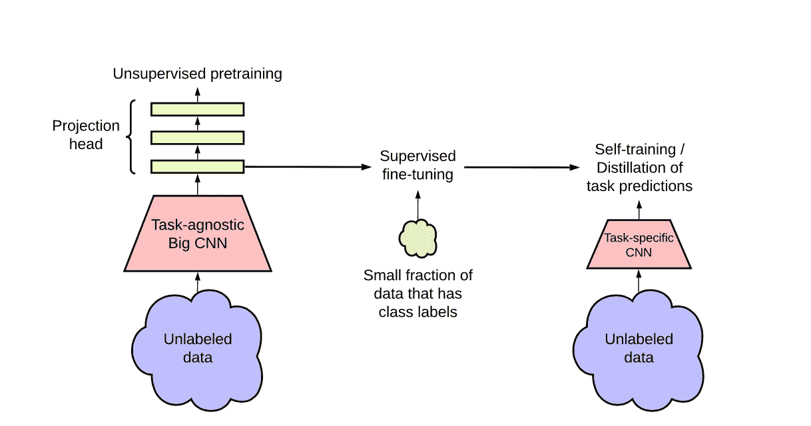

# 自我监督模型如何使不同的计算机视觉任务受益？

> 原文：<https://pub.towardsai.net/how-can-self-supervised-models-benefit-different-computer-vision-tasks-8ad0313dfde8?source=collection_archive---------2----------------------->

## [计算机视觉](https://towardsai.net/p/category/computer-vision)

## SimCLRv2 解释道

[来源:Shutterstock](https://www.shutterstock.com/image-photo/robotchild-reading-book-workshop-creator-333995531?src=xJPWZuG5eIRToy5xKB1Ctg-1-26)

去年，谷歌大脑团队给出了他们之前最先进的图像分类自我监督方法的新版本，称为 [SimCLRv2](https://arxiv.org/pdf/2006.10029.pdf) 。该方法的关键要素是在**预训练**和**微调期间使用**大(深&宽)**网络。**当前面的监督训练在较少的标签上执行时，用于自监督学习的任务不可知方法更有成效。

半监督学习算法可以概括为三个步骤:

*   *使用 SimCLRv2 方法对大型 ResNet 模型进行无监督*训练
*   *对一些带标签的示例进行监督微调*
*   *提炼*具有未标记的数据示例，用于提炼和传递特定于任务的知识，或者具有紧凑的模型

[资料来源:论文](https://arxiv.org/pdf/2006.10029.pdf)

本文对 ImageNet 数据上半监督学习的**、*无监督预训练、*、**、*、*、**、*有监督微调、*、**范式进行了深入研究。在无监督的与任务无关的预训练期间，使用更大的广度和深度模型提供了大大提高的准确性。在预训练之后，通过向模型显示一些带标签的示例，使用监督微调对模型进行微调

一旦模型被微调，特定于任务的预测可以用相同的模型架构或更小的模型架构来训练，无论哪种方式，提炼和自我训练的过程都是相同的。蒸馏过程不使用真实标签，但是蒸馏损失完全基于从教师(更大)模型预测的标签和由学生模型预测的标签，因为当涉及特定目标任务时，可能不需要教师模型的额外能力。因此，学生网络学会模仿教师网络的标签预测。本文还描述了非线性变换的重要性，即**投影头**。投影头越深，通过线性评估测得的图像质量越好。当从投影头的*中间层*执行微调时，它还提高了半监督性能。

所提出的半监督学习框架以两种方式利用未标记的数据:

*   无监督预训练中的任务不可知使用
*   自我训练/提炼中的特定任务用途

# 无监督预训练

第一次使用未标记的数据时，它是以任务不可知的方式，通过有监督的预训练来学习一般的视觉表示。然后，通过有监督的微调，使一般表示适应特定的任务。第二次使用未标记的数据时，是以特定于任务的方式，用于进一步提高预测性能和获得紧凑的模型。任务不可知模型通过潜在空间中的对比损失最大化相同数据(图像)的不同增强视图之间的一致性来学习。给定一个随机采样的小批量图像，使用随机裁剪、颜色失真和高斯模糊将每个图像放大两次，创建同一示例的两个视图。这两个图像通过 ResNet(即编码器网络)进行编码，然后使用非线性变换(即投影头)对表示进行变换。较大的 ResNet 模型用于充分利用预培训的力量。正在训练的最大模型是具有 3 倍宽通道和选择性内核(SK)的 ResNet 152。当对 1%的标记示例进行微调时，放大模型导致 top-1 准确度相对提高 29%。

非线性投影头也更深，并且不是在微调时扔掉投影头，而是从中间层进行微调，这对于线性评估和微调都产生了显著的改进，仅用几个标记的例子。预训练期间更大/更深的投影头改善了表示学习，即当从投影头的第一层执行微调时，对几个标记的示例的微调提供了更好的结果，并且当与编码器网络结合时，据说从中间层执行微调。

# 自我训练/升华

蒸馏通常涉及鼓励学生匹配老师的蒸馏损失和标签上的普通交叉熵损失，但这里学生在仅具有蒸馏损失的未标记示例上接受训练。这从两个方面改进了微调模型，

1.  当学生模型具有较小的体系结构时，教师模型将特定于任务的知识传递给学生模型。
2.  即使学生模型具有与教师模型相同的体系结构，自提炼/自训练也可以有意义地提高半监督学习性能。同样，为了在较小的 ResNets 上获得更好的性能，在将大模型提炼为较小的模型之前，先对其进行自我提炼。

与它的前身 SimCLRv1 相比，这种方法导致 Top-1 精度提高了 20%,并且在监督微调期间仅观察到 1 %的标签被使用。此外，在监督微调期间使用 10 %的标签，观察到 Top-1 准确度增加了 8.37 %。

# 概括起来

这种**“无监督预训练，监督微调**”的方法可以在许多缺乏标记数据的计算机视觉领域提供帮助。它可以潜在地被用来提高计算机视觉的任何应用的准确性，在这些应用中，标记附加数据比训练更大的模型更昂贵或更困难。

在计算机视觉的一些医疗应用中，获取高质量的标签需要临床医生仔细注释，更好的半监督学习方法可能有助于挽救生命。计算机视觉在农业中的应用可以增加作物产量，这可能有助于提高食物的可用性。这种方法可能成为有害监视系统的一部分。