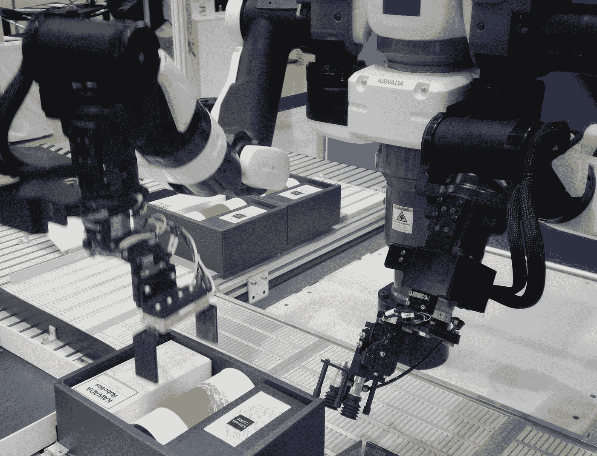

# 你如何推动你的人工智能事业积极影响我们的社会？

> 原文：<https://pub.towardsai.net/how-can-you-drive-your-career-in-ai-positively-impacting-our-society-725e55789e80?source=collection_archive---------2----------------------->

[JESHOOTS.COM](https://unsplash.com/@jeshoots?utm_source=medium&utm_medium=referral)在 [Unsplash](https://unsplash.com?utm_source=medium&utm_medium=referral) 上拍照

## 一些关于追求吸引人和令人满意的职业的实用见解，可以对人类的未来产生重大影响。

人工智能(AI)对一些人来说可能是一个遥远而鲜为人知的学科，但现实是它比许多人认为的要近得多。

通过人工智能，可以打击针对女性的暴力行为；协助律师、律师事务所和部门进行文件分析，并监测立法的变化；协助客户处理财务事宜；让农民有更好的生产力；在成千上万的事情中，帮助老年人拥有更好的生活质量。

人工智能的进步也同样重要。例如，人工智能将很快能够加速药物发现和绿色能源研究。

另一方面，先进的人工智能可能会被用来进一步巩固歧视，并比以往任何时候都更有效地赋予独裁者权力——或者我们可能会失去对这些系统的控制，因为它们变得太强大而无法遏制…

[附身摄影](https://unsplash.com/@possessedphotography?utm_source=medium&utm_medium=referral)在 [Unsplash](https://unsplash.com?utm_source=medium&utm_medium=referral) 上拍照

# 人工智能如何改善我们生活的三个例子

根据世界领先的人工智能专家之一吴恩达的说法，到 2030 年，人工智能的进步可以为全球经济增加超过 10 万亿美元。

许多人未能认识到这并不一定是一件坏事或值得害怕的事情。

特别是人工智能可以解决更多反复出现的问题，让人们专注于更具战略性的活动，如研究和专业化，同时营造一个有利于产生鼓舞人心和创造性想法以及开发颠覆性和创新性商业模式的环境。

不管担心什么，人工智能已经在一些领域得到成功应用。他举了一些例子:

## 卫生保健

人工智能最重要的受益者之一是卫生部门。现在已经有公司使用这种机制来辅助医生进行诊断。

患者表达他的感受(通过书写或说话)，并基于其数据库(数 Pb 的数据)，人工智能引擎向医生建议可能的诊断和药物治疗。

临床考试也是如此。基于你以前和现在的检查，人工智能引擎对它们进行分析，并指出哪些可能的症状或检查指标不好，以及你可以做些什么来改善这些指标和可能的药物治疗。

## 信息安全

人工智能已经在信息安全中发挥着关键作用。

人工智能引擎正在快速学习黑客如何实施他们的攻击和“入侵”，并且成功地阻止了它们。每一次新的黑客攻击对人工智能引擎来说都是一次学习经历；因此，你攻击计算机越多，人工智能学习的就越多，随着时间的推移，这无疑会削弱黑客。

## 人类的行为和习惯

这可能是人工智能如火如荼的一个领域，并取得了明显的成果。你在社交网络上发布的内容就是一个例子:根据你在注册和帖子中已经拥有的信息，这些网络背后的认知分析和智能机制可以“知道”你那天是否悲伤，是否更有政治意识，是否想买一个包或一双新鞋，是否想去旅行和去哪里，或者你是否路过。

这只是几个例子，还有更多例子表明，人工智能作为一种工具，已经取得了成果，可以改善人们的生活，更快更果断地解决问题。

不到几年前，要在人工智能领域建立职业生涯，你应该是一名统计学家、数学家、数据传道者和数据库管理员。

今天，您将听到更多关于数据科学家、数据工程师、人工智能专家等的信息。

在过去几年中，人工智能为市场创造新应用和解决方案的需求发展迅速，但我们的重点应该是如何对它产生全球影响。或许你应该开始问自己以下四个问题:

照片由[弗雷迪婚姻](https://unsplash.com/@fredmarriage?utm_source=medium&utm_medium=referral)在 [Unsplash](https://unsplash.com?utm_source=medium&utm_medium=referral)

# “我应该从哪里开始？”

回答这个问题可以告诉我们很多关于你如何合理地影响 AI 在我们社会中的积极作用。让我们来探索一下。

考虑到人工智能的潜力，如果你想通过从事这项技术对世界产生积极的影响，有一个决心应该比所有其他的都突出:*你将如何利用你的职业生涯做好事？*

让我们以气候变化为例…多年来，研究人员专注于地球正在经历的全球变化，并使用了这一技术。

因此，将有可能继续监测人类活动造成的不平衡，并利用算法衡量政府和组织制定的减排行动的影响。

然而，使用人工智能来应对气候变化的影响可以走得更远，但它尚未得到充分发展；虽然其他国家必须扩大规模，但所有国家都可以为限制地球气温上升的全球努力做出贡献。

一种方法是安装开放数据库，以更大的透明度共享，以提高报告的准确性。

或者，我们可以让人工智能专家加入政府小组，分析减轻气候变化影响的新政策。换句话说，国际社会必须投资于科学，同时促进伙伴之间的全球合作。

人工智能还可以帮助减少能源消耗和温室气体排放，优化土地利用，并提供自然灾害的预测模型，随着全球平均气温上升，冰川融化，海平面向沿海城市上升，自然灾害变得越来越常见。

在这种背景下，具有连接性和数据的智能城市已经利用人工智能来实现大规模解决方案。许多其他行业也是如此，如制造业和监测森林火灾的能力，这些行业受益于对卫星数据更灵活的解释。

反过来，人工智能可以帮助改善金融市场中碳市场估值和基于 ESG 实践的股票基金的表现。

2019 年，咨询公司普华永道(PwC)进行了一项题为“人工智能如何实现可持续发展的未来”的调查，该调查受微软委托，提供了对人工智能在应对气候变化中的使用的见解。

它发现，到 2030 年，该技术有可能将全球温室气体排放量减少 4%，使用人工智能的环境应用市场价值可能高达 5.2 万亿美元，此外还将在全球创造超过 3800 万个就业岗位。

最重要的是，它将能够拯救多达 3200 万公顷的森林，并有助于减少多达 24 亿吨的二氧化碳排放。

此外，根据这项研究，将需要大规模的协调行动和许多熟练的人，我相信这正是可以描绘出从事人工智能职业的潜在影响的画面。

除了限制全球变暖，你还可以通过各种方式潜在地影响数十亿人。例如，更智能的空气监测系统可以识别排放源，同时为政府节省 1 . 5 亿美元的医疗费用。

根据联合国的一项预测，到 2050 年，更高效的农业将使用更少的土地、水和化肥来养活预计将达到 97 亿的世界人口。

此外，更接近消费市场的高效生产将有助于减少运输和物流部门的气体排放。

从学术角度来看，如果你想开始与人工智能合作，你应该意识到趋势是人工智能开始为各种市场前沿增加新的价值。因此，只要有一些改进，市场就可以接受来自最多样化领域的专业人士。

你可以攻读该领域的几个研究生学位中的一个，一个 MBA 学位和一个专业。再者，因为大部分 AI 相关的资料都是通用化的，所以在英语流利度上的投入是值得的。

如果你已经有了大学学历，攻读研究生学位是与 AI 合作的最佳方式。它是学习的延续，功能类似于大学，但内容更加专业和先进。

在线研究生课程因其众多优势而广受欢迎，包括灵活性和最佳成本效益比。但 Ea h 研究生课程的时长大致相当，硕士学位由于其理论性和研究性更强的培养，一般会持续 2 到 3 年。

另一方面，工商管理硕士和专业更适合就业市场的应用，因此有技术和实践内容。

需要大量有技能、有奉献精神的个人来协助将他人的合作转化为真正的变革。

总的来说，推进你在人工智能和机器学习方面的职业生涯可能是你做出改变的最佳机会，特别是如果你想让新技术变得更好。

由 [Unsplash](https://unsplash.com?utm_source=medium&utm_medium=referral) 上 [Elisa Ventur](https://unsplash.com/@elisa_ventur?utm_source=medium&utm_medium=referral) 拍摄的照片

# "我怎样才能找到“正确的”问题来解决？"

在这一点上，你应该问你想关注的问题有多紧急，它对社会意味着什么，你选择致力于它能产生多大的影响。

总的来说，世界上最紧迫的问题结合了三个因素:

1.  它们的规模很大(它们极大地影响了大量的人——解决它们将是一件大事)
2.  他们被忽视了(在他们身上花费的努力还远远不够)
3.  它们是可管理的(付出额外的努力，进步是可能的)

让我们来分析一个例子:人工智能的风险…这可能是我们很快将面临的最重要的问题之一…在这方面的工作可能会产生巨大的影响；随着人工智能(AI)的重要性和可见性的增长，对使用这些技术的负面后果的担忧也在增加。

面对风险和负面后果，政府、研究人员、民间团体甚至企业都在争论减轻人工智能潜在负面后果所需的护理和措施。

风险和危险数不胜数。除了最广为人知的工作未来问题之外，潜在的复杂因素还包括从对特定群体的歧视到人类概念及其对机器的支配地位的根本转变，包括对隐私的威胁、对市场组织的伤害和工作场所的虐待。在武器方面

根据皮尤研究中心 2019 年对美国公民进行的一项调查，约 80%的受访者担心自己的隐私，并在企业和政府面前感到无能为力。

由于人工智能系统在各种分析和决策中获得了牵引力，这些选项开始直接影响人们的生活，包括在雇用员工、发放贷款、获得权利和福利以及警务等各种流程中歧视特定群体。

让我们以面部识别系统为例，它可以确定一个人是否可以接受援助，登记，甚至坐牢，是最有争议的应用之一。

在中国，监控公民行动和移动以建立每个人的社会记录的摄像头可以用于各种目的，包括区分服务的获取，甚至产生制裁。

各州和城市已经禁止了这项技术，以回应人们的担忧，包括世界上最大的科技公司所在地旧金山和麻省理工学院所在地剑桥。此外，欧盟委员会宣布了在今年年初禁止面部识别的可能性，这是欧盟目前正在讨论的一个话题。

基于人工智能的项目也可能促进公共政策中的歧视。例如，在阿根廷萨尔塔斯省，当地政府与微软合作推出了一个社会干预技术平台，根据对姓名和地址等个人数据的分析，确定有早孕风险的女孩。

问题是人类用特定的概念和目标创建人工智能模型的参数。它的广泛使用危及影响人们生活的决策的正当程序，这些决策是由在其发展和应用中经常缺乏透明度的系统作出的。

我们需要能够针对此类决策提供量身定制的响应的研究人员和技术人员，以及具有这种影响和必须保护的权利保障的政策，无论是在工具的选择方面，还是在拥有能够具备审查条件且有效的特定人员方面，而不是简单地创建一个流程，在该流程中，该投诉导致系统进行新的分析。

然而，当人工智能拥有市场力量时，它甚至有更大的能力来影响这种多样化的决策。在技术领域，大型企业集团，如美国的微软、亚马逊、谷歌、苹果和脸书，以及中国的腾讯和阿里巴巴，主导着他们的利基市场，引领着人工智能的采用。

谷歌控制着全球最大的视听平台 Youtube，以及 90%以上的搜索市场和 70%以上的浏览器市场。Fa 电子书拥有 25 亿用户，控制着全球前三大应用:脸书、FB Messenger、Whatsapp 和 Instagram。

市场份额和用户数量越大，收集的数据就越多。假设经济合作与发展组织(OECD)和世界经济论坛(WEF)等国际组织认为这些个人信息是一项重要的经济资产。在这种情况下，那些控制广泛基础的人将拥有显著的竞争优势，这可以在损害竞争对手的同时加强你的领域。

这种新经济似乎更容易受到集中和集权的影响。因此，克服这个部门的垄断壁垒要比其他部门困难得多。

这种数据垄断意味着对数据货币化和基于数据产生新技术进步的能力的垄断。围绕数据的争议是核心问题，许多这类服务都是在全球范围内提供的。

然而，最受关注的一个最严重的风险是无人机和自主坦克等人工智能武器的兴起，这可以被认为是继火药和核武器之后的第三次战争革命。

然而，处理人工智能的公司一直没有密切关注这一系列风险，至少根据人工智能研究人员(即使是那些不关心降低风险的人)的说法，相信我，这不仅仅是猜测。这是真的。

这也令人震惊地被研究界忽视了，在那里，每 100 个左右研究如何提高人工智能能力的人，只有一个人在研究如何防止人工智能造成灾难性的伤害。

当我们退一步考虑哪些问题显得特别紧迫时，人工智能等强大的新兴技术脱颖而出:它们有可能像其他事物一样危及我们的未来，但它们的风险被大大低估了。

这些问题无疑是大规模的，它们几乎被忽略了，考虑到研究它们的研究人员相对较少，感谢上帝，它们仍然是可管理的。

在 [Unsplash](https://unsplash.com?utm_source=medium&utm_medium=referral) 上的 [Smartworks 合作者](https://unsplash.com/@smartworkscoworking?utm_source=medium&utm_medium=referral)的照片

# “我如何才能最大限度地发挥我在人工智能方面的贡献？”

你可能想知道你如何能显著地影响如此复杂的问题…嗯…我每天都问自己同样的问题…

一些善意的解决重要问题的方法比其他方法更有效——有些方法甚至会适得其反。因此，我相信你可以通过专注于正确的解决方案来最大化你的影响。

为了确保人工智能的发展顺利进行，我认为两个棘手的问题应该是任何人工智能研究人员或专业人员的首要任务:

首先，我们应该致力于解决技术上的"**对齐问题**，" Brian Christian 在他 2020 年的著作《**对齐问题:机器学习和人类价值观》中推广了这个问题。"** 在书中，克里斯蒂安概述了确保人工智能模型捕捉“*我们的规范和价值观，理解我们的意思或意图，最重要的是，做我们想做的事情”的挑战*

糟糕或不足的算法训练数据是“**比对问题**的核心”，因为数据现在几乎在日常生活的每个方面都被收集，算法更有可能由于过度依赖其数学函数而做出糟糕的决策。

第二，我们需要在**人工智能治理方面持续取得进展，**这是一个相对较新的概念，涉及算法在决策中的使用。

公司治理包括公司的目标、挑战和道德困境。因此，使用治理政策的机构有清晰的内部法律、习惯和组织过程图。

另一方面，人工智能是一个使用机器人和软件来自动化流程、交叉引用数据、标准化信息和辅助决策的概念。

然而，随着新的解决方案的出现，人工智能变得更加复杂，处理更多的数据，这是做出更自信的决定或强化错误所必需的。因此，人工智能解决方案必须考虑整个社会，以确保没有人受到伤害。

比如，未来的自动驾驶汽车不仅必须识别何时该走、转弯或刹车，还必须识别人们盲目穿越街道、动物意外穿越车道以及其他司机可能闯红灯。

人工智能的另一个问题是缺乏多样性。目前，男性主导着 IT 行业。具体来说，根据微软的数据，全球 75%的 IT 专业人士是男性，而女性只有 25%。

由于女性在技术领域的代表性较低，越来越多的女性现在在执行更多常规和重复性任务的领域工作，这些任务更容易被人工智能取代。

我们必须考虑并努力包容所有人，无论性别、种族或族裔，以便人工智能不会因为文化缺陷、不平等甚至种族主义而发展为偏见和代表性不足，这会增加社会中的不平等，并将数字解决方案从某些人群中推开。

因此，政府在实施人工智能时面临的主要挑战是社会本身的直接反映。

这些机器被它们的程序无意识地刺激，重复已知的问题，例如基于原籍国和肤色的歧视性刻板印象。

结果，人工智能非但不能解决问题，反而可能成为不平等的代理人，导致负面变化，给捍卫技术使用的当局制造困难。

人工智能还面临着展示信息的挑战，这些信息使人们更容易受到欺诈或童年成瘾的影响。例如，公司通过基于算法提供的信息做出决策，找到促进人们参与的公式。因此，制造奴役儿童的游戏和吸引读者的假新闻是可能的。

在制定指导方针以界定公司和政府之间关于监管和使用人工智能的共识方面存在巨大挑战。

这意味着这两个领域(“**对齐问题**”和“ **AI 治理**”)肯定已经需要更多的人来处理它们了。能够对未来产生巨大影响的人。

约翰·施诺布里奇在 [Unsplash](https://unsplash.com?utm_source=medium&utm_medium=referral) 上的照片

# “我如何才能在人工智能的世界里找到自己的位置？”

此时，你的脑海中可能会出现一个反复出现的问题:我适合 AI 中的角色吗？

这个问题没有单一的答案，简单来说有两个原因:第一，AI 不断变化，它在进化；第二:有许多可能的方法可以给这个领域带来真正的影响…让我们考虑一个例子:

如果你是一名出色的作家和公共演说家，但你从未从科学研究中获得如此多的乐趣，你可以像我一样，专注于人工智能伦理、人工智能政府政策或人工智能和数据素养。你可以在提高意识和普及技术方面发挥重要作用。

正如我所说的，在当今世界，有许多方法可以产生影响，每种方法都需要一套独特的技能。我们需要他们所有人…因此，也许你将是对对齐问题提出新见解的人，这是当今该领域最困难的挑战之一。

然而，我们也需要新的创业公司和公司组织来实施最有前途的解决方案，这需要培养在创业、管理、运营、会计和筹资方面具有专长的个人。

我们也需要社区建设者来帮助那些想解决这些问题的人。我们还需要优秀的沟通者，他们能够提高全球对解决方案的认识。

请记住，导航最重大的人工智能突破是一项协作努力，需要不同的技能和不同的背景。

在 [Unsplash](https://unsplash.com?utm_source=medium&utm_medium=referral) 上由[Max bhme](https://unsplash.com/@max_thehuman?utm_source=medium&utm_medium=referral)拍摄的照片

# “什么样的未来在等着我？”

很明显，在人工智能领域，就像在许多其他领域一样，我们需要越来越多的人将他们的职业生涯专注于帮助人类共同努力和繁荣。

有几个选择来推进你在人工智能领域的职业生涯，包括许多与开发新技术无关的选择；例如，你可以把你最好的技能贡献给在人工智能领域做得很好的组织，比如做志愿者或者组织捐赠和活动。

这里的关键信息是，如果你留意我们在本文中看到的问题，你可以找到一份既吸引人又令人满意的职业，以及一份对人类有重大积极影响的职业。

在我不断变化的职业生涯中，这种情况在我身上发生过无数次。我认识到风险很高。现在是寻找一个有影响力的职业来帮助我们的社会公平和可持续发展的最佳时机。

# 结论

我们生活中的每一个变化都影响着我们，无论是积极的还是消极的，如果你想开始从事人工智能的工作，也没有什么不同。你将有机会帮助我们的社会变得更好。

对于人工智能的未来，我们仍然没有一个普遍接受的预测，但我相信，我们必须尽最大努力，负责任地为创造一种革命性的技术做出贡献，这种技术将帮助我们确保商业世界的可持续发展，并将越来越多地被纳入改变和改善社会生活质量的项目，共同推动繁荣！

# 你可能想读的其他文章。

*   [**这 9 篇研究论文正在改变我今年对人工智能的看法**](https://medium.com/illumination/these-9-research-papers-are-changing-how-i-see-artificial-intelligence-this-year-cd8ba548f785) **。**
*   [**我们正在见证人工智能的下一次进化吗？**](/are-we-witnessing-the-next-evolution-of-artificial-intelligence-264f251ea06d)
*   [**你印象最深刻的 Youtube 频道学习人工智能、机器学习、数据科学**](https://medium.com/p/486c1b41b92a) **。**
*   [**这些是 Youtube 上一些最好的频道，你可以在那里免费学习 PowerBI 和数据分析**](https://medium.com/p/8f8eb434b48d) **。**
*   [**这 10 个算法可以改变你的生活——如果你和数据打交道**](/these-10-algorithms-can-change-your-life-if-you-work-with-data-ff544657922d)
*   [**你必读的 5 本关于人工智能的神奇书籍**](https://medium.com/p/4db9646e0807) **。**
*   [**供你免费学习 A.I .和机器学习的最好的 MIT 在线资源**](https://medium.com/p/d3ba1e50f436) **。**

# 链接、资源和参考资料

*   对齐问题是什么？简而言之就是对齐问题。[https://fourweekmba.com/alignment-problem/](https://fourweekmba.com/alignment-problem/)
*   人工智能在国防中日益增长的作用。[https://www . axios . com/2020/11/14/military-人工智能-武器-系统](https://www.axios.com/2020/11/14/military-artificial-intelligence-weapons-systems)
*   2018 年人工智能预测—福布斯。[https://www . Forbes . com/sites/Frida polli/2018/01/03/2018 年人工智能预测/](https://www.forbes.com/sites/fridapolli/2018/01/03/predictions-for-artificial-intelligence-in-2018/)

# 如果你坚持到这里，你愿意支持我吗？

*为了获得无限的故事，你也可以考虑* [*注册*](https://medium.com/@jairribeiro/membership) *成为中等会员，只需 5 美元。此外，如果您使用我的链接注册了* *，我会收到一小笔佣金(无需您支付额外费用)*

 [## 通过我的推荐链接加入媒体- Jair Ribeiro

### 阅读我分享的每一个故事(以及媒体上成千上万的其他作者)。你的会员费直接支持其他…

medium.com](https://medium.com/@jairribeiro/membership)