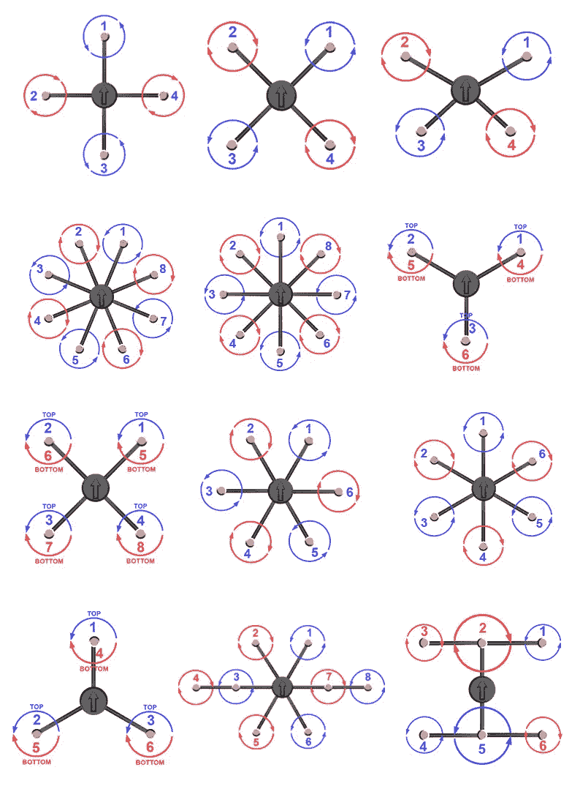
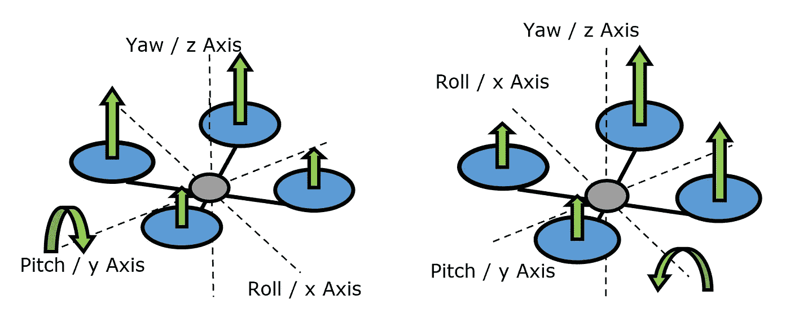
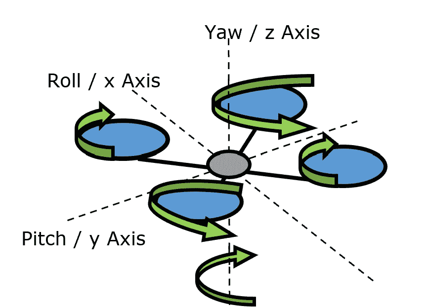
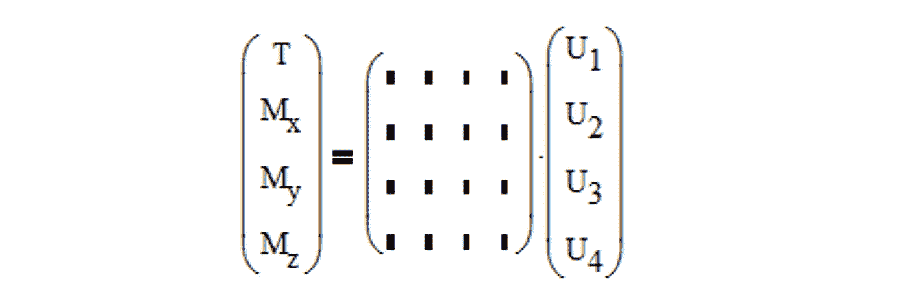
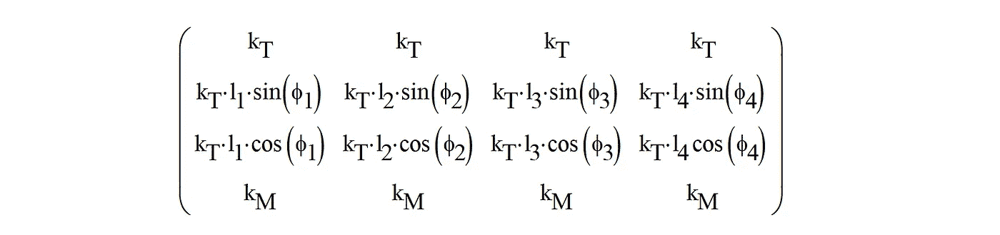
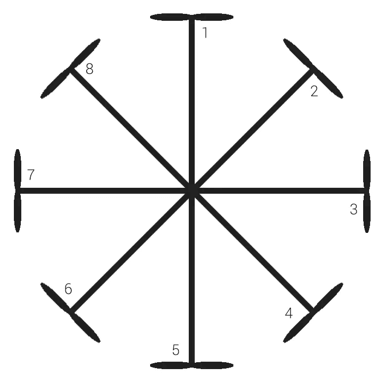
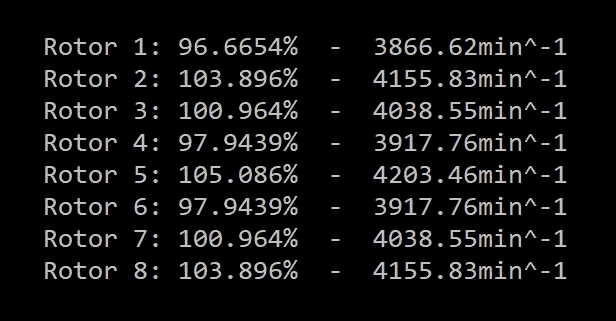

# 多旋翼系统的控制分配是如何工作的

> 原文：<https://pub.towardsai.net/how-control-allocation-for-multirotor-systems-works-46473e371874?source=collection_archive---------4----------------------->

在 [Unsplash](https://unsplash.com?utm_source=medium&utm_medium=referral) 上[剂量媒体](https://unsplash.com/@dose?utm_source=medium&utm_medium=referral)拍照

## 应用数学

## 无人机如何工作的数学解释

看到无人机飞行总会让你想到它是如何在空中保持自身稳定的？多翼飞机及其广泛的适用性使其成为各种飞行和运输的最具创新性的工具之一。然而，在背景中，运行复杂的数学计算，以相对于环境影响精确地跟随控制输入。

在三维空间中操纵多翼飞机是通过每个单独旋翼的特定旋转频率进行的，由此该系统能够执行期望的运动。在这个过程中，某些旋翼被加速，以根据飞行员的控制输入改变多旋翼系统的方向。在飞行控制器(每架无人机的计算机)的最里面有一个控制分配程序。根据飞行员的输入，它以矩阵的形式建立各种输入信息，并执行一些线性代数变换和计算来计算输出值。在数学层面上有趣的事情是，随着转子数量的增加，如何分配旋转转子速度有无限多的选择。但首先，让我们谈谈一些基础知识。

# 配置

单个电机的设置和位置是数学计算中最重要的信息。这也包括重量和重心的位置。这就是当你增加一个不可预见的有效载荷时，无人机坠毁或不再稳定飞行的原因。多旋翼系统有许多不同的配置或布局模式。它们的范围从最常见的搭配如四、六、八分之一到相当不常见的排列如同轴、双、三、五或七分之一。

来源:[迪邦科技](http://didbantech.com/)

关于设置的信息对于每架无人机都是必不可少的，并将在数学方程中发挥重要作用。

# 力学

为了控制无人机，某些旋翼被加速或减速，以根据飞行员的控制输入移动多旋翼的方向。

通常，多翼飞机由固定螺距的旋翼驱动，这意味着单个叶片不能调节螺距。旋转时，它们不仅产生推力，还产生绕自身轴的扭矩，这将使无人机旋转。为了抵消，一半的转子顺时针旋转，另一半逆时针旋转。当它们以相同的速度运行时，旋翼扭矩被抵消，飞机可以以稳定的方式悬停。对于上升和下降，转子速度相等或相等。

虽然悬停、上升和下降机动很容易计算，但俯仰和滚转需要一定的推力和扭矩控制，以获得所需的控制输出，并仍然保持相同的高度。下面的运动用最简单的配置，四轴飞行器来解释。如果飞机需要滚转，螺旋桨速度必须在滚转轴的一侧加速，在另一侧减速。由于推力矢量方向的改变，这导致了横向运动。这同样适用于围绕俯仰轴的俯仰控制。

为了使多翼机绕其自身轴线旋转或改变其方向，一半的对置旋翼被加速，而另一半的对置旋翼被减速。这种变化会覆盖扭矩补偿，多直升机会围绕偏航轴旋转。

# 物理基础

知道无人机如何控制自己，我们可以从飞行控制律中实现的物理基础开始。飞行控制器中使用的旋翼推力方程定义如下:

因为 **k** 是一个恒定的推力系数，它只取决于转子的几何形状，推力与转速 **n** 的平方成正比。

每个螺旋桨也会产生一个扭矩，抵消螺旋桨的旋转方向。它也与旋转速率 **n** 的平方成比例:

在这个方程中， **k** 也是一个常数力矩系数，取决于转子的几何形状。

最后，我们必须根据一个转子的推力 **T** 及其到轴的距离 **l** 来计算无人机绕 x 轴和 y 轴的扭矩或力矩:

有了这三个方程，我们可以建立一个线性方程组，这样，对于给定的控制输入，每个螺旋桨的转速可以以最有效的方式计算出来。

# 基本数学系统

飞行控制器每 2-3 毫秒必须解决的是一个线性方程组。每条线代表多翼机的一种输入运动。在这种情况下，我们只关注四轴飞行器的系统，但该系统在尺寸上没有限制。

转速 **n** 的平方被转速 **U** 代替，以给出更好的概述。 **T** 代表总推力， **M(x，y，z)** 代表无人机所有三个轴的力矩或扭矩。

中间的矩阵称为**B**-矩阵因多机而异，描述了第一节中描述的系统配置。在我们的例子中，我们看到的是一个非常简单、对称的四轴飞行器。它包括两个不同的旋翼常数 **k** ，旋翼与重心之间的距离 **l** ，以及旋翼从向前飞行方向绕重心所算出的不同角度**φ**。

最后，我们可以看到飞行控制器最深层的任务是什么:计算向量 **U** ，在这个线性系统中每个转子的转速。在下面的部分中，我们将快速求解该系统。如果你对矩阵运算不感兴趣，第一眼看不懂也不要担心。

# 数学解决方案

用 **B** 的逆矩阵求解 **U** 的方程:

由于矩阵的乘法规则(仅当 B 矩阵的列数等于 TM 矩阵的行数时有效)，有必要利用所谓的伪逆矩阵从 4xn 矩阵中得到 4x4 矩阵，或者通常将非二次矩阵转换成二次矩阵。如果我们把它限制在四轴飞行器上，就没有必要了，因为 B 矩阵已经是二次的了。然而，这仅涵盖了许多配置可能性中的一种。

伪逆矩阵的创建需要矩阵操作逆矩阵、转置矩阵和乘法矩阵的组合，如下式所示:

将此应用于 **B** 矩阵，并通过乘以 **TM** 来求解 **U** 的方程，将为我们提供最有效分配所需的转子速度。

# 示例和结果

为了可视化和验证我们的计算，让我们看看下面的无人机:

*   对称八轴直升机
*   6 千克起飞质量
*   距离重心 0.4 m 的均匀分布的转子
*   悬停时的转子速度为 4000 转/分

我们的高级控制输入是“向前飞”，在更深的层次上，需要围绕 y 轴旋转，正如你在俯仰动力学的图片中看到的那样。因此，我们的控制输入。**我的**必须是 1 Nm 之类的现实正值，也就是说无人机在 0.4 m 的距离内，会以 2.5 N 左右的力或者 0.25 kg 的质量推动旋转。

控制分配程序给出了下面的结果，这一点也不容易理解。因为我们有 8 个旋翼，所以有无限的可能性来实现这个期望的控制输入。但是你可以借助上面的配置试着想象一下。旋翼 1 位于向前飞行方向。

这就是飞行控制器中最深和最重要的回路之一是如何工作的。然而，在大多数飞行模式中，它与飞行员的控制输入没有直接关系，而是与飞行控制器的控制输入有关，飞行控制器在其他计算中使用飞行员的命令，如位置保持，并要求我们对更高级别的控制回路进行计算。尤其是具有更复杂飞行模式的几乎自主飞行的无人机，必须进行额外的估计，如最佳飞行路径、协调转弯和位置控制，这将引导我们深入研究飞行动力学。

希望你能在阅读的时候学到一些新东西。我期待你的评论！

**来源:**

*Lay，d .，Lay，s .，McDonald，j .，“线性代数及其应用”，第五版，美国皮尔逊，2016 年。*

*约翰逊:直升机理论，普林斯顿大学出版社，新泽西，1994 年*

*全，q .:多机设计与控制导论，施普林格，2017*