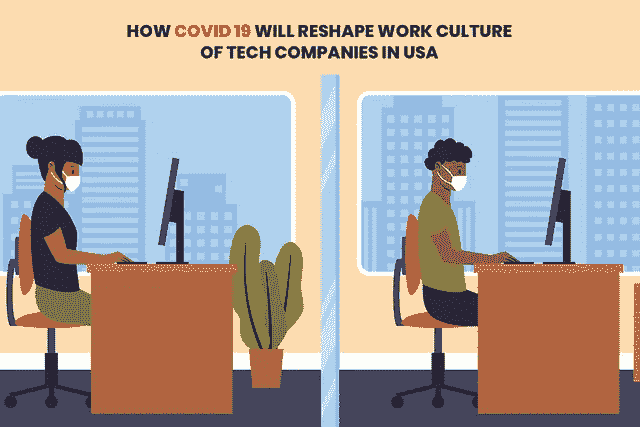
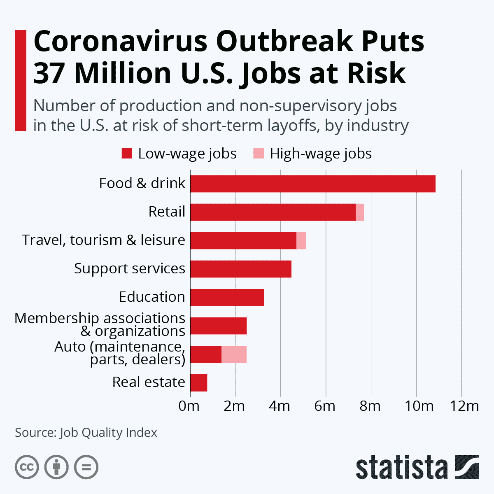
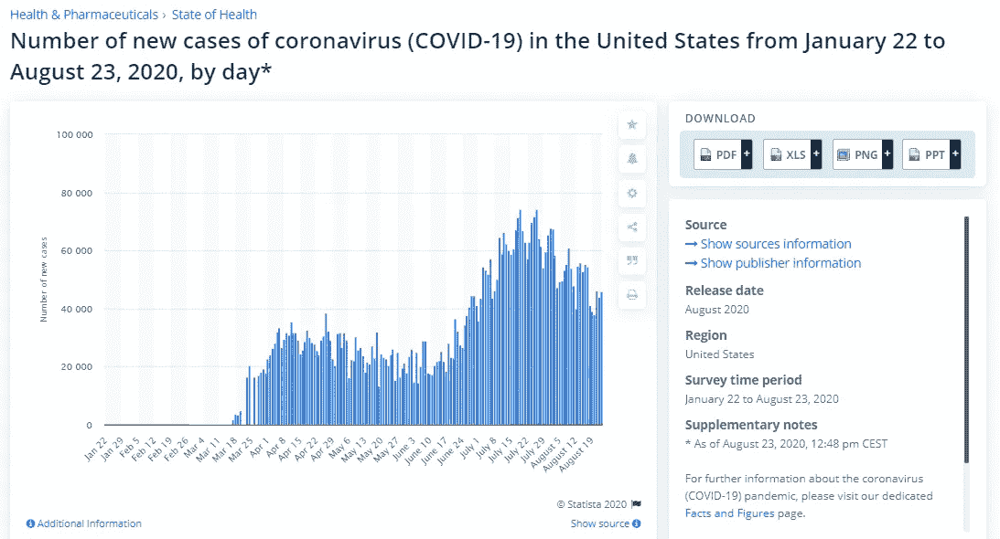
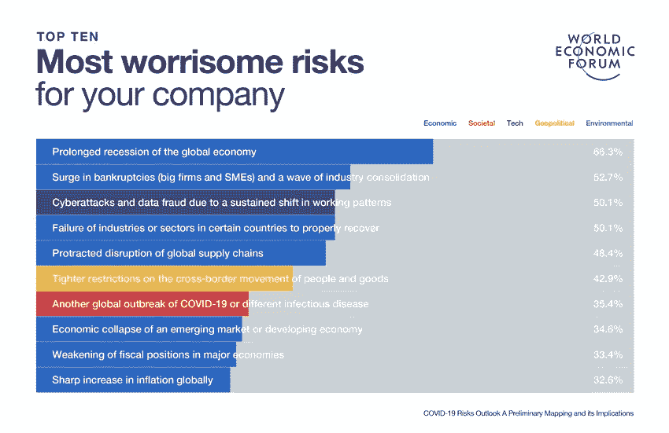
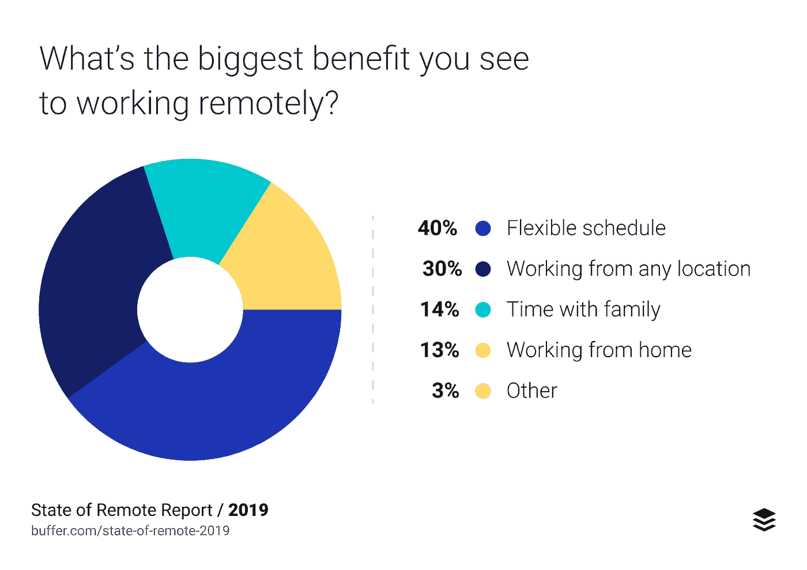
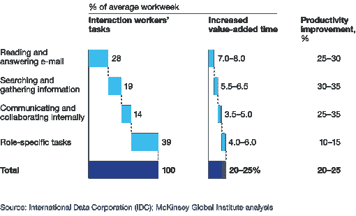
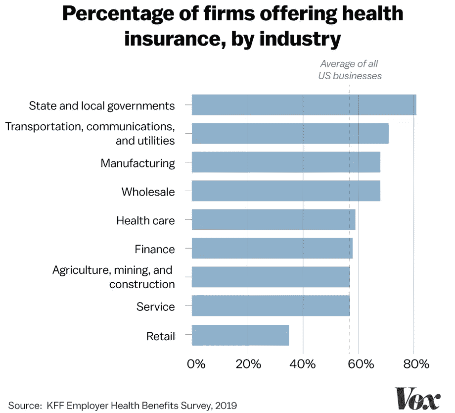
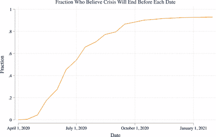

# 新冠肺炎将如何重塑美国科技公司的工作文化

> 原文：<https://pub.towardsai.net/how-covid-19-will-reshape-work-culture-of-tech-companies-in-usa-543b35470b93?source=collection_archive---------3----------------------->

## [未来](https://towardsai.net/p/category/future)、[技术](https://towardsai.net/p/category/technology)、[观点](https://towardsai.net/p/category/opinion)

谁会想到一种病毒会搞垮整个世界，让我们呆在家里？疫情浪潮改变了我们的生活，没有人(无论大小)能控制它。

各行各业的人们不仅受到了影响，而且各行各业也经历了大规模的衰退。这使得公司重组他们的工作，并想办法尽快恢复元气。

> 根据 Statista 的研究，冠状病毒的爆发使 3700 万美国人的工作处于危险之中。

**(图片来源:**[**Statista**](https://www.statista.com/chart/21204/american-jobs-at-risk-due-to-coronavirus-outbreak/)**)**

因此，组织有一个很好的机会来加快他们的产品和使他们的工作场所成为一个更好的地方，因为这个疫情预计将持续下去。所以问题是:公司如何做到这一点？

> 为了帮助你理解这个想法，这里有一些方法可以帮助你了解新冠肺炎是如何重塑企业文化的。

## **世界经济论坛完成的案例研究**

> 根据 Statista 的研究，美国的病例数每天都在增加。2020 年 8 月 23 日，美国报告了近 4.6 万例新冠肺炎新增病例

**(图片来源:**[**Statista**](https://www.statista.com/statistics/1102816/coronavirus-covid19-cases-number-us-americans-by-day/)**)**

在世界经济论坛的帮助下与达信和麦克伦南合作完成的研究以及苏黎世保险集团推出的 [**新冠肺炎风险展望:初步测绘及其影响**](http://www3.weforum.org/docs/WEF_COVID_19_Risks_Outlook_Special_Edition_Pages.pdf) **。**

这项研究倾向于调查 350 名参与风险认知调查的资深风险专家。他们被要求评估 31 项风险，这些风险被认为属于三类:对世界最有可能、对世界最令人担忧、对公司最令人担忧。

大约 80%的⅔人认为经济衰退是他们最关心的问题.他们中大约有 20%的人认为破产和供应链中的描述是最大的担忧.该组织担心 COVID 19 的影响以及其中涉及的地缘政治破坏。由于超过 40%的人限制了人员和货物的流动，工业也对该地区产生了担忧。

> 第三个最麻烦的方面是网络欺诈和数据攻击，其中大约 50%发生在 IT 行业和**新冠肺炎对美国科技行业的展望**

**(图片来源:** [**经济论坛**](https://www.weforum.org/agenda/2020/03/how-are-companies-responding-to-the-coronavirus-crisis-d15bed6137/) **)**

## **那么，组织是如何适应当前形势的，他们是如何恢复的？**

大流行后的世界可能会给所有行业和软件开发公司带来巨大的变化，因此他们需要为即将到来的事情做好准备。

那么，最大化工作文化以改善管理的重要特征是什么呢？

> 让我们来了解一下！

# **针对员工**

## **1。适应远程工作或 WFH 场景**

远程构建整个团队的想法是组织在这个疫情期间最好的工作。这些远程团队的最大优势是他们在危机时刻提供的灵活性。

以一种分布式的方式构建一个组织，不仅能让雇主在当前的情况下充分利用优势，还能让组织增加工作场所的多样性。

> **根据 buffer 的研究，对于个人来说，灵活的时间表是远程工作的最大好处**

**(图片来源:******)****

**在家工作有助于保护员工，提高员工能力，服务客户，并帮助重建业务连续性。**

**不要忘记，远程工作和 WFH 不仅有助于疫情的员工，也有助于全球经济。与过去他们走到办公室，亲自出现在办公室的日子相比，大多数公司正在举行更多的会议。在此之前，一些交流是非正式的、不定期的。现在有了远程办公，交流就变得直接和频繁了**

## ****2。技术****

**有助于远程工作成功实施的一个最重要的因素是沟通。既然我们已经讨论了远程工作，那么工作场所需要在技术方面进行重新配置，并根据需要进行升级。**

**组织可能需要更好的工作场所重新配置，以帮助员工适应远程工作，还可能需要通信技术升级。于是， [**雇佣了懂得这项改革的 app 开发者**](https://www.xicom.biz/offerings/hire-mobile-developers/) 。*整个事情的解决方案是，组织需要投资软件和 VPN，也称为虚拟专用网络，以实现更快、更高质量的数据连接。例如，让我们举一些顶尖组织的例子。***

*   **谷歌允许免费访问尖端技术，这往往涉及每月的常规费用，以满足所有 G Suite 和 G Suite 教育客户的需求。**
*   ****微软**倾向于为顶级微软团队提供为期半年的免费预备课程，帮助用户支持中国等国家的学校、医疗诊所和组织，即使在冠状病毒的限制下也能继续工作。**

## ****3。功能多样且准确****

**当我们谈论组织的功能时，我们包括了组织在疫情事件后需要采取的安全措施的每一个方面。本组织需要提供更好的设施和便利条件，这将有助于各组织之间更好的互动。**

> **他们如何通过设计高效的布局和在弹性中的使用来做到这一点。他们需要整合座位安排，在两个员工之间留出一张桌子。**

**不仅如此，这些组织现在还需要整合高科技且卫生良好的茶水间，然后 [**雇佣移动应用开发者**](https://www.xicom.biz/offerings/hire-mobile-developers/) 。这些办事处还需要重要的品牌和识别工具。整个行业还可以做的一件事是，他们需要更多的会议和会议室，这将有助于扩大视频会议能力。**

# ****针对客户****

## ****1。与客户相处的习惯****

**新冠肺炎的爆发永远改变了顾客、员工和市民的体验。由于这些巨大的变化，他们的行为也在改变。这也导致了消费品行业的结构性变化。**

**在这些新行为的帮助下，该组织有一个很好的机会向客户提供他们在冠状病毒开始之前选择的平台上未能获得的体验。组织和应用程序开发公司可以扩展现有产品，从而建立新的服务系列，其中可能包括零售商联合起来帮助客户以及组织为消费者提供“非接触式”交付和路边取货服务。**

## ****2。沟通是关键****

**美国 IT 组织重塑业务的唯一方法之一就是与客户沟通。这是你与客户保持关系的唯一有效和高效的方式。**

**在广告商的帮助下，你应该能够通过电子邮件和直接信息的帮助来寻找和建立与现有和潜在客户的信任。**

> ****根据统计，通过社交技术改善沟通和协作可以将互动工作者的生产率提高 20%至 25%。****

****

**(图片来源:[麦肯锡](https://www.mckinsey.com/))**

**当涉及到活动或可能需要推迟营业的商店地点时，所有企业都应该考虑与客户的长期关系，并知道退款或重新安排可能是那些可能经历压力的人的缓解点之一。**

**不仅如此，组织和公司也可以从受影响的业务中获得帮助。谷歌建议用户更新“我的商业档案”上的营业时间和描述。除了让受众了解他们的业务，用户还可以更新描述，以提供更多关于他们想要采取的任何额外预防措施的数据，或者是否需要对服务进行任何修改。**

# ****为行业****

## ****1。削减不必要的中层管理职位****

**在这些危机时刻，最重要的事情之一就是消除一些晋升和不必要的标签，这些标签是由 [**网络开发公司**](https://www.xicom.biz/offerings/web-development/) 给他们的员工的。许多行业会意识到，他们真的不需要以前公司里有的这些层。**

**其他人则更有希望，一旦疫情消退，人们对高层管理者的兴趣将会反弹，理由是协会需要效率。对理顺管理层结构的一个担忧是，需要监督大量直接下属的董事将会减少，从而为错误、缺乏监督和拙劣的工作创造了空间。**

## ****2。必备健康保险****

**现在 COVID 19 让很多人意识到了自己的健康。健康保险的需求是每个行业，无论大小，都需要思考的问题。员工们将会面临巨大的降低成本的压力。美国的许多组织正在考虑这样做，以保护他们的员工，使他们的人数不会减少。**

> **根据⅓的一项研究，很多行业已经在为员工提供医疗保险。**

****

****(图片来源:** [**Vox**](https://www.vox.com/policy-and-politics/2020/3/27/21197279/coronavirus-us-unemployment-health-insurance) **)****

## ****3。IT 产业融资援助****

**美国的 Android 应用程序公司正在采取一种做法，他们向所有代表提供奖励、奖励、加薪或其他与金钱相关的帮助，以控制由于长期活动、终止或管理暂停的变化而导致的薪酬不稳定。**

**深入调查有关保留或提高其代表资格的组织或公司的见解，往往会奖励这些计划，而不管组织是否提供他们可以获得的最大金额。**

# ****预测危机的路径****

**根据 PNAS 所做的研究，大多数行业认为这种疫情会持续一段时间，行业可能会因此遭受损失。**

****

****(图片来源:**[**PN**](https://www.pnas.org/content/117/30/17656)**AS)****

****因此，行业和 iOS 应用开发公司还可以做的就是遵循这些重要步骤:****

*   **解决:寻找新冠肺炎给所有研究所员工以及商业伙伴带来的挑战和问题**
*   ****恢复能力:**解决与现金管理相关的所有挑战，以及病毒相关停工和经济衰退期间存在的问题**
*   **现在你知道了问题所在，你需要制定一个详细的回归计划，更加明确你需要的目标和成就。**
*   ****想象:**寻找下一个常态。了解不连续性是什么样的，并解决组织应该如何改造的问题。**
*   ****改革:**意识到并清楚环境中的竞争和转变。**

# ****总而言之****

**到这篇文章结束时，你会确信现在雇佣软件开发人员或其他员工可能不是一个好主意，而抛光和照顾现有的人是你需要做的。**

**如果 [**软件开发公司**](https://www.xicom.biz/) 需要这方面的指导，他们可以在评论区提出你的问题，或者亲自联系。**