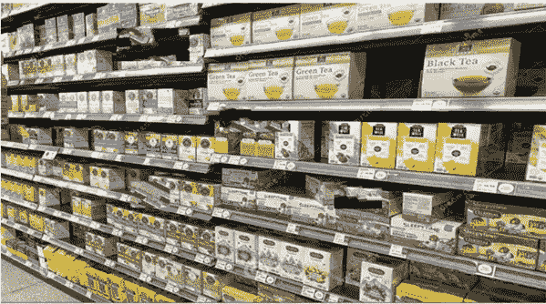
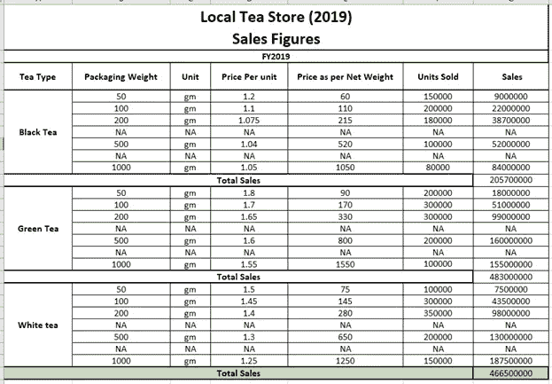
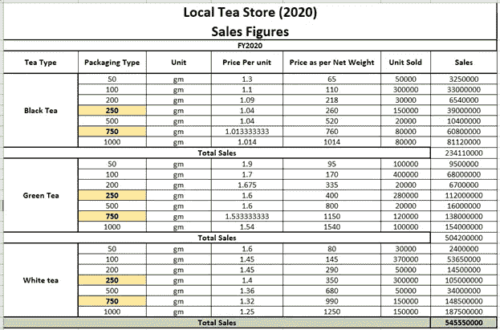
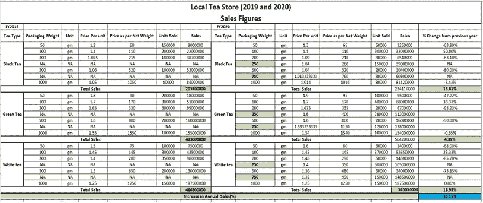
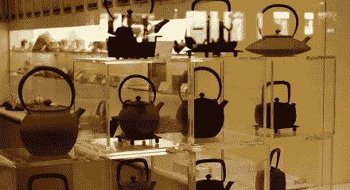

# 数据分析如何帮助当地一家茶叶商店在疫情期间将销售额提高了 35%？

> 原文：<https://pub.towardsai.net/how-data-analytics-helped-a-local-tea-store-to-increase-its-sales-by-35-during-pandemic-c93136883cdc?source=collection_archive---------2----------------------->

## [数据分析](https://towardsai.net/p/category/data-analytics)

来源:[https://tracychowblog . WordPress . com/2018/04/25/aake-a-cup-of-tea-for/](https://tracychowblog.wordpress.com/2018/04/25/aake-a-cup-of-tea-for/)

我们每个人都熟悉新冠肺炎的浩劫，以及它如何导致 2020 年商业的大规模衰退。由于全球疫情，商业销售额空前下降。世界各地的商店和企业大范围关闭发生在疫情，原因有很多——即。受政策要求、需求下降、健康问题和许多其他因素的影响。

新冠肺炎危机爆发时，小企业的相对收入损失比大企业大得多。疫情来袭时，小企业快速适应法规和需求变化的能力较低。

但是有一家**当地的茶叶店**，在这段时间里比去年多了 35%的销售额。

来源:[https://store brands . com/ahold-USA-gets-sustainable-store-brand-tea-coffee](https://storebrands.com/ahold-usa-gets-sustainable-store-brand-tea-coffee)

这是怎么发生的？

商店经理可以从他的数据分析中获得什么样的见解？

采用了什么策略来增加收入？

看一眼它是值得的。

来源:[https://www . dreamstime . com/display-tea-过道-全食超市-杂货店-奥兰多-佛罗里达-美国-image182167756](https://www.dreamstime.com/display-tea-aisle-whole-foods-market-grocery-store-orlando-fl-usa-image182167756)

对此，我先从该店 2019 年的销售数字说起。

**免责声明:**商店的确切数据和数字无法透露，因此被视为虚构数据，以显示所采用的策略。

**假设**—2019 财年和 2020 财年相同包装和相同单价的销售单位保持不变(即观察到茶叶需求无弹性)。

表 1

上表描述了 2019 财年销售的包装重量

50 克，

100 克，

200 克，

500 克和

1000 克

这促成了 **466500000** 的年总销售额(未提及具体货币以使计算独立于任何单位。)

同样，让我代表商店 2020 年的销售数字。

表 2

上表描述了 2020 财年销售的包装重量

50 克，

100 克，

200 克，

**250 克，**

500 克

**750 gm** 和

1000 克

这促成了 **545550000** 的年总销售额(未提及具体货币，以使计算独立于任何单位。)

这是否意味着，引入新包装重量的 **250 克和 750 克**后，销售额从 **466500000 增加到 545550000** ？

嗯，既可以说“是”，也可以说“不是”。但是让我给你详细解释一下。

为了理解这一点，让我来表示代表 2019 财年和 2020 财年销售数字的数据，以及与上一年相比，本年度观察到的销售百分比变化。

表 3

以上数据显示:

新推出的 250 克和 750 克包装重量的单价(1.04 和 1.013、1.6 和 1.533 以及 1.4 和 1.32)分别低于其他可比包装重量。

事实上，如果你仔细观察 50 克早期包装的单价，与 2019 财年相比，2020 财年所有情况下的单价都增加了 200 克，与 2019 财年相比，2020 财年所有情况下的单价都减少了 1000 克或保持不变，但 250 克和 750 克新包装重量的单价保持相对较低。

这对销售有什么影响？让我们试着去理解。

我已经提到过，特定包装重量的年销售量是不变的，直到单价不变，因为这是一家本地商店，有特定的区域和客户群来迎合。

类似地，新包装推出时的单价低于其早期包装重量，这使得客户群从可比较的旧包装转向新包装重量(即 250 克和 750 克)。

例如，如果您观察“表 3 ”,您将会看到，对于“红茶，以低于 1.09 英镑的单价 1.04 英镑推出 250 克包装(包装重量为 200 克),随着单价降低，客户群向 250 克包装转移，客户群从早期的 180000 个 200 克包装转移到 150000 个。反过来，2020 财年观察到，200 gm 包装的客户群只有 30，000 个，而早期为 1，80，000 个。

由于单价降低，其大部分客户群(1，50，000)转向 250 克包装。这标志着销售的巨大差异。

同样，您可以观察其他包装重量的数据，您会发现同样的现象在 750 克包装的情况下也在重复。

这导致销售额大幅增长(总体增长 35.15%)。

这家茶店采用的策略叫什么？

来源:[https://travelandtea.wordpress.com/tag/usa/](https://travelandtea.wordpress.com/tag/usa/)

它被称为“**有针对性的细分市场销售最大化定价策略”。**

我来详细解释一下“**目标细分市场销售最大化定价策略**”。

茶叶商店观察到茶叶的需求曲线相当缺乏弹性，因此利用这一点，对现有包装小幅提价，对新包装小幅降价，这对他们的销售产生了巨大的积极影响，而没有减少对 it 饮料的需求。它瞄准了对价格敏感的客户群，并赢得了不同包装范围的差异化价值。

在仔细分析数据和评估趋势后，这是任何具有非弹性需求曲线的组织都可以采用的策略。

希望你喜欢阅读这篇文章。

继续阅读，因为它激励我带来更多。

你可以在媒体上跟踪我

LinkedIn: [Supriya Ghosh](https://www.linkedin.com/in/supriya-ghosh)

还有推特: [@isupriyaghosh](https://twitter.com/isupriyaghosh)