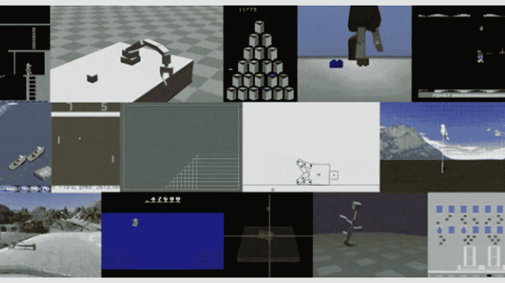
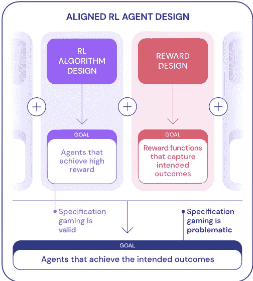
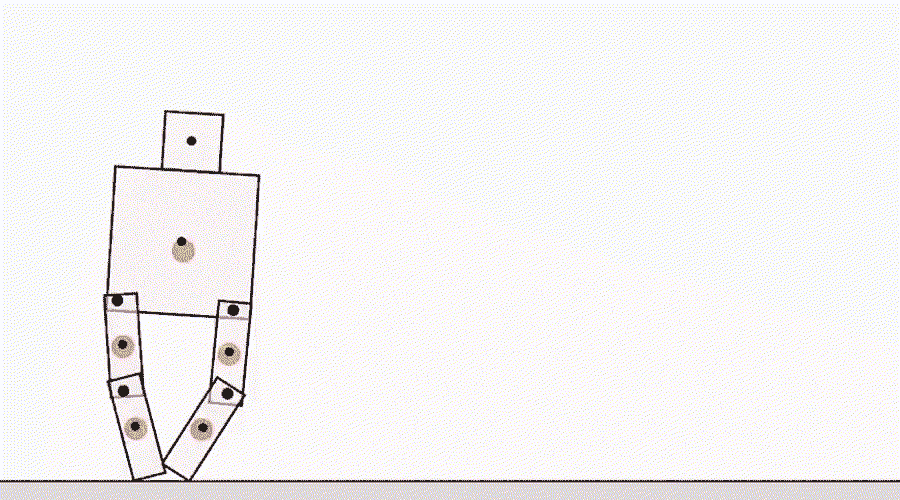
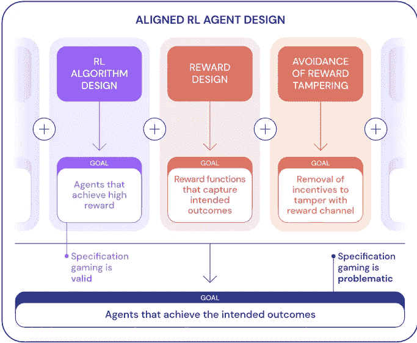

# 深度思维如何控制强化学习代理变得“太聪明”

> 原文：<https://pub.towardsai.net/how-deep-mind-controls-reinforcement-learning-agents-from-getting-too-clever-49a95eca2ce5?source=collection_archive---------1----------------------->

## 规范游戏是强化学习中的一个挑战。

图片来源:DeepMind

> 我最近创办了一份专注于人工智能的教育时事通讯，已经有超过 125，000 名订户。《序列》是一份无废话(意思是没有炒作，没有新闻等)的 ML 导向时事通讯，需要 5 分钟阅读。目标是让你与机器学习项目、研究论文和概念保持同步。请通过订阅以下内容来尝试一下:

 [## 序列

### 与机器学习、人工智能和数据发展保持同步的最佳资源…

thesequence.substack.com](https://thesequence.substack.com/) 

强化学习(RL)是人工智能(AI)领域中最纯粹的知识构建形式之一。毕竟，程序有一种魔力，它可以通过自然地与环境交互来积累知识，以完成特定的任务。然而，当 RL 代理为了完成任务而开始寻找漏洞时会发生什么。自动驾驶汽车需要在到达某个目的地的任务与尊重交通规则和保护人类生命之间取得平衡，否则后果将是灾难性的。错误的任务规范会导致 RL 代理利用漏洞，这在一般环境中会产生负面影响。DeepMind 开始更详细地分析任务规范的问题，并且[提出了联合 RL 代理的概念，其目标是在其环境中实现最佳可能结果](https://deepmind.com/blog/article/Specification-gaming-the-flip-side-of-AI-ingenuity)。

我们都接触过糟糕的任务规范的后果的例子。你可以争辩说，迈达斯国王要求把他接触到的任何东西都变成金子，但他没有很好地定义他想要的结果。但是让我们更务实一点。有多少次，我们看到人们为了完成任务走捷径，在压力下跨越道德，有时甚至法律的界限？在 RL 的环境中，当代理试图游戏任务规范时，他们会表现出同样的不稳定行为。

# 规范游戏和 RL

目睹一个 RL 代理偏离预期的行动路线来完成一项任务是一件不可思议的事情。我们都记得 AlphaGo 与 Lee Sedol 的第二场比赛中著名的 37 步棋，当时 AlphaGo 的一步棋与每一种传统的围棋策略相矛盾，最终成为比赛中的决定性一步。在 AlphaGo 的案例中，37 步棋被誉为真正创造性的标志，它没有超出围棋的规则，只是超出了它的传统策略。但是，当 RL 代理面临的任务规范与环境中的预期结果不完全一致时，会发生什么呢？

让我们用一个 RL 代理的例子，它的任务是堆叠一些乐高积木。在这种情况下，当 RL 代理不接触红色块时，它会因红色块底面的高度而获得奖励。该规范是不完整的，因为缺少红色块应放置在蓝色块上方的要求。机器人基本上忽略了堆叠砖块的最终目标，而是翻转红色砖块以达到更高的高度。

来源:[https://deep mind . com/blog/article/Specification-gaming-the-flip-side-of-AI-intelligence](https://deepmind.com/blog/article/Specification-gaming-the-flip-side-of-AI-ingenuity)

AlphaGo 和 lego-stacking agent 这两个例子说明了规范游戏的摩擦。一方面，规范游戏表明 RL 代理正在寻找解决问题的新方法。另一方面，结果可能会损害代理的环境。第一个案例(AlphaGo)展示了 RL 的创造力，第二个(乐高代理)是规范博弈的例子。

规格博弈问题随着手头任务的关键程度而增加。找到一个漏洞来堆砌乐高积木和我们谈论一个机器人给病人做手术没有同样的相关性。

# 对齐的 RL 代理

当 RL 代理以预期结果为代价利用规范中的漏洞时，规范博弈就发生了。这些漏洞通常是由于对预期任务的错误指定，而不是 RL 算法中的问题。[在 DeepMind 用来讨论他们的研究的博客文章](https://deepmind.com/blog/article/Specification-gaming-the-flip-side-of-AI-ingenuity)中，他们将对齐的 RL 代理定义为能够完成目标任务同时在其环境中实现预期结果的模型。

来源:[https://deep mind . com/blog/article/Specification-gaming-the-flip-side-of-AI-intelligence](https://deepmind.com/blog/article/Specification-gaming-the-flip-side-of-AI-ingenuity)

从强化学习的角度来看，任务规范是不同元素的组合，如环境设计、训练方法、主体的奖励函数等。正确的任务规范对于确定代理是否与目标任务一致至关重要。如果规格是正确的，代理人的创造力产生一个令人满意的新的解决方案。错误的规范会产生不良行为，如前一节所述。

有许多因素会导致 RL 代理中的规范博弈。DeepMind 的研究确定了几个关键因素:

# 奖励塑造

作为一个规范博弈概念，当一个 RL 代理试图最大化中间奖励而不是任务的最终结果时，奖励形成就会发生。让我们看看下面的例子，一个代理在 [Coast Runners 游戏](https://openai.com/blog/faulty-reward-functions/)中控制一艘船。预期的目标是快速完成比赛，但鉴于代理的奖励是基于击中绿色方块，它制定了一个奇怪的政策，以循环并继续击中这些方块。

来源:[https://deep mind . com/blog/article/Specification-gaming-the-flip-side-of-AI-intelligence](https://deepmind.com/blog/article/Specification-gaming-the-flip-side-of-AI-ingenuity)

# 人因规格

正确地指定任务的结果可能是一个令人生畏的挑战。鉴于这种复杂性，许多 RL 代理依赖人类来提供关于任务结果的反馈。然而，这种方法可以使 RL 代理利用人类判断的主观本质。例如，一个执行[抓取任务](https://openai.com/blog/deep-reinforcement-learning-from-human-preferences/)的智能体学会了通过从摄像机角度覆盖物体来伪造结果。

来源:[https://deep mind . com/blog/article/Specification-gaming-the-flip-side-of-AI-intelligence](https://deepmind.com/blog/article/Specification-gaming-the-flip-side-of-AI-ingenuity)

# 模拟器错误

创建真实世界环境的模拟是一项超级复杂的任务，经常容易出现软件错误。在许多情况下，RL 代理可以利用这些错误来最大化他们的奖励功能。例如，一个[模拟机器人](https://www.youtube.com/watch?v=K-wIZuAA3EY&feature=youtu.be&t=486)学会了一种奇怪的行为，混淆了“行走”规范任务。

来源:[https://deep mind . com/blog/article/Specification-gaming-the-flip-side-of-AI-intelligence](https://deepmind.com/blog/article/Specification-gaming-the-flip-side-of-AI-ingenuity)

虽然这些例子可能看起来很有趣，但在关键任务环境中，相同类型的行为可能会产生有害的后果。

[DeepMind 确定了任务规范设计中的三个关键挑战](https://deepmind.com/blog/article/Specification-gaming-the-flip-side-of-AI-ingenuity):

*   *我们如何在奖励函数中忠实地捕捉给定任务的人类概念？*
*   *我们如何避免在关于领域的隐含假设中犯错误，或者设计代理来纠正错误的假设而不是玩弄它们？*
*   我们如何避免奖励被篡改？

理解这些挑战对于设计一致的 RL 代理是必不可少的。

来源:[https://deep mind . com/blog/article/Specification-gaming-the-flip-side-of-AI-intelligence](https://deepmind.com/blog/article/Specification-gaming-the-flip-side-of-AI-ingenuity)

尽管这些挑战没有通用的解决方案，但意识到它们的存在有助于优化 RL 环境和奖励功能的设计。随着 RL 模型开始应用于更复杂和关键任务，规范游戏挑战可能会增加。就像人类行为一样，建立功能、道德和法律规则来规范 RL 代理的行为对于最小化规范博弈的影响是必要的。