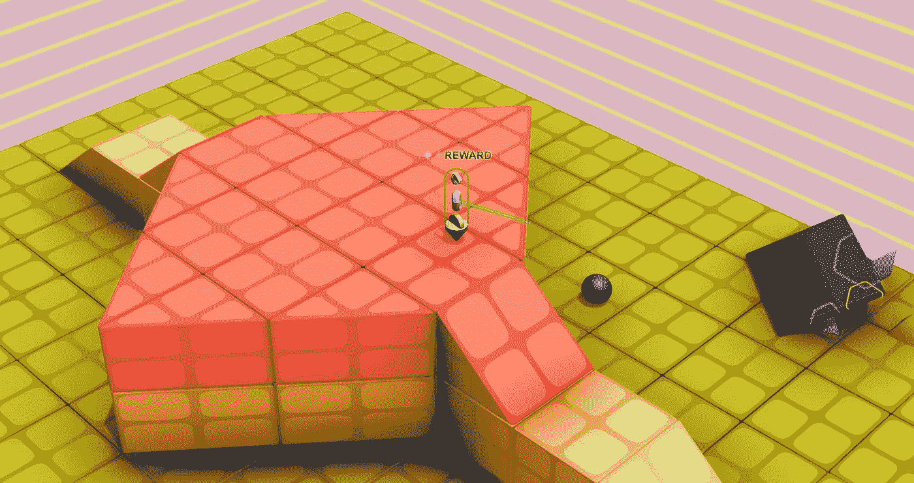
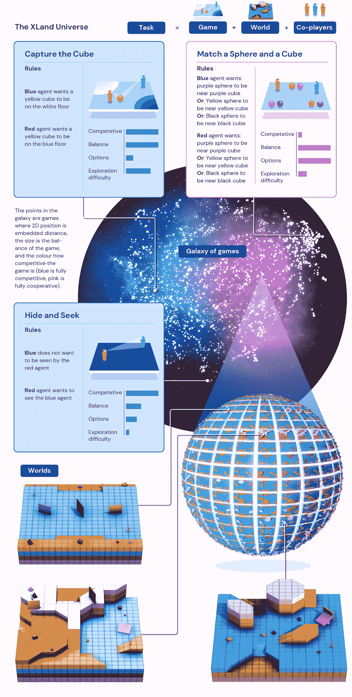
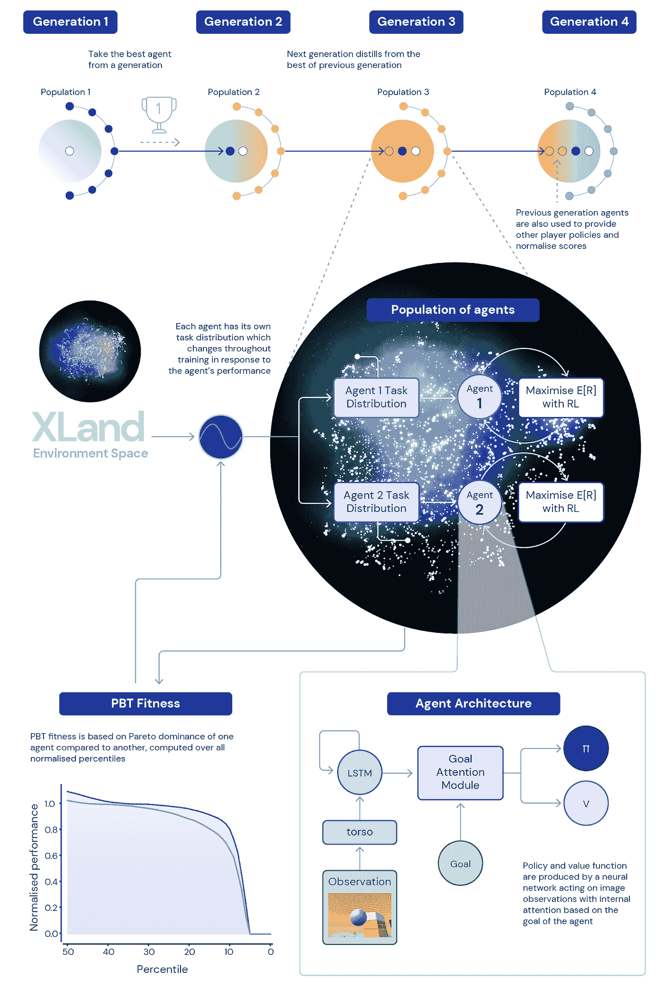

# DeepMind 如何训练可以在没有人类干预的情况下玩任何游戏的代理

> 原文：<https://pub.towardsai.net/how-deepmind-train-agents-that-can-play-any-game-without-human-intervention-63ef95dbdff3?source=collection_archive---------1----------------------->

## [人工智能](https://towardsai.net/p/category/artificial-intelligence)

## 一份新的报告提出了一个新的架构和培训环境，一般有能力的代理人。

图片来源:DeepMind

> 我最近创办了一份专注于人工智能的教育时事通讯，已经有超过 10 万名订户。《序列》是一份无废话(意思是没有炒作，没有新闻等)的 ML 导向时事通讯，需要 5 分钟阅读。目标是让你与机器学习项目、研究论文和概念保持同步。请通过订阅以下内容来尝试一下:

 [## 序列

### 订阅人工智能世界中最相关的项目和研究论文。受到 85，000 多人的信任…

thesequence.substack.com](https://thesequence.substack.com/) 

近年来，游戏一直是一些最大的深度学习的中心。当 DeepMind 的强化学习代理 AlphaGo 击败围棋世界冠军 Lee Sedol 时，深度学习和游戏的 sputnik 时刻到来了。AlphaGo 后来被 AlphaZero 完善，alpha zero 能够掌握像国际象棋、围棋或日本象棋这样的游戏。强化学习代理在多人游戏中也取得了超人的表现，如[雅达利](https://deepmind.com/blog/article/Agent57-Outperforming-the-human-Atari-benchmark)、[夺旗](https://deepmind.com/blog/article/capture-the-flag-science)、[星际争霸 2](https://deepmind.com/blog/article/AlphaStar-Grandmaster-level-in-StarCraft-II-using-multi-agent-reinforcement-learning)、 [Dota 2](https://openai.com/projects/five/) 和[捉迷藏](https://openai.com/blog/emergent-tool-use/)。然而，在每种情况下，强化学习代理每次都在一个游戏中训练。在深度学习领域，构建可以同时掌握多个游戏而无需大量人工干预的智能体的想法仍然是一个难以实现的目标。最近，DeepMind 发表了“[开放式学习导致普遍有能力的代理](https://deepmind.com/research/publications/open-ended-learning-leads-to-generally-capable-agents)”，这是一篇研究论文，详细介绍了训练强化学习代理的方法和过程，这些代理能够在没有人类干预的情况下掌握多个同时进行的游戏。这篇论文代表了在现实世界环境中建立更通用的智能体的一个重要步骤。

本质上，DeepMind 构建通用智能代理的方法基于三个直观的构建模块:

*1)丰富多样的训练任务。*

*2)灵活的架构和训练方法。*

衡量进展的严格流程。

# 大量的训练任务

为了普遍掌握学习不同游戏的技能，DeepMind 创建了一个名为 XLand 的环境，本质上是一个游戏星系。在 XLand galaxy 中，游戏是根据某些特征(如合作或竞争动态)的接近程度来放置的。每个游戏可以使用不同的复杂程度来玩，这些复杂程度可以动态地改变，以改善代理的学习行为。

图片来源:DeepMind

# 灵活的架构和培训方法

DeepMind 的代理架构基于目标注意力代理(GOAT)神经网络，该网络使用对其当前状态的注意力。这种机制有助于代理关注给定游戏中的特定子目标。训练任务的分配是使用 DeepMind 最喜欢的[基于人口的训练](https://deepmind.com/blog/article/population-based-training-neural-networks) (PBT)来选择的，这已经在他们的许多强化学习模型中使用过。PBT 调整任务生成过程的参数，以改进代理的学习。培训过程从零开始，并根据代理的进度逐渐增加复杂性。

图片来源:DeepMind

# 衡量进展

量化不同任务的学习进度可能是一个重大挑战。为了解决这个问题，DeepMind 将每项任务的分数标准化，并使用通过当前一组训练有素的玩家计算出的纳什均衡值。评估任务查看标准化分数的不同百分位数，这些分数可以在不同代理之间进行比较。

# 结果呢

DeepMind 在 XLand 的 4000 个世界的大约 700，000 个游戏中训练了其一般能力的代理。这相当于大约 200，000，000，000 个训练步骤和 3，400，000 个训练任务。代理人能够在几乎没有人工干预的情况下掌握几乎每一项任务。这清楚地显示了这种类型的方法在没有人类监督的情况下使用单个代理来掌握多个复杂任务的可行性。本文概述的想法可能是新一波强化学习里程碑的开始。您可以在下面的视频中看到代理的工作: