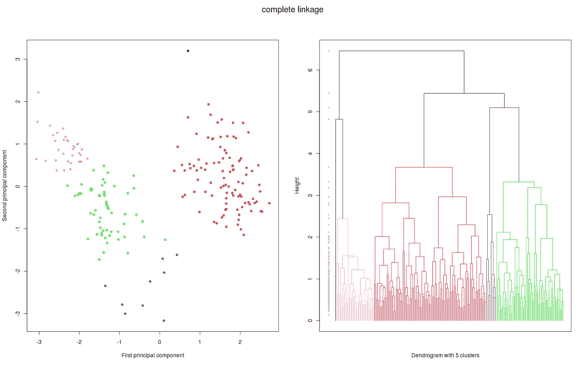
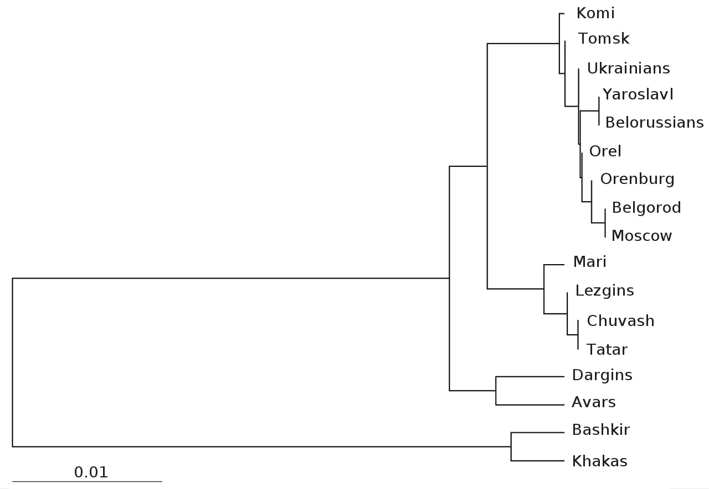
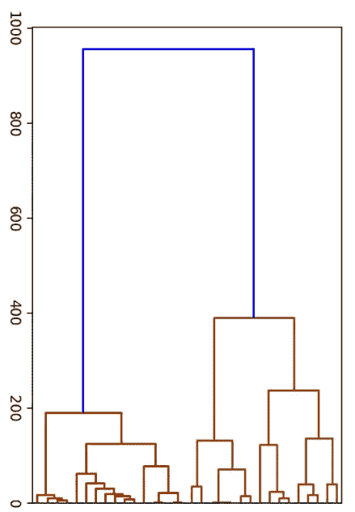

# 树状图如何使你的销售预测更加准确

> 原文：<https://pub.towardsai.net/how-dendrograms-can-make-your-sales-forecasts-more-accurate-c446411340b5?source=collection_archive---------4----------------------->

## [商业科学](https://medium.com/tag/business-science)，[数据科学](https://towardsai.net/p/category/data-science)

## 为什么人工智能模型依赖于产品相似性来获得更好的结果


照片由[迈克尔·泽兹奇](https://unsplash.com/@lazycreekimages?utm_source=medium&utm_medium=referral)在 [Unsplash](https://unsplash.com?utm_source=medium&utm_medium=referral) 上拍摄

如果你从未听说过树状图，你并不孤单。在我开始从事数据科学家的工作之前，我从未听说过它们。然后它们很快对我的工作变得至关重要。

为什么？它们帮助我们更好地评估产品相似性——这是让我们的**人工智能驱动的销售预测**更加准确的一个基本方法。如果你想提高自己的销售预测(或者有兴趣自己创建一个类似类型的算法)，你需要掌握这个概念。

# 什么是树状图？

[树状图](https://en.wikipedia.org/wiki/Dendrogram)是一种图表，它向您展示不同项目之间的紧密相关性。这种类型的数据可视化创建了从单个“叶子”或节点分支的树，这些“叶子”或节点以一个一个的簇开始，慢慢地将不同的项目与相似的项目配对，以连接成更大的 2 个(然后 4 个，然后 8 个，等等)的组。).最后，您会得到一个显示相似组的图表。根据您定义的一系列特征，您可以看到哪些项目几乎相同，以及哪些项目最不相同。



*CC 下授权:* [维基共享；西格伯特](https://commons.wikimedia.org/wiki/File:Swiss_complete.png)

当你看树状图时，连接两个特定项目的节点越高，它们的共同点就越少。您可以使用这些节点将项目分成相似的组。在定义最终聚类时，你愿意考虑多高的相似性阈值取决于你自己。尽管如此，树状图还是把一组混乱的数据组织起来，这样你就可以进行分析了。

此数据是使用执行分层聚类分析的算法生成的，这是一种基于一组特征确定两个不同项目之间相似性的计算。分层聚类是一种复杂的矢量计算，它根据两个项目在广泛的属性范围内的共性来确定它们之间的总体差异。

# 树状图与产品相似性的关系

树状图可以比较任何项目，以显示它们有多相似(或有多不同)。这对于各种比较都很有用，不仅仅是数据科学家做的比较。拿这张树状图来比较俄罗斯不同人群的遗传基因:



*CC:*[下授权的维基共享资源；a .斯捷潘诺夫诉巴拉诺夫斯基案、梅尔尼科夫案等](https://commons.wikimedia.org/wiki/File:Dendrogram_of_the_genetic_distances_between_Russian_populations.svg)

节点的位置向我们展示了 T4 人与别尔哥罗德人在基因上的相似性，以及他们与哈卡斯人和巴什基尔人的不同之处。你可以想象，比较基因是非常复杂的。我们有数十亿的测序基因，所以有大量的数据可以比较。层次聚类和树状图使我们能够有效地理解这些数据，从而一目了然地了解它们之间的关系。(数据可视化的[力量](https://medium.com/towards-artificial-intelligence/making-ai-more-accessible-a554efcfe433)在起作用！)

当谈到[产品相似度](https://link.springer.com/chapter/10.1007/978-3-319-98038-6_7)时，可能没有数十亿个属性需要评估，但仍然有成吨的因素涉及其中。以时尚产品为例。看似无穷无尽的描述符定义了一件衣服。一条红色的裙子永远不仅仅是一条红色的裙子。可以是非正式的，也可以是正式的。这件衣服可以设计成冬装或夏装。它的材料可以是棉或丝。它可能有刺绣或褶饰或其他风格的细节。这件衣服可以是长袖的，也可以是露肩的。你看这件衣服的时间越长，描述它的方式就越多。


塔玛拉·比利斯在 [Unsplash](https://unsplash.com/s/photos/red-dress?utm_source=unsplash&utm_medium=referral&utm_content=creditCopyText) 上拍摄的照片

树状图允许你综合比较两件衣服，考虑所有这些细节。有时相似性可能不像乍看上去那么明显。虽然比起黄色背心裙，男人的裤子显然更不像红色的鸡尾酒裙，但要决定一条新的蓝色裙子更像红色的鸡尾酒裙还是黄色的背心裙并不容易。树状图给出了一个你可以信赖的更明确的答案。

# 为什么产品相似性对销售预测很重要？

但是你为什么要关心你的产品有多相似呢？如果你知道两种产品相似，你可以根据另一种产品的表现来预测其中一种的销量。

从本质上讲，产品相似性为您提供了额外的可操作数据来计算产品需求，尤其是新产品。虽然历史数据[不应该是你销售预测的唯一驱动力](https://towardsdatascience.com/fashion-is-broken-science-is-fixing-it-b771b1ab5b59)，但它是拼图中必不可少的一块。如果树状图表明新产品与现有产品非常相似，您可以可靠地使用其历史数据作为模型的一部分来计算新产品的需求。

树状图中定义的每个紧密聚类的相似产品应该具有相似的销售概况。你的树状图越全面，你的产品相似性就越精确。这可以让你更准确地预测销售。



*产品相似性树状图*，图片由作者提供(抄送并注明出处)


作者提供的图片(抄送并注明出处)

# 如何利用树状图取得更大的成功

树状图似乎是一个简单的工具，但它们提供了对提高库存效率至关重要的信息。如果你愿意投资于理解和使用树状图，你可以提高预测趋势的能力——甚至有可能[增加销售额，同时减少库存](https://customers.microsoft.com/en-us/story/837835-evo-pricing-boggi-milano-azure-italy)。有效使用时，树状图不仅仅是一个基本图表。

本文只是简单介绍了树状图和产品相似性。为了有效地应用这些概念，你需要比我在这里分享的更彻底地理解它们。幸运的是，我在 Evo 的团队已经开发了关于这个主题的完整课程。它是免费的，深入挖掘了产品相似性的原理(有一节课是关于树状图的！).如果你对这个话题感兴趣，[我鼓励你注册](https://evo.ltd/join)。当你理解了树状图，你就可以用它们来推动你自己的成功。

非常感谢 Kaitlin Goodrich。

**想阅读 Evo 的所有商业科学知识吗？**

[](https://towardsdatascience.com/9-tips-for-data-driven-decision-making-c51fedbafbe3) [## 数据驱动决策的 9 个技巧

### 避免代价高昂的错误的行之有效的方法

towardsdatascience.com](https://towardsdatascience.com/9-tips-for-data-driven-decision-making-c51fedbafbe3) [](https://towardsdatascience.com/learn-the-secret-psychology-of-price-5d4885695fda) [## 了解价格的秘密心理

### 设计最佳价位和促销的 5 个战略问题

towardsdatascience.com](https://towardsdatascience.com/learn-the-secret-psychology-of-price-5d4885695fda) 

```
Get free access to your monthly summary of Business Science, new software and University-level learning:[**Free access**](https://evouser.com/register)Any questions? Please follow Evo and reach out on [Linkedin](https://www.linkedin.com/company/evo-pricing)
```