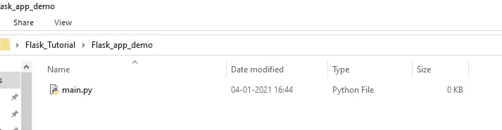
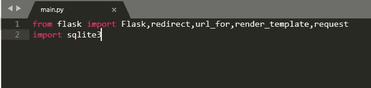
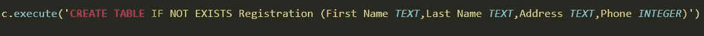
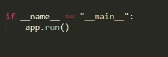
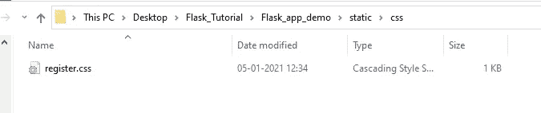
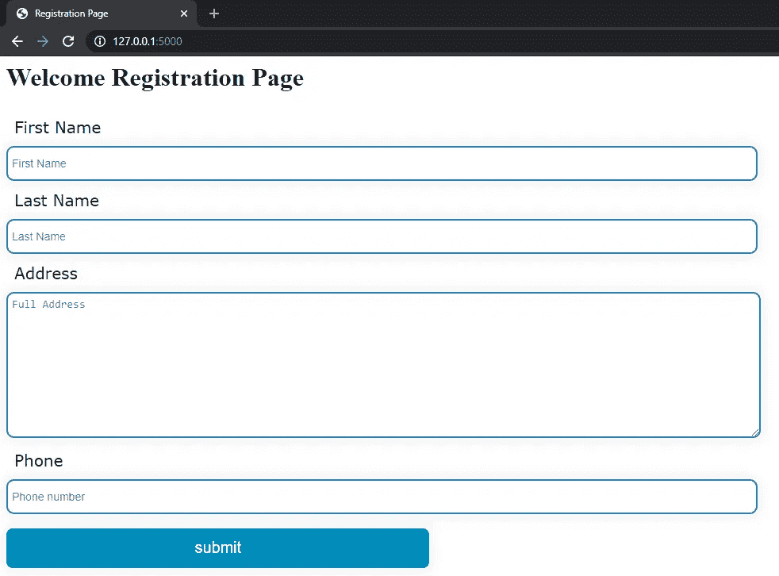
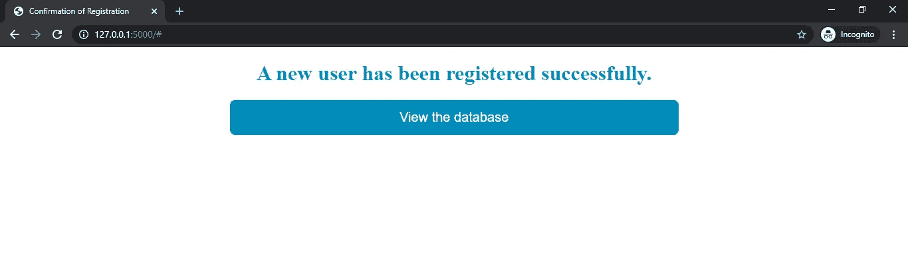
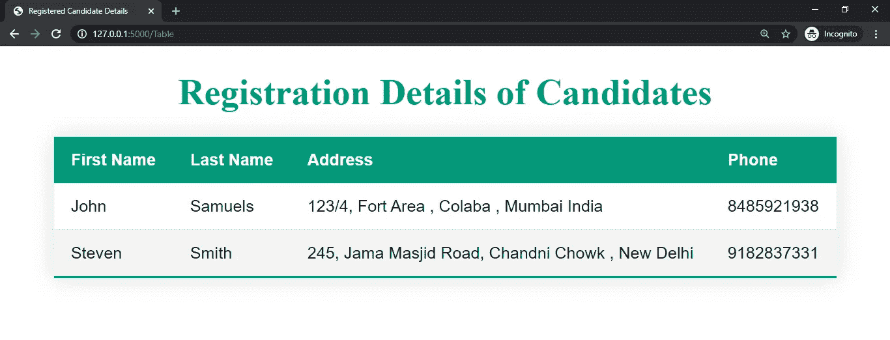
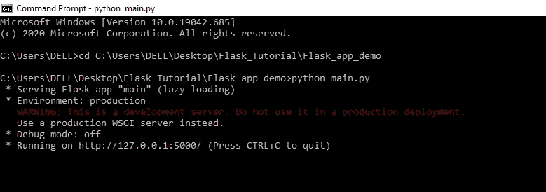

# 我是如何使用 Flask 构建我的第一个注册应用程序的？

> 原文：<https://pub.towardsai.net/how-did-i-build-my-first-registration-app-using-flask-87eb2a791812?source=collection_archive---------1----------------------->

## [编程](https://towardsai.net/p/category/programming)

## 使用 flask 框架集成 HTML 和 python

图片来自 [Pixabay](https://pixabay.com/?utm_source=link-attribution&utm_medium=referral&utm_campaign=image&utm_content=606612) 的 [Republica](https://pixabay.com/users/republica-24347/?utm_source=link-attribution&utm_medium=referral&utm_campaign=image&utm_content=606612)

# 介绍

大约一个月前，我非常好奇，想知道系统是如何收集用户在注册表单中提交的数据的？如何将经过训练的模型应用于使用静态 HTML 页面收集的用户输入？我们如何构建应用程序并配置应用程序部署所需的后端设置？在所有这些研究之后，我发现了这个叫做 Flask 的有用框架。Flask 是一个在产品开发期间广泛使用的框架，用于在实时环境中构建和部署机器学习模型。Flask 还允许我们创建数据库，这对于组织、总结和总结所执行的分析非常有帮助。

在这篇文章中，我将向您展示我如何使用 HTML 创建一个简单的注册应用程序，使用 Sqlite 创建一个数据库，执行各种 SQL 操作，使用 route 函数实现 Flask 来重定向页面，最后显示使用表单从用户那里收集并存储在数据库中的数据。

# 开始前要记住的事情

1.  我们使用 **IDE 作为升华**和**命令提示符**来通过本地主机运行代码。
2.  我们需要创建一个包含主要代码的 main.py 页面。

作者图片

3.导入 flask 库和必要的方法以及创建数据库所需的 sqlite3。

作者图片

4.初始化 Flask 对象 app 和 SQL 对象。另外，创建一个名为 form 的数据库来存储有关用户的信息。

作者图片

5.在新创建的数据库表单中创建一个名为 Registration 的表。

作者图片

6.创建一个主函数来运行 Flask 对象。如果我们不包括应用程序运行功能，那么我们可能无法运行主要功能。

作者图片

# 步骤 1:创建一个注册 HTML 文件

网站链接启动后，用户必须查看的第一个页面是注册页面。注册页面必须包含用户提交的所有必要的详细信息。因此，我们创建了一个简单的静态网页，要求用户信息。我们需要确保存储。名为 templates 的文件夹中的 html 文件。

# 步骤 2:创建级联样式表

在上面的步骤中，我们已经调用了脚本来运行 CSS 文件。我们必须确保在名为 static 的文件夹中创建名为 register.css 的文件。

作者图片

# 步骤 3:使用路由调用 main.py 文件中的表单

因为我们已经创建了 app Flask 对象，所以我们现在需要根据用户执行的操作将用户路由到各个页面。为了达到同样的目的，我们在步骤 3 中使用了 route 函数。route 函数有两种方法可以访问注册表。其中之一是使用 GET 方法访问注册表单。其次是使用 POST 方法提交存档的详细信息名、姓、地址、电话。一旦我们从用户那里获得了详细信息，我们接下来需要更新数据库中的注册表。因此，我们使用 SQLite 库方法执行插入操作。

下面是注册页面的图像，其中包含用户要提交的所有字段。

作者图片

# 步骤 4:创建注册确认 HTML 文件

一旦用户通过注册页面提交了详细信息，数据就会存储在后端的数据库表中。但是用户肯定会期望对成功提交的细节进行一些确认。因此，我们将创建一个 show.html 文件，它提供细节提交的确认，并为用户提供查找数据库表的灵活性。

作者图片

# 步骤 5:创建数据库表静态 HTML 文件

单击上图中的 view database 按钮，用户必须重定向到包含表格的页面，该表格表示表单数据库中的注册表。因此，我们首先创建一个 HTML 文件，它将接收作为数据库表的输入，静态 HTML 页面中的代码将使用 python 和 HTML 以行和列的形式转换数据。

作者图片

# 步骤 6:引导用户查看数据库表

当用户点击查看数据库按钮时，用户被重定向到 table.html 页面。因此，我们需要配置一个 GET route 函数，将用户重定向到 Table.html 页面。但是 Table.html 文件需要数据库表作为输入，以便遍历这些值。因此，在 GET route 函数中，我们使用 fetchall()函数从数据库中提取表，并将其作为参数传递给静态 table.html 页面。

# 步骤 7:从 cmd 运行 main.py 代码

写完整个代码后，我们使用命令提示符访问文件夹路径。之后，我们运行 python main.py 文件来执行代码，并在 localhost 上运行。以匿名模式运行下面提到的服务器链接 [http://127.0.0.1:5000/](http://127.0.0.1:5000/) 进行表单注册。

作者图片

完整代码可以参考我的 Github 链接:

 [## charan Raj 2411/Registration _ App _ Flask

### 在 GitHub 上创建一个帐户，为 charan Raj 2411/Registration _ App _ Flask 开发做出贡献。

github.com](https://github.com/charanraj2411/Registration_App_Flask) 

我的 LinkedIn 个人资料

 [## Charanraj Shetty -技术作家-走向人工智能| LinkedIn

### Pilani BITS 软件系统(数据科学)在职硕士综合学习计划。正在寻找…

www.linkedin.com](https://www.linkedin.com/in/charanraj-shetty-a74831b2/)