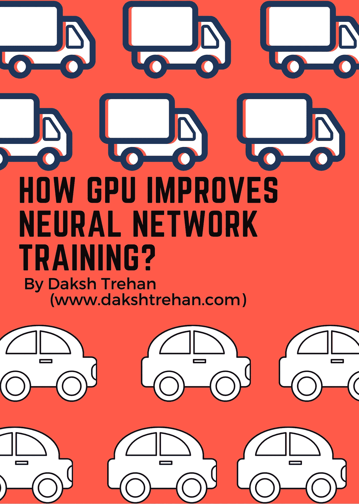
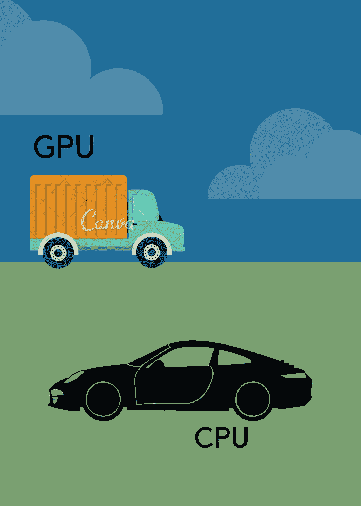
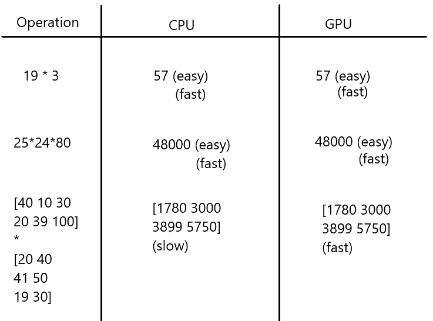
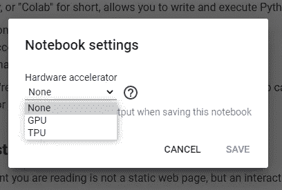

# GPU 如何提高神经网络训练？

> 原文：<https://pub.towardsai.net/how-do-gpus-improve-neural-network-training-5a6fb0221533?source=collection_archive---------2----------------------->

## [深度学习](https://towardsai.net/p/category/machine-learning/deep-learning)

## 与 CPU 相比，GPU 必须提供什么？

我打赌我们大多数人都听说过“**GPU**”。有人说 GPU 是你能为游戏做的最好的投资。

但是，这项曾经风靡于 ***游戏产业*** 的技术，如今已经成为包括 ***人工智能、视频渲染、医疗保健在内的各种其他领域的核心元素。***

两个主要的 GPU 制造商是 NVIDIA 和 AMD。电子巨头曾经只专注于游戏行业来设计他们的 GPU，但随着人工智能的主体不断扩大，GPU 的需求和专业化正呈指数级增长。

对深度学习越来越多的关注使制造商也能够专注于软件，而不仅仅是硬件。针对这一点，CUDA 被发明出来，它可以用软件的方式加速处理。

# 什么是 GPU，它与 CPU 有何不同？

Rafael Pol 在 [Unsplash](https://unsplash.com?utm_source=medium&utm_medium=referral) 上拍摄的照片

**GPU** 代表 **G** 图形 **P** 处理 **U** nit。它通常位于你机器的图形卡内，不像 CPU 那样是你机器的一个要求。

GPU 是小型硅基微处理器，有助于加快涉及数学计算的过程。简单来说， **GPU 可以定义为我们 CPU 的一块额外的肌肉，只是它不能独立工作。**

虽然 GPU 和 CPU 都是基于硅的，速度也很快，但区别在于它们的**架构和操作模式**。CPU 通常有 2/4/8/16 个内核，而另一方面，GPU 包含数千个内核。此外，**CPU 串行工作**并处理通用数据。但是**，GPU 对特定类型的数据并行工作**。

事实上，CPU 和 GPU 具有相同的速度，但由于上述差异，当进程计算量大时，GPU 可以胜过 CPU。

在玩重型游戏时，我们的机器需要渲染大量的图形，图形是使用数学计算可视化的。当 CPU 负责同样的事情时，它是串行工作的，因此我们通常会在游戏中遇到延迟。植物装载一次，然后道路装载，然后玩家装载。但是，当使用 GPU 处理相同的场景时，由于其并行模式的性质，事情是并发操作的，我们可以获得完美的无延迟输出。

在内存访问方面，GPU 也不同于 CPU，GPU 可以处理更快的速度和更大的内存，而 CPU 可以匹配 GPU 的速度，但它无法匹配 CPU 的内存容量(也是由于大量的内核)。

想想看，GPU 是卡车，CPU 是保时捷。CPU 确实更快，但只有两个座位，而在卡车上你可以装载许多人在一起。此外，GPU 有更多的核心，即更多的卡车，因此更多的数据传输。这种更高的带宽有助于 GPU 超越 CPU，因此，在现代高科技计算机中使用。

随着世界每天变得越来越复杂，慢慢地，GPU 的用例也在增加，甚至在不需要可视化的领域也在使用它。它现在被广泛应用于*比特币挖掘、神经网络训练等*。

与 CPU 相比，GPU 的三大优势是:

*   **并行化**
*   **更大的内存带宽。**
*   **更快的内存访问。**

GPU 可能会很慢，但需要更多的数据并在 RAM 中存储更多的数据，由于并行操作模式，它们执行数据的速度比 CPU 快得多。

# GPU 如何辅助神经网络训练？

由于具有许多参数的广泛和高度复杂的数据，GPU 正在慢慢地逐渐成为神经网络训练的必备组件。深度神经网络可以由数组形式的数百万个参数组成。

现在，举例来说:

可以得出这样的结论:CPU 擅长标量值，但却很难处理矩阵，因为矩阵运算需要同时处理多个值，而 CPU 是 Porsche，它们只能处理一两个值，但 GPU 是 truck，可以处理多个值。到那个时候，CPU 将会把所有的值都放到 RAM 中，GPU 将会把所有的值进行乘法运算，然后把答案放回去，这样还有一些时间。

支持 GPU 操作，神经网络是令人尴尬的并行****即它们可以很容易地被分解成更小的子问题，即遵循分治法。****

****当与 GPU 的并行操作模式混合时，神经网络的性质提供了极快的速度。****

## ****没有 GPU？****

****即使你没有 GPU，仍然是一个新兴的数据科学家/机器学习工程师。没什么好担心的。****

****GPU 的能力可以通过云共享，可以在任何机器上使用。相信我，你那极其缓慢的机器也能在瞬间完成数百万次运算。****

****最常见的云 GPU 环境之一就是 [**Google Colab。**](https://colab.research.google.com/)****

****从 GPU 计算开始，只需从新笔记本开始，更改“ ***运行时类型*** ”。****

********

# ****结论****

****在本文中，我们试图阐明 GPU 如何优于 CPU，以及使用 GPU 而不是 CPU 如何有利于神经网络训练。****

******如果你喜欢这篇文章，请考虑订阅我的简讯:** [**达克什·特雷汉每周简讯**](https://mailchi.mp/b535943b5fff/daksh-trehan-weekly-newsletter) **。******

****网上找我:**[**www.dakshtrehan.com**](http://www.dakshtrehan.com)******

****在领英关注我:[**www.linkedin.com/in/dakshtrehan**](http://www.linkedin.com/in/dakshtrehan)****

****阅读我的科技博客:[**www.dakshtrehan.medium.com**](http://www.dakshtrehan.medium.com)****

****在 Instagram 跟我连线:[**www.instagram.com/_daksh_trehan_**](http://www.instagram.com/_daksh_trehan_)****

# ****想了解更多？****

****[YouTube 是如何利用 AI 推荐视频的？](/how-is-youtube-using-ai-to-recommend-videos-38a142c2d06d)
[利用深度学习检测新冠肺炎](https://towardsdatascience.com/detecting-covid-19-using-deep-learning-262956b6f981)
[逃不掉的 AI 算法:抖音](https://towardsdatascience.com/the-inescapable-ai-algorithm-tiktok-ad4c6fd981b8)
[GPT-3 向一个 5 岁的孩子解释。](/gpt-3-explained-to-a-5-year-old-1f3cb9fa030b)
[Tinder+AI:一场完美的牵线搭桥？](https://medium.com/towards-artificial-intelligence/tinder-ai-a-perfect-matchmaking-b0a7b916e271)
[一个内部人士的使用机器学习卡通化指南](https://medium.com/towards-artificial-intelligence/an-insiders-guide-to-cartoonization-using-machine-learning-ce3648adfe8)
[谷歌是如何做出“哼哼来搜索？”](/how-google-made-hum-to-search-865f224b70d0)
[一行神奇的代码执行 EDA！](/one-line-magical-code-to-perform-eda-f83a731fbc35)
[给我 5 分钟，我给你深度假！](/give-me-5-minutes-ill-give-you-a-deepfake-ce83a645b0f9)****

> *****欢呼*****