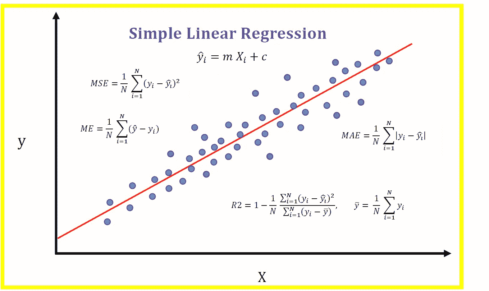
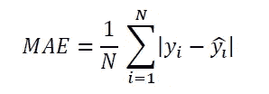
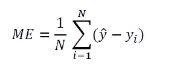
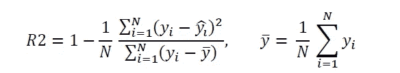
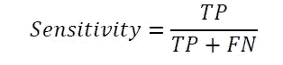
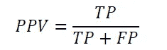
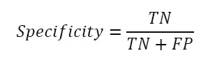
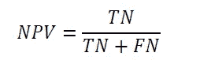
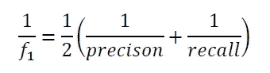

# 如何计算回归的精确度？

> 原文：<https://pub.towardsai.net/how-do-i-calculate-accuracy-for-regression-ec304f3e27b6?source=collection_archive---------2----------------------->

Benjamin O. Tayo 的图片

## [数据科学](https://towardsai.net/p/category/data-science)，[机器学习](https://towardsai.net/p/category/machine-learning)

## 这取决于我们预测的是连续的还是离散的目标变量

# 一.导言

有许多不同的度量标准可用于评估回归模型。在本文中，我们将根据目标变量是离散的还是连续的来讨论几种可以使用的度量标准。

# **二。持续目标回归的指标**

如果您正在为**连续结果**执行回归(即线性回归、K-neighbors 回归或支持向量回归)，那么您可以使用 ***MSE*** 、 ***MAE*** 、 ***ME*** 或 ***R2 分数*** 等指标来评估您的模型的性能。

在下面的例子中， *y* 表示精确值，而 *y_hat* 表示预测值。

*   **MSE(均方误差)**:使用欧几里德距离计算误差。MSE 仅给出了误差的大小。

*   **MAE(平均绝对误差)**:使用曼哈顿距离计算误差。MAE(像 MSE 一样)只给出误差的大小。

*   **ME(平均误差)**:跟踪误差的符号，模型是过预测还是欠预测？

*   **R2 得分**

其中 *R2 分数*在 0 和 1 之间，越接近 1，回归拟合越好。

**评论和备注**

*R2 得分*是一个非常流行的指标，用于评估线性回归模型的性能。比较两个或两个以上型号时，使用 *MSE* 或 *MAE* ，MSE 或 *MAE* 的值越低越好。当您有兴趣了解平均而言您的模型是过预测( *ME > 0* )还是欠预测( *ME < 0* )时，请使用 *ME* 。人们也可以用 R2 分数来比较不同的模型。

作为案例，请看下面这篇文章:[机器学习过程教程。](https://medium.com/swlh/machine-learning-process-tutorial-222327f53efb)

# 三。离散目标回归的度量

如果您正在为一个**分类问题**执行回归(例如，逻辑回归分类器、K-neighbors 分类器或支持向量分类器)，那么您可以使用下面讨论的一些指标。

在下面的例子中， *TP* 代表真阳性， *FP* 是假阳性， *TN* 是真阴性， *FN* 是假阴性。

*   **准确度分数:**这是与精确分类标签相匹配的预测分类标签的总百分比。对于不平衡的数据集，这通常不是一个好的指标。看这个例子:[贝叶斯定理讲解。](https://medium.com/towards-artificial-intelligence/bayes-theorem-explained-66ebf8285fcc)
*   **积极回忆或敏感度**

*   **阳性精度或阳性预测值(PPV)**

*   **负面回忆或特异性**

*   **负精度或负预测值(NPV)**

*   **F1 得分**

**评论和备注**

二元分类模型的其他度量是 ROC 下的 ***混淆矩阵*** 和 ***区域。***

作为案例研究，请看本文:[贝叶斯定理讲解。](https://medium.com/towards-artificial-intelligence/bayes-theorem-explained-66ebf8285fcc)

# **四。总结和结论**

总之，我们已经讨论了几个可用于评估回归模型的度量标准。我们看到，根据您的模型是预测连续还是离散目标变量，有几个选项可供选择。在使用之前，理解每个指标的数学意义是很重要的。这将使您能够构建可靠且具有良好预测能力的模型。

# 其他数据科学/机器学习资源

数据科学需要多少数学知识？

[数据科学课程](https://medium.com/towards-artificial-intelligence/data-science-curriculum-bf3bb6805576)

[进入数据科学的 5 个最佳学位](https://towardsdatascience.com/5-best-degrees-for-getting-into-data-science-c3eb067883b1)

[数据科学的理论基础——我应该关心还是仅仅关注实践技能？](https://towardsdatascience.com/theoretical-foundations-of-data-science-should-i-care-or-simply-focus-on-hands-on-skills-c53fb0caba66)

[机器学习项目规划](https://towardsdatascience.com/machine-learning-project-planning-71bdb3a44349)

[如何组织你的数据科学项目](https://towardsdatascience.com/how-to-organize-your-data-science-project-dd6599cf000a)

[大型数据科学项目的生产力工具](https://medium.com/towards-artificial-intelligence/productivity-tools-for-large-scale-data-science-projects-64810dfbb971)

[数据科学作品集比简历更有价值](https://towardsdatascience.com/a-data-science-portfolio-is-more-valuable-than-a-resume-2d031d6ce518)

***如有疑问和咨询，请发邮件给我***:benjaminobi@gmail.com