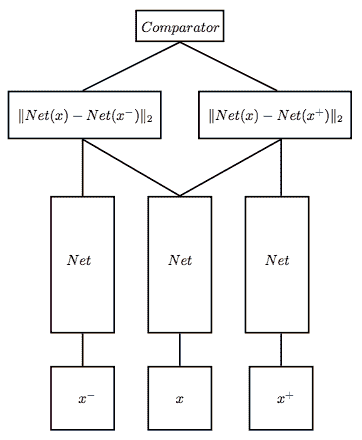

# 双胞胎和三胞胎神经网络是如何工作的

> 原文：<https://pub.towardsai.net/how-do-twins-and-triplet-neural-network-work-cfed66d9b829?source=collection_archive---------0----------------------->

## **双胞胎和三胎神经网络**

拉尔夫·梅休在 [Unsplash](https://unsplash.com?utm_source=medium&utm_medium=referral) 上拍摄的照片

作为从业者，我们通常建立一个多类分类模型，这是一个预定义的类别数。事实上，我们不需要在训练时间和推理时间都知道类别的总数。`Twins (aka Siamese) Network`和`Triplet Network`设计用于支持这种情况。

通过向`Siamese Network`输入两个输入，它确定两个输入之间的相似性。例如，我们可以比较两幅图像是否属于同一类别。更准确的说，我们可以用在元学习领域的零投学习或者少投学习。对于`Triplet Network`，我们通常应用无监督学习来训练一个好的嵌入表示。给定 3 个输入(目标、正面例子和负面例子)，模型可以通过用预定义的距离函数(例如欧几里德距离)比较这些嵌入来学习嵌入。您可以使用它将任何输入(例如图像)编码为低维向量，以用于下游用例。

**连体网络**

暹罗网络是由 Bromely 等人在 1994 年提出的。它被设计用来比较两个输入。例如，我们有两个图像，但我们不知道它们是否属于同一类别。给定一个训练有素的暹罗神经网络，该模型输出一个分数来表示输入的相似性。许多研究者将这种网络结构应用于回归问题、图像问题和文本问题。由于模型的高度灵活性，`Siamese Network`也应用于元学习。由于我们不需要训练一个模型来处理固定数量的标签，它也可以处理零镜头学习/少镜头学习问题。

源代码:[https://github . com/Harvey slash/face-Similarity-with-Siamese-Networks-in-py torch/blob/master/Siamese-Networks-medium . ipynb](https://github.com/harveyslash/Facial-Similarity-with-Siamese-Networks-in-Pytorch/blob/master/Siamese-networks-medium.ipynb)

**三联网络**

受`Siamese Network`的启发，Hoffer 和 Ailon 提出了从 3 个实例中学习嵌入的`Triplet Network` (2015)。3 个实例是锚例(x)、正例或与 x 同一类(即 x+)和负例或与 x 不同类(即 x-)。

训练步骤是将示例输入到神经网络(共享参数)，并且生成两个令人生畏的结果，这两个结果是锚(即 x)和支持输入(即 x-和 x+)之间的嵌入距离。嵌入的距离函数是欧几里德距离(L2 ),它是在多维空间中寻找两个向量之间的最短距离。最后，计算这两个嵌入之间的差异来学习好的表示。它将 MSE(均方误差)简化为损失函数。

源代码:[https://github . com/Andreas veit/triplet-network-py torch/blob/master/train . py](https://github.com/andreasveit/triplet-network-pytorch/blob/master/train.py)

# 参考

*   J.布罗姆利、I .盖永、Y .勒昆、e .萨金格和 r .沙阿。[利用连体延时神经网络](http://papers.nips.cc/paper/769-signature-verification-using-a-siamese-time-delay-neural-network.pdf)进行签名验证。1994
*   E.霍弗和 n .艾伦。[使用三元组网络的深度度量学习](https://arxiv.org/pdf/1412.6622.pdf)。2015