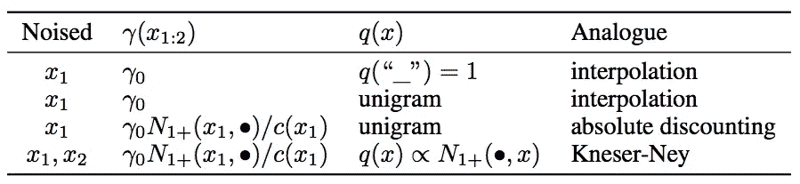
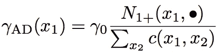
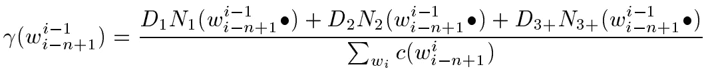
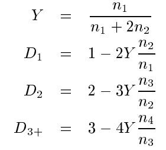
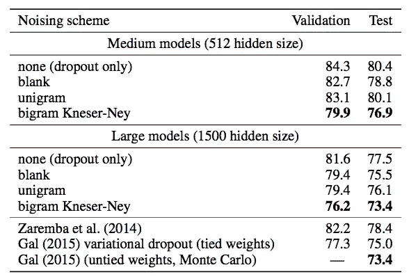
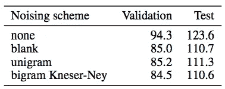

# 数据噪声如何帮助改进您的 NLP 模型？

> 原文：<https://pub.towardsai.net/how-does-data-noising-help-to-improve-your-nlp-model-480619f9fb10?source=collection_archive---------1----------------------->

## 用数据噪声改进 NLP 模型| [走向人工智能](https://towardsai.net)

## 注入数据噪声的目的


照片由[马志威](https://unsplash.com/@makcedward?utm_source=medium&utm_medium=referral)在 [Unsplash](https://unsplash.com?utm_source=medium&utm_medium=referral) 上拍摄

将数据噪声引入神经网络旨在提高模型的泛化能力和性能。谢等人提出了几种通过`unigram noising`和`blank noising`生成更多训练的方法，用于离散序列级设置，如语言建模。换句话说，它是在 NLP 上执行数据扩充的一种方式。

这个故事经历了[神经网络语言模型中平滑的数据去噪](https://arxiv.org/pdf/1703.02573.pdf)(谢等，2017)。它包括语言模型平滑和数据扩充方法两部分。

# 数据去噪方法


照片由[@ chairufajar _](https://unsplash.com/@chairulfajar_?utm_source=medium&utm_medium=referral)在 [Unsplash](https://unsplash.com?utm_source=medium&utm_medium=referral) 上拍摄

`Unigram noising`方法是**根据单字频率分布用其他单词替换目标单词**。与[无监督数据扩充](https://arxiv.org/pdf/1904.12848.pdf)(谢等，2019)类似，在数据扩充之前计算字数(也称为词频)，而字典是从训练数据构建的。下面是`unigram noising`的例子。

```
# Original
text = 'The quick brown ***fox*** jumps over the lazy dog'augmented = Augment(text)
print(augmented)
>>> 'The quick brown ***dog*** jumps over the lazy dog'
```

`Blank noising`方法是**用占位符令牌**替换目标单词。本文提出“_”作为占位符标记。这似乎太简单了，不可能是数据扩充。谢等人声称`blank noising`是一种避免过度适应特定语境的方法。下面是一个例子:

```
# Original
text = 'The quick brown ***fox*** jumps over the lazy dog'augmented = Augment(text)
print(augmented)
>>> 'The quick brown ***_*** jumps over the lazy dog'
```

# 语言模型中的平滑

谢等应用[插值和](https://en.wikipedia.org/wiki/N-gram#Smoothing_techniques)(陈和 Goodman，1996)对 LM 进行平滑。术语平滑指的是通过调整最大似然估计来获得更准确概率的技术。


[西蒙朱](https://unsplash.com/@smnzhu?utm_source=medium&utm_medium=referral)在 [Unsplash](https://unsplash.com?utm_source=medium&utm_medium=referral) 上的照片

谢等借用平滑技术计算加噪的概率，使得**常见的二元模型不太可能被加噪**。例如，双字母“and the”比“Hong Kong”更常见。所以它可能有意不发出噪音。

另一个目的是**防止从二元语法回退到一元语法。换句话说，它还能防止那些`sticky pair`发出噪音。例如，“孔”总是跟着“洪”来代表一个城市。谢等人不喜欢对这种粘着对二元组进行噪声处理，否则会将二元组(如“Hong Kam”)分解为两个单元组(如“Hong Kam”)。**

通过考虑上述行为，谢提出了三种不同的计算替换概率的方法。他们是`interpolation`、`absolute discounting`和`Kneser-Ney`。



去噪方案(谢等，2017)

`Absolute discounting`是用下面的公式计算的。简单地说，N1+(x1，)是以 x1 开始的不同双元组合(在训练集中)的数量，而 x1 是双元的前一个词。c(x1，x2)是 x1 和 x2 的二元组的总计数，而γ0 是固定速率。



绝对折现公式(谢等，2017)

`Modified Kneser-Ney`(陈&古德曼，1998)是`absolute discounting`的延伸。它不使用单字码频率，而是考虑 n 字码频率。这种改进旨在解决通常跟随其他单词的一些单词。再次以“香港”为例，“孔”可能会频繁出现，但它通常出现在“洪”之后。因此，倾向于降低对这种二元图应用噪声的概率。

对于下面的公式，D1、D2 和 D3+是具有一个、两个和三个或更多的 n 元文法，而 N1、N2 和 N3 分别是一元文法、二元文法和三元文法的前字数。



修正的 Kneser-Ney 公式(陈& Goodman，1998)



Y、、和 D3+的定义(陈& Goodman，1998)

# 实验

以下实验展示了在 Penn Treebank 和 Text8 数据上应用数据扩充的性能增益。



Penn Treebank 不同去噪方案的困惑(谢等，2017)



文本 8 种不同去噪方案的困惑(谢等，2017)

# 拿走

*   数据扩充是提高模型泛化和性能的一种行之有效的方法。
*   前面提到的数据扩充是在 nlpaug 中实现的，NLP aug 是用于文本库的 python 数据扩充。

# 喜欢学习？

我是湾区的数据科学家。专注于数据科学、人工智能，尤其是 NLP 和平台相关领域的最新发展。在 [LinkedIn](https://www.linkedin.com/in/edwardma1026) 或 [Github](https://github.com/makcedward) 上随时联系 [me](https://makcedward.github.io/) 。

# 延伸阅读

*   [斯坦福大学正式实施](https://github.com/stanfordmlgroup/nlm-noising)
*   全面的文本数据扩充库

# 参考

*   南陈和古德曼。[语言建模平滑技术的实证研究](https://dash.harvard.edu/bitstream/handle/1/25104739/tr-10-98.pdf?sequence=1)。1998
*   Z.谢，王世义，李军，李维，聂，朱拉夫斯基，吴亚英。[神经网络语言模型中平滑数据噪声](https://arxiv.org/pdf/1703.02573.pdf)。2017
*   谢，戴，贺维，梁明堂，乐庆伟。[无监督数据增强](https://arxiv.org/pdf/1904.12848.pdf)。2019