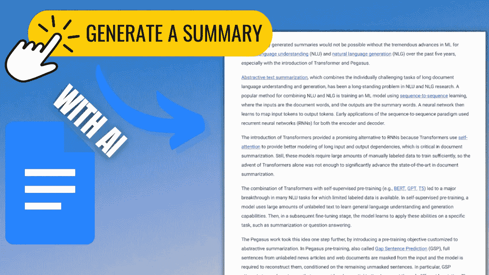
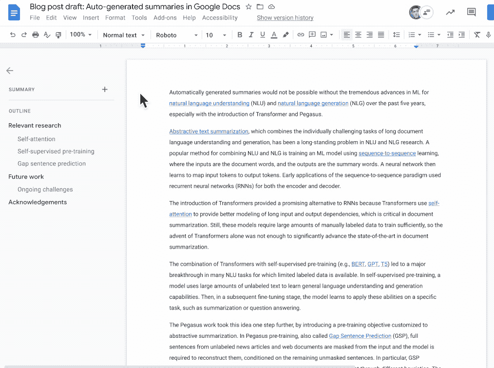
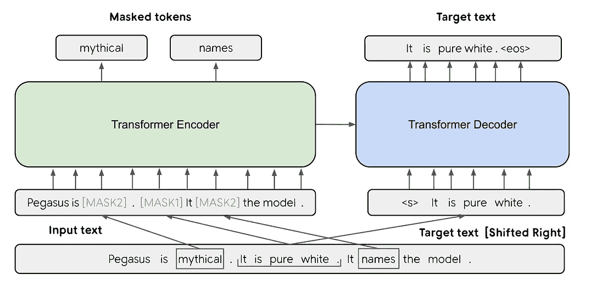
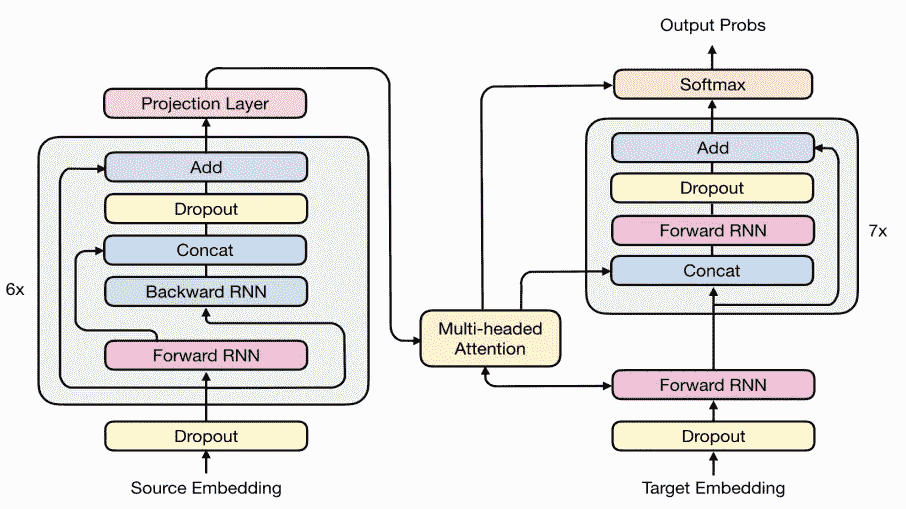

# Google 如何生成摘要？

> 原文：<https://pub.towardsai.net/how-does-google-generate-summaries-b7c24687a032?source=collection_archive---------2----------------------->

## 使用机器学习自动生成摘要的新模型，在 Google Docs 中发布，您已经可以使用了！

> 最初发表于 [louisbouchard.ai](https://www.louisbouchard.ai/google-docs-summary/) ，前两天在[我的博客](https://www.louisbouchard.ai/google-docs-summary/)上读到的！

## 观看视频

你是否发现很难快速概括你刚刚看完的一部电影或几周前读过的一本书？有时你喜欢一本书，如果你能设法记住它的内容(我经常记不住)，你可能会花一个小时描述许多章节和重要部分，而你的朋友只想有一个快速而简洁的摘要，这最终会让你的朋友感到厌烦。这是因为做一个伟大的总结是具有挑战性的，即使对我们来说，但也是必要的。能够在购买前快速知道这本书是关于什么的，或者只是帮助你在几秒钟内浏览所有的电子邮件和文档，这是多么有用啊。

你需要对一本书、一部电影或任何你试图总结的内容有很好的理解才能做好。省略所有不必要的信息，保留必要的信息。尽可能使一些东西简洁可能真的很复杂，甚至是不可能的。

在这里，我试着用几分钟来解释研究，我经常无法让它短于 5 分钟，即使它只是一篇 20 页文章的摘要。这需要数小时的工作和微调，现在我可能会被一个在毫秒内做得更好的人工智能取代。

事实上，谷歌最近宣布了一种使用机器学习自动生成摘要的新模型，发布在你已经可以使用的谷歌文档中。

该模型将试图理解整个文档，并生成一个简短的摘要——这显然是一些电影专业人员仍然无法做到的。

当文档摘要建议可用时，左上角会出现一个蓝色摘要图标。然后，文档作者可以查看、编辑或忽略建议的文档摘要。图片来自[谷歌的博客文章](https://ai.googleblog.com/2022/03/auto-generated-summaries-in-google-docs.html)。

该模型需要实现两件事:

1.  理解文档中的文本称为自然语言理解。
2.  使用自然语言生成连贯的句子。或者换句话说，执行自然语言生成。

但是你怎么能做到呢

你猜对了…拥有大量数据和计算能力！幸运的是，这是谷歌研究。

他们训练他们的模型来复制我们用太多手动生成摘要的文档来生成摘要的思维过程。看到所有这些例子，该模型确实喜欢任何好学生，并最终能够为类似的文档生成相对较好的摘要，正如它在训练阶段看到的那样。您可以看到我们为什么需要高质量的数据。模型会向他们学习。它可能只和用于训练它的数据一样好。

这就像一个对篮球一无所知的糟糕教练试图教一个新球员一样。如果教练对这项运动一无所知，这位新运动员怎么可能变得优秀呢？新人的天赋不会得到优化，可能会因为糟糕的指导而被浪费。

挑战来自于对新文档的推广。对于只知道如何执行给定示例，但不知道如何应用公式的学生来说，归纳有时甚至很困难。这里也是一样。该模型面临困难，因为它不能记住所有的文档和摘要。它必须理解它们，或者至少知道应该注意哪些词，以便产生一个能很好地反映文档的摘要。后者最有可能发生，因为模型并不真正理解文档，它只理解如何执行任务，不幸的是，这还远不是人类水平的智能，但对于这样的任务来说已经足够好了。

我刚刚提到了“注意”。这不是巧合。注意力可能是这个模型背后最重要的概念。事实上，就像 GPT-3 一样，这个新模型也使用了变压器架构和注意力机制。这是需要高计算的地方。如你所知，变压器是大而强大的网络，但大多数时间有点太大了，需要在几秒钟内在线快速有效的工具。Transformers 的计算复杂度也与输入大小成比例，这意味着输入越长，计算量就越大，当您想要总结一整本书时，就会出现大问题。

图片来自[谷歌的博文](https://ai.googleblog.com/2022/03/auto-generated-summaries-in-google-docs.html)。

GPT-3 适用于小输入，如问题回答任务，但同样的架构无法有效处理整本书。相反，他们不得不使用一些技巧，以便在保持高质量结果的同时拥有一个更小、更高效的模型。这种优化是通过合并变压器和 RNNs 实现的，这是我在以前的视频中解释过的两个概念，我强烈建议观看以更好地理解。这两个视频在下面的描述中都有关联。

飞马模型和 RNN+变压器组合模型[1][2]。

简而言之，它的行为类似于 GPT-3，现在你应该从我的视频中了解到了，但是有一个较小版本的模型，一遍又一遍地迭代，直到模型完成这本书。该架构的转换器部分将负责“理解”文本的一小部分，并产生其编码版本。RNN 将负责在内存中堆叠和保存这些知识，遍历整本书，以最简洁的方式总结其内容。通过共同努力，添加到循环架构中的注意力机制将能够浏览长文档，并找到要在摘要中提及的最重要的特性，就像任何人都会做的那样。

当然，这个模型并不完美，因为即使是专业作家在总结他们的作品时也不完美，但是结果非常令人印象深刻，而且非常高效。我强烈建议你在谷歌文档中亲自尝试一下，以下定决心。

瞧！

这就是 Google Docs 如何用他们新的基于机器学习的模型自动总结你的文档。我希望你喜欢这篇文章！如果是这样，请花点时间留下评论，关注我的作品。让我知道你对这个新模型的想法。你会用吗？

谢谢你一直读到最后，下周我会带着另一篇惊人的论文和你见面！

## 参考

谷歌的博文:[https://ai . Google blog . com/2022/03/auto-generated-summaries-in-Google-docs . html](https://ai.googleblog.com/2022/03/auto-generated-summaries-in-google-docs.html)
GPT-3 视频:[https://youtu.be/gDDnTZchKec](https://youtu.be/gDDnTZchKec)关注视频:[https://youtu.be/QcCJJOLCeJQ](https://youtu.be/QcCJJOLCeJQ)rnn 是什么？:
[1]张，j .，赵，y .，萨利赫，m .，刘，p .，2020 年 11 月。Pegasus:用提取的间隔句进行抽象摘要的预训练。在*机器学习国际会议*(第 11328–11339 页)。PMLR。
[2]陈，M.X .，菲拉特，o .，巴普纳，a .，约翰逊，m .，马切里，w .，福斯特，g .，琼斯，l .，帕马尔，n .，舒斯特，m .，陈，z .，吴，y .，2018。两全其美:结合神经机器翻译的最新进展。 *arXiv 预印本 arXiv:1804.09849* 。
我的简讯(每周向您的电子邮件解释一个新的人工智能应用！):[https://www.louisbouchard.ai/newsletter/](https://www.louisbouchard.ai/newsletter/)