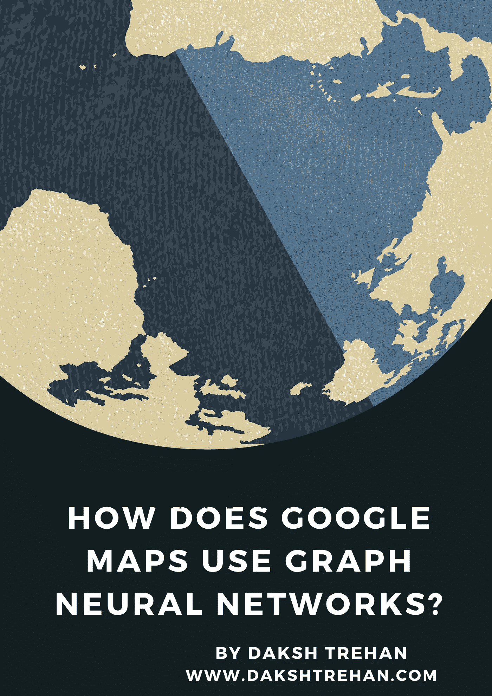
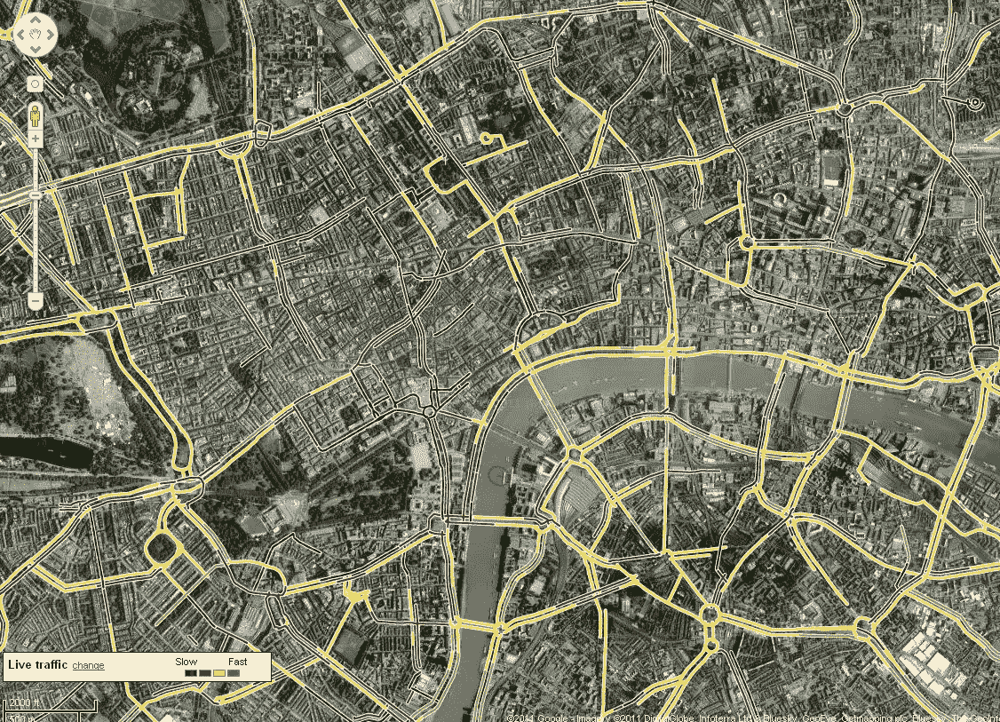
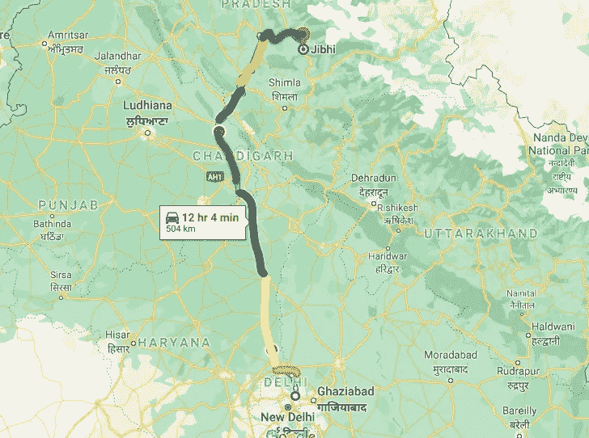
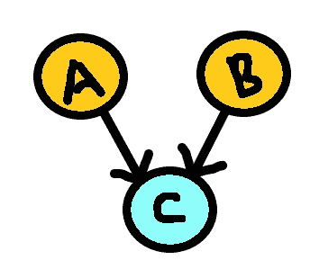
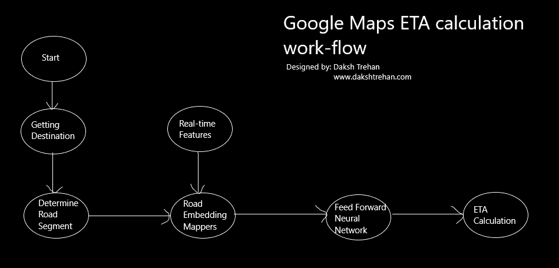

# 谷歌地图如何使用图形神经网络？

> 原文：<https://pub.towardsai.net/how-does-google-maps-use-graph-neural-networks-579cba9ea1e4?source=collection_archive---------1----------------------->

## 深度学习，算法

## 基于图形神经网络的交通流量和预计到达时间预测

旅行者过去常常寻找又长又粗糙的地图来选择路线的日子已经一去不复返了。现在，他们依靠一个流行的工具，谷歌地图。

每天，大约**10 亿公里**使用谷歌地图旅行，全球超过 **220 个国家**使用谷歌地图。当你跳上汽车/自行车并开始导航时，谷歌地图会通过*预测交通状况、预计旅行时间、预计到达时间(ETA)以及最佳路线来帮助你。*

但是，在谷歌地图的超级功能背后，还有一点人工智能。

# 谷歌是如何确定直播流量的？

照片由 [Isaac Mehegan](https://unsplash.com/@isaacmehegan?utm_source=medium&utm_medium=referral) 在 [Unsplash](https://unsplash.com?utm_source=medium&utm_medium=referral) 上拍摄

谷歌地图很聪明，他们可以很容易地预测世界各地道路的交通状况。当人们使用谷歌地图导航时， ***他们的总体位置、路线、行驶速度*** 都被谷歌记录下来，并用来帮助可能很快就要走这条路线的用户。

通过计算特定路线上各种用户的速度，人工智能可以很容易地确定该路线是否受到交通堵塞的影响，从而帮助未来的通勤者。

如果许多谷歌地图用户被困在路线的特定部分，这意味着该路线可能会遭遇交通堵塞，因此人工智能将该部分涂为红色，类似地，对于缓慢移动的交通，人工智能将该部分涂为黄色。

交通状况信号，[来源](https://londontransportdata.wordpress.com/2011/08/12/live-traffic-speeds-from-google-maps/)

但是，谷歌地图只能显示实时位置，无法预测道路上未来的交通状况。

谷歌地图收集的用于预测实时交通的信息:

*   用户的实时位置。
*   汽车总量、车速、路况、用户反馈。
*   特定时间特定路线的交通历史记录。

# 谷歌地图如何计算 ETA 并提供最佳路线？

ETA(预计到达时间)是谷歌地图的突出特色之一。谷歌地图试图计算到达目的地的不同路线，然后在计算预计到达时间后，它会向用户建议最佳路线。这就是机器学习发挥作用的地方。

为了计算每条路线的 ETA，算法将路线分成更小的路线，然后分别计算每条路线的 ETA。

将路由分成多个更小的路由

但是，如何计算每条路径的 ETA 呢？

## 第一步:

为了计算特定路段的 ETA，我们需要路段，即先前的路径。

我们可以使用上述要求来前馈神经网络，但通常，前馈神经网络需要独立的样本，但在实践中，一段道路上的交通会直接影响另一段道路上的交通，最终会导致不准确。

我们提供的数据是连续的，因此 RNNs 变压器会有很大帮助。但是，rnn 需要大量数据。如果我们希望将 RNNs 用于 Google Maps，那么每条路线都需要不同的数据。

即使我们能够收集数据，从头开始学习每条路线之间的关系也需要很高的计算能力。

最优解可以是**图**。

每个城市可以用图的形式来表示，其中*每个路段可以被区分为一个顶点，每个节点可以被定义为一条边*。

**节点网络→嵌入→前馈神经网络→每段 ETA**

## 第二步:

在将每个城市部署为图表后，为了学习路线，我们需要嵌入。

对于每个节点，嵌入将被定义和更新。

因为路由是互连的，所以嵌入将被创建，状态将被更新，并且新的嵌入将被创建，直到我们到达目的地。

对于复杂路径:

**A + B + AC + BC →编解码→C 嵌入**

将为单个节点的单次传递创建每个新消息。

由于节点是互连的，每个节点都有以下信息:

*   它的邻居。
*   它邻居的邻居。

上述信息有助于创建每个节点与不同节点之间的关系，从而帮助我们提高准确性。

经过 X 次后，将生成路线的最终嵌入，该最终嵌入可以在字典中更新，以道路向量作为关键字，以信息和关系作为值。

**交通信息+限速+事故+过往记录→前馈神经网络→计算 ETAs。**

# 最终工作流程:

谷歌地图 ETA 计算工作流程，由作者设计，版权所有。

*   开始吧。
*   找条路。
*   确定细分市场。
*   道路嵌入地图。
*   添加实时特征→前馈神经网络→ ETA
*   计算所有 eta 的总和。

# 结论

谷歌地图是旅行者的强大工具和福音。图形神经网络的组合和嵌入的使用有助于算法计算 ETA 并返回给用户最佳路线。

**如果你喜欢这篇文章，请考虑订阅我的简讯:** [**达克什·特雷汉每周简讯**](https://mailchi.mp/b535943b5fff/daksh-trehan-weekly-newsletter) **。**

# 参考资料:

[1] [使用高级图形神经网络进行交通预测| DeepMind](https://deepmind.com/blog/article/traffic-prediction-with-advanced-graph-neural-networks)

[2] [这就是谷歌地图的工作方式——普里特什·帕瓦尔](https://www.priteshpawar.com/how-google-maps-works/technology-explained/priteshpawar/)

[3] [谷歌地图 101:人工智能如何帮助预测交通和确定路线(blog.google)](https://blog.google/products/maps/google-maps-101-how-ai-helps-predict-traffic-and-determine-routes/)

网上找我:**[**www.dakshtrehan.com**](http://www.dakshtrehan.com)**

**在领英关注我:[**www.linkedin.com/in/dakshtrehan**](http://www.linkedin.com/in/dakshtrehan)**

**阅读我的科技博客:[**www.dakshtrehan.medium.com**](http://www.dakshtrehan.medium.com)**

**在 Instagram 跟我连线:[【www.instagram.com/_daksh_trehan_】T21](http://www.instagram.com/_daksh_trehan_)**

# **想了解更多？**

**[YouTube 是如何利用 AI 推荐视频的？](/how-is-youtube-using-ai-to-recommend-videos-38a142c2d06d)
[利用深度学习检测新冠肺炎](https://towardsdatascience.com/detecting-covid-19-using-deep-learning-262956b6f981)
[逃不掉的 AI 算法:抖音](https://towardsdatascience.com/the-inescapable-ai-algorithm-tiktok-ad4c6fd981b8)
[GPT-3 向一个 5 岁的孩子解释。](/gpt-3-explained-to-a-5-year-old-1f3cb9fa030b)
[Tinder+AI:一场完美的牵线搭桥？](https://medium.com/towards-artificial-intelligence/tinder-ai-a-perfect-matchmaking-b0a7b916e271)
[一个内部人士的使用机器学习卡通化指南](https://medium.com/towards-artificial-intelligence/an-insiders-guide-to-cartoonization-using-machine-learning-ce3648adfe8)
[谷歌是如何做出“哼哼来搜索？”](/how-google-made-hum-to-search-865f224b70d0)
[一行神奇的代码执行 EDA！](/one-line-magical-code-to-perform-eda-f83a731fbc35)
[给我 5 分钟，我给你深度假！](/give-me-5-minutes-ill-give-you-a-deepfake-ce83a645b0f9)**

> ***欢呼***