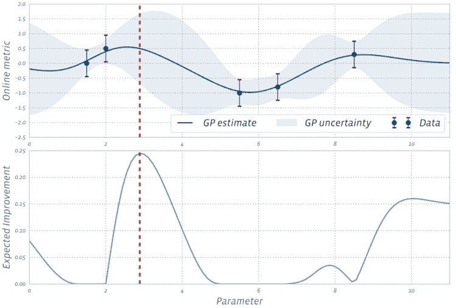
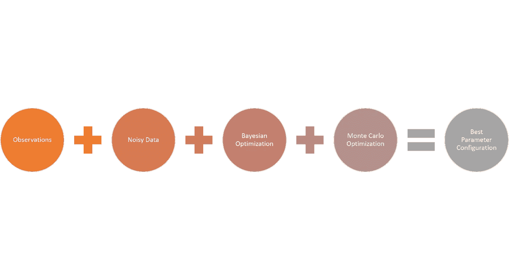
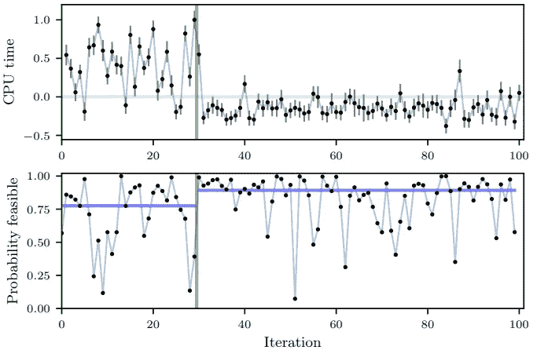

# 脸书如何实现机器学习模型的高效 A/B 测试

> 原文：<https://pub.towardsai.net/how-facebook-enables-efficient-a-b-testing-of-machine-learning-models-3f529fea9494?source=collection_archive---------1----------------------->

## [人工智能](https://towardsai.net/p/category/artificial-intelligence)

## 一项新的研究提出了一种基于贝叶斯优化的方法来微调机器学习模型中的超参数。

来源:[https://blog . eduonix . com/software-development/hyperparameter-tuning-neural-networks/](https://blog.eduonix.com/software-development/hyperparameter-tuning-neural-networks/)

> 我最近创办了一份专注于人工智能的教育时事通讯，已经有超过 80，000 名订户。《序列》是一份无废话(意思是没有炒作，没有新闻等)的 ML 导向时事通讯，需要 5 分钟阅读。目标是让你与机器学习项目、研究论文和概念保持同步。请通过订阅以下内容来尝试一下:

 [## 序列

### 订阅人工智能世界中最相关的项目和研究论文。受到 85，000 多人的信任…

thesequence.substack.com](https://thesequence.substack.com/) 

超参数优化是机器学习应用程序生命周期的一个关键方面。虽然网格搜索等方法对于优化特定孤立模型的超参数非常有效，但它们很难扩展到大规模的模型和实验排列。像脸书这样的公司运营着数以千计的并发机器学习模型，需要不断调整。为此，脸书工程团队需要定期进行 A/B 测试，以确定正确的超参数配置。这些测试中的数据很难收集，并且它们通常是在彼此隔离的情况下进行的，这最终导致计算量非常大的练习。最近，来自脸书[的一组人工智能研究人员发表了一篇论文，提出了一种基于贝叶斯优化](https://projecteuclid.org/euclid.ba/1533866666)的方法，根据先前测试的结果自适应地设计 A/B 测试轮次。

# 为什么要贝叶斯优化？

贝叶斯优化是一种解决黑盒优化问题的强大方法，它涉及到昂贵的函数计算。最近，贝叶斯优化已经发展成为优化机器学习模型中超参数的重要技术。从概念上讲，贝叶斯优化从评估少量随机选择的函数值开始，并对结果拟合高斯过程(GP)回归模型。GP 后验提供了对每个点的函数值的估计，以及该估计的不确定性。GP 很适合贝叶斯优化，因为它提供了极好的不确定性估计，并且在分析上易于处理。它提供了对在线指标如何随感兴趣的参数变化的估计。

让我们想象一个环境，在这个环境中，我们正在对机器学习模型进行随机和规则的实验。在这种情况下，贝叶斯优化可用于构建参数和感兴趣的在线结果之间关系的统计模型，并使用该模型来决定运行哪些实验。下图很好地说明了这个概念，其中每个数据标记对应于该参数值的 A/B 测试结果。我们可以使用 GP 通过平衡勘探(高度不确定性)和开发(良好的模型估计)来决定接下来测试哪个参数。这是通过计算获取函数来完成的，该获取函数估计用任何给定的参数值运行实验的值。

图片来源:脸书

当应用于超参数优化时，贝叶斯优化的基本目标是确定一个实验对于一个特定的超参数配置有多大价值。从概念上讲，贝叶斯优化对于孤立的模型非常有效，但当用于运行随机实验的场景时，其价值主张受到挑战。基本的挑战与观测中引入的噪声有关。

# 噪声和贝叶斯优化

机器学习系统中的随机实验在观察中引入了高水平的噪声。此外，给定实验的许多约束可以被认为是其本身内外的噪声数据，这些噪声数据可以影响实验的结果。假设我们试图对一个给定的观测值 *x* 评估一个函数 *f(x)* 的值。有了观测噪声，我们现在不仅在值 *f(x)* 上有不确定性，而且在当前最佳的观测值 *x** 及其值 *f(x*)上也有不确定性。*

通常，贝叶斯优化模型使用试探法来处理有噪声的观察结果，但那些在高噪声水平下表现非常差。为了应对这一挑战，脸书团队想出了一个聪明的答案:为什么不把噪音作为观察的一部分呢？

想象一下，如果不是计算观察 f(x)的期望值，而是我们观察*yi*=*f*(**x**I)+*€I*，其中 *€i* 为观察噪声。在数学上，GP 处理噪声观测的方式与处理无噪声数据的方式类似。在他们的研究论文中，脸书团队没有对数学着迷，而是表明这种类型的近似非常适合蒙特卡罗优化，这种优化可以产生难以置信的精确结果，估计正确的观察值。

# 噪声数据作用下的贝叶斯优化

脸书团队在几个脸书规模的真实世界场景中测试了他们的研究。第一个是优化脸书排名系统的 6 个参数。第二个例子是优化与 HipHop 虚拟机(HHVM)中使用的 CPU 使用相关的 7 个数字编译器标志。对于第二个实验，前 30 个迭代是随机创建的。此时，带有噪声数据的贝叶斯优化方法能够将 CPU 时间识别为需要评估的超参数配置，并开始运行不同的实验来优化其值。下图清楚地显示了结果。

图片来源:脸书

在大规模机器学习算法中，带噪声数据的贝叶斯优化等技术非常强大。虽然我们在优化方法上做了大量的工作，但是大多数方法仍然是高度理论化的。很高兴看到脸书正在拓展这个新生空间的边界。