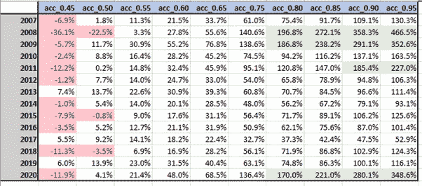
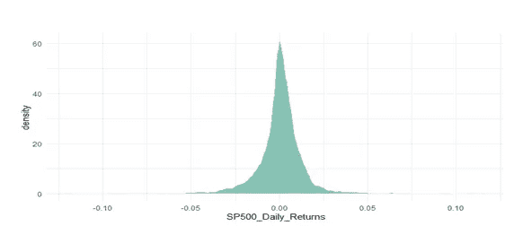
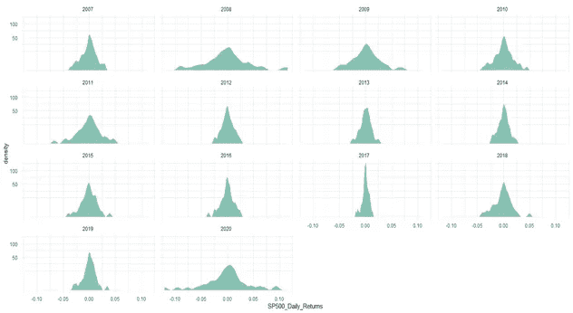
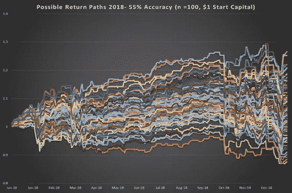

# 你的股票模型要有多好才能赚钱？

> 原文：<https://pub.towardsai.net/how-good-does-your-stock-model-have-to-be-to-make-money-e44d37c37192?source=collection_archive---------1----------------------->

## [机器学习](https://towardsai.net/p/category/machine-learning)，[概率](https://towardsai.net/p/category/probability)

## **为什么随机性不是你的朋友**

安德里亚·费拉里奥在 [Unsplash](https://unsplash.com?utm_source=medium&utm_medium=referral) 上拍摄的照片

虽然许多人认为 2020 年是被遗忘的一年，但不可否认的是，它将被历史铭记。随着世界大部分地区陷入由 COVID19 引发的衰退，市场从短暂的跌跌撞撞中恢复过来，回到了以前的上升轨道，这是由科技股引领的长达十年的牛市所预测的。金融市场对实体经济的这种错位带来了新的动力，因为无聊、足不出户的投资者纷纷涌入在线交易平台，寻求从封闭生活的束缚中解脱出来，并参与金融收益。

交易不再是完美专业人士的领域，因为像 Robinhood 这样的公司可以让任何人在自己舒适的客厅里轻松地买卖和投机金融证券。这些平台在吸引流量方面非常成功，以至于像 Citadel 这样的对冲基金花钱购买它们的数据来衡量散户投资者的情绪。因此，有理由认为，随着机器学习(及相关技能组合)变得越来越大众化，以及许多平台提供大量历史数据和复杂的回溯测试工具，对数据驱动型投资的兴趣也相应增加了。虽然传统观点认为盈利模式在大多数时候应该是成功的，但对于专业人士和业余爱好者来说，问题仍然是，最多是多少？

# **实证方法**

经验丰富的投资者之间的一个常见轶事是，财富的积累来自于随着时间的推移而复合的小而持久的收益，而不是不规则发生的大而不频繁的收益，因此这意味着当机会集的规模很大时，小的优势可能足以成功。为了验证这一点，我们进行了一个简单的实验；我们将 S&P500 指数从 2007 年到 2020 年的回报数据分成不同的日历年区间。我们将把收益为正的日子标为 1，其他日子标为 0。为了简单起见，不允许做空。然后，我们以不同的准确率对这些回报进行重新采样，然后计算每个周期的平均回报。准确性是机器学习中模型性能的一种常见衡量标准，简单来说，它衡量的是正确预测与预测总数的比率。在财务预测的上下文中，这个度量也可以被表征为命中率或方向准确性。

例如，在 2016 年采样 100 次的准确率为 60%的情况下，我们将随机设定 60%的预测对 2016 年是正确的，计算得到的回报，重复 100 次，并取这些迭代的平均回报。因此，通过我们的方法，我们希望确定一个模型必须有多好(通过准确性来衡量)才能在过去 14 年中的每一年产生正回报。

通过使用所描述的方法，我们得到了以下结果:

取样结果

根据结果，我们得出以下观察结果:

1.一个模型根本不需要精确到可以做出回报。事实上，在过去 14 年的 11 年中，抛硬币就足以产生高于 0 的持有期收益率。

2.在某些情况下，一个精确的模型(95%)能够让你的钱翻两番以上。

3.在某些年份，甚至 45%的准确率也是有利可图的(尽管从理论上讲，如果你只是翻转标签，二元分类中持续糟糕的模型实际上是一个好模型)。

虽然这似乎证明了上面提到的一些观点，即只需要一点点优势，但它确实提出了另一个非常有趣的问题，如果赚钱这么容易，为什么这么多人亏损？

# **不对称的问题**

在整个 14 年中，有正回报的天数百分比约为 54%。这表明，随着时间的推移，任何准确率超过 50%的模型都应该是盈利的。然而，许多分类任务隐含地假设正确的回报价值与错误的代价相同。对于许多现实世界的任务来说，这是不正确的(想想疾病诊断或自动驾驶中的行人检测)。其中包括对股票市场的预测。从下面使用的每日回报分布图中，我们看到数据是负偏态的，有一个长的左尾巴。这意味着 S&P500 的回报模式充满了不常见的、尽管相对较大的负回报。

当我们按年分解数据时，我们看到了同样的效果。

这种股票回报的负偏度是股票的一个众所周知的属性，并在 **Neuberger 和 Payne，2019** 中提到。这对模型驱动型投资者来说意味着，犯一次错，买入其中一个例子，可以抵消多次正确的影响。一个与纳西姆·塔勒布推广的“黑天鹅”事件有关的想法。理解这个问题的另一种方法是，在我们进行抽样时，观察返回剖面的分布。以 2018 年为例，当我们以 55%的准确率随机采样 100 条返回路径时，我们得到以下结果:

我们看到，尽管准确率超过 50%，平均回报率为 6.9%(见上表)，但大量的回报路径最终都低于 1 美元的起始资本。

# 这是什么意思？

尽管准确性在实践和学术界是一个流行的度量标准，但对于这个问题来说，它是一个糟糕的度量标准。财务预测，本质上是一个回归问题。将它重新表述为分类过于简化了所涉及的现实世界的复杂性**(更不用说由于金融数据中的低信噪比，获得高准确率是非常困难的)**。这也是投资从业者对分类不如机器学习从业者熟悉的原因。金融文献中许多开创性的工作都是从回归的角度进行的(见 Markowitz、Fama 和 French)。虽然许多论文和模型会引用可接受的准确率和良好的回溯测试结果，但它们容易受到一定程度的随机性和/或偏差的影响，这取决于测试期间的时间顺序以及它采用了无限可能的返回路径中的哪一个。

尽管回归提供了一些改进，但没有灵丹妙药或神奇的门槛。像均方差这样的性能指标会根据你是想预测价格还是回报而有所不同，相对于准确性而言，用绝对术语来解释要困难得多。正如我的许多帖子一样，我试图传达的是，接近金融市场需要谨慎和勤奋。对数据和领域的理解是最重要的。

持续战胜市场并不容易，因为根据定义，市场回报是所有参与者的平均值，没有人打算赚取平均值。一个好的模型需要严格的回溯测试和样本内的密切监控(可能首先作为“纸上”投资组合)，以确保测试期间的结果不是虚假的。借用塔勒布的另一句话，经验主义应该只用来反驳一个假设，而不是肯定它。

**[1]纽伯格，a .，&佩恩，R. (2020)。从长期来看，股票市场的偏态。金融研究评论。DOI: 10.1093/rfs/hhaa048**

**免责声明**:此**帖子纯属个人观点和看法的表达。它不代表任何建议。**