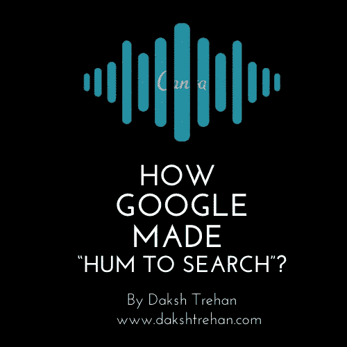
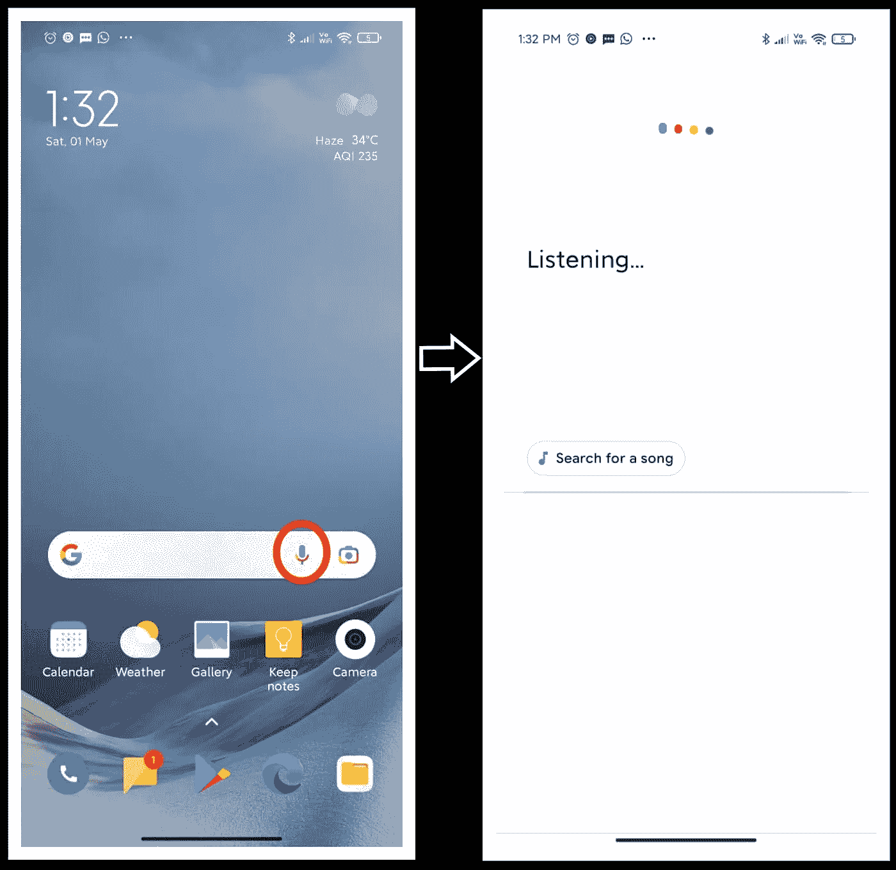
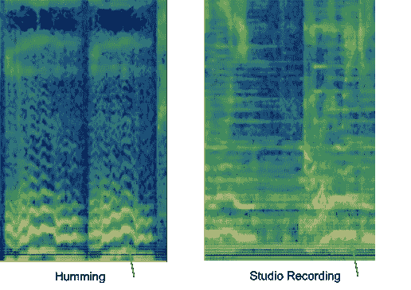
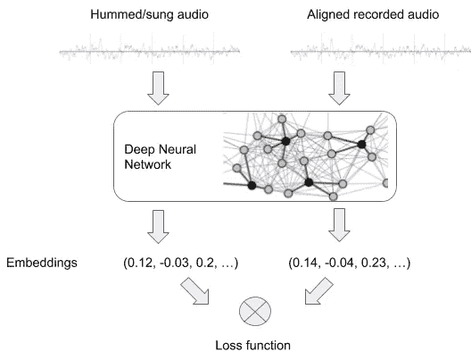
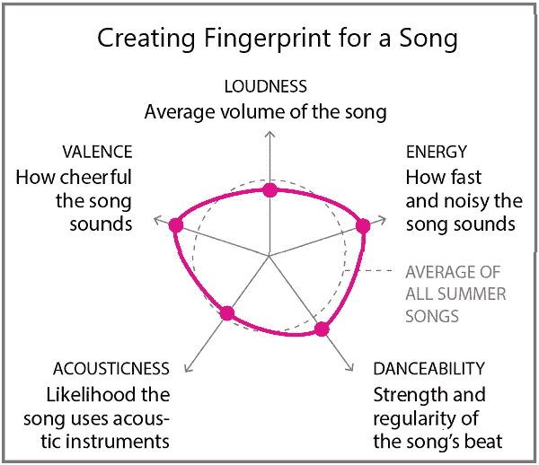
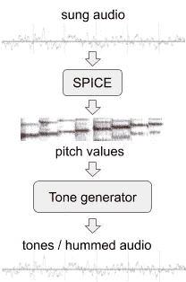
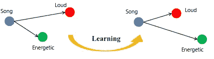

# Google 是如何做出“哼哼来搜索”的？

> 原文：<https://pub.towardsai.net/how-google-made-hum-to-search-865f224b70d0?source=collection_archive---------2----------------------->

## [技术](https://towardsai.net/p/category/technology)

## 赶走耳虫的完美工具。

你们知道我的伙计们，我喜欢解码有趣的算法，先是*，然后是[***Tinder***](/tinder-ai-a-perfect-matchmaking-b0a7b916e271)接下来是[***GPT-3***](/gpt-3-explained-to-a-5-year-old-1f3cb9fa030b)还有现在的 ***谷歌哼！****

## *目录:*

*   *如何使用 Google Hum 功能？*
*   *Google 是如何在“哼哼”功能中使用 ML 的？*

*你是否曾经在考场/会议室里，你所能想到的只有昨晚迪斯科舞厅里播放的奇怪音乐？*

*别担心，我们都经历过。这种现象被称为耳虫。而且，要赶走耳虫，放松你的大脑，唯一的诀窍就是唱/听那首曲子。*

*但是，你不知道那首歌，只有一个“哼”的声音在你的脑海里旋转？别担心，谷歌在这里。*

*Google Hum 是普通音乐识别系统的一个进步。*

***Shazam，Pixel Sound Search** 都可以，但是它们只能在音高、速度和乐器存在的情况下识别出准确的曲调。但是谷歌把它带到了另一个层次，推出了“**哼声**”，如果你在谷歌上“*哼声*”15 秒钟，哼声与任何特定歌曲相匹配，它甚至可以识别歌曲名称。*

*有趣和令人惊奇的是，我们可以想象的所有奇怪的事情现在都可以通过人工智能的使用来实现，甚至当和你有相同品味的人类不能理解你，但该死的人工智能可以！*

# *如何使用 Google Hum 功能？*

*这很简单，去你的谷歌搜索，点击“麦克风”和“哼”的曲调/歌曲。*

****

# *Google 是如何在“哼哼”功能中使用 ML 的？*

*在典型的音乐识别系统中，为了处理音频，样本被转换成 [**声谱图**](https://en.wikipedia.org/wiki/Spectrogram) 以找到精确的音频匹配。但这在哼唱的情况下是做不到的，因为哼唱的声音不包括任何额外的附加内容，如速度、音高、音量等。它只有一个随机的曲调，我们的模型必须匹配最接近的歌曲。*

**

*哼唱曲调 vs 录音棚录音，[来源](https://ai.googleblog.com/2020/11/the-machine-learning-behind-hum-to.html)*

*为了实现上述技术，我们的模型需要非常健壮，并且必须忽略语音注释的所有精确内容。为了让它发挥作用，我们需要对已经定义的声音识别模型进行修改。*

**

*修改已经定义的音乐识别系统，[来源](https://ai.googleblog.com/2020/11/the-machine-learning-behind-hum-to.html)*

*嗡嗡声被转换成基于数字的序列，以便于计算。然后用一对哼唱和录音室录制的音频来训练修改后的神经网络，该音频为每个输入对产生嵌入，从而创建类似指纹的唯一身份。该模型必须足够有效，能够区分旋律相同但音乐和乐器不同的两首不同的歌曲。*

**

*指纹原型*

*经训练的模型为每个输入哼声生成嵌入，并在其训练语料库中寻找具有相似嵌入的歌曲/曲调。*

## *培训用数据*

*训练数据需要每首歌曲的录制版本和演唱版本。使用 [**SPICE**](https://ai.googleblog.com/2019/11/spice-self-supervised-pitch-estimation.html) 从歌曲中提取音高，从而生成由离散音频音调组成的旋律。*

**

*生成训练数据，[来源](https://ai.googleblog.com/2020/11/the-machine-learning-behind-hum-to.html)*

*通过对音高、响度、低音、录音室录音能量的实验，该模型变得更加坚固。此外，混合和匹配同一歌手的两个不同音频有助于实现更高的准确性。*

*我只希望谷歌已经训练了所有真正糟糕的哼歌版本，并亲自尝试了。*

## *三重损失*

*训练与[三重损失](https://en.wikipedia.org/wiki/Triplet_loss)结合在一起，试图忽略少量训练点，从而避免各种神经网络缺陷。当我们将一对音频和相应的旋律传递给我们的模型时，三连音丢失往往会忽略那些来自不寻常旋律的训练数据值，即它会留下伴随的乐器音频，并为每个旋律生成一个基于数字的序列。*

**

*三重缺失，作者图片*

***如果你喜欢这篇文章，请考虑订阅我的简讯:** [**达克什·特雷汉每周简讯**](https://mailchi.mp/b535943b5fff/daksh-trehan-weekly-newsletter) **。***

# *结论*

*在本文中，我们试图阐明 Google Hum 的工作原理，以及机器学习如何成为新虚拟世界的核心。*

# *参考资料:*

*谷歌人工智能博客:Hum to Searc 背后的机器学习*

*【2】[谷歌解释 Hum to Search 是如何工作的](https://9to5google.com/2020/11/12/google-hum-to-search-works/#:~:text=When%20you%20hum%20to%20Search,Search%20results%20featuring%20match%20percentages.)*

*[3] [哼哼搜索:谷歌新功能背后的 ML](https://analyticsindiamag.com/hum-song-search-google-feature-maachine-learning/)*

*[4] [谷歌现在可以猜出你哼的歌了！|作者尼基塔·高德|传媒](https://gawdenikita10.medium.com/google-can-now-guess-the-song-you-hum-e9c843f68673)*

*请随意连接:*

> **作品集~*[*https://www.dakshtrehan.com*](http://www.dakshtrehan.com/)*
> 
> **LinkedIn ~*[*https://www.linkedin.com/in/dakshtrehan*](https://www.linkedin.com/in/dakshtrehan/)*

*关注更多机器学习/深度学习博客。*

> **中等~*[*https://medium.com/@dakshtrehan*](https://medium.com/@dakshtrehan)*

# *想了解更多？*

*[准备好拜 AI 神了吗？](https://medium.com/swlh/are-you-ready-to-worship-ai-gods-818c9b7490dc)
[利用深度学习检测新冠肺炎](https://towardsdatascience.com/detecting-covid-19-using-deep-learning-262956b6f981)
[逃不掉的 AI 算法:抖音](https://towardsdatascience.com/the-inescapable-ai-algorithm-tiktok-ad4c6fd981b8)
[GPT-3 向一个 5 岁的孩子解释。](/gpt-3-explained-to-a-5-year-old-1f3cb9fa030b)
[Tinder+AI:一场完美的牵线搭桥？](https://medium.com/towards-artificial-intelligence/tinder-ai-a-perfect-matchmaking-b0a7b916e271)
[使用机器学习的卡通化内幕指南](https://medium.com/towards-artificial-intelligence/an-insiders-guide-to-cartoonization-using-machine-learning-ce3648adfe8)
[强化强化学习背后的科学](https://medium.com/towards-artificial-intelligence/reinforcing-the-science-behind-reinforcement-learning-d2643ca39b51)
[解码生成性对抗网络背后的科学](https://medium.com/towards-artificial-intelligence/decoding-science-behind-generative-adversarial-networks-4d188a67d863)
[了解 LSTM 和 GRU 的](https://medium.com/towards-artificial-intelligence/understanding-lstms-and-gru-s-b69749acaa35)
[用于假人的递归神经网络](https://medium.com/towards-artificial-intelligence/recurrent-neural-networks-for-dummies-8d2c4c725fbe)
[用于假人的卷积神经网络](https://medium.com/towards-artificial-intelligence/convolutional-neural-networks-for-dummies-afd7166cd9e)*

> **欢呼**