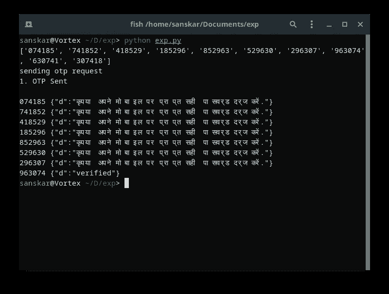
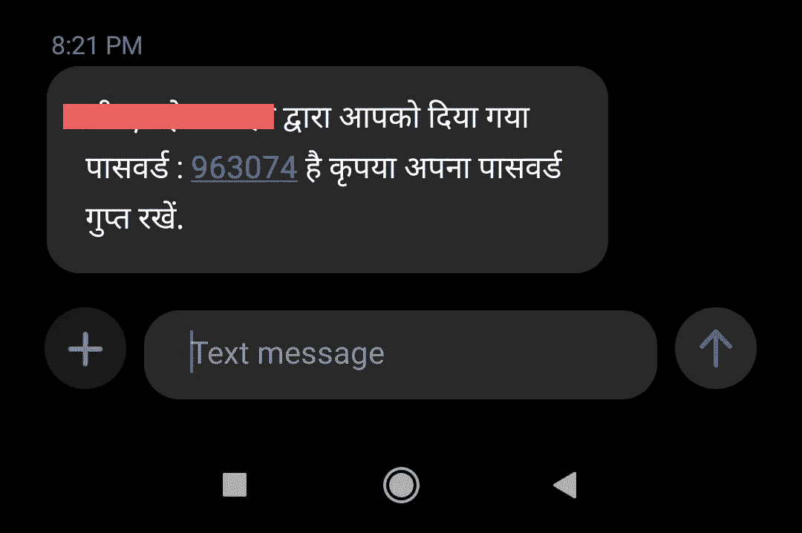

# 我是如何通过识别一个愚蠢的模式意外地入侵了一个政府应用程序

> 原文：<https://pub.towardsai.net/how-i-accidentally-hacked-a-government-app-by-recognizing-a-silly-pattern-4bb5cd293022?source=collection_archive---------2----------------------->

## [网络安全](https://towardsai.net/p/category/cybersecurity)

## 有些东西就是要被黑的…


在 [Unsplash](https://unsplash.com/s/photos/hacker?utm_source=unsplash&utm_medium=referral&utm_content=creditCopyText) 上 [Pille dougats](https://unsplash.com/@pilledougats?utm_source=unsplash&utm_medium=referral&utm_content=creditCopyText) 的照片

嘿伙计们！

让我再说一遍，

> “有些东西就是要被黑的！”

几天前，我安装了一个政府应用(*不能透露，因为他们还没有发布补丁*)，在这个应用中，我发现了一个隐藏在简单的一次性密码(OTP)机制角落的严重漏洞。

我不知道这是程序员的失误，还是有意操纵，但在我看来这很可疑。

> 我在 OTP 里看到了“模式”。

请允许我解释…

对于那些不知道的人来说，OTP 机制在印度应用程序中非常常见，他们主要通过电话号码注册用户，而不是电子邮件地址或社交媒体帐户。为了验证相关的电话号码和授权，向电话发送“随机”的一次性密码，然后用户可以通过输入正确的数字序列来注册/登录。

这个应用程序和网站也使用了这样的 OTP 机制，但它完全是垃圾！(我的意思是，“故障”)

我这么说是什么意思？

# 让我们开始讨论细节吧

在理想的情况下，6 位数的动态口令必须完全随机，有 1，000，000(一百万)种可能性，范围从 000000 到 999999；它必须在一段时间后过期，并且用户必须有固定(有限)的尝试次数。

这三个条件确保了攻击者无法强行进入受害者的帐户。(至少，不是在合理的时间内)

这个政府网站(比如说， *Wx* )和它对应的 app **，**和任何其他现代平台一样，使用 OTP 机制通过他们的电话号码注册他们的用户。但遗憾的是，上述 3 个条件都没有满足；无论是与网站还是与移动应用程序，因为它们可能共享相同的 API。

在我做“研究”的时候，我发现没有设置过期时间，并且可以进行无限的登录尝试。此外，在 OTP 序列中有某些**模式**可以帮助攻击者在几秒钟内**危及应用的安全**！

*如何？*

以下是认证(登录/注册)时出现**概率**极高的前 10 名 OTP。

```
074185
741852
418529
185296
852963
529630
296307
963074
630741
307418
```

这些数字**不是随机的**，而是使用以下序列生成的:

> 0 7 4 1 8 5 2 9 6 3

> **注意:**我并不是说这些 OTP 是唯一的可能性，而是它们有很高的**概率**。这足以编写一个工作漏洞。

如果你从任何一点滑动一个 6 位数的窗口，你会得到上面的一个 OTP。

```
**0 7 4 1 8 5** 2 9 6 3
0 **7 4 1 8 5 2** 9 6 3
0 7 **4 1 8 5 2 9** 6 3
0 7 4 **1 8 5 2 9 6** 3
0 7 4 1 **8 5 2 9 6 3**
  7 4 1 8 **5 2 9 6 3 0**
    4 1 8 5 **2 9 6 3 0 7** 1 8 5 2 **9 6 3 0 7 4**
        8 5 2 9 **6 3 0 7 4 1**
          5 2 9 6 **3 0 7 4 1 8**
```

那个系列是从哪里来的？

它来源于 ***数字在标准数字小键盘*** 上的排列方式。请参见下图:


来源:图片由作者提供

震撼吧！？

# 剥削

一旦这种模式引起了我的注意，就只需要写一个小脚本来测试我的假设。为此，我需要以下信息:—

API 端点:

```
For Authentication: **POST** http://Wx.gov.in/Functions.aspx/auth_dashFor Sending OTP: **POST** http://Wx.gov.in/Functions.aspx/send_otp
```

和 API 响应:

```
After sending OTP: **{“d”: “OPT Added”}**On successful authentication: **{“d”: “verified”}**On failed authentication: **{“d”:”कृपया अपने मोबाइल पर प्राप्त सही पासवर्ड दर्ज करें.”}**
```

> **旁注:**对于失败的认证，上面的印地语句子翻译成“请输入正确的密码”。而且没错，OTP 被程序员拼错成了 OPT。

在对 [Postman](https://www.postman.com/) 进行了几轮测试后，我终于编写了一个 python 程序，可以在一个循环中生成并输入所有 10 个“极有可能”的密码，共 10 次。(顺便说一下，我总是只通过 3 次迭代就成功了)

看看剧本…如此优雅却又如此有力！

## Python 脚本—

来源:作者代码

## 截图—

如果您执行这个脚本，您将在终端上看到类似这样的内容:



作者截图

手机上还有一条包含 OTP 的消息:



作者截图

> **翻译:**由【Wx】给你的密码是:963074。请保密您的密码。

如你所见，两个号码都匹配— **963074**

利用成功！

万岁！！！

# 在这之后我做了什么？

如果我想，我可以创建数以千计的假账户，用假请求让他们的服务器超载，劫持其他人的账户，或者破坏他们的功能，还有其他什么……但我没有做过这样的事情。毕竟这是一个重要的应用程序！

我知道这听起来可能很无聊，但是我向当局报告了这个漏洞；像一个负责任的大国公民应该做的那样。😅

在印度， [NCIIPC](https://nciipc.gov.in/) (国家关键信息基础设施保护中心)运行着一个 [**负责任的漏洞披露计划(RVDP)**](https://nciipc.gov.in/RVDP.html) **。所以我填好表格，寄出了邮件。**

就是这样。没什么特别的。

至少我是这样认为的…

# 最后一点—

开始只是猜测，结果却是巨大而有意义的事情。如果我没有安装这个应用程序，我就不会注意到这种模式，这个应用程序(和网站)可能会被黑帽利用得更糟糕。

我不是安全专家或道德黑客，我只是一个偶然发现这个漏洞的程序员，并做了正确的事情。

尽管如此，还是有一些事情让我挠头。

我个人认为:我认为，这里面有猫腻。作为一名程序员，我知道实现一个随机函数来生成一个 OTP 要比实现一个随机函数+一个模式生成器的组合(我上面提到的)更容易。

*那么，这是故意的吗？比如后门？或者本来就是要黑的东西？没人知道……*

如果这个 OTP 机制的程序员选择了一个不同的系列(而不是 *0741852963* )，我可能不会这么容易就发现这个模式。如果它真的是预先计划好的，那么，最后，它只是一个愚蠢的人类错误，把它给了。

总之，我很享受这种剥削。

> 谢天谢地，我有能力进一步探索它，并有坚实的道德指南针来做出明智的决定。

感觉上，我的好奇心和观察模式的能力在这里终于得到了回报。

感谢您的阅读，祝您愉快！

***免责声明:*** *我不是鼓励你去黑政府或任何其他你没有权限的应用。这篇文章只是出于教育目的，因为我想告诉你我的故事。请乖乖的，出了事不要怪我。*

*干杯！*

*如果你喜欢阅读这些故事，那么我相信你一定很乐意成为* [***中等付费会员***](https://nishu-jain.medium.com/membership) ***。每月只需 5 美元，你就可以无限制地接触成千上万的故事和作家。你可以通过* [***使用此链接***](https://nishu-jain.medium.com/membership)*注册来支持我，我将赚取一点佣金，这将帮助我成长并出版更多像这样的故事。***

**其他一些你可能喜欢的文章—**

[](https://medium.com/towards-artificial-intelligence/how-to-find-out-which-cybersecurity-career-is-right-for-you-6ded18478789) [## 如何找到适合自己的网络安全职业？

### 开始网络安全之旅的分步指南

medium.com](https://medium.com/towards-artificial-intelligence/how-to-find-out-which-cybersecurity-career-is-right-for-you-6ded18478789) [](https://medium.com/towards-artificial-intelligence/is-your-phone-really-listening-to-you-effafbd71a1d) [## 你的手机真的在听你说话吗？

### 与爱德华·斯诺登一起重温这一令人担忧的现象背后的真相

medium.com](https://medium.com/towards-artificial-intelligence/is-your-phone-really-listening-to-you-effafbd71a1d) [](https://medium.com/swlh/whats-the-business-model-for-open-source-software-anyway-e387190d0323) [## 开源软件的商业模式是什么？

### 如何用开源免费软件挣钱？

medium.com](https://medium.com/swlh/whats-the-business-model-for-open-source-software-anyway-e387190d0323)