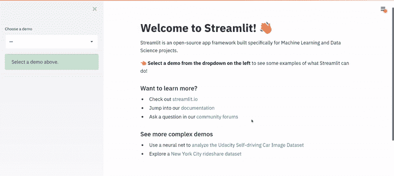
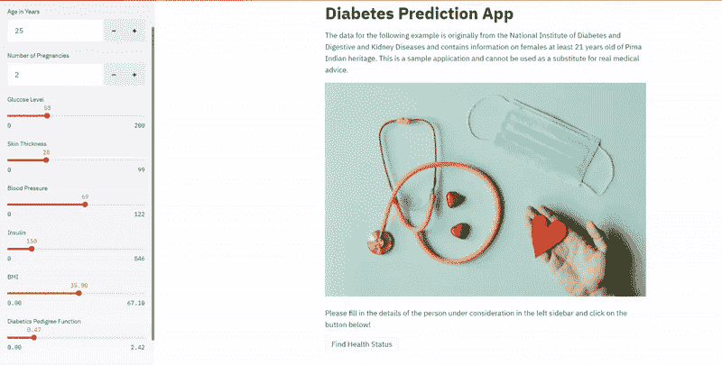

# 我如何在数小时内构建机器学习应用

> 原文：<https://pub.towardsai.net/how-i-build-machine-learning-apps-in-hours-a1b1eaa642ed?source=collection_archive---------0----------------------->

## [机器学习](https://towardsai.net/p/category/machine-learning)，[编程](https://towardsai.net/p/category/programming)

## 几个小时，不是几天。我们还有选择吗？


用 ML 应用程序给他们惊喜！(照片由[约翰·施诺布里奇](https://unsplash.com/@johnschno?utm_source=medium&utm_medium=referral)在 [Unsplash](https://unsplash.com?utm_source=medium&utm_medium=referral) 上拍摄)

在几个小时内将 ML 模型包装成应用程序不再是一件大事。如果你懂 Python，相信我，你懂 Streamlit。如果你知道 Streamlit，相信我，你也能做到。

我将准确地告诉你我是怎么做的，并带你看一个真实世界的例子。陪我到最后，你会惊讶于在这么短的时间里你会学到多少东西。我们走吧！

# 为什么要构建 ML 应用

你和我刚刚在 Jupyter 笔记本上建立的令人敬畏的机器学习项目，没有人会使用它。当然，如果我们在 GitHub 库中附带一个好的自述文件，并在上面写一篇博客，人们会检查它，但仍然没有人会使用它。很悲哀，但也是现实。

除非…

除非你我通过尽可能降低壁垒来说服他们使用。演示、文档、教程，应有尽有。尽管如此，没有什么比让用户自己检查一个机器学习 web 应用程序，与应用程序交互，提供输入，并对输出感到惊讶更有效的了。**那才是真正的赢。**

我不是一夜之间发现的。我是凭经验学会的。在这里介绍一下我就够了。我是一家 AI 创业公司的机器学习工程师。我的日常工作主要围绕着研究、原型制作以及为各种商业问题提供机器学习解决方案。你可能认为这是最难的部分；不，机器学习是我的艺术，我喜欢表演它。**最难的是说服**。首先，让内部决策者相信这个解决方案是可行的，其次，说服(潜在的)客户。斗争是真实的，我的朋友。

对于数据科学领域的任何角色来说，沟通都是最重要的技能之一。在尝试了许多关于演示、模拟等技术之后，就有效性而言，有一样东西脱颖而出——机器学习(Web)应用。

> 我相信和让决策者自己看到“魔力”有关。

# 简化救援

对于我参与的大多数项目，我经常花足够的时间来研究、构建和优化我的机器学习解决方案，更不用说预处理和清理数据的时间了。很自然地，到最后，就没有时间去做一个值得展示的演示或者类似的事情了。所以当我只剩下不到一天的时间来演示最近的一个项目时(*还不允许透露太多关于这个项目的信息！*)我在工作；我最终用 Flask、Dash 等等来检验我的运气，直到我偶然发现 Streamlit。

我只有几个小时来弄清楚 Streamlit，所以我别无选择，只能在我的终端上键入这两个命令。

```
pip install streamlit
streamlit hello
```

这就是我所看到的。



作者的 Streamlit Hello 截屏

我真的很惊讶，我有希望。我知道我能在最后期限前完成这个应用程序(*剧透:我很快就完成了！*)。我希望我能向你展示我最终用 Streamlit 构建的东西。尽管如此，由于我可能不被允许这样做，我决定为现实世界的糖尿病预测用例建立一个类似的模型，并迅速将其包装成一个 Streamlit web 应用程序。

# 现实世界的例子:糖尿病预测

糖尿病是一种由异常高血糖引起的慢性疾病，在[所有年龄组中都很常见。](https://aspe.hhs.gov/report/diabetes-national-plan-action/importance-early-diabetes-detection#:~:text=Early%20detection%20and%20treatment%20of,limb%20amputations%2C%20and%20kidney%20failure.)糖尿病的早期检测和治疗是保持糖尿病患者健康的重要一步。早期治疗糖尿病可以在很大程度上避免严重的并发症，如肾衰竭、失明、截肢和心脏病[。](https://aspe.hhs.gov/report/diabetes-national-plan-action/importance-early-diabetes-detection#:~:text=Early%20detection%20and%20treatment%20of,limb%20amputations%2C%20and%20kidney%20failure.)


Volodymyr Hryshchenko 在 [Unsplash](https://unsplash.com/s/photos/medicine?utm_source=unsplash&utm_medium=referral&utm_content=creditCopyText) 上拍摄的照片

以下示例的数据最初来自美国国家糖尿病、消化和肾脏疾病研究所，可在 Kaggle 上获得。该数据包含至少 21 岁的皮马印第安族女性的信息。你可以参考[这个 GitHub 库](https://github.com/arunnthevapalan/diabetes-prediction-app)来跟随例子的代码。

## 步骤 1:预处理

任何机器学习问题的第一步都是分析和探索数据。最快的方法是使用熊猫概况(有一天，我一定会写这个超级有用的包。[更新:我做了，这里还有更多](https://towardsdatascience.com/pandas-profiling-for-quicker-data-understanding-83bb9fc6719f)。通过快速浏览，我们可以注意到，虽然没有丢失值，但是对于血压、皮肤厚度、葡萄糖水平、身体质量指数和胰岛素水平等变量，存在相当多的零，这是没有意义的。因此，在按目标变量分组后，我们用这些变量的中位数做了一个简单的插补。

我们还使用标准缩放器来缩放特征，以保持数值变量之间的范围和重要性。我们肯定可以进行更多的预处理和转换，以创建更多的相关功能；然而，我们的重点是展示一个快速的端到端管道，可以在以后进一步改进。

## 第二步:培训

上面的代码一点也不花哨，不言自明。我们做了一个 80-20 的训练测试分割，并安装了一个随机森林分类器。使用 scikit-learn 的分类报告，我们评估了我们模型的性能，得到了 0.88 的加权 F1 分数，这相当不错。

## 第三步:推理

到目前为止，我们已经构建了一个工作模型，为输入数据的预测提供服务。我们在推理过程中接受输入，执行相同的预处理和转换，并使用我们已经建立的模型进行预测。输出要么是*“这是一个健康的人”*要么是*“这个人患糖尿病的几率很高。”解决了一个基本的机器学习问题。*

# 快速包装成一个 Streamlit 应用程序

是时候将我们的惊人模型转变为机器学习 web 应用程序了。如我所承诺的，你只需要几个小时。我把这个方法简化为 6 个小步骤，这样你也可以跟着做。



作者发布的糖尿病预测应用截屏

## 步骤 0:使用 Streamlit 模板

这是一个简单的起点。几乎所有的应用程序都需要一个标题，一个简短的功能描述和一个吸引人的图片。不用说，这部分代码在跨项目修改很少的情况下就可以重用。我们使用像`st.title()`、`st.write()`和`st.image()`这样不言自明的函数。您最终会掌握这个模板的窍门。

## 步骤 1:重构代码

如果你遵循干净代码原则，这应该很容易。我们需要我们的完整管道有纯粹的功能，以便我们可以馈入输入并获得输出，如我们进一步的步骤中所解释的。

确定应用程序需要哪些代码部分也很重要。在我们的糖尿病预测示例中，预处理或训练阶段是一次性操作，应用程序不需要。我们可以做的是加载经过训练的模型，并对输入进行推理。重构后的推理代码如下:

## 步骤 2:接收用户输入

Streamlit 提供了各种小部件来接收用户的输入。在本例中，我们发现数字输入即`st.number_input`和滑块即`st.slider()`是合适的。除此之外，还可以根据需要使用复选框、单选按钮、多选框等等。这些函数使用起来很简单，更多可以在这里的[官方文档中找到。](https://docs.streamlit.io/en/stable/api.html#display-interactive-widgets)

我也喜欢使用`st.sidebar.<function>`在侧边栏中组织我的所有输入，并保留标题、描述和输出的主要部分。这是个人的选择，请随意探索你的选择！

## 第三步:运行管道

Streamlit 简化了这个过程，其中机器学习管道可以基于触发器来执行。这里使用的触发器是使用`st.button()`创建的按钮，用户需要单击一次。我们之前创建的纯函数是逐步执行的。

## 步骤 4:显示输出

这个例子展示了一行输出，可以使用一个简单的`st.write()`语句显示出来(并被添加到步骤 3 的代码中)。然而，当我们要显示更高级的东西，如图像、音频、表格或图形时，注意这一步是很重要的。Streamlit 文档具有所有这些输出的功能，可以相应地使用。

## 第五步:优化应用程序

一旦你构建了一个像样的应用程序，就开始优化是很重要的。通过深入研究文档，我们可以找到许多其他功能，但这个很酷的“Streamlit Cache”功能是必须知道的。它通过缓存在运行之间不会改变的重复函数来帮助加速应用程序。[你可以在这里阅读更多关于 Streamlit 缓存如何工作的信息。](https://docs.streamlit.io/en/stable/caching.html)在这个例子中，我们可以缓存我们的模型，而不需要每次运行都加载。

请参考[这段代码](https://github.com/arunnthevapalan/diabetes-prediction-app/blob/master/app.py)，它将上述所有片段整合成一个机器学习应用`app.py`。最后，在您的终端上键入这一行，自己看看其中的神奇之处吧！

```
streamlit run app.py
```

正如您现在所意识到的，这是一个故意保持简单的示例，以向您展示开始使用 Streamlit 是多么简单。然而，当你着手更高级的需求时，[官方文档](https://docs.streamlit.io/en/stable/getting_started.html)和[官方社区论坛](https://discuss.streamlit.io/)会非常有帮助。

既然你知道要构建一个机器学习应用程序，下一步就是对它进行 dockerize 和部署。**我推荐你看一下** [**这篇文章，在这篇文章中，我继续这个糖尿病预测应用程序的例子，并用 3 个简单的步骤进行分类！**](https://towardsdatascience.com/how-to-dockerize-any-machine-learning-application-f78db654c601)

# 最后的想法

在这篇博客文章中，我们看到了为什么我们需要构建 ML 应用程序，以及为什么我们需要知道如何快速原型化它们。这是这篇文章对我如此重要的唯一原因。 接下来，我们有了一个预测患者是否患有糖尿病的真实世界的例子，并建立了一个机器学习模型。然后，我们强调了一种逐步的方法，使用 Streamlit 将任何机器学习模型包装到 web 应用程序中。开始使用 Streamlit 使我的工作流程变得简单，我可以快速轻松地制作最终产品的原型。我迫不及待地想看到你尝试细流！

```
This article is a part of my series on **Machine Learning in Production**:
- [How I Build Machine Learning Apps in Hours](https://medium.com/towards-artificial-intelligence/how-i-build-machine-learning-apps-in-hours-a1b1eaa642ed)
- [How to Dockerize Any Machine Learning Application](https://towardsdatascience.com/how-to-dockerize-any-machine-learning-application-f78db654c601)
- [Deploying Your Machine Learning Apps in 2021](https://towardsdatascience.com/deploying-your-machine-learning-apps-in-2021-a3471c049507)
```

*我希望你喜欢阅读，就像我喜欢为你写这篇文章一样。我在 Medium 中广泛地写了我在数据科学方面的学习和经验。想保持联系吗？* [***加入我的私人邮箱好友列表*** *。*](https://friends.arunnthevapalan.com/)