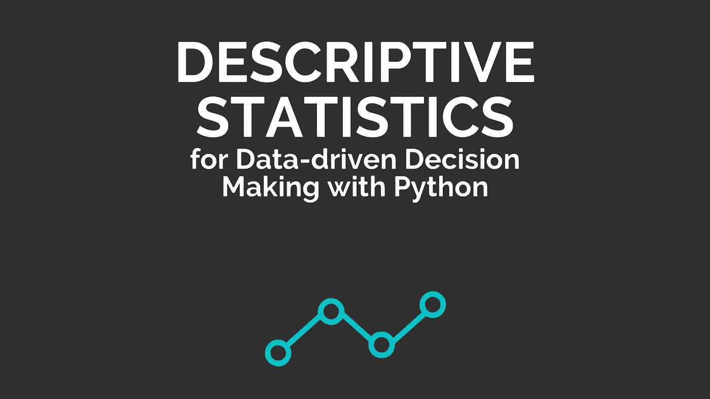
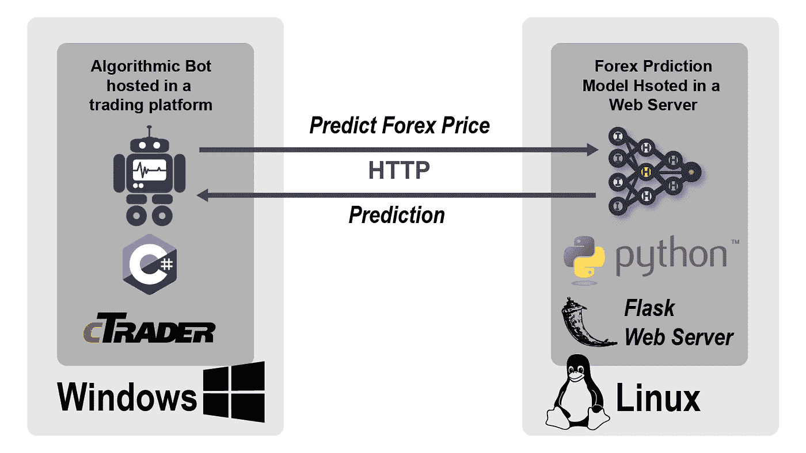
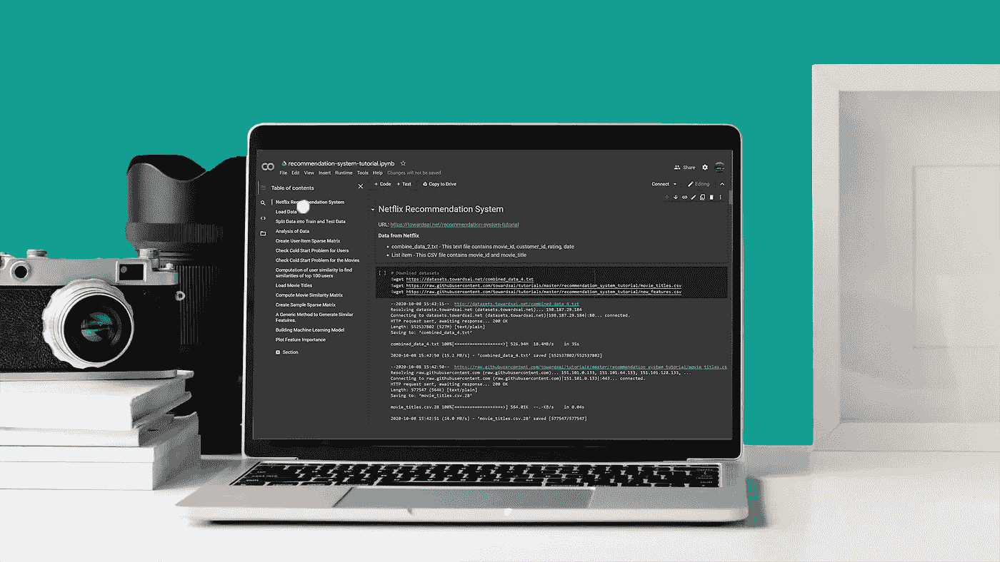
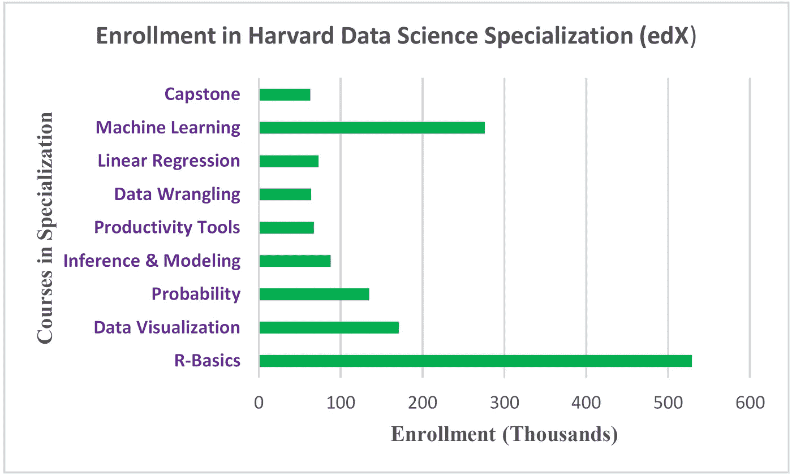
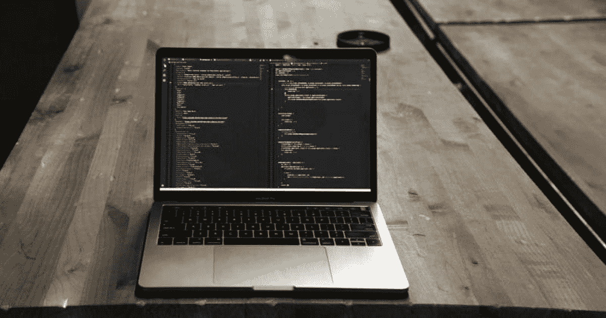
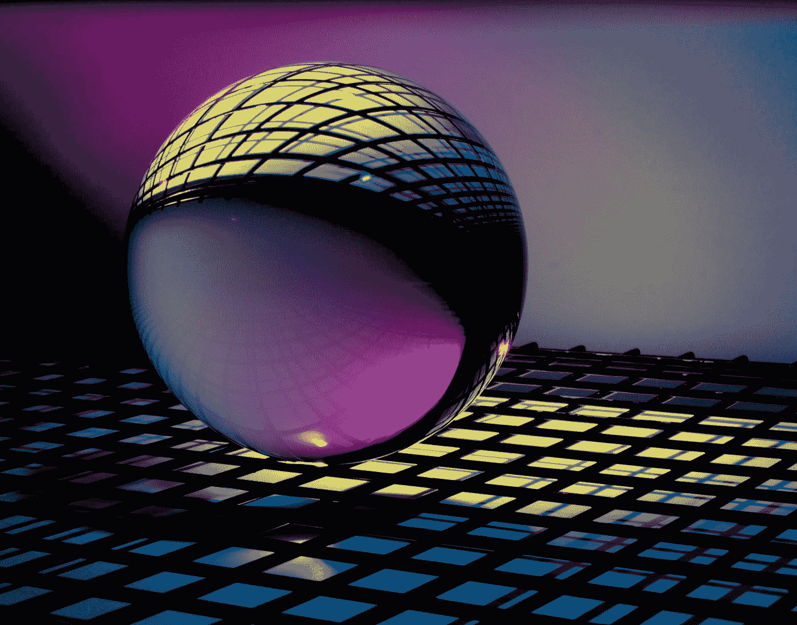

# 我如何在数小时内构建机器学习应用程序…以及更多！

> 原文：<https://pub.towardsai.net/how-i-build-machine-learning-apps-in-hours-and-more-486955768aa1?source=collection_archive---------1----------------------->

## [新闻](https://towardsai.net/p/category/news)，[快讯](https://towardsai.net/p/category/newsletter)

## 人工智能世界有什么新消息，我们的书[的发布，以及我们每月的编辑精选](https://mktg.best/ebook1)

***如果你阅读这封邮件有困难，请在*** [***网络浏览器***](https://mktg.best/ybryx) ***上查看。***

H appy 周一，走向艾家人！为了以微笑开始你的一周，我们建议你看看 Falaah Arif Khan 和 Zachary Lipton 教授的“ [**深度学习的超级英雄第一卷:机器学习的向往**](https://mktg.best/gvi94) ”,这是一部激动人心、令人捧腹并具有教育意义的漫画，适合过去或曾经与数据打交道的人。

如果你正在进行研究， [**NeurIPS**](https://mktg.best/os2nz) 最近 [**在 2020 年的论文评审过程中发布了其研究结果**](https://mktg.best/bd2qx) ，其中有一些关于过去两年主要主题领域、接受率、评级等提交和历史数据的见解。

接下来，如果你有博士学位，并且你正在就业市场上寻求一个教师职位，我们建议你查看卡内基梅隆大学 [**机器学习系**](https://mld.ai/mldcmu) 中的 [**教师职位空缺**](https://mktg.best/c91fs) 。他们目前为你们这些研究人员提供了多种终身职位和教学机会！

如果你对修补数据感兴趣，并且对预测流行病感兴趣(特别是新冠肺炎的情况)。我们建议您查看凯瑟琳·马扎蒂斯和亚历克斯·莱因哈特发表的关于如何访问 [**COVIDcast**](https://mktg.best/c1qli) 的 Epidata API 的 [**这篇文章**](https://mktg.best/sdsyz) ，该 API 向 [**CMU 德尔福**](https://mktg.best/yrucv) 的新冠肺炎监控流免费提供可用数据。

[使用 Python 进行数据驱动决策的描述性统计](https://mktg.best/ebook1)

📊在有限的时间内，我们将对我们的书“ [**描述性统计，用于使用 Python**](https://mktg.best/ebook1)**”**-借助于 [**描述性统计**](https://mktg.best/ebook1) **进行简单明了的数据驱动决策的指南”[****进行预先订购。订购我们的书还可以让您访问未来对它的任何更新——支持 AI 的努力和****](https://mktg.best/ebook1) ****[**帮助我们改进**](https://mktg.best/ebook1) 为您提供更好的内容。📊******

现在进入月度精选！我们挑选这些文章是基于读者群、粉丝和某篇文章的浏览量。我们希望你和我们一样喜欢阅读它们。此外，我们开始做一些新的东西！我们将选出我们的十大表现文章，我们的编辑将选择一到两篇表现不突出，但由于其质量而入选本月的文章。

如果可以，请将我们的 [**订阅链接**](https://towardsai.net/subscribe) 分享给你的朋友、同事、熟人。我们承诺不会向他们的收件箱发送垃圾邮件。如果您对我们的简讯有任何反馈，请随时给我们发送 [**电子邮件**](mailto:pub@towardsai.net) 。

# 📚编辑选择每月精选文章↓📚

用 ML 应用程序给他们惊喜！(约翰·施诺布里奇在 [Unsplash](https://unsplash.com/?utm_source=medium&utm_medium=referral) 上的照片)

## [我如何在几个小时内构建机器学习应用](https://mktg.best/my390)作者[阿伦·the vapalan](https://medium.com/u/c821ffaf8c99?source=post_page-----486955768aa1--------------------------------)

在几个小时内将 ML 模型包装成应用程序不再是一件大事。如果你懂 Python，相信我，你懂 Streamlit。如果你知道 Streamlit，相信我，你也能做到。我将准确地告诉你我是怎么做的，并带你看一个真实世界的例子。陪我到最后，你会惊奇地发现在这么短的时间里你会学到多少东西。我们走吧！…

**[**阅读更多**](https://mktg.best/my390)**

********

## ****[**使用 TensorFlow 深度学习模型进行外汇交易**](https://mktg.best/28-5w) 作者[亚当·蒂比](https://medium.com/u/867d72d8a9d6?source=post_page-----486955768aa1--------------------------------)****

****我之前创建了一个预测外汇市场的模型:[外汇预测实用深度学习模型](https://mktg.best/ze971)。现在我们想在商业交易平台下使用这种模式进行交易，看看它是否会产生利润。这个故事中使用的技术集中在我上一个故事中的模型上，但是它们可以被调整以适合另一个模型。这里的目的是使模型可以被其他系统使用，例如交易平台。你可以在“LSTM-外汇-CTrader-客户端”和“LSTM-外汇-预测-服务器”目录下找到这个故事的源代码…****

******[**阅读更多**](https://mktg.best/28-5w)******

************

******来源:Bongkarn Thanyakij 在[像素](https://www.pexels.com/photo/silver-laptop-beside-analog-camera-and-camera-lens-3759108/)上从原始内容衍生而来******

## ******[Google Colab 101 Python 教程——技巧、诀窍和常见问题](https://towardsai.net/p/programming/google-colab-101-tutorial-with-python-tips-tricks-and-faq-7689bd4d24b4)作者[面向人工智能团队](https://medium.com/u/aea8a19ea239?source=post_page-----486955768aa1--------------------------------)******

******Google Colab 是 Google Research 的一个项目，这是一个免费的基于 Jupyter 的环境，允许我们创建 Jupyter[编程]笔记本来编写和执行 Python [ [1](https://colab.research.google.com/) ](以及其他基于 Python 的第三方工具和 [**机器学习**](https://mld.ai/mldcmu) 框架，如 **Pandas、PyTorch、Tensorflow、Keras、Monk、OpenCV** 等)******

******[**阅读更多**](https://towardsai.net/p/programming/google-colab-101-tutorial-with-python-tips-tricks-and-faq-7689bd4d24b4)******

************

******照片由[艾玛·马修斯数字内容制作](https://unsplash.com/@emmamatthews?utm_source=medium&utm_medium=referral)在 [Unsplash](https://unsplash.com/?utm_source=medium&utm_medium=referral) 上拍摄******

## ******[2020 年开始机器学习——从无到有成为专家，免费！](https://mktg.best/242x1)由[路易(什么是艾)布沙尔](https://medium.com/u/f34bfe2bbaec?source=post_page-----486955768aa1--------------------------------)******

******在我的社交媒体上，同一个问题一天会被问很多次。问题是，“**机器学习怎么开始？**”。它经常以多种形式出现，例如“**我如何才能免费开始？**或**没有开发者背景怎么下手**等。所以我决定写一个关于如何在 2020 年从没有任何背景开始学习机器的完整指南，而且是免费的。因为这些相关的问题，我研究了很多资源，并在过去的一年里将最好的资源保存在记事本上，以快速回答接下来即将出现的问题…******

******[**阅读更多**](https://mktg.best/242x1)******

************

******哈佛数据科学专业的注册(数据来源:edX)。Benjamin O. Tayo 的图片******

## ******【MOOC 数据科学专业的完成率非常低作者 [Benjamin Obi Tayo 博士](https://medium.com/u/3a025d440e6b?source=post_page-----486955768aa1--------------------------------)******

******数据科学、机器学习和分析被认为是最热门的职业道路。行业、学术界和政府对熟练数据科学从业者的需求正在快速增长。因此，正在进行的“*数据热潮*”吸引了众多具有不同背景的专业人士，如物理、数学、统计、经济和工程等。数据科学家的就业前景非常乐观。IBM 预测，到 2020 年，对数据科学家的需求将飙升 28%******

********[**阅读更多**](https://mktg.best/efpo7)********

************

******来源:克里斯汀·哈德威克的免费图片******

## ******[alpha zero 会玩冰壶吗？](https://mktg.best/nufwe)🥌由[米哈伊尔·西敏](https://medium.com/u/21224cebe9ea?source=post_page-----486955768aa1--------------------------------)博士******

******具有离散空间的板可以容易地表示为小图像。棋盘可以放入 8 像素乘 8 像素大小的图像中。作为对比，上面的库存照片是 960 像素乘以 640 像素。卷积神经网络(CNN)是专门设计来进行图像分析的。它比完全连接的人工神经网络(ANN)学习得更快，因为一些神经元连接被先验地移除了。大多数棋盘可以很容易地用图像来表示。棋盘上的每个棋子都有其独特的值或“颜色”，每个像素对应棋盘上的一个方格。为了表示游戏，只需要 3 个颜色值来表示白、黑和空…******

********[**阅读更多**](https://mktg.best/nufwe)********

************

## ******[为什么 JavaScript 是初学者的好选择](https://mktg.best/z54jd)由 [Catalin 坑](https://medium.com/u/e345593e211e?source=post_page-----486955768aa1--------------------------------)******

******JavaScript 是 web 开发中事实上使用的语言，这是有充分理由的。它是一种通用的语言，易于开始，并且很受欢迎。因此，您可以:******

*   ******构建所有类型的应用程序。例如，手机、智能手表和网络应用。******
*   ******只使用你的浏览器开始用 JavaScript 编码。******
*   ******快速轻松地找到任何类型的教程…******

********[**阅读更多**](https://mktg.best/z54jd)********

************

******克拉克·范·德·贝肯在 [Unsplash](https://unsplash.com/?utm_source=medium&utm_medium=referral) 上的照片******

## ******[**600 NLP 数据集和荣耀**](https://mktg.best/h3h0e)by[Quantum Stat](https://medium.com/u/7a94371c6509?source=post_page-----486955768aa1--------------------------------)******

******欢迎回来。今天的时事通讯会有些不同。我们想更新每个人对大坏 NLP 数据库的当前状态😎。首先，我想提一下，今天，我们用 10 个新数据集更新了数据库，使我们在 9 月份总共超过 600 个或 50 个新数据集！我们想借此机会感谢所有在过去一年里为 BBND 做出贡献的人，他们使这个储存库成为一个永恒的储存库…******

********[**阅读更多**](https://mktg.best/h3h0e)********

************

## ******[贝叶斯推理简介](https://mktg.best/sfc1y)作者 [___](https://medium.com/u/3c36dad0dabc?source=post_page-----486955768aa1--------------------------------)******

******让我们把模型的世界分成两种类型:统计的和科学的。这两类模型都旨在理解目标变量(即 y)和一组特征(即 **x.** 之间的关系。前者旨在基于数据找到统计上合理的关系，而后者具有能够描述因果关系的特性。本系列中的所有示例都使用了统计模型，例如 GLMs，来说明贝叶斯推理中的一个概念。然而，贝叶斯推理与建立科学模型一样相关…******

******[**阅读更多**](https://mktg.best/sfc1y)******

************

******迈克尔·泽兹奇在 [Unsplash](https://unsplash.com/?utm_source=medium&utm_medium=referral) 上的照片******

## ******[用 Python 和 Qiskit 介绍量子计算](https://mktg.best/3sc-m)作者 [Bala Priya C](https://medium.com/u/75516508ba84?source=post_page-----486955768aa1--------------------------------)******

*******这是一篇关于使用 Python 和 IBM Qiskit 开始量子计算的博文，灵感来自于* [*Sara A. Metwalli 的*](https://sara-ayman-metwalli.jimdosite.com/)*webinar in the Women Who Code Python Track。* **什么是量子计算？**量子计算是指利用**叠加**和**纠缠**等量子力学现象进行计算。为了理解量子现象，理解量子信息的单位**量子位**以及叠加和纠缠的概念是很重要的…******

******[**阅读更多**](https://mktg.best/3sc-m)******

************

******来自[像素](https://www.pexels.com/photo/woman-in-brown-blazer-wearing-sunglasses-5212325/?utm_content=attributionCopyText&utm_medium=referral&utm_source=pexels)的[马克斯·费舍尔](https://www.pexels.com/@max-fischer?utm_content=attributionCopyText&utm_medium=referral&utm_source=pexels)的照片******

## ******[深度学习算法解决高等数学问题](https://mktg.best/ltbsa)作者[S·K·达萨拉德](https://medium.com/u/db4a0d3b48c1?source=post_page-----486955768aa1--------------------------------)******

******有没有尝试过建立一个神经网络模型来解决简单的数学问题？比如两个数相乘或者一个数的平方？那么你可能会意识到神经网络不是为解决这些简单问题而设计的。你需要一个相对复杂的模型来近似一个数的平方。也不会完美…******

********[**阅读更多**](https://mktg.best/ltbsa)********

************

******来源: [Pixabay](https://pixabay.com/photos/library-books-education-literature-869061/)******

## ******[来自不同行业领域的 50 多个对象检测数据集](https://mktg.best/wph4l)由 [Abhishek Annamraju](https://medium.com/u/c428453bc402?source=post_page-----486955768aa1--------------------------------)******

******计算机视觉是一个快速发展的领域，每天都有大量的新技术和算法出现在不同的会议和杂志上。从理论上讲，当涉及到对象检测时，你会学到许多算法，如 fast-rcnn，Mask-rcnn，Yolo，SSD，Retinenet，Cascaded-rcnn，Peleenet，EfficientDet，CornerNet…这个列表是永无止境的！******

********[**阅读更多**](https://mktg.best/wph4l)********

********🙏感谢您成为** [**订阅者**](https://towardsai.net/subscribe) **与** [**同向艾**](https://towardsai.net/) **！🙏********

*****跟着走向艾↓*****

****[***【脸书】******|***](https://www.facebook.com/towardsAl/)[***推特***](https://twitter.com/towards_ai?lang=en)***|***[***insta gram***](https://www.instagram.com/towards_ai/)***|***[***LinkedIn***](https://www.linkedin.com/company/towards-artificial-intelligence)****