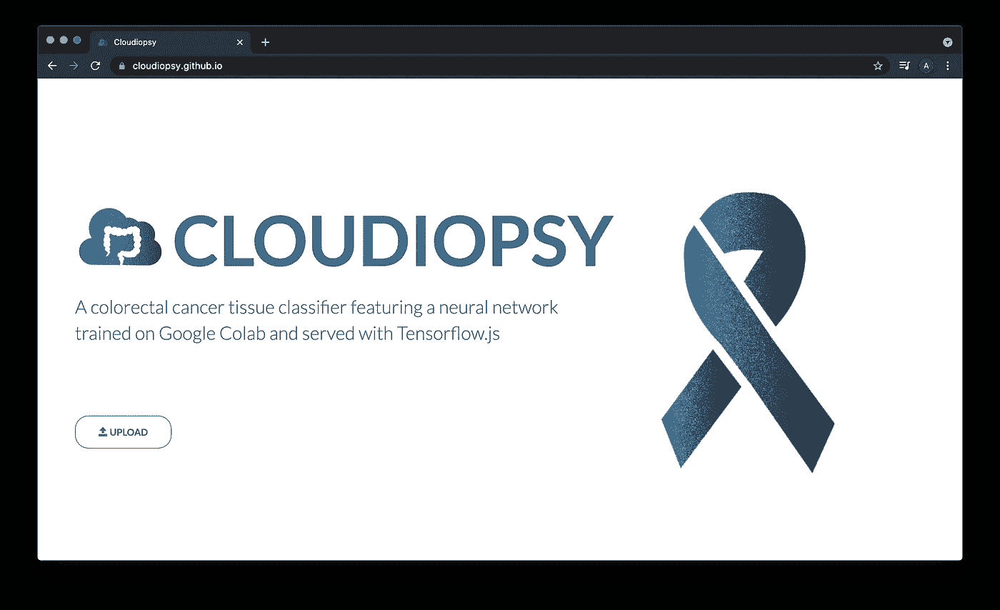
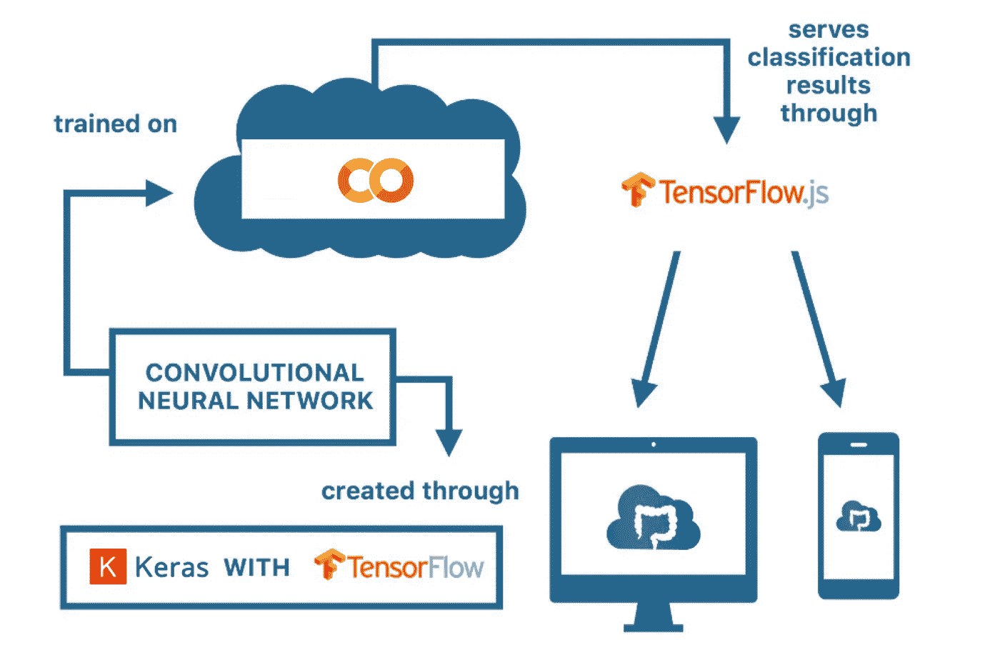
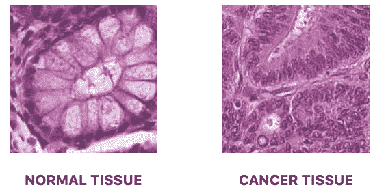
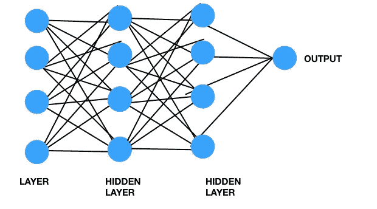
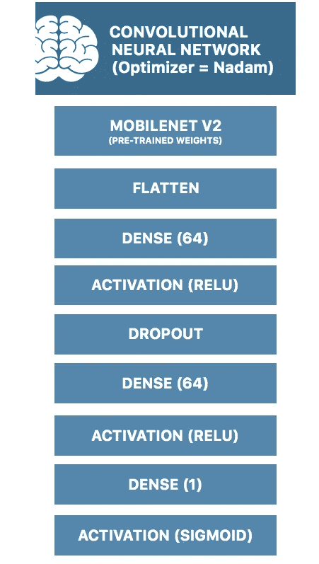
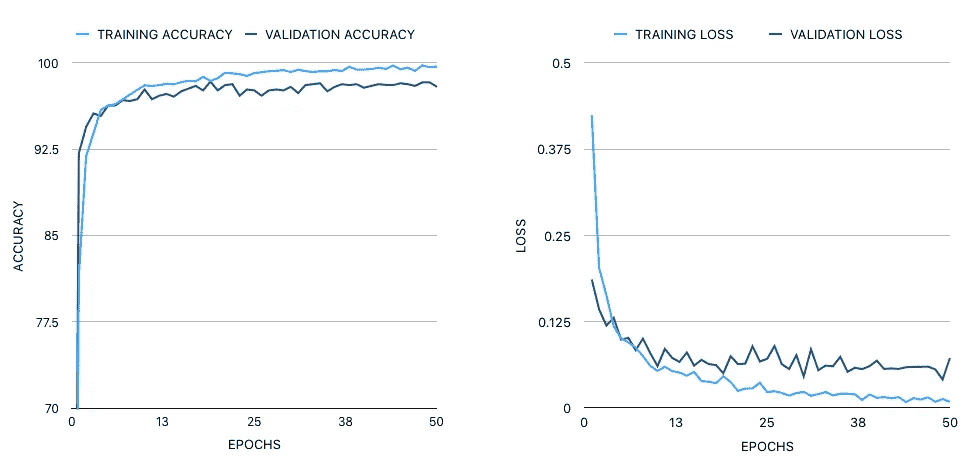
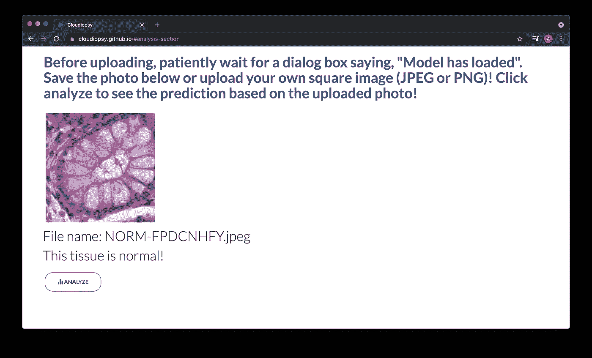

# 我如何通过深度学习构建结直肠癌组织分类器

> 原文：<https://pub.towardsai.net/how-i-built-a-colorectal-cancer-prediction-platform-through-deep-learning-343aeb24d34a?source=collection_archive---------3----------------------->

## [深度学习](https://towardsai.net/p/category/machine-learning/deep-learning)

我相信人工智能可以 ***拯救*** 人类。

然而具有讽刺意味的是，正如任何普通科幻小说所描绘的那样，任何先进的人工智能都会突然想到 ***灭绝*** 人类是世界和平的解决方案。

天网的幻想离实现还有点遥远…至少现在是这样。

开玩笑，与其关注人工智能导致人类毁灭的 0.001%的概率，不如考虑人工智能可能对社会非常有益，特别是在医疗保健领域。

人工智能在医疗保健领域的应用是无限的，在精准医疗、健康分析、医疗信息学等领域提供了巨大的潜力。

在我的情况下，我试图调查人工智能在肿瘤学领域的潜力。我试图利用深度学习的力量来建立经过训练的神经网络，以更准确和有效地确定结肠直肠组织是否包含肿瘤。

# 为什么是 Cloudiopsy？

仅在 2018 年，结肠直肠癌就夺去了大约 180 万人的生命(世卫组织，2018 年)。事实上，在菲律宾，结直肠癌被视为头号胃肠癌(Afinidad-Bernardo，2017)。然而，幸运的是，结直肠癌是可以预防的，如果在早期发现，结直肠癌是可以治愈的。

因此，Cloudiopsy 被设计为结肠直肠癌预测平台，其可以容易地在全国分布，以通过区分正常粘膜组织和上皮腺癌(肿瘤)组织来辅助诊断。这是在菲律宾普及结肠直肠癌预测的一种经济有效的方式，因为该诊断平台在未来可以很容易地在线获得。

# 那是什么？

简单来说， [Cloudiopsy](http://cloudiopsy.github.io) 平台通过迁移学习，使用 [Keras](https://keras.io/) 和在 Google Colab 上训练的 [Tensorflow](https://www.tensorflow.org/) 后端，并通过 [Tensorflow.js](https://js.tensorflow.org/) 在浏览器中提供预测，通过神经网络模型预测图像输入。

# 结直肠癌背后的基本病理学直觉

这些是来自组织病理学结肠直肠组织样本数据集的图像，将在下面的部分中简要讨论。

左图是一个正常粘膜组织层的例子。可以看出，杯状细胞(粘液分泌细胞)的大小相对相同，并分布于结肠隐窝(一种肠腺，其横截面为椭圆形)。这表明隐窝是健康的，因此，这张照片取自正常粘膜组织。

与右图相反，杯状细胞在组织内部不再可见，这意味着它已经是肿瘤组织。这种类型的肿瘤具体称为上皮腺癌。如果发送的其他区域样本也被证明含有肿瘤，这可能是结肠直肠癌的指标。

给定活检的组织样本的当前分析方法是手动扫描样本，并通过查看组织的结构来寻找癌变区域。然而，扫描整个区域是非常费力的，并且容易出现人为错误。因此，理想的情况是自动完成这一过程，并找到一种方法来创建一个平台，该平台将自动确定补片是正常组织还是癌症组织，并返回预测结果。

# 神经网络和迁移学习

神经网络是大脑中的一组连接，电信号通过彼此发射来产生思想、想法、情感等。另一方面，当我们学习时，我们重新安排这些神经元之间的这些连接，以学习新的模式和概念。

模仿我们的大脑，神经网络可以通过数学运算转换信息，以获得特定的输出。因此，神经网络有能力将图像或语音等复杂模式转换为数值，并通过乘以权重对这些值进行数学转换，从而对它们进行分类。

权重只是输入被乘以或变换的值。这些权重被修改，直到产生特定的输出(分类或预测)。

一个样本神经网络

此外，为了捕获模式并“学习”哪个是肿瘤，哪个是正常的，神经网络中的某些层可能负责学习关于图像的某些特征。初始层可能负责识别诸如边和角的特征，并沿着神经网络移动，一些层经历更高层次的抽象，例如理解形状(圆对椭圆)，以及随后可能理解这些形状之间的距离等。

一种方法是从头开始训练神经网络。然而，在我的项目中，知道较低层可能负责边缘检测和形状检测，我没有从头开始训练，而是使用迁移学习，其中我用来自预训练神经网络的预训练权重来初始化它。具体来说，我在 Mobilenet V2 模型上进行了预培训。

# 数据集

该项目使用的数据集是由 Kather、Halama 和 Marx 准备的人类结肠直肠癌和健康组织的 100，000 张组织学图像。据研究人员称，该数据集由 10 万张苏木精&曙红(H & E)染色的人类结直肠癌(CRC)和正常组织的组织学图像组成，这些图像是从 NCT 生物库和 UMM 病理学档案馆的样本中整理出来的(Kather，Halama & Marx，2016)。

# 构建模型

为了建立神经网络模型，我利用 Google Colab 对超过 4534 幅图像(2235 幅肿瘤组织图像和 2299 幅正常组织图像)进行了训练。我有 1330 张图像用于验证(正常组织 656 张，肿瘤组织 674 张)和 1653 张图像(正常组织 810 张，肿瘤组织 843 张)用于测试数据集。

我已经利用 Keras 与 Tensorflow 后端设计的神经网络与那达慕优化器，训练 50 个时代。

我的模型的具体架构如下所示:

# 结果

损失函数基于二元交叉熵。该模型的最终测试准确率为 98.79%，F1 值为 0.987。模型的最终大小为 75.5 MB。

# 使用 Tensorflow.js 提供服务

为了在线提供服务，我使用了 tfjs 转换器，它将模型转换成 model.json 文件和 shard 文件，这些文件将用于加载模型。我编写了一个简单的脚本来加载 model.json 并通过 [cloudiopsy.github.io](http://cloudiopsy.github.io) 提供预测。

# 结论

这仍然是一项进展中的工作，因为更高的精度更有利于创建一个对病理学家和医疗专业人员非常有用的工具。此外，对临床设置的测试将揭示软件中可能的改进。然而，有一天，Cloudiopsy 有望通过更快地分析结肠直肠活检来帮助诊断结肠直肠癌，并帮助全球抗癌倡议。

# 感谢

我要感谢我的导师 Martin Gomez 先生、Daphne Ang 博士以及我的父母 Serafin Serapio 博士和 Cherry Serapio 博士，是他们帮助我使这个项目成为可能。

# 参考资料:

f . chollet(2016 年)。使用非常少的数据构建强大的图像分类模型。检索自[https://blog . keras . io/building-powerful-image-class ification-models-using-very-little-data . html](https://blog.keras.io/building-powerful-image-classification-models-using-very-little-data.html)。

马丁森，C. (2018)。Keras 中的迁移学习和数据扩充。从[https://craigmartinson.com/post/keras-transfer-learning/](https://craigmartinson.com/post/keras-transfer-learning/)取回。

数据集:

j . n . kather，n . Halama，Marx，A. (2016)。人类结肠直肠癌和健康组织的 100，000 张组织学图像。[图像数据集]。从[https://zenodo.org/record/1214456.](https://zenodo.org/record/1214456.)取回