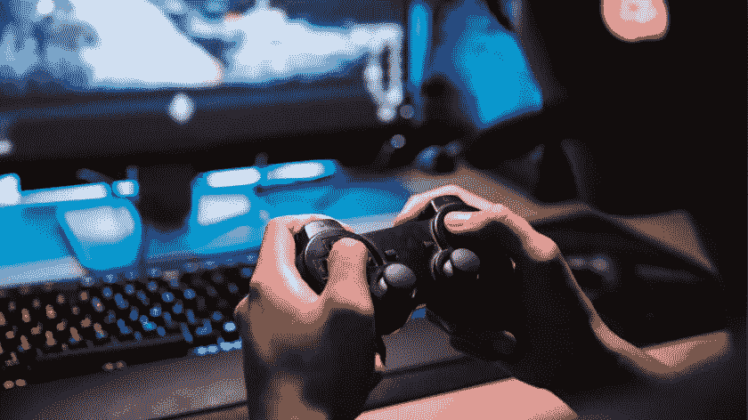
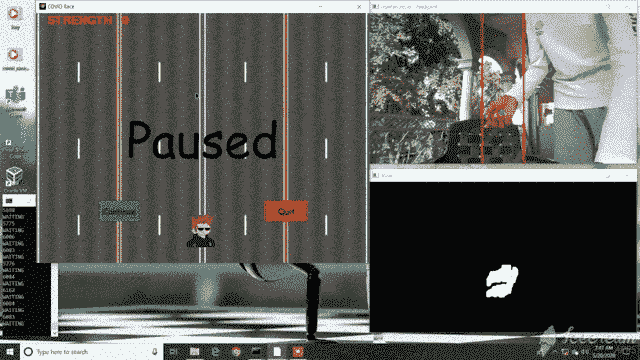
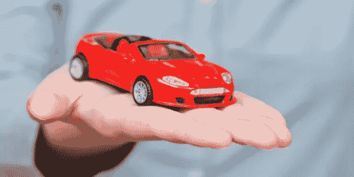
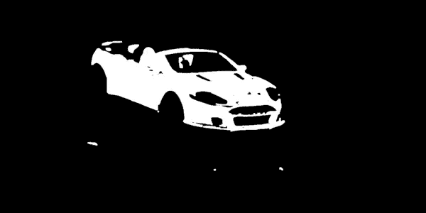
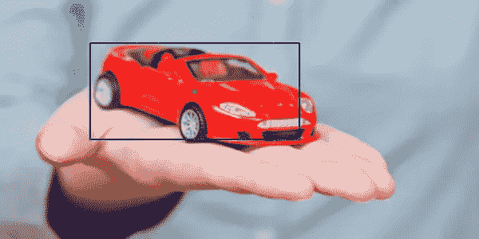

# 如何使用计算机视觉开发游戏

> 原文：<https://pub.towardsai.net/how-i-developed-a-game-using-computer-vision-18409a39a1f3?source=collection_archive---------1----------------------->

## 计算机视觉

## 玩赛车游戏使用手跟踪，人工智能



使用 Canva 制作的图片

如果你是一个兴奋的极客，热爱计算机视觉，AI 在这里是一个有趣的应用程序。在人工智能中使用 CV 开发游戏。我使用深度学习库和 python 游戏开发工具——Pygame 开发了一个简单的游戏。让我们来了解如何使用手动跟踪或任何用户定义的对象来控制计算机屏幕上的移动。

下面是我如何用手控制游戏的短片。



作者提供的视频

[](https://drive.google.com/file/d/1tIsIdCmm731XzsasVtaAyDDBmWNHheL3/view?usp=sharing) [## VideoGame1.mp4

游戏—集成手势控制](https://drive.google.com/file/d/1tIsIdCmm731XzsasVtaAyDDBmWNHheL3/view?usp=sharing) 

## 使用 Python 实现

让我们开始使用 OpenCV 和 Numpy 逐步实现算法。首先，我们建立一个模型，并在其中定义我们想要控制的对象的颜色范围。下面的代码是用来识别一个红色的物体，你可以通过改变亮度值来识别任何想要的颜色。要检测红色，您可以使用下面的 HSV 颜色阈值脚本。



输入图像(使用 Canva 制作)

检测帧中的红色对象



检测到红色的结果(作者提供照片)

*我们可以通过多次应用不同范围的遮罩，并使用从我们想要找到的对象中采样的不同模型来获得更好的结果。也可以实现多重反投影版本(直方图反投影)。如果你想从头开始写代码，你可以使用 CNN 图书馆 Deepgaze。*

## 检测多个轮廓

我们都知道，视频不过是一系列快速显示的图像(帧)。这个游戏反复使用同一个画面(背景中的道路)。我们试图在每一帧上找到想要的物体(这里是人)的轮廓，一旦确定了表演动作(如果需要)，我们就继续下一帧。如果没有找到，这个人很可能已经死了。

下面的代码将返回轮廓的数量。由于我们一个接一个地运行框架(滑动窗口),如果框架中没有轮廓，我们不想将框架处理到下一步。

寻找等高线的数量

## 检测具有最大面积的轮廓

在识别每一帧中的对象后，将选择在图像阵列中占据最大部分的轮廓，以避免面积较小的轮廓，可能是噪声*(你可以看到在上面的汽车图像中，不需要的部分也被视为白色部分，但我们不希望我们的模型误解它并对结果产生负面影响)。*

检测具有最大面积的轮廓

一旦我们得到了具有最大面积的轮廓，我们就给它指定一个参考点——我们称之为节点。该节点有助于跟踪该轮廓，因此无论何时对象移动，该节点都会随之移动。我认为矩形的中心是一个节点。您可以根据您的应用选择任意数量的节点。

得到节点

我们现在的主要目标是获得节点的像素值(x，y)。可以优选任何方法来进行该步骤。例如，您可以使用一个分类器来检测人脸，并在模型检测到帧中的人脸时控制操作。在这种情况下，节点将位于检测到的面部的中心区域。



绿点是我们的节点(作者照片)

## 游戏

现在我们有了节点，我们需要写一个算法来移动游戏中的玩家。在我的例子中，当检测到我的肤色/红色物体时，我希望播放器左右移动。为了控制键盘动作，我们在 python 中有一个工具——Pynput。

要执行的键盘操作


检测到的对象与阈值线进行比较(作者提供照片)

两条红线之间的区域 L1(左)、L2(右)代表关键区域。

*   当节点位于 L1 线左侧的区域时，键盘向左动作被触发，通知应用程序用户想要将**播放器**移动到左侧。
*   类似地，当节点位于 L2 线右侧的区域时，玩家将向右移动。
*   如果节点位于 L1 和 L2 之间，即在偏移区域(偏移= L2-L1)，将不执行任何操作。
    盔甲！

> 再次为我的游戏这些约束，你可以执行任何你自己的行动。

这就是我们要做的！游戏准备好了，我们已经完成了设置*手势控制应用程序*所需的每个步骤，该程序负责处理游戏中的**玩家**。我们可以将这个模型集成到任何其他应用程序中，比如控制我们的笔记本电脑屏幕、游戏开发等。我用过 Deepgaze，一个 CNN 的人机交互库。

完整代码可以在 GitHub 上找到，从这里[](https://github.com/developers-cosmos/COVID-Race-Game)**。下载代码并运行下面的命令。我已经包括了设置游戏和如何玩游戏的清晰说明。**

```
pip install -r requirements.txt
python "Race Game.py"
```

> **你可以在这里查看游戏的短片。**

**[](https://drive.google.com/file/d/12Ho6bXNPRIipf2Y_74sIV3LeYQje-g5v/view?usp=sharing) [## VideoGame.mp4

### Pygame](https://drive.google.com/file/d/12Ho6bXNPRIipf2Y_74sIV3LeYQje-g5v/view?usp=sharing) [](https://drive.google.com/file/d/1tIsIdCmm731XzsasVtaAyDDBmWNHheL3/view?usp=sharing) [## VideoGame1.mp4

游戏—集成手势控制](https://drive.google.com/file/d/1tIsIdCmm731XzsasVtaAyDDBmWNHheL3/view?usp=sharing) 

> 要下载手势控制应用的可执行文件，[点击此处](https://bit.ly/COVID-Race-Game-GestureControlAIapplication)。

## 结论

我们学习了如何构建运动跟踪应用程序，以及如何使用 Pygame 将它与游戏集成。我希望你喜欢这个过程，并且现在明白如何开始开发简单而有趣的游戏。如果你发现有改进的地方，请随时提出修改建议。我很快会再赶上你的。在那之前，呆在家里，注意安全！
如果您想联系，**在** [**LinkedIn**](https://www.linkedin.com/in/ritheesh-baradwaj-yellenki-8a6988173/) **上联系我。****