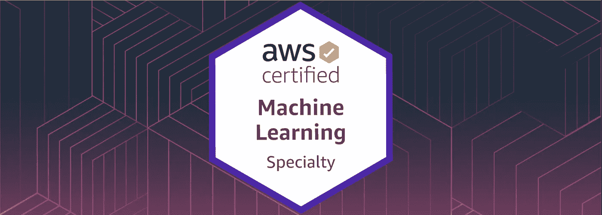

# 我如何获得 AWS 机器学习专业认证

> 原文：<https://pub.towardsai.net/how-i-got-the-aws-machine-learning-specialty-certification-a1142f1376cd?source=collection_archive---------1----------------------->

## [机器学习](https://towardsai.net/p/category/machine-learning)，[观点](https://towardsai.net/p/category/opinion)

## 你不需要推荐的 1-2 年的实践经验

****注意:*** *我没有推广任何在线课程、博客或材料。我不属于任何提到的资源。只是让人们知道我用了什么资源通过认证，他们也可以使用它，而不用浪费时间研究好的资源。此外，我假设你对机器学习有很好的理解(算法，技术等。).这篇文章和提到的资源是为了补充你所掌握的知识。如果你是数据科学/机器学习领域的初学者，那么我会建议你在很好地了解这个领域后的 1 到 2 年后参加这个考试。本文最后更新于 2020 年 7 月 12 日。**

# 为什么要考 AWS 认证机器学习专员？

您可能知道，许多大公司和小型初创企业正在使用云服务来构建他们的产品/解决方案，并向全球客户提供这些产品/解决方案。这也包括机器学习解决方案。

有大量与数据科学和机器学习相关的工作。随着工作数量的增加，竞争也在加剧。所以，不管你是想找工作，转行，还是想升职，你都想要能让你脱离大众的东西。这就是这个认证发挥作用的地方。它证明了一个人使用 AWS 云构建和部署机器学习解决方案的能力。也测试对机器学习相关核心概念的理解。(所以不仅仅是关于 AWS 云，你还需要对机器学习算法有深刻的理解。)

让我们看看 AWS 怎么说，

> AWS 认证机器学习-专业认证面向从事开发或数据科学工作的个人。它验证候选人针对给定业务问题设计、实施、部署和维护机器学习(ML)解决方案的能力。

如果你感到不知所措，不要担心。本文中提到的资源和程序将使您的旅程顺利而轻松。

# 成为一名优秀的数据科学家或机器学习工程师需要证书吗？

号码

没有这个证书你也可以成为一名优秀的数据科学家或者机器学习工程师，但是如前所述，它会帮助你自己脱离大众。

证书只是现有技能的一种验证方法。

# 这要花多少钱？

它的价格是 300 美元。请确保您在参加本次考试之前做好充分准备，因为如果您考试失败并想要重考，您将不得不再次付费。

我的推荐是先考 [**AWS 云从业者考试**](https://aws.amazon.com/certification/certified-cloud-practitioner/) 再考这个。这将帮助您全面熟悉 AWS 云、它们提供的所有服务以及最佳实践。

你可以用 [**这个 Udemy 课程**](https://www.udemy.com/course/aws-certified-cloud-practitioner-training-course/) 来准备 AWS 云从业者考试，用 [**这个练习考试**](https://www.udemy.com/course/aws-certified-cloud-practitioner-practice-exams-c/) 来检查你的理解，大概知道考试会问什么样的问题。(实践考试很重要。)

AWS 云从业者考试将花费您 100 美元。根据 AWS 政策，如果您通过了一项认证，您可以在下次认证时享受 50%的折扣。此外，您还可以获得一次免费的实践考试。这意味着如果你在机器学习之前给云从业者考试，那么总成本将是

*$100 美元(云从业者)+ $150 美元(机器学习专业原价的 50%)= $ 250 美元。*

因此，如果你只提供机器学习专业，它将花费你 300 美元，但如果你先提供云从业者，然后提供机器学习专业，那么你可以获得两个认证总共 250 美元。

# 认证的有效性？

三年。如果你想继续成为认证机器学习专家，你需要在那之后重新参加考试。

这是有意义的，因为 AWS 每年都在不断发展并提供新的服务。

# 通过认证验证的能力

> 1.为给定的业务问题选择并论证适当的 ML 方法
> 
> 2.确定适当的 AWS 服务来实施 ML 解决方案
> 
> 3.设计和实施可扩展、成本优化、可靠且安全的 ML 解决方案

# 根据 AWS 推荐的知识和经验

> 1.1-2 年在 AWS 云上开发、设计或运行 ML/深度学习工作负载的经验
> 
> 2.表达基本 ML 算法背后的直觉的能力
> 
> 3.执行基本超参数优化的经验
> 
> 4.有 ML 和深度学习框架的经验
> 
> 5.遵循模型训练最佳实践的能力
> 
> 6.遵循部署和运营最佳实践的能力

然而，你不需要 1-2 年的实践经验就能通过机器学习专业考试。在参加机器学习专业考试时，我有大约 7 到 8 个月的使用 AWS 云的经验。

作为补充，您可以利用下一节中提到的资源。

*注意:你需要获得至少 75%的分数才能通过考试。*

# 我用来通过考试的资源

## 1.AWS 考试指南

**费用:**免费；**时间:** 5 分钟；**乐于助人:** 10/10

AWS 考试指南对于了解考试的结构和主题非常有用。

## 2.AWS 示例问题

**费用:**免费；**时间:** 15 分钟；**乐于助人:** 10/10

本[文档](https://d1.awsstatic.com/training-and-certification/docs-ml/AWS-Certified-Machine-Learning-Specialty_Sample-Questions.pdf)涵盖了 10 道样题。这会让你对你在实际考试中看到的问题的复杂性有所了解。

## 3.AWS 认证机器学习专业 2020 —动手实践！(Udemy)

 [## AWS 认证机器学习专业 2020 -动手！

### 夏羽是一名解决方案架构师、顾问和软件开发人员，他对所有事情都有特殊的兴趣…

www.udemy.com](https://www.udemy.com/course/aws-machine-learning/) 

**费用:** $15-$20 加元(打折)；**时间:** 15 小时(带动手)；乐于助人: 10/10

夏羽·马拉克和弗兰克·凯恩教授的 Udemy 课程涵盖了 AWS 考试指南中提到的所有主题。本课程还包括动手实验，这些实验将帮助您了解如何使用 AWS 云来训练和部署您的机器学习模型。它还涵盖了所有基本的机器学习和深度学习算法，包括 AWS 特定的算法和服务。

注意:不要为 Udemy 上的任何课程支付全价。最有可能的是，他们每个月会有两到三次折扣率(85%-90%)的课程。如果您在购买任何课程时没有看到任何折扣，那么您可以使用不同的电子邮件 id 创建一个新帐户，这样，您将在有限的时间内以折扣价获得所有课程。

## 4.AWS 机器学习认证考试|2020 完整指南(Udemy)

 [## AWS 机器学习认证考试|2020 完整指南

### 机器和深度学习是目前最热门的技术领域！机器/深度学习技术被广泛…

www.udemy.com](https://www.udemy.com/course/amazon-web-services-machine-learning/) 

**费用:** $15-$20 加元(打折)；**时间:**20 hrs；**乐于助人:** 7/10(可选)

对我来说，这门 Udemy 课程是选修的，如果你对上一节提到的课程中的任何主题没有一个清晰的概念，或者你想要一些额外的材料，它会很有帮助。

## 5.模拟考试(Udemy)

**费用:** $15-$20 加元(每个，打折)；**时间:**取决于你，**乐于助人:** 9/10

实践考试对通过这个认证非常非常重要。这会让你对实际考试的难度有一个大致的了解。(在我看来，实际考试比 Udemy 的练习考试难 15%左右)

我参加了乌德米的这两次练习考试。

 [## AWS 认证的机器学习专业:全实践考试

### 对 AWS 认证的机器学习专业考试感到紧张吗？你应该的！这可以说是最艰难的……

www.udemy.com](https://www.udemy.com/course/aws-machine-learning-practice-exam/)  [## AWS 认证的机器学习专业:3 次实践考试

### 想打破 AWS 认证的机器学习专业(MLS-C01)考试吗？这是给你的实践考试课程…

www.udemy.com](https://www.udemy.com/course/aws-certified-machine-learning-specialty-full-practice-exams/) 

## 6.实践考试

**费用:**40 美元(如果您有以前认证考试的优惠券，则为 0 美元)；**时间:** 1 小时；**乐于助人:** 8/10(可选)

这次考试是可选的，但是如果您有上次认证考试的优惠券，我强烈建议您参加。我会建议你在完成前几节提到的所有课程和考试后参加这个练习考试。

您可以参加这次练习考试，看看您在实际考试中的表现如何。实际考试的难度与本次练习考试非常接近，如果您在本次练习考试中得分超过 80%，您就可以安排实际考试了。

# 完成考试后

一旦您在考试中按下结束测试按钮，您将立即在屏幕上获得通过或失败。我希望你们都能看到粗体字的通行证:)

您将在完成实际考试后一天内收到一封关于考试总结和分数(满分为 1000 分)的电子邮件。之后，您将能够在 AWS 认证和培训帐户的福利部分看到您的新优惠券。

您也可以通过电子邮件收到的链接加入领英的 AWS 认证社区小组。

如果你对考试有任何疑问或需要任何建议，你可以通过 [LinkedIn](https://www.linkedin.com/in/mayankvadsola/) 联系我。我希望本文提供的信息对你的考试有所帮助。好运！