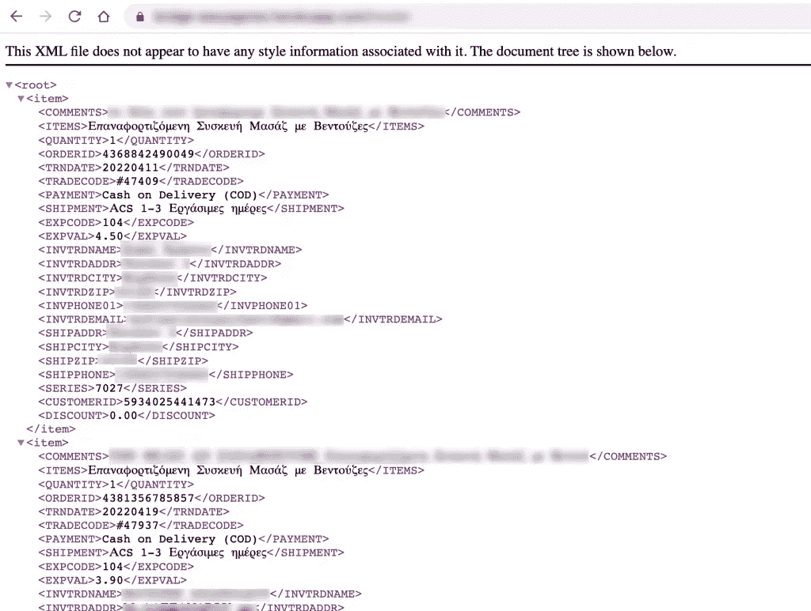
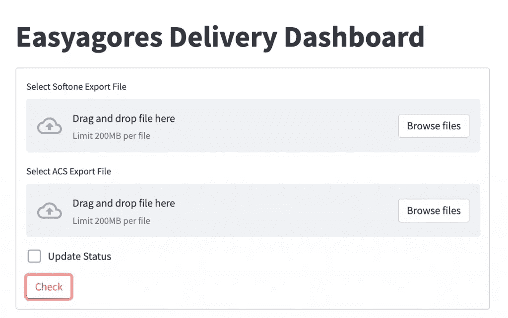
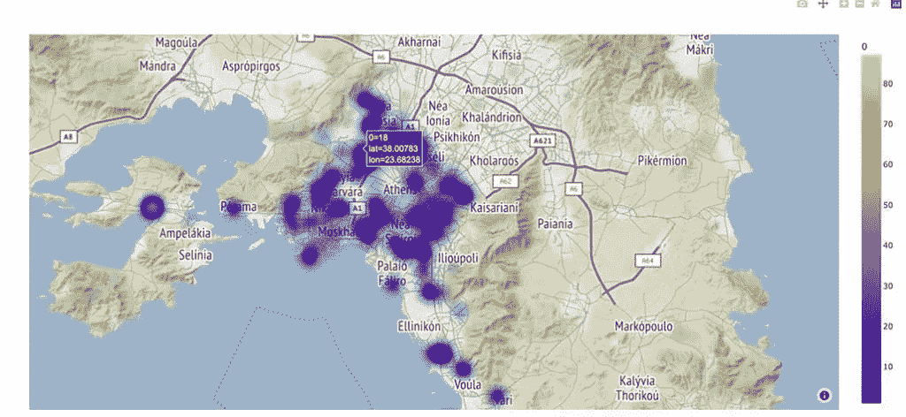

# 我如何利用我的数据科学技能帮助一家零售公司

> 原文：<https://pub.towardsai.net/how-i-helped-a-retail-company-using-my-data-science-skills-80e63b14e8c0?source=collection_archive---------0----------------------->

## 批判性思维的力量

作者图片

数据科学家就像瑞士军刀，如果我们试图理解和思考一个需求或问题，我们几乎可以在任何地方使用我们的知识。我们中的许多人都在犹豫是否要处理似乎超出数据科学范围的项目，我个人认为，这样做，他们失去了一个变得更好的好机会，为什么不呢，赚取一些额外的收入。在这篇文章中，我将告诉你一个关于我如何帮助朋友 Andrea 经营他的第一家电子商务商店的故事。

# 第一个问题:ERP 连接器

首先，他需要以某种方式帮助他的 ERP 系统，因为 ERP 提供商不知道如何将 ERP 系统与我朋友使用的平台 Shopify 连接起来。那时候，我甚至不知道什么是 ERP，但我没有放弃。

在与 ERP 提供商进行了长时间的会谈后，我了解到他们想要一种以特定的 XML 格式获取当天订单的方法。关于这个问题，我有太多的空白和疑问，但是我想通过一些研究，我可能能够解决这个问题。

我需要一种方法从 Shopify 中提取数据，然后转换并以 XML 格式返回它们。第一步，在学习了 Shopify 及其 API 之后，我设法使用 Python 获得了[当天的所有订单。然后，我使用](https://predictivehacks.com/how-to-get-all-orders-from-shopify-in-python/) [Pandas Dataframes 将数据](https://predictivehacks.com/pandas-dataframes-basics-reshaping-data/)转换成 ERP 供应商想要的方式，然后，我设法使用自定义函数将数据[转换成 XML 格式。](https://predictivehacks.com/?all-tips=convert-a-pandas-dataframe-to-xml)

最后，我创建了一个 GET API，让 ERP 提供者使用它来获取 XML 数据。我们没有任何服务器，所以我决定使用 Heroku 免费部署。就是这样！解决问题的方法已经准备好了。

一年后，连接器工作得很好，我们甚至更新了一些产品的新信息，通常情况下，我的朋友必须支付第三方应用程序才能做到这一点。下面，您可以看到 API 输出的截图。

# 第二个问题:快递状态更新

Andreas 告诉我，他的公司在快递服务提供商方面遇到了困难。他需要以某种方式跟踪每一个订单，因此如果状态不清楚，他的员工必须与客户或快递提供商沟通来解决问题。当时，员工必须手动检查每天超过 400 个订单的交付状态。我很震惊，因为这既低效又耗时。我告诉他，我们需要某种方式来自动化这个过程。

他们目前的流程是从 ERP 系统获取 CSV 格式的新订单及其跟踪编号，并将它们添加到 google 电子表格中。然后，他们不得不每天手动检查每个订单的交付状态。

经过几个小时的头脑风暴，我找到了解决他们问题的最佳方案。我需要创建一个 web 应用程序，它可以从 ERP 获取新订单作为输入，将它们添加到电子表格中，同时自动刷新它们的交付状态。首先，我需要找到一种方法来使用快递供应商的 API，这样我就可以自动更新状态。经过一些研究，我能够从快递提供商的网站上找到 API。其次，我需要找到一种方法将我的网络应用程序与他们的[谷歌电子表格连接起来，我已经知道该怎么做了。](https://predictivehacks.com/the-easiest-way-to-connect-python-with-google-sheets/)最后，对于 UI，我使用了我最喜欢的 [Streamlit](https://predictivehacks.com/how-to-create-a-simple-streamlit-app-how-to-deploy-it-on-heroku/) 。

状态更新应用程序已准备就绪！我们成功地自动化了这项任务，节省了许多工作时间，当然，他的交付率也有所提高。后来，这个应用程序变成了一个仪表盘，显示每个交付状态的汇总统计数据(有多少订单正在路上，等等)。)和许多更有用的功能来自动化和监控整个交付过程。

# 第三个问题:找到最佳的交货方式

该公司总部设在希腊，其大部分客户来自雅典。经过一番分析，他决定跳过快递供应商，雇佣两名司机在雅典送货。问题是他需要为他们找到最佳路线，以便每天递送更多的包裹。我认为我们需要用雅典地图上的订单绘制一个热图。这样我们可以看到热点区域，并可以帮助他为他的司机决定最佳路线。

我有订单的邮政编码，并在互联网上找到了对应的经纬度。最后，我用[制作了一个互动热图。](https://predictivehacks.com/data-visualization-in-r/)

# 总结一下

这是一个数据科学家如何利用他的技能解决业务问题的例子，即使这些问题似乎超出了他的范围。大多数数据科学家都有一个庞大的技能工具箱，只要运用批判性思维并努力适应，几乎可以解决任何问题。这可以在很多方面帮助他们的工作生活，因为他们扩展了他们的知识，因为适应是员工最好和最有用的事情之一。