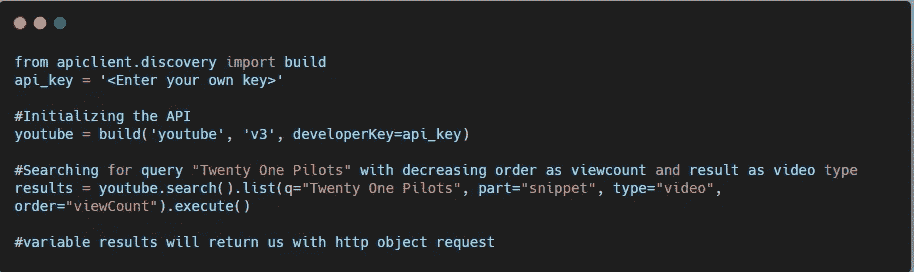
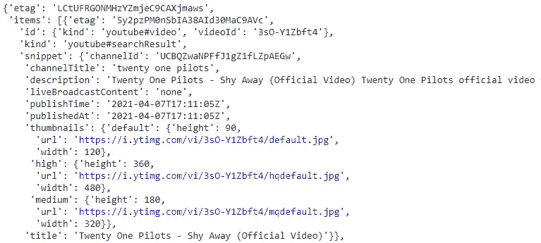
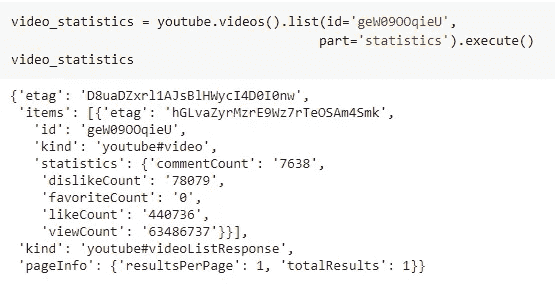
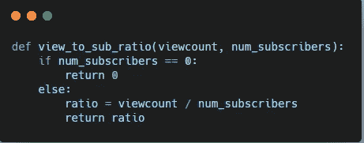
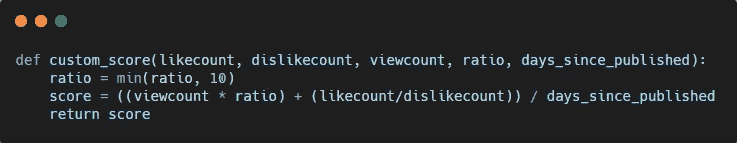
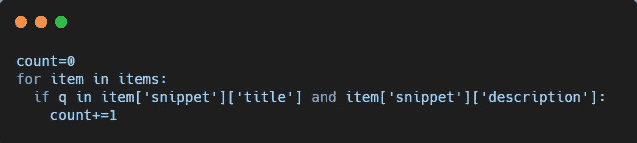
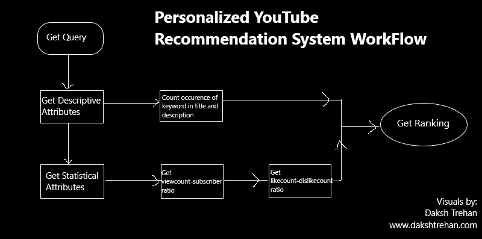
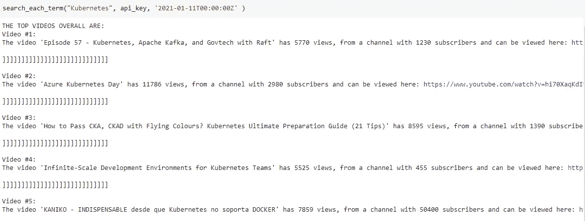

# 我如何使用 YT API 个性化我的 YouTube 推荐？

> 原文：<https://pub.towardsai.net/how-i-personalized-my-youtube-recommendation-using-yt-api-d20f6174bdaa?source=collection_archive---------4----------------------->

## [机器学习](https://towardsai.net/p/category/machine-learning)

## 如何利用 YouTube 的大部分 API？

途经[科斯塔丁](https://kostadindraganov.com/youtube-video-marketing/)

上周，我写了关于[**YouTube 算法如何工作**](/how-is-youtube-using-ai-to-recommend-videos-38a142c2d06d) 及其背后的人工智能工作流程。但基于其推荐系统的现有信息，我认为它存在一些缺陷:

*   它高度偏好**观看时间**，显然，较长的视频将具有较高的观看时间，并且它倾向于在特定时段之后推荐更长持续时间的视频。
*   YouTube 有很多 **clickbait 视频，低质量内容**然而它是推荐的，并且没有对传递的虚假信息采取行动。
*   诸如 **LikeCount、DislikeCount** 之类的满意率对可以改进的推荐几乎没有影响。

在我研究 [**YT 算法**](/how-is-youtube-using-ai-to-recommend-videos-38a142c2d06d) 的过程中，我发现了一篇非常有趣的文章，作者是 [Chris Lovejoy](https://medium.com/u/c155ffc8de0e) ，他使用 YT API 成功创建了一个个性化推荐系统。受到他的思维过程和一篇有见地的文章的启发，我决定使用 YT APIs 创建自己的 YT 推荐算法。

# 这个计划

计划是创建一个系统，可以按照个性化的计划推荐相关的视频。我的动机是避免在成千上万的视频中寻找最好的视频，而是得到一个统计上符合我口味的视频。

这个计划可以为我节省很多寻找相关内容的时间，并且可以帮助我避免分心。

照片由[努贝尔森·费尔南德斯](https://unsplash.com/@nubelsondev?utm_source=medium&utm_medium=referral)在 [Unsplash](https://unsplash.com?utm_source=medium&utm_medium=referral) 拍摄

工作流程包括使用 YouTube 的 API 获取视频信息，然后根据我的喜好对它们进行统计排名。稍后，为了方便起见，我们还可以使用 Python 来自动化整个过程。

# 熟悉 YouTube 的 API

YouTube API 是驱动这个项目的汽车。它会给你带来关于视频的各种信息，无论是统计的还是描述的。

参考文档，它既可以用于频道，也可以用于视频，并向我们返回它们各自的元数据。

从 API 开始，我们需要一个可以使用[开发者控制台](https://console.cloud.google.com/apis/dashboard)生成的 **API 密钥**。

按照下面的代码获取基于您的查询的内容。

输出将留给我们一个 **JSON 对象**，稍后可以对其进行解析并提取有用的信息。

这将提供视频/频道的描述性属性。

为了获得统计属性，我们需要从描述性属性中获取 id，并遵循以下代码。

# 创造完美的配方？

我不太喜欢 YouTube 的推荐系统。我认为它缺少几个重要的特征，或者我有一种特殊的品味。

现在我已经熟悉了 YouTube API，可以轻松地生成有用的信息，是时候打开我的创意机器，开发适合我偏好的排名指标了。

几个因素可以制作一个好的视频。它可能是我的搜索查询的**观看次数、观看时长、视频满意率(如评论、分享)**，或者可能是更多**相关标签。**

最简单的方法是接受高浏览量的视频，但从逻辑上讲，如果一个频道有 1000 万订户，那么一个视频获得 10 万次浏览量对他来说不是什么大事。但如果一个拥有 1 万名订阅者的频道的某些内容达到了 10 万的浏览量，我们可以推断这些内容是符合标准的。

在这种情况下，获得一个**观看用户比率**可能是选择相关视频的最佳指标。

但是，订户数量少的频道内容可以提高该比率。我稍微调整了一下代码，添加了一些限制，并将视频设置为至少有 10k 的浏览量和 1k 的订阅者。

此外，浏览量和订阅人数不能作为排名的唯一衡量标准。我引入了**like count-to-dislike count ratio**来进一步挑选相关和可信的内容。

加上**观看-订阅比率**和**喜欢计数-不喜欢计数比率**，我为每个视频制定了一个分数。

人们普遍认为，YouTube 上的任何内容在 24-48 小时内都是黄金时段，可以获得最多的浏览量和满意率。但是，与事实相反，我决定对每个查询保持手动。

为了得到精确的结果，我还使用了描述性属性，检查了“**查询**是否同时出现在*标题*和*描述中。*

我统计了标题和描述中出现的问题。遵循“人越多越好”的理念。

在最后一步，我修改了我的最终得分函数。首先，关注标题和描述中的关键字，以最大的内容返回。稍后返回具有最大**观看用户比率**和**喜欢计数与不喜欢计数比率的内容。**

YouTube 算法工作流程，由 Daksh Trehan 设计，版权所有

# 决赛成绩

我测试了查询“Kubernetes”的工作流，得到了以下结果。

取得的结果是伟大和可靠的，但在我看来，事情可以变得更好一点。

总的来说，这是一个有趣的项目，围绕着对 YouTube 的 API 和 YouTube 的推荐系统工作流程的理解。

代码的工作流程可以总结为:

*   **手动输入查询、时间段、API 键提取视频。**
*   **根据描述和统计属性过滤视频。**
*   **对视频进行排名。**
*   **显示输出。**

你可以在我的 [**Github**](https://github.com/dakshtrehan/YouTube-personalized-algorithm) 找到完整的代码。

# 结束语

该项目仍处于初始阶段，可以改进很多，可以考虑的一些步骤有:

*   获取个性化视频的整个过程可以自动化。
*   一个更好的度量实现来获得更好的结果。
*   将代码部署在云服务器上供公众使用。

**如果你喜欢这篇文章，请考虑订阅我的简讯:** [**达克什·特雷汉每周简讯**](https://mailchi.mp/b535943b5fff/daksh-trehan-weekly-newsletter) **。**

# 结论

希望这篇文章能让你深入了解 YouTube 推荐系统，以及如何为他们构建一个推荐系统。

但是，这篇文章中描述的关于通用 YouTube 推荐系统的信息仅仅是基于用户体验到的或者 YouTube 开发者宣传的一些理论。个性化算法可以被进一步推向极限，我们可以得到更好的结果。

# 参考资料:

[1] [我创造了自己的 YouTube 算法(为了不让我浪费时间)](https://towardsdatascience.com/i-created-my-own-youtube-algorithm-to-stop-me-wasting-time-afd170f4ca3a)

[2][YouTube 是如何利用 AI 推荐视频的？](/how-is-youtube-using-ai-to-recommend-videos-38a142c2d06d)

[3] [探索 YouTube 数据 API:印度 Pythonista](https://www.youtube.com/playlist?list=PLyb_C2HpOQSBJRh38CTPvsouV4SBpyt_H)

[4] [YouTube 数据 API](https://developers.google.com/youtube/v3)

网上找我:**[**【www.dakshtrehan.com】**](http://www.dakshtrehan.com)**

**在领英关注我:[**www.linkedin.com/in/dakshtrehan**](http://www.linkedin.com/in/dakshtrehan)**

**阅读我的科技博客:[**www.dakshtrehan.medium.com**](http://www.dakshtrehan.medium.com)**

**在 Instagram 跟我连线:[**www.instagram.com/_daksh_trehan_**](http://www.instagram.com/_daksh_trehan_)**

# **想了解更多？**

**[YouTube 是如何利用 AI 推荐视频的？](/how-is-youtube-using-ai-to-recommend-videos-38a142c2d06d)
[利用深度学习检测新冠肺炎](https://towardsdatascience.com/detecting-covid-19-using-deep-learning-262956b6f981)
[无法逃脱的 AI 算法:抖音](https://towardsdatascience.com/the-inescapable-ai-algorithm-tiktok-ad4c6fd981b8)
[GPT-3 向一个 5 岁的孩子解释。](/gpt-3-explained-to-a-5-year-old-1f3cb9fa030b)
[Tinder+AI:一场完美的牵线搭桥？](https://medium.com/towards-artificial-intelligence/tinder-ai-a-perfect-matchmaking-b0a7b916e271)
[一个使用机器学习卡通化的内幕指南](https://medium.com/towards-artificial-intelligence/an-insiders-guide-to-cartoonization-using-machine-learning-ce3648adfe8)
[谷歌是如何做出“哼哼来搜索？”](/how-google-made-hum-to-search-865f224b70d0)
[一行神奇的代码执行 EDA！](/one-line-magical-code-to-perform-eda-f83a731fbc35)
[给我 5 分钟，我给你一个深度假！](/give-me-5-minutes-ill-give-you-a-deepfake-ce83a645b0f9)**

> ***欢呼***