# 我如何准备我的亚马逊数据科学家面试

> 原文：<https://pub.towardsai.net/how-i-prepared-for-my-amazon-data-scientist-interview-5904db944378?source=collection_archive---------1----------------------->

…并且成功了！


克里斯蒂安·威迪格在 [Unsplash](https://unsplash.com/s/photos/amazon-basics?utm_source=unsplash&utm_medium=referral&utm_content=creditCopyText) 上拍摄的照片

让我警告你。这将是一个很长的阅读。你可以浏览一些部分，但是我强烈建议你不要，因为我在这里分享的是黄金(如果我可以这么说的话)。

你们大多数人可能都熟悉方(脸书、亚马逊、网飞和谷歌)公司极其漫长的面试过程。它可能漫长得令人难以忍受，永远拖下去。我总共参加了 4 次亚马逊的面试(针对不同的职位)，我在最后一次面试中成功获得了一个数据科学家的职位(这本身总共有 5 次面试)。在这篇文章中，我将解释我是如何为成功的面试做准备的，以及我使用了哪些资源。

通常，我在第一次面试前一周左右开始准备，在此期间，我会浏览我在本文中讨论过的所有材料。

如果你有兴趣了解实际的面试过程，那么去看看这篇非常受欢迎的文章[我的亚马逊数据科学家面试问题和答案！](/my-amazon-data-scientist-interview-questions-and-answers-9220bd9d01e9)

## K 现在基本编码

如果你是数据科学家或软件开发人员，那么我猜你已经知道一些 Python 和 SQL 的基本编码。就数据科学家的面试而言，以我的经验，我还没有遇到太多专注于任何其他编码语言的公司——然而，我要补充的是，在你的简历上有火花是一个很好的加分。

现在，当我说基本时，我指的是非常基本的——例如对于 **SQL，**您应该知道如何:

*   从表中选择某些列
*   联接两个表(内联接、左联接、右联接和外联接)
*   汇总结果(总和、平均值、最大值、最小值)
*   在 SQL 中使用窗口函数
*   操纵日期

对于 **Python，**知道如何:

*   处理数据框，例如读取、连接、合并、过滤
*   操纵日期和格式化日期
*   操作字符串，例如使用正则表达式，搜索字符串包含的内容
*   有效地使用循环(这本身就是一个话题)
*   使用列表和词典
*   用 Python 创建函数和类

对于 Python，我发现这篇文章很有用:[https://real Python . com/courses/Python-coding-interversations-tips-best-practices/](https://realpython.com/courses/python-coding-interviews-tips-best-practices/)

对于你的编码面试来说，很好地掌握 SQL 和 Python 是很重要的。

## 了解机器学习算法和概念

对于一个数据科学家的职位来说，这是绝对**必须的。**不了解基础算法的来龙去脉，是做不好的。你应该很好地掌握最常用的机器学习模型和算法，并了解它们是如何工作的，以及它们的优缺点。这一点我怎么强调都不为过；试着去发现和学习为什么一个模型有效，为什么它会失败。我在这里列出了最常见的主题，在文章的结尾，我对其中一些主题提供了更详细的注释。

*   线性回归
*   逻辑回归
*   支持向量
*   随机森林
*   增强(Ada 和梯度)
*   聚类算法(k 均值、密度、高斯)
*   自动编码器
*   时间序列预测(基本)
*   LSTMs 和关注层
*   贝叶斯定理
*   梯度下降算法的细节
*   超参数调谐
*   一个热编码与标签编码
*   统计分布
*   异常检测算法

## 了解你的数据结构和算法

这是一个很重要的问题，可能没有软件开发人员重要，但是对数据结构和算法有很好的理解肯定会让你脱颖而出。以下是一个好的开始:

*   大 O 符号
*   二进位检索
*   数组和链表
*   选择排序
*   快速排序
*   冒泡排序
*   合并排序
*   哈希表

这是一本很棒的书，可以帮助你理解数据结构和算法，[搜索算法:程序员和其他好奇者的图解指南](https://www.amazon.co.uk/Grokking-Algorithms-illustrated-programmers-curious/dp/1617292230)。

## 在面试前写一些好的笔记

键入或写出你所学到的和准备的东西非常有帮助——至少它帮助我更长时间地记住这些信息。我在 One Note 应用程序中输入了我所有的笔记，然后用它来快速修改。

你可以使用最适合你的。

## 关于 ML 主题的详细注释

**线性回归**

我关于线性回归的大部分笔记都是基于《统计学习导论》这本书。

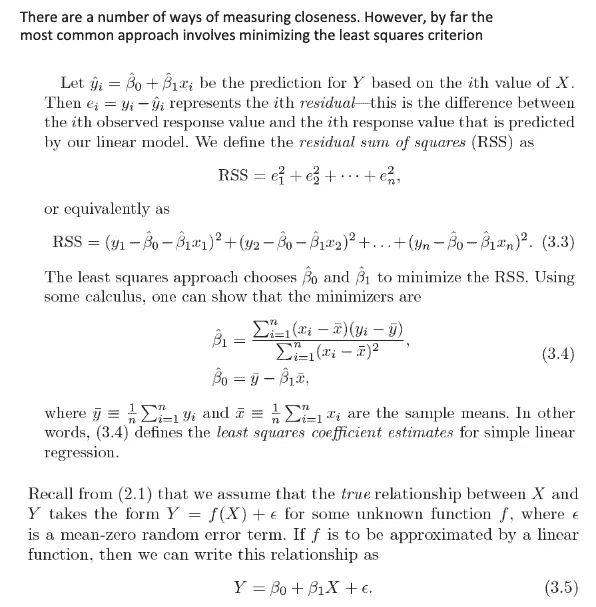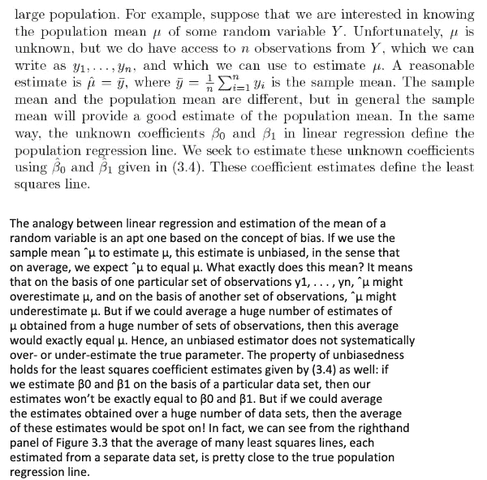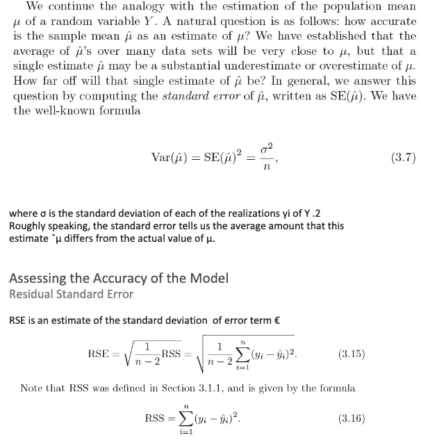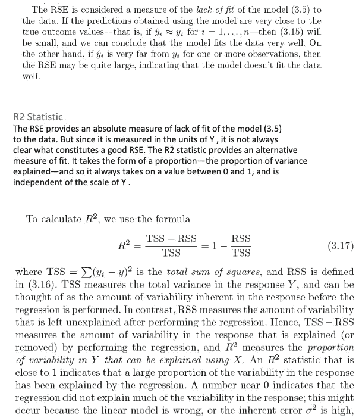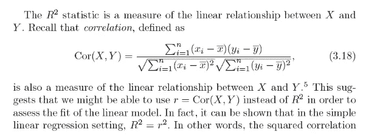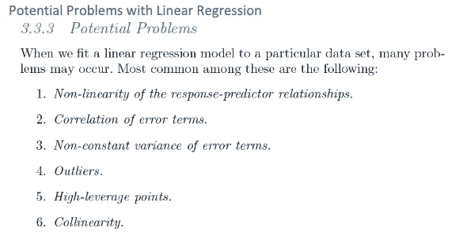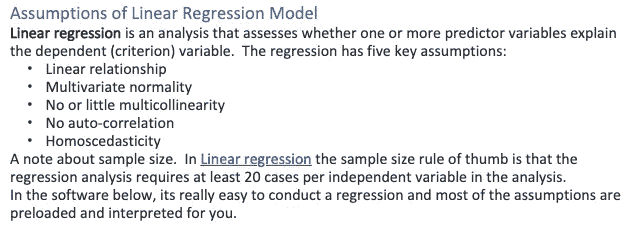

**逻辑回归**

这是一篇关于这方面的好文章:[https://christophm . github . io/interpretable-ml-book/logistic . html](https://christophm.github.io/interpretable-ml-book/logistic.html)

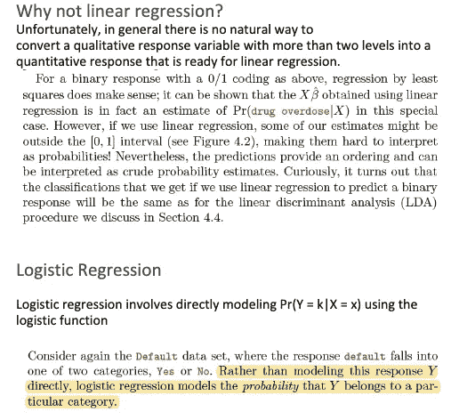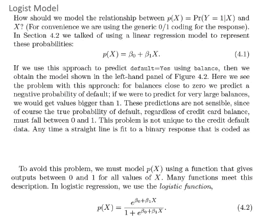

*优点/缺点:*这是一种广泛使用的技术，因为它非常高效，不需要太多的计算资源，可解释性高，不需要缩放输入要素，不需要任何调整，易于正则化，并且它输出校准良好的预测概率。

与线性回归一样，当您移除与输出变量无关的属性以及彼此非常相似(相关)的属性时，逻辑回归的效果会更好。因此，特征工程对于逻辑和线性回归的性能起着重要的作用。逻辑回归的另一个优点是，它非常容易实现，训练起来非常有效。我通常从逻辑回归模型作为基准开始，然后尝试使用更复杂的算法。

由于其简单性以及相对容易和快速实现的事实，逻辑回归也是一个很好的基准，您可以使用它来衡量其他更复杂算法的性能。

它的缺点是我们不能用逻辑回归解决非线性问题，因为它的决策面是线性的。看看下面的例子，它有两个来自两个例子的二进制特征。

*Logistic 回归的假设:*首先，Logistic 回归不要求因变量和自变量之间存在线性关系。第二，误差项(残差)不需要正态分布。第三，不要求同质性。最后，逻辑回归中的因变量不是在区间或比率尺度上测量的。

然而，其他一些假设仍然适用。

一、二元 logistic 回归要求因变量为二元，序数 logistic 回归要求因变量为序数。

第二，逻辑回归要求观察值相互独立。换句话说，观察值不应该来自重复的测量或匹配的数据。

第三，逻辑回归要求自变量之间很少或没有多重共线性。这意味着独立变量之间的相关性不应该太高。

第四，逻辑回归假设独立变量和对数优势的线性。尽管该分析不要求因变量和自变量线性相关，但要求自变量与对数概率线性相关。

最后，逻辑回归通常需要大样本量。一般准则是，对于模型中的每个独立变量，至少需要 10 个结果最不频繁的案例。

**随机森林**

这是一篇关于兰登森林的惊人文章:[https://builtin.com/data-science/random-forest-algorithm](https://builtin.com/data-science/random-forest-algorithm)

**集群**

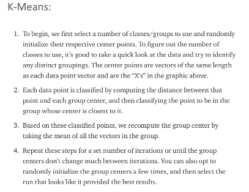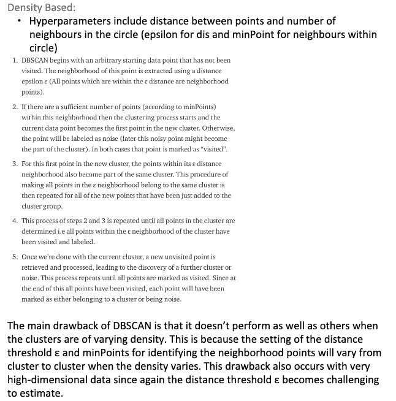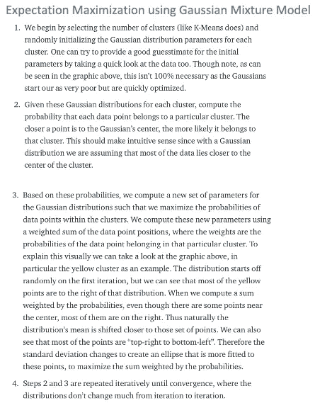

使用 GMM 有两个主要优势。首先，GMM 在聚类协方差方面比 K-Means 灵活得多；由于标准偏差参数，聚类可以呈现任何椭圆形状，而不局限于圆形。K-Means 实际上是 GMM 的一个特例，其中每个聚类在所有维度上的协方差都接近 0。第二，由于 GMM 使用概率，所以每个数据点可以有多个聚类。因此，如果一个数据点位于两个重叠聚类的中间，我们可以简单地定义它的类别，即 X %属于类别 1，Y %属于类别 2。即 GMM 支持混合会员。

**梯度推进**

这是一篇理解渐变提升的好文章:[https://explained.ai/gradient-boosting/](https://explained.ai/gradient-boosting/)

**自动编码器**

自动编码器是一种无监督的学习技术，其中我们利用神经网络来完成**表示学习**的任务。具体来说，我们将设计一个神经网络架构，以便我们*在网络中施加一个瓶颈，该瓶颈迫使原始输入*的 ***压缩*** *知识表示。如果输入特征彼此独立，这种压缩和随后的重构将是非常困难的任务。然而，如果数据中存在某种结构(即输入要素之间的相关性)，可以学习这种结构，从而在强制输入通过网络瓶颈时加以利用。*

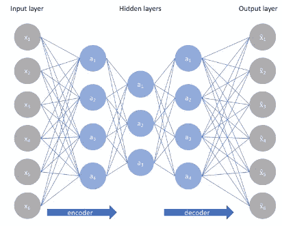

如上所述，我们可以将一个未标记的数据集构建为一个监督学习问题，其任务是输出 x̂，即原始输入 x 的**重建。可以通过最小化*重建误差*，(x,x̂)来训练该网络，该误差测量我们的原始输入和随后的重建之间的差异。瓶颈是我们网络设计的一个关键属性；如果没有信息瓶颈的存在，我们的网络可以通过在网络中传递这些值来简单地学习记忆输入值(如下图所示)。**

*注:事实上，如果我们要构建一个线性网络(即在每层不使用非线性激活函数的情况下),我们将观察到与 PCA 中观察到的相似的维数减少*

因为神经网络能够学习非线性关系，这可以被认为是 PCA 的更强大(非线性)的推广。PCA 试图发现描述原始数据的低维超平面，而自动编码器能够学习非线性流形(流形在*简单的*术语中被定义为连续、不相交的表面)。

**梯度下降**

梯度下降是一种寻找可微函数局部最小值的优化算法。梯度下降简单地用于找到尽可能最小化成本函数的函数参数(系数)的值。

首先定义初始参数的值，然后梯度下降使用微积分迭代调整这些值，使它们最小化给定的成本函数。为了充分理解这个概念，了解渐变是很重要的。

*什么是渐变？*梯度简单地测量所有权重相对于误差变化的变化。你也可以把梯度想成一个函数的斜率。梯度越高，斜率越陡，模型可以学习得越快。但是如果斜率为零，模型就停止学习。在数学术语中，梯度是相对于其输入的偏导数。

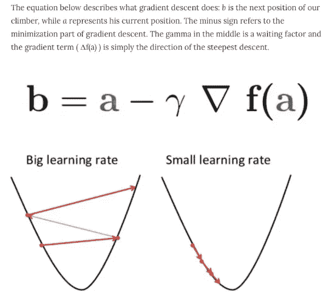

*梯度下降的类型*

批量梯度下降:批量梯度下降，也称为普通梯度下降，计算训练数据集中每个示例的误差，但只有在评估了所有训练示例后，模型才会更新。这整个过程就像一个循环，它被称为训练时期。

批量梯度下降的一些优点是它的计算效率，它产生稳定的误差梯度和稳定的收敛。一些缺点是，稳定的误差梯度有时会导致收敛状态，这不是模型能够实现的最佳状态。它还要求整个训练数据集位于内存中，并且可供算法使用。

随机梯度下降:相比之下，随机梯度下降(SGD)对数据集中的每个训练示例执行此操作，这意味着它会逐个更新每个训练示例的参数。根据问题的不同，这可以使 SGD 比批量梯度下降更快。一个好处是频繁的更新允许我们有一个相当详细的改进率。

然而，频繁的更新在计算上比批量梯度下降方法更昂贵。此外，这些更新的频率可能导致噪声梯度，这可能导致错误率四处跳跃，而不是缓慢降低。

小批量梯度下降:小批量梯度下降是首选方法，因为它结合了 SGD 和批量梯度下降的概念。它只是将训练数据集分成小批，并对每一批执行更新。这在随机梯度下降的鲁棒性和批量梯度下降的效率之间建立了平衡。

常见的小批量大小在 50 到 256 之间，但像任何其他机器学习技术一样，没有明确的规则，因为它因不同的应用而异。这是训练神经网络时的首选算法，也是深度学习中最常见的梯度下降类型。

**一次热编码 vs 标签编码**

那么，我们应该如何处理分类变量呢？事实证明，处理分类变量有多种方式。在本文中，我将讨论两种最广泛使用的技术:

*   标签编码
*   一键编码

*标签编码*

标签编码是一种处理分类变量的流行编码技术。在这种技术中，每个标签根据字母顺序被分配一个唯一的整数。

让我们看看如何使用 scikit-learn 库在 Python 中实现标签编码，并了解标签编码面临的挑战。

让我们首先导入所需的库和数据集:

正如您在这里看到的，第一列 Country 是分类特征，因为它由 object 数据类型表示，其余的是数字特征，因为它们由 int64 表示。

现在，让我们用 Python 实现标签编码:

```
# Import label encoder 
from sklearn import preprocessing 
# label_encoder object knows how to understand word labels. 
label_encoder = preprocessing.LabelEncoder() 
# Encode labels in column ‘Country’. 
data[‘Country’]= label_encoder.fit_transform(data[‘Country’]) 
print(data.head())
```

标签编码的挑战

在上面的场景中，国家名称没有顺序或等级。但是，当执行标签编码时，国家名称是根据字母表排列的。因此，该模型很有可能捕捉到印度< Japan < the US.

This is something that we do not want! So how can we overcome this obstacle? Here comes the concept of One-Hot Encoding

*一键式编码*等国家之间的关系

一键编码是另一种处理分类变量的流行技术。它只是根据分类要素中唯一值的数量创建附加要素。类别中的每个唯一值都将作为一个要素添加。

在这种编码技术中，每个类别被表示为一个独热向量。让我们看看如何在 Python 中实现一键编码:

```
# importing one hot encoder 
from sklearn from sklearn.preprocessing import OneHotEncoder 
# creating one hot encoder object 
onehotencoder = OneHotEncoder() 
#reshape the 1-D country array to 2-D as fit_transform expects 2-D and finally fit the object 
X = onehotencoder.fit_transform(data.Country.values.reshape(-1,1)).toarray() 
#To add this back into the original dataframe 
dfOneHot = pd.DataFrame(X, columns = [“Country_”+str(int(i)) for i in range(data.shape[1])]) 
df = pd.concat([data, dfOneHot], axis=1) 
#droping the country column 
df= df.drop([‘Country’], axis=1) 
#printing to verify 
print(df.head())
```

一键编码的挑战:虚拟变量陷阱

独热编码导致虚拟变量陷阱，因为一个变量的结果可以在其余变量的帮助下很容易预测。

虚拟变量陷阱会导致多重共线性问题。当独立要素之间存在依赖关系时，会出现多重共线性。多重共线性是线性回归和逻辑回归等机器学习模型中的一个严重问题。

因此，为了克服多重共线性问题，必须去掉一个虚拟变量。在这里，我将实际演示在执行一次性编码后如何引入多重共线性的问题。

检查多重共线性的一种常用方法是方差膨胀因子(VIF):

*   VIF=1，非常少的多重共线性
*   VIF <5, Moderate Multicollinearity
*   VIF> 5、极端多重共线性(这是我们必须避免的)

**异常检测**

*监督*

训练数据标有“标称”或“异常”。

被监督的设置是理想的设置。在这种情况下，数据科学家可以很好地准备数据集，所有数据点都被标记为异常或正常。在这种情况下，所有异常点都是提前知道的。这意味着有一些数据点是异常的，但没有被识别为模型训练的数据点。

结构化数据的流行 ML 算法:

*   支持向量机学习
*   k 近邻(KNN)
*   贝叶斯网络
*   决策树

*清洁*

在干净设置中，所有数据都被假定为“正常的”，并且被“异常”点污染。

clean 设置是一种不太理想的情况，在这种情况下，一组数据呈现给建模者，它是干净和完整的，但是所有数据都被假定为名义数据点。然后，由建模者来检测这个数据集中的异常。

*无人监管*

在无监督的设置中，训练数据是无标签的，并且由“名义”和“异常”点组成。

最困难的情况，也是建模者在不断增加的暗数据量中不断增加的情况，是无监督的实例。在无监督的情况下，数据集没有被标记为标称或异常的部分。没有可以期待结果的基础事实。模型必须向建模者展示什么是反常的，什么是正常的。

*“无监督学习中最常见的任务是聚类、表示学习和密度估计。在所有这些情况下，我们希望在不使用明确提供的标签的情况下了解数据的内在结构。”-* [*德文索尼*](https://towardsdatascience.com/supervised-vs-unsupervised-learning-14f68e32ea8d)

在无监督设置中，需要一组不同的工具来创建非结构化数据的顺序。在非结构化数据中，主要目标是从数据中创建聚类，然后找到少数不属于这些聚类的组。实际上，所有异常检测算法都是某种形式的近似密度估计。

针对非结构化数据的流行 ML 算法有:

*   自组织映射(SOM)
*   k 均值
*   c 均值
*   期望最大化元算法
*   自适应共振理论
*   单类支持向量机

根据 Dietterich 博士的讲座幻灯片，无监督设置情况下的异常检测策略分为两种情况:

在机器学习不适用的情况下，顶级非 ML 检测算法包括:

*   、隔离林(刘等，2008)
*   LODA:轻型异常在线检测器(Pevny，2016)

这是一篇关于异常检测的好文章:[https://www . BMC . com/blogs/machine-learning-Anomaly-Detection/](https://www.bmc.com/blogs/machine-learning-anomaly-detection/)

**超参数调谐**

*随机搜索交叉验证*

通常，我们对最佳超参数只有一个模糊的概念，因此缩小搜索范围的最佳方法是评估每个超参数的大范围值。使用 Scikit-Learn 的 RandomizedSearchCV 方法，我们可以定义超参数范围的网格，并从网格中随机采样，对每个值组合执行 K 倍 CV。

```
from sklearn.model_selection import RandomizedSearchCV# Number of trees in random forestn_estimators = [int(x) for x in np.linspace(start = 200, stop = 2000, num = 10)]# Number of features to consider at every splitmax_features = [‘auto’, ‘sqrt’]# Maximum number of levels in treemax_depth = [int(x) for x in np.linspace(10, 110, num = 11)]max_depth.append(None)# Minimum number of samples required to split a nodemin_samples_split = [2, 5, 10]# Minimum number of samples required at each leaf nodemin_samples_leaf = [1, 2, 4]# Method of selecting samples for training each treebootstrap = [True, False]# Create the random gridrandom_grid = {‘n_estimators’: n_estimators,‘max_features’: max_features,‘max_depth’: max_depth,‘min_samples_split’: min_samples_split,‘min_samples_leaf’: min_samples_leaf,‘bootstrap’: bootstrap}pprint(random_grid){‘bootstrap’: [True, False],‘max_depth’: [10, 20, 30, 40, 50, 60, 70, 80, 90, 100, None],‘max_features’: [‘auto’, ‘sqrt’],‘min_samples_leaf’: [1, 2, 4],‘min_samples_split’: [2, 5, 10],‘n_estimators’: [200, 400, 600, 800, 1000, 1200, 1400, 1600, 1800, 2000]}# Use the random grid to search for best hyperparameters# First create the base model to tunerf = RandomForestRegressor()# Random search of parameters, using 3 fold cross validation,# search across 100 different combinations, and use all available coresrf_random = RandomizedSearchCV(estimator = rf, param_distributions = random_grid, n_iter = 100, cv = 3, verbose=2, random_state=42, n_jobs = -1)# Fit the random search modelrf_random.fit(train_features, train_labels)
```

RandomizedSearchCV 中最重要的参数是 n_iter，它控制要尝试的不同组合的数量，以及 CV，它是用于交叉验证的折叠数(我们分别使用 100 和 3)。更多的迭代将覆盖更宽的搜索空间，更多的 cv 折叠将减少过度拟合的机会，但提高每个将增加运行时间。机器学习是一个需要权衡的领域，性能与时间是最基本的因素之一。

我们可以通过拟合随机搜索来查看最佳参数:

```
rf_random.best_params_{‘bootstrap’: True,‘max_depth’: 70,‘max_features’: ‘auto’,‘min_samples_leaf’: 4,‘min_samples_split’: 10,‘n_estimators’: 400}
```

*交叉验证网格搜索*

随机搜索允许我们缩小每个超参数的范围。既然我们知道了集中搜索的位置，我们就可以显式地指定要尝试的每种设置组合。我们使用 GridSearchCV 来完成这项工作，这种方法不是从分布中随机抽样，而是评估我们定义的所有组合。要使用网格搜索，我们根据随机搜索提供的最佳值制作另一个网格:

```
from sklearn.model_selection import GridSearchCV# Create the parameter grid based on the results of random searchparam_grid = {‘bootstrap’: [True],‘max_depth’: [80, 90, 100, 110],‘max_features’: [2, 3],‘min_samples_leaf’: [3, 4, 5],‘min_samples_split’: [8, 10, 12],‘n_estimators’: [100, 200, 300, 1000]}# Create a based modelrf = RandomForestRegressor()# Instantiate the grid search modelgrid_search = GridSearchCV(estimator = rf, param_grid = param_grid,cv = 3, n_jobs = -1, verbose = 2)
```

**精度 vs 召回**

回忆，或模型在数据集中找到所有相关案例的能力

例如，在烟雾预测系统中，我们可能更关心低假阴性而不是低假阳性。假阴性将意味着没有警告雾霾天，而事实上这是一个高雾霾天，导致公众无法采取预防措施的健康问题。误报意味着公众会在不需要的时候采取预防措施

精度，即分类模型仅识别相关数据点的能力。

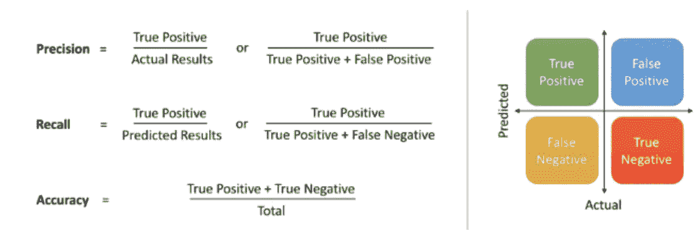

**损失函数**

使用哪个损失函数？

回归:

均方误差损失

*   从数学上讲，如果目标变量的分布是高斯的，那么它就是最大似然推断框架下的首选损失函数。首先要评估的是损失函数，只有在你有充分理由的情况下才会改变。

平均绝对误差损失

*   在一些回归问题中，目标变量的分布可能主要是高斯分布，但可能有异常值，例如远离平均值的大值或低值。
*   在这种情况下，平均绝对误差(MAE)损失是一个合适的损失函数，因为它对异常值更稳健。它被计算为实际值和预测值之间的绝对差值的平均值

二元分类:

交叉熵

*   交叉熵将计算一个分数，该分数总结了预测类别 1 的实际概率分布和预测概率分布之间的平均差异。分数被最小化，并且完美的交叉熵值是 0。

铰链损耗

*   对于二元分类问题，交叉熵的替代方法是铰链损失函数，主要开发用于支持向量机(SVM)模型。
*   它适用于目标值在集合{-1，1}中的二元分类。
*   铰链损失函数鼓励示例具有正确的符号，当实际类值和预测类值之间的符号存在差异时，分配更多的错误。
*   关于铰链损失的性能报告是混合的，有时在二元分类问题上比交叉熵产生更好的性能。

多类分类:

*   多类交叉熵

## 额外小费

我发现这个 Git 链接非常有用，它非常详细，但是快速浏览一下这个 Git 也不错，[https://github . com/khanhnamle 1994/cracking-the-data-science-interview](https://github.com/khanhnamle1994/cracking-the-data-science-interview)

## 临终遗言

我分享了我用过的所有东西和我学到的所有东西。所以，我真的希望这篇文章对你有所帮助，并祝你在准备即将到来的面试时一切顺利！