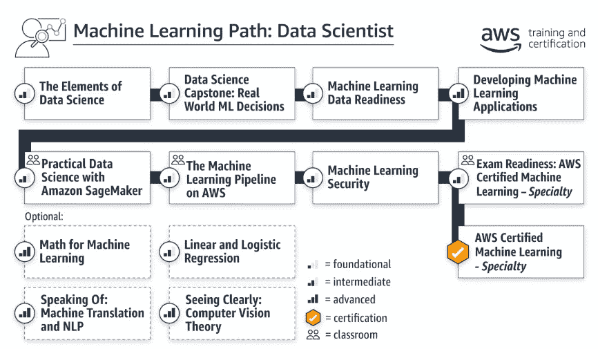

# 我如何准备 AWS 认证机器学习考试(2020 年 7 月)

> 原文：<https://pub.towardsai.net/how-i-prepared-for-the-aws-certified-machine-learning-exam-ca6e2322117e?source=collection_archive---------1----------------------->

## [云计算](https://towardsai.net/p/category/cloud-computing)，[教育](https://towardsai.net/p/category/education)，[机器学习](https://towardsai.net/p/category/machine-learning)

# 介绍

在这篇文章中，我将描述我是如何准备 AWS 认证机器学习-专业考试的。我将分享我使用的材料和我对它们有用性的想法。

注意我是 2020 年 7 月份考的。当时考试指南是 1.2 版 MLS-C01。

# 旅程

## 了解考试预期

我做的第一件事就是阅读考试指南，弄清楚考试内容、考试形式、及格分数等等。这份文件非常有助于找出我知识上的差距。

## 评估考试准备情况

鉴于我目前对各种 AWS 服务的了解，我很想知道我会在考试中表现如何。所以我购买了模拟考试来找出答案。事后看来，这是一个糟糕的决定。

模拟考试将会告诉你你的最终分数和各个领域的分数，但是不会给你错误答案的反馈。此外，您不能在以后重做或检查它。

如果你打算把模拟考试作为一种学习工具，你需要到别处去看看。

## 为考试而学习

我指望 [O'Reilly 的在线学习平台](https://www.oreilly.com/)来帮助我准备考试，因为它有一个准备考试的解决方案，包括一个模拟考试和一个 6 小时的视频课程。想象一下，只需花 6 个小时准备认证！

事实证明，视频课程更像是学习内容的指南。它很好地概述了您应该知道的相关 AWS 服务，并提供了您应该在业余时间学习的资源。光看视频课程不会让你为考试做好充分的准备！

我最喜欢这个解决方案的一点是，模拟考试有反馈，你有无限的尝试机会。

我只希望解决方案的提供商保持它的最新版本。视频课程基于考试指南 1.1 版。虽然我不希望每次考试指南更新时都要重做，但如果有一个注释强调这一点以及它如何影响课程中所涵盖主题的相关性，这将是有用的。

## 使用官方 AWS 资源

我决定通过 [AWS 培训&认证](https://aws.amazon.com/training/?nc2=sb_tc)网站上的“机器学习之路:数据科学家”学习之路。这条路的终点是认证考试，它由 AWS 主持，所以我希望内容与认证要求保持一致。

这条路看起来是这样的:

图 1:机器学习:数据科学家学习之路(2020 年 7 月)

我浏览了所有可以数字化完成的模块。

这条路会给你一个彻底的基础，关于如何在 AWS 上做机器学习，并且安全有效地做。我希望我在开始使用 AWS 时就这样做了。这将节省大量构建和排除不合格解决方案的时间。

在考试准备方面，我发现“考试准备:AWS 认证的机器学习-专业”模块非常有价值。它涵盖了你可以用来回答问题的考试技巧，以及一个模拟考试(带有答案反馈和无限的尝试)。

## 熟悉 AWS 上的服务

我在尝试模拟考试时注意到，我往往难以回答需要了解特定 AWS 服务的问题，例如何时使用 X 服务而不是 y 服务。这是因为在我作为数据科学家的日常工作中，我只使用了 AWS ML 相关服务的很小一部分，以及 AWS 生态系统中更广泛服务的更小一部分。

我发现 AWS 认证&培训库中的[学习库](https://www.aws.training/LearningLibrary)是一个很好的资源，可以快速获得对任何 AWS 服务的基本熟悉。我所要做的就是搜索这项服务，并观看它的介绍视频。

## 将一切联系在一起

我把剩下的学习时间花在了浏览 AWS 机器学习博客上。

我主要关注案例研究帖子，以理解如何混合和匹配各种 AWS 服务来实现给定的结果。这一点值得强调，因为根据考试指南:

> 该考试验证考生使用 AWS 云构建、训练、调整和部署机器学习(ML)模型的能力

案例研究是拓宽您在其他领域的 ML 应用知识的好方法，这不仅对专业成长很重要，对考试也很重要，因为考试不限于任何特定的用例。

# 结论

我将通过提供一个我认为足以帮助人们通过考试的学习计划来结束这篇文章:

*   浏览“机器学习:数据科学家”学习路径中的所有模块
*   浏览“考试准备:AWS 认证机器学习-专业”中提到的服务常见问题
*   停机时间随便浏览 AWS 机器学习博客
*   运行几个笔记本 SageMaker 示例 [repo](https://github.com/awslabs/amazon-sagemaker-examples) 只是为了了解 SageMaker 在实践中是如何工作的。然后，阅读[开发者指南](https://docs.aws.amazon.com/sagemaker/latest/dg/gs.html)，了解它的功能
*   通过以适当的间隔做练习和样题来监控进度，以避免记住答案

我希望这是有用的。如果你有任何问题，请在评论中告诉我。