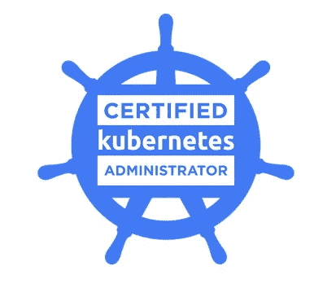
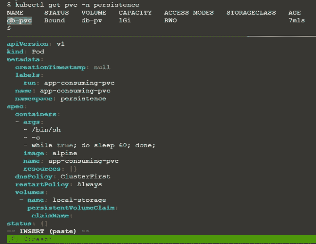
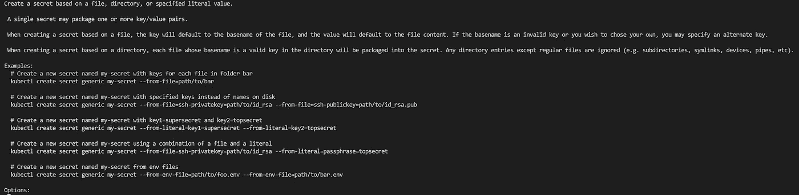
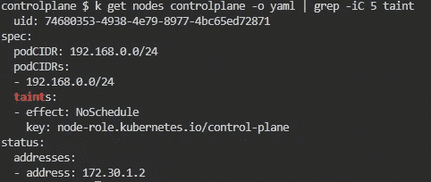
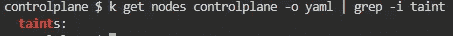
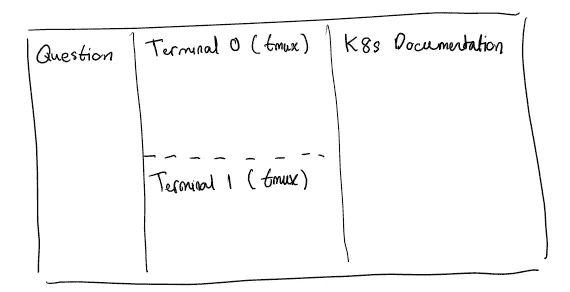
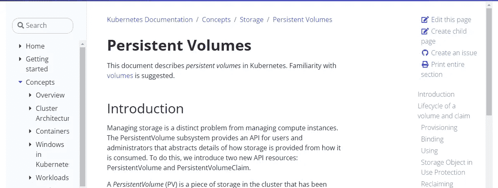
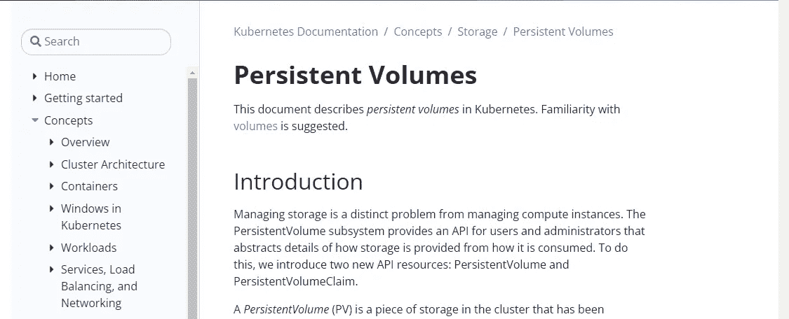

# 我如何准备 Kubernetes 认证管理员(CKA)考试(2022 年 9 月)

> 原文：<https://pub.towardsai.net/how-i-prepared-for-the-certified-kubernetes-administrator-cka-exam-september-2022-24c92a83f9ad?source=collection_archive---------0----------------------->



# 介绍

在这篇文章中，我将分享我是如何准备【Kubernetes 认证管理员 (CKA)考试的。我将涵盖我所使用的材料，并提供一些实用的技巧，我希望我在真正尝试真正的考试之前就知道了。

注意我是 2022 年 9 月份考的。当时的课程表是 1.24 版本，你可以在这里看到[。](https://github.com/cncf/curriculum/blob/830611cfcf557b67c6bc7fc7549a1f8059c06242/old-versions/CKA_Curriculum_v1.24.pdf)

# 使用的材料

本节将涵盖:

*   **学习资料**:这些资料是我用来确保我有在考试背景下使用 k8s 的理论知识
*   额外的练习:虽然学习材料中包含了相当多的练习，但我想要更多的练习，而且我发现这一部分的内容对练习非常有帮助

## 学习材料

奥赖利学习是我学习资料的主要来源，因为我已经订阅了它。

Sander van Vught 教授的[认证 Kubernetes 管理员(CKA)第二版](https://learning.oreilly.com/videos/certified-kubernetes-administrator/9780137438419/)视频课程在涵盖与 Kubernetes 合作的核心方面做得非常出色。这个视频课程是 2021 年 2 月发布的，不确定多久更新一次。

也就是说，讲师会定期组织一个为期两天的 CKA 速成班，他会现场做大量练习，你也有机会提问。因此，我建议先浏览视频课程，为 K8s 的理论打下良好的基础，然后参加他的几个为期 2 天的速成课程，进行一些实时练习。他会给你几分钟时间自己尝试这些问题，所以你肯定会知道你是否准备好尝试真正的东西！

我经常参加的另一堂现场课是 Benjamin Muschko 教授的【Kubernetes 认证管理员(CKA)考试准备课。我认为这是对桑德现场课的一个很好的补充，因为两位导师提供了不同的练习，这些练习同样具有挑战性。

考试前两周，我花了几遍[认证 Kubernetes 管理员(CKA)学习](https://learning.oreilly.com/library/view/certified-kubernetes-administrator/9781098107215/)指南，以确保我很好地掌握了考试课程中的所有重要概念。如果你已经仔细阅读了我前面提到的其他资料，那么浏览一下这本书就足够了。

## 额外练习

我实际上是在报名考试的时候购买了课程捆绑包(LFS258)。虽然我觉得课程内容没什么帮助，但附带的实验练习还是有点帮助的。如果我没有早一点浏览 O'Reilly Learning 的资料，我想我会发现这个课程包更有价值。

我发现最有用的练习是来自[killer corda](https://killercoda.com/killer-shell-cka)的练习，因为答案附有详细的解释和替代方法(如果适用的话)。我备考的时候没有那么多练习(很多都是“即将到来的”)，但是能做的都是极具挑战性的，尤其是那些考验你故障排除能力的。

最后，注册考试还可以让你参加两次由 Killercoda 管理的样题考试。要明确的是，你有两次机会尝试相同的考试。所以，确保你使用它们，并在第二次尝试中获得“高分”。如果你第一次尝试就获得了“高分”……这对你有好处。根据 Killercoda 的说法，模拟考试比真正的考试更难，所以在你第一次尝试后，要花一些时间来复习你的错误。

# 技巧

本节将讨论以下提示:

*   轻松使用 Vim
*   轻松使用 tmux
*   熟悉`kubectl create`中的内置文档
*   学会在上下文中使用`grep`
*   学会使用`find`命令
*   试着在宽屏显示器上做
*   确保早点登录

## 轻松使用 Vim

您将在[远程桌面](https://docs.linuxfoundation.org/tc-docs/certification/lf-handbook2/exam-user-interface#lf_remote_desktop)上进行考试。因此，您可以使用 GUI 附带的文本编辑器来编写您的 YAML 文件。然而，我认为从终端做任何事情都更有效率，因为你可以通过切换窗口来节省宝贵的时间。

因此，您应该能够轻松使用`vi`。这里有一张[备忘单](http://vimsheet.com/)。这些是我发现自己反复使用的命令:

*   `h`、`j`、`k`、`l`分别向左、上、下、右移动光标
*   `o`在当前行下方添加一个空行
*   `dd`删除当前行
*   `/pattern`搜索`pattern`和`n`以到达下一个事件
*   `:set nu`显示行号

## 轻松使用 tmux

保持一切从终端开始的主题，你应该熟悉一下`tmux`。当您在执行当前任务时需要引用之前创建的内容时，这非常有用。

例如，假设您需要创建一个 pod，该 pod 应该挂载您在几个步骤之前创建的 PVC。您可以打开另一个终端来查找 PVC 的名称(以防您忘记了名称或者只是想简单地复制粘贴名称以避免愚蠢的错误)。

或者，您可以水平拆分现有终端，在上半部分显示 PVC 名称，在下半部分继续您当前的任务:



图 1:为什么 tmux 对考试有用

如果您想使用`kubectl`查找集群的详细信息，但是您当前在集群的一个工作节点中，那么`tmux`可以派上用场。

这是`tmux`的[备忘单](http://tmuxcheatsheet.com/)。这些是我在使用`tmux`时经常使用的命令:

*   `Ctrl + b + "`水平分割屏幕
*   `Ctrl + b q`在每个屏幕上显示数字，然后`0...9`将光标实际移动到该屏幕
*   `Ctrl + b + [`激活滚动模式，`q`退出滚动模式

## 熟悉 kubectl create 中的内置文档

用`kubectl create`可以做很多事情，自带的文档往往足够解决考试中的一个任务。

例如，假设您需要创建一个通用的秘密。

你可以打开网页浏览器，在 kubernetes.io/docs 网站上搜索一些如何做的提示。

更有效的方法是简单地运行`kubectl create secret generic -h | less`，它给出:



图 kubectl 中的内置帮助如何在考试中帮助你

请注意内置帮助是如何包含一些常见场景的示例的！这些应该足够给你在考试中指明正确的方向了。此外，请注意，我们通过管道将输出发送到`less`，因为如果您不这样做，示例部分将滚动通过您的屏幕，您必须向上滚动才能找到它，这在考试过程中浪费了时间。

当然，并不是所有的资源都可以使用`kubectl create`来创建。例如，您不能使用它来创建永久卷。在这些情况下，您需要熟悉 K8s 网站上的文档。

## 学会在上下文中使用 grep

假设您需要找出哪些污点已经应用于控制平面节点。有几种方法可以做到这一点，但我认为这是最快的方法:

```
k get nodes controlplane -o yaml | grep -iC 5 taint
```

这给出了:



图 3:在上下文中使用 grep 的好处

我们基本上得到控制平面的 yaml 定义，然后使用`grep`只返回`taints`部分。我们通过`-C 5`返回包含`taint`的行前后的 5 行。否则，我们会得到这个:



图 4:在上下文中不使用 grep 的效果

这一点帮助都没有。

查找资源的标签是知道如何使用上下文的另一个例子。

注意，我们还将参数`i`传递给了`grep`。这使得搜索不区分大小写，以防我们在考试压力下忘记区分大小写。

## 学会使用`find`命令

假设您需要检查一个节点的 kubelet 配置，由于考试的压力，您不知道在哪里可以找到这个文件。不全是损失！

你可以试试:

```
find / -name *.yaml | less
```

并浏览结果，假设您记得配置是一个 YAML 文件。

此外，如果您也碰巧记得它在一个名为`kubelet`的文件夹中，那么您可以这样做:

```
find / -wholename **/kubelet/*.yaml
```

这里的要点是你应该考虑学习如何有效地使用`find`它，以防你忘记了标准 k8s 配置文件和日志通常保存在哪里。

## 试着在宽屏显示器上做

我喜欢在我的终端旁边并排打开显示 k8s 文档的浏览器窗口，如下所示:



图 5:我首选的考试显示布局

浏览器窗口需要足够宽，这样包含文档目录的侧边栏就会出现在右侧侧边栏上，便于您快速跳转到相关部分。例如，这是带有侧栏的持久性卷的文档:



图 6:我显示文档的理想方式

因为浏览器的窗口太窄，这是一个没有侧边栏的文档:



图 7:我不喜欢以这种方式浏览文档

根据您的屏幕大小和远程桌面的分辨率(一些候选人过去报告过这方面的问题)，可能很难实现这一点，因为您需要考虑问题窗格的宽度。您希望问题窗格足够宽，以便无需过度滚动即可阅读。此外，您将从 web 浏览器内部进行考试，因此您将从一开始就失去一些屏幕空间。

## 确保尽早登录

最多允许在考试开始前 30 分钟登录考试。一定要做到这一点！

为什么？

[值机流程](https://docs.linuxfoundation.org/tc-docs/certification/lf-handbook2/taking-the-exam#candidate-self-check-in-process)包括:

> 安全浏览器将检查未经授权的硬件(例如双显示器)或软件应用程序，并提示候选人采取必要的措施。

问题是，候选人收到的“提示”并不总是有帮助的。你可能需要一段时间来找出正确的方法来终止你的操作系统的一些服务，分配权限等等。，使其通过自动检查。

# 结论

这篇文章描述了我在考试中使用的材料和我认为每个考生在参加考试之前应该知道的技巧。

我希望这是有用的。如果你有任何问题，请在评论中告诉我。