# 我使用 VS 代码分析 Python 代码的工作流程

> 原文：<https://pub.towardsai.net/how-i-profile-python-code-using-vs-code-714d0ba71b6d?source=collection_archive---------0----------------------->

## [软件工程](https://towardsai.net/p/category/software-engineering)

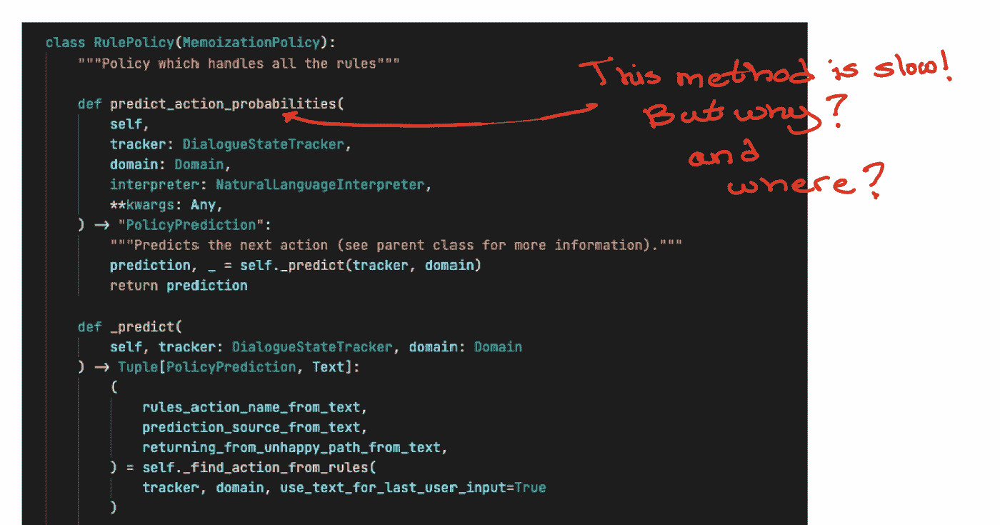

# **简介**

本文描述了我如何使用 VS 代码来分析 Python 代码，以识别 CPU 或内存问题。

为了使事情更加具体和实用，我将通过快速找到真实项目中高 CPU 利用率的来源来演示工作流是如何工作的:2.8.22 版本中 rasa 开源项目中的 [RulePolicy](https://github.com/RasaHQ/rasa/blob/a215ae5ef54bed0c62e25331866f97f6f2845df7/rasa/core/policies/rule_policy.py#L92) 类。

复制本文中描述的工作流的代码是这里的[和](https://github.com/hsm207/python_profile)。

# 问题陈述

假设您收到一个错误报告，声称使用 rasa 构建的聊天机器人具有不合理的高 CPU 利用率，并且报告作者声称这是 RulePolicy 类导致的。

您试图使用错误报告中共享的信息来重现该行为，实际上，您也观察到了高 CPU 利用率。

下一步是找出这是如何发生的。你如何着手做这件事？

最简单的办法就是问问你的资深同事的想法。不幸的是，编写该类的作者已经不在了，其他人只能提供通用或模糊的想法。

在这一点上，你几乎是靠你自己。您必须自己找出高 CPU 利用率的来源。你将如何着手做这件事？

你可以从阅读代码开始…

让我们看看这种方法能走多远。

错误报告提到问题只发生在推理时，并且您知道`[predict_action_probabilities](https://github.com/RasaHQ/rasa/blob/a215ae5ef54bed0c62e25331866f97f6f2845df7/rasa/core/policies/rule_policy.py#L1070)`方法是推理时的主要入口点。所以，这看起来是一个开始阅读的好地方。

这个方法看起来是这样的:

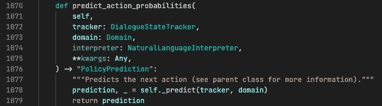

图 1:预测行动概率方法

结果这个方法非常简单:它只是调用另一个方法，`[_predict](https://github.com/RasaHQ/rasa/blob/a215ae5ef54bed0c62e25331866f97f6f2845df7/rasa/core/policies/rule_policy.py#L1081)`。让我们看看这个方法是如何工作的:

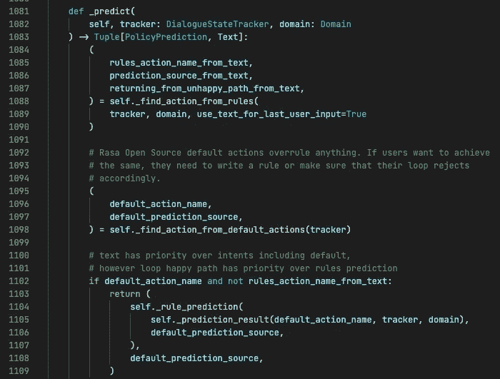

图 2:predict 方法的一个片段

`_predict`有一个非常长的实现，它有许多分支，也调用其他函数。

即使您决定坚持到底，一行一行地跟踪整个实现，也不能保证您真的理解每一行在做什么或应该做什么，更不用说导致高 CPU 利用率的实际行了。

这就是剖析器快速锁定违规行的方便之处。

# 解决办法

## 概观

以下是我分析 python 代码(或任何相关语言)的主要步骤:

1.  建立集装箱化的环境
2.  编写一个调用我们想要分析的函数的最小脚本
3.  重现问题
4.  设置调试基础结构
5.  剖析脚本
6.  可视化并分析结果
7.  尝试各种修复[可选]

## 步骤 1:建立一个容器化的环境

我们应该在集装箱化的环境中进行分析，这样我们就可以轻松地与同事分享我们的结果。

使用 VS 代码很容易做到这一点，因为它允许开发人员无缝地创建一个容器、登录到该容器并编码，就像他们在本地机器上一样。有关详细信息，请参考 VS [代码在容器内开发](https://code.visualstudio.com/docs/remote/containers)指南。

在本例中，我们将基于`rasa/rasa:2.8.22-full`映像创建一个容器，因为这是报告高 CPU 利用率问题的版本。

## **第二步:编写一个最小的脚本来调用我们想要分析的函数**

“最小”这个词很重要。换句话说，我们希望直接或者尽可能直接地调用我们认为有问题的函数。

为什么？

假设您决定从头构建一个完整的机器人，并通过与它对话来测试 CPU 负载，从而重现这种行为。这将会降低您以后的分析速度，因为您所做的每一项更改都需要启动 bot 并与之对话，以评估您的更改的影响。此外，bot 中有许多移动部件，因此即使您在与它交谈时看到高 CPU 负载，也很难确定它发生在 RulePolicy 的`[predict_action_probabilities](https://github.com/RasaHQ/rasa/blob/a215ae5ef54bed0c62e25331866f97f6f2845df7/rasa/core/policies/rule_policy.py#L1070)`方法内部的某个地方。

那么，我们如何找出调用该方法的最快方法呢？

一个好的起点是阅读 RulePolicy 类的测试用例。当然，这是假设您在一个一直努力遵循软件工程最佳实践的团队中工作。如果不是这样，那么你有更大的问题要解决:)

通过阅读[test _ potential _ conflict _ resolved _ by _ conversation _ start _ when _ slot _ initial _ value](https://github.com/RasaHQ/rasa/blob/a215ae5ef54bed0c62e25331866f97f6f2845df7/tests/core/policies/test_rule_policy.py#L154)函数，我们了解到这是调用 RulePolicy 的`[predict_action_probabilities](https://github.com/RasaHQ/rasa/blob/a215ae5ef54bed0c62e25331866f97f6f2845df7/rasa/core/policies/rule_policy.py#L1070)`方法的最直接方式:

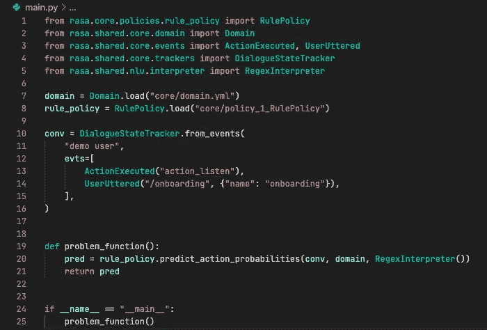

图 3:测试 RulePolicy 的`[predict_action_probabilities](https://github.com/RasaHQ/rasa/blob/a215ae5ef54bed0c62e25331866f97f6f2845df7/rasa/core/policies/rule_policy.py#L1070)`方法的最小脚本

注意，我们已经将对`predict_action_probabilities`方法的调用封装在另一个名为`problem_function`的函数中。这看起来是多余的，但实际上非常重要，因为我们想防止其他函数调用，例如`DialogueStateTracker.from_events`影响稍后`rule_policy.predict_action_probabilities`的计时。

此外，因为我们将重复运行这个脚本，所以有一个快捷方式来快速完成它会很有帮助。我们可以为此使用 makefile

图 4:运行最小脚本的 makefile 目标

## 步骤 3:重现问题

现在我们准备测试 bug 报告者的声明，即 RulePolicy 是运行时高 CPU 负载的原因！

为此，我们可以重复调用我们在上一步中编写的脚本，并使用类似`htop`的工具观察脚本运行时的 CPU 负载:

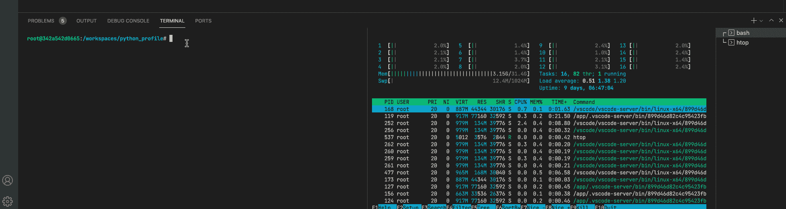

图 5:重复调用脚本并观察 cpu 负载

在图 5 中，我们调用最小脚本 3 次，并注意到在一个 CPU 内核中总是有一个峰值。但这可能只是由于 TensorFlow 将我们的模型加载到内存中。

为了确保不是这种情况，我们可以在`problem_function`之前插入一个调用 sleep 来休眠 5 秒钟，并在该间隔之后观察 CPU 负载。为了简洁起见，我将在本文中省略这一步。

## 步骤 4:设置调试基础设施

既然我们已经确认了`rule_policy.predict_action_probabilities`的实现有问题或效率低下，我们应该配置脚本运行时附带一个调试器，这样我们就可以检查脚本在整个执行过程中的状态。

这一步非常容易设置 VS 代码，因为我们已经将问题隔离到一个 python 脚本中。我们只需要创建一个[启动配置](https://code.visualstudio.com/docs/python/debugging)来调试当前文件:

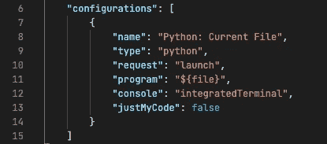

图 6:调试 main.py 的 launch.json 配置

注意，我们已经将`justMyCode`设置为`false`(第 13 行)。如果我们将这个设置为`true`，那么我们在`rasa`库中插入的断点都不会有任何效果。

## 步骤 5:剖析脚本

我们可以使用 [cProfile](https://docs.python.org/3.8/library/profile.html#module-cProfile) 模块为`main.py`中的函数调用计时。它输出一堆在终端上阅读起来很麻烦的统计数据，所以我们应该使用以下命令将它保存到一个文件中:

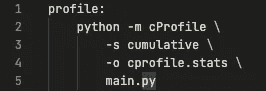

图 7:概要文件 main.py 的 makefile 目标

## 第六步:想象并分析结果

我们可以使用 [pstats](https://docs.python.org/3.8/library/profile.html#module-pstats) 模块来操作我们在上一步中创建的`cprofile.stats`的内容。

然而，通过使用 [snakeviz](https://jiffyclub.github.io/snakeviz/) 模块可视化结果来开始分析更容易:

图 8:使用 snakeviz 可视化 cProfile 的结果

图 8 显示了 snake via 在容器内的端口 8080 **上启动了一个 web 服务器。但是，VS 代码以某种方式检测到这一点，并将自动转发该端口，因此您应该会看到以下提示:**

图 9: VS 代码神奇地完成了端口转发…

点击“在浏览器中打开”按钮，导航到从`problem_function`发出的函数调用，我们看到:

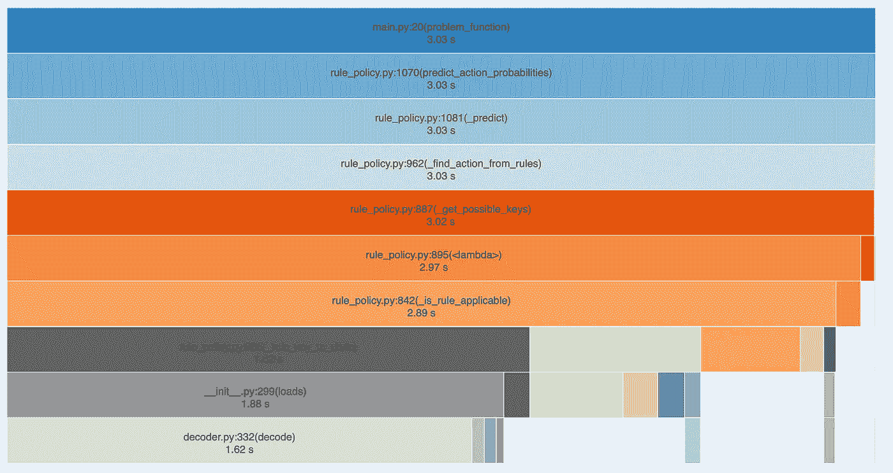

图 10:来自 problem_function 的所有函数调用的计时

运行这个函数需要 3.03 秒。这个函数调用`_predict`，T8 又调用`find_action_from_rules`，T9 又调用`_get_possible_keys`。

似乎在`_get_possible_keys`内部有一个匿名函数，这个函数占用了大部分执行时间(总共 3.02 秒中的 2.97 秒)。方便的是，图 10 中的图表告诉我们，我们可以在 rule_policy.py 文件的第 895 行找到这个函数。让我们看看这个函数的作用:

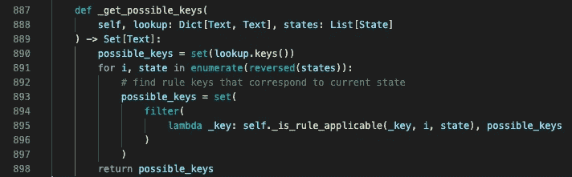

图 11:花费很长时间完成的匿名函数

匿名函数慢是因为`possible_keys`真的很大还是因为谓词函数，`self._is_rule_applicable`是 CPU 密集型函数？

我们可以通过查看 python 遍历一个集合并执行一些简单操作需要多长时间来检查前一种情况。例如:

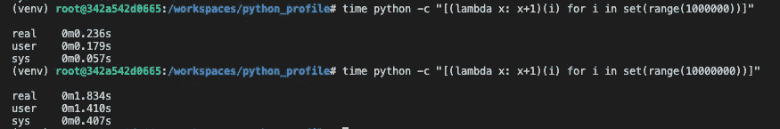

图 12:快速检查一个集合的循环开销是否很大

图 12 显示，对一组 100 万个元素进行函数调用需要不到 1 秒的时间。对一组 1000 万个元素做同样的事情几乎需要 2 秒钟。

`possible_keys`有多大？使用[日志点](https://code.visualstudio.com/blogs/2018/07/12/introducing-logpoints-and-auto-attach)很容易检查:

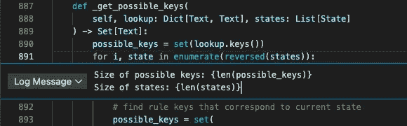

图 13:添加一个日志点来检查 states 和 possible_keys 变量的大小

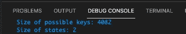

图 13:States 和 possible_keys 变量的大小

我们看到变量`possible_keys`只有 4082 个元素，变量`states`只有 2 个元素。

因此，我们得出结论，高 CPU 负载的主要原因更多地与`self._is_rule_applicable`的实现有关，而不是在`states`和`possible_keys`数据结构上循环。

谜团解开了！

## 尝试各种修复方法[可选]

此时，我们可以提交一份新的错误报告，让开发人员知道他们需要重新考虑他们的`self._is_rule_applicable`或者甚至`_get_possible_keys`的实现。

我们也可以多逛逛，看看我们自己是否能想出一个快速的解决办法。

回头看图 10，我们看到`_is_rule_applicable`大部分时间花在了`_rule_key_to_state`函数上。这个函数看起来是这样的:

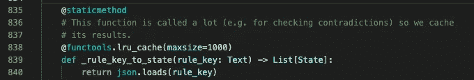

图 14: `_rule_key_to_state definition`

这个函数的目的是将一段文本转换成 JSON 对象/python 字典。值得注意的是，这个函数有一个`lru_cache`装饰器，并且被设置为只缓存 1000 个元素。

如果我们把`maxsize`设为 5000 会怎么样？这能解决高 CPU 利用率的问题吗？

在我们这样做之前，让我们返回 snakeviz 来看看当`maxsize=1000`发生以下情况时`json.loads`函数调用的统计数据:

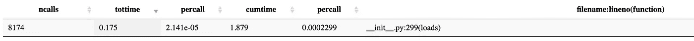

图 maxsize = 1000 时的 json.loads()统计数据

我们还可以使用 [memory_profiler](https://pypi.org/project/memory-profiler/#description) 模块来监控内存使用情况:

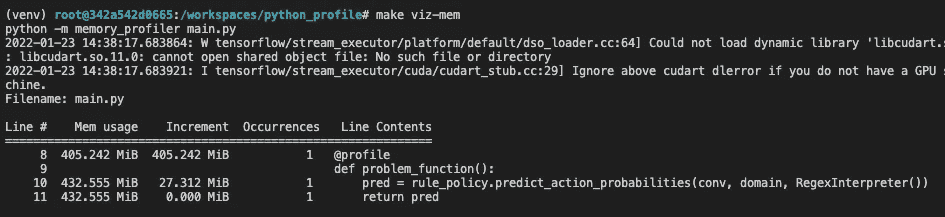

图 maxsize = 1000 时的内存使用情况

图 16 显示该函数在`maxsize=1000`时消耗了 27.312 MiB 的内存。请注意，在编写关于当对象被销毁时如何报告内存使用情况的文章时，有一个公开的 bug。详见本[期](https://github.com/pythonprofilers/memory_profiler/issues/236#issuecomment-503996763)。

下面是当我们将`maxsize`设置为 5000 时发生的情况:

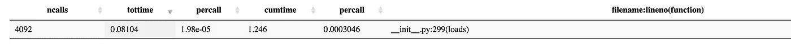

图 maxsize = 5000 时的 json.loads()统计数据

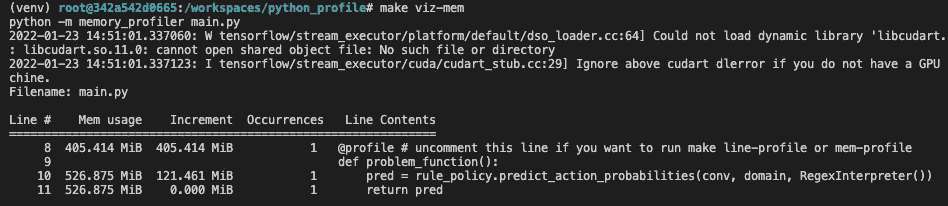

图 maxsize = 5000 时的内存使用情况

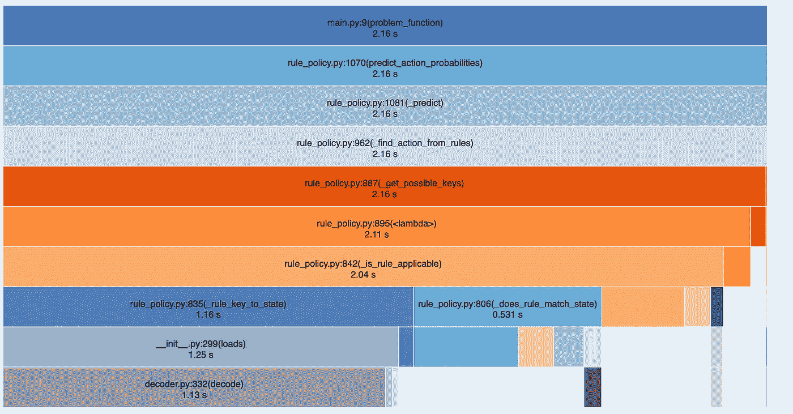

图 19:当 maxsize=5000 时，来自 problem_function 的所有函数调用的计时

将`maxsize`从 1000 增加到 5000 的影响是:

*   对`json.loads()`的呼叫次数减少 50%
*   内存使用量增加了近 5 倍
*   运行时间减少 28%

运行时间的减少可能看起来不明显，但请记住，这是基于对`problem_function()`的 1 次呼叫的概况。多次修改`main.py`来调用`problem_function()`会节省更多的时间。

更重要的是，高 CPU 负载现在不那么明显了(本文省略了结果)。

因此，设置`maxisze=5000`可能是一个可接受的临时快速修复。

# 结论

本文解释了我使用 VS 代码分析 python 代码的工作流程。我们已经了解了如何使用 docker、make、cprofile、snakeviz 等工具来快速识别代码中的性能瓶颈并评估修复的影响。

我希望你已经发现这是有用的。

关于剖析 python 代码的更多技巧和诀窍，我强烈推荐[1]。

# 参考

[1] [高性能 Python，第二版](https://github.com/mynameisfiber/high_performance_python_2e)。米莎·戈瑞克和伊恩·奥兹瓦尔德。2020.