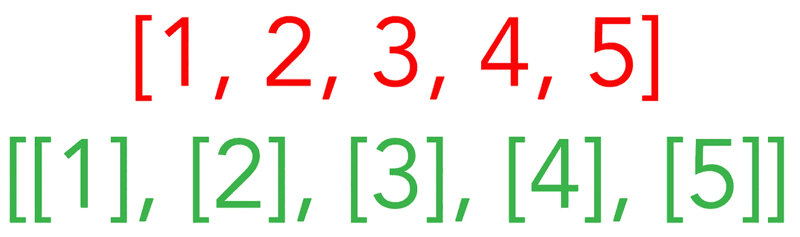
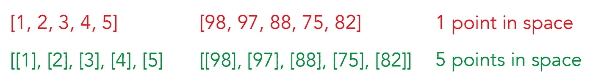
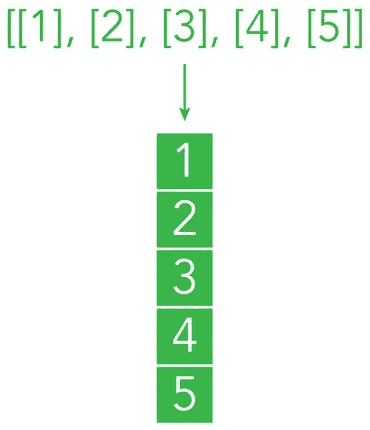
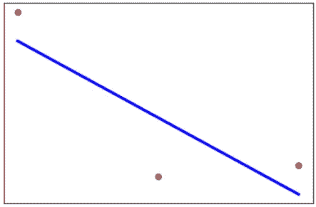

# 我如何用一行代码搞砸了一个 HackerRank 测试

> 原文：<https://pub.towardsai.net/how-i-screwed-up-a-hackerrank-test-with-a-line-of-code-63015d0708ee?source=collection_archive---------1----------------------->

## [机器学习](https://towardsai.net/p/category/machine-learning)

## 线性回归:细节决定成败。完整的代码[可在我的回购。](https://github.com/arditoibryan/Projects/tree/master/20210227_timeseries_regression)

[**点击这里了解我，我的项目，我的最新文章。**](http://www.michelangiolo.best/)

一周前，我被我申请的一家公司的编码测试录取后，我非常兴奋。我花了最后一周的时间准备硬核编码和研究基本算法。测试日期定在昨天，当时我为一个 ML 工程师职位使用 HackerRank 进行了第一次编码测试。

我的总体体验是愉快的，至少在开始时是这样，因为我能够在前 20 分钟内解决 3 个问题中的 2 个。我着火了！老实说，我认为我已经把它握在手心里了，但是，我太快地宣称胜利了。剧透一下，这一行代码(红色的而不是绿色的)让我付出了测试的代价，我想也是下一轮的代价。



新手错误

在本文中，我将向您详细解释为什么使用错误的代码行，我无法使用最基本的 ML 模型之一来解决一个简单的 HackerRank 测试。

# 我必须解决的问题

虽然，按照要求，我不会透露 HackerRank 测试中问题的细节，但这是问题的本质:我得到了一个随机的时间序列，我必须对它进行预测。看起来很简单，我想，它只需要一个回归模型，除了你必须处理日期的部分，这可能需要额外的几分钟。


HackerRank 徽标

我的计划是将日期转换成从 0 开始的序数(例如。2005，第一个日期，变成 0，2006 -> 1，2007 -> 2，2008 -> 3，2009 -> 4…等等)，然后创建回归模型。到目前为止还不错，除了当我试图应用以日期为特征、以数值为标签的回归模型时:什么都不工作。

# 我的错误

在分享代码之前，这些是我在测试时的错误:我花了最后一天收集笔记并改进我的代码以防止它们再次发生。

1.  对日期时间库有点措手不及
2.  我用于调试的模拟函数太复杂了，无法发现我在代码中犯的错误
3.  当我发生错误时，我很难识别 sklearn 的线性代数调试输出:我没有及时发现我的错误，尽管我正确地概念化了问题的解决方案。

# 如何不再犯同样的错误

我试图对维数错误的 NumPy)应用回归算法，而不是嵌套列表(5，1)。

基于线性代数犯下的这个小小的错误不允许我创建一个有效的算法:应用于原始特征的线性回归模型(在我的辩护中，我已经有 6 个月没有使用它了)输出相同的精确数字！

例如，如果我在这 5 个样本上创建一个回归模型，因为这些点不遵循线性路径，那么如果应用于特征(1，2，3，4，5)，我会期望回归线显示不同的结果。相反，对我得到的特征(98，97，88，75，82)应用线性回归，这怎么可能呢？



数字形状的差异

原因是它没有将它应用于每个单独的特性，而是考虑了一个整体。

另外，我花了几个小时深入研究 DateTime 库，这样以后我就可以用预先准备好的解决方案查看我的笔记，而不是搜索文档。

## 为什么我会犯菜鸟的错误？

也许是压力，但希望这不是唯一的原因。为了编写 ML 代码，我一直用熊猫作为解决方案，令人作呕。甚至我在过去的一个月中编写的更简单的 ML 模型也是熊猫数据框架的形式。我没有考虑到的是，pandas 数据帧已经是一个嵌套的 NumPy 数组，因为 HackerRank 给了我一个简单的列表作为输入，所以我必须在一个嵌套的 NumPy 数组中进行适当的转换。



数字到数据帧

# 右代码

测试结束后，我立即决定尝试编写正确的代码并将其添加到我的笔记中。我在 5 分钟内就找出了错误所在(是的，有点太晚了)。在测试过程中，我没有像下面这样使用一个非常简单的例子，而是试图纠正我已经有的代码，工作在 96 分而不是 5 分。除了 HackerRank 的调试困难之外，这种过度复杂的程度不允许我从一开始就清楚地看到事情，并且没有意识到我输入的是形状为(96，)而不是(96，1)的 96 个数字。

通过下面的简单代码，我执行了一个非常简单的线性回归，从一个 NumPy 数组开始，而不是从一个 pandas df 开始(df 在这里是作为参考，我在后面一行把它转换成一个数组)。

```
import pandas as pd
import matplotlib.pyplot as plt
import numpy as np
from sklearn import datasets, linear_model
from sklearn.metrics import mean_squared_error, r2_score#linear regression on timeseries
df = pd.DataFrame([[1, 2, 3], [100, 25, 30]]).T
df#np conversion
X = np.array(df[0])
y = np.array(df[1])#reshaping
X = X.reshape(3, 1)
y = y.reshape(3, 1)reg = LinearRegression().fit(X, y)
reg.predict([[4]])
```

## 绘制模型

因为测试已经结束，我没有时间限制，所以我额外花了几分钟寻找一种算法来可视化模型:

```
#red dots as scatter
plt.scatter(X, y,  color='red')
#we are graphing the normal dataset#blue line as regression
plt.plot(X, reg.predict(X), color='blue', linewidth=3)
#we are graphing [[1], [2], [3]] and the predictions for 1, 2, 3plt.xticks(())
plt.yticks(())
plt.show()
```



简单的模拟函数来试验正确的代码设置

如果在编写代码期间，我用最简单的形式(只有 3 个点)编写算法，我可能会及时发现我的错误。然而，即使这不是我的常规做法，我也把它过度复杂化了。

# 结论

在这一点上没什么好说的了，继续学习，继续进步，让我们破解下一个测试吧！