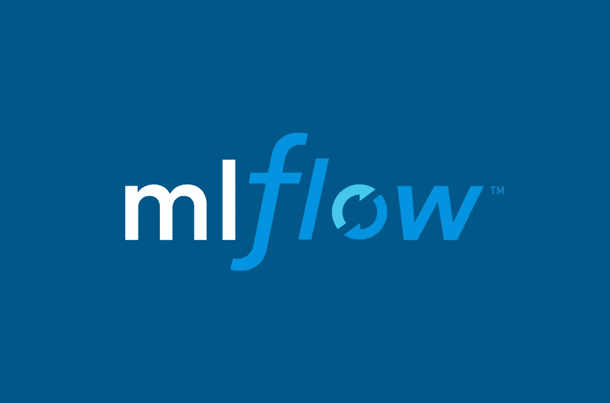
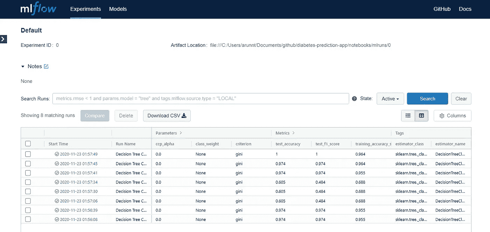

# 我是如何像专家一样开始跟踪我的 ML 实验的

> 原文：<https://pub.towardsai.net/how-i-started-tracking-my-ml-experiments-like-a-pro-dba184beb34?source=collection_archive---------1----------------------->

## [数据科学](https://towardsai.net/p/category/data-science)，[机器学习](https://towardsai.net/p/category/machine-learning)，[编程](https://towardsai.net/p/category/programming)

## 如果我能一直赢回来，我就浪费在 Excel 表格上了。


如果我能一直赢回来，我就浪费了。(图片由 [Icons8 团队](https://unsplash.com/@icons8?utm_source=medium&utm_medium=referral)在 [Unsplash](https://unsplash.com?utm_source=medium&utm_medium=referral) 上拍摄)

我要对你完全坦白。我花在管理机器学习实验和跟踪它们上的时间比我花在开发机器学习模型上的时间多得多。在早期，我会使用 Excel 表格，概述我正在试验的所有参数和指标，用颜色编码它们，手动输入结果，等等。

你明白了。

我知道我需要彻底修复我的工作流程。

在这篇文章中，首先，我将介绍为什么跟踪实验是重要的。然后，我将概述 MLFlow 如何使我们的生活变得简单，最后，我将通过一个日常示例和代码向您展示如何自己集成这一切。当你完成这些后，**我保证你能像专家一样集成 MLflow 并修复你的工作流程！**

# 为什么要跟踪实验

无论你有多有经验，你都不可能一步到位地开发出性能最好的模型。最佳执行模型的关键是一个迭代的过程，为手头的业务问题优化所选择的度量。在模型开发期间进行试验只是数据科学生命周期中另一个不可避免的步骤。

就研究和产品开发而言，实验是数据科学生命周期中最关键的一步。在这种需要大量研究的问题中，仅仅找到最佳解决方案是不够的。您还需要概述您为获得最佳性能解决方案所采取的流程，并确保该解决方案是可重复的。

**底线是，实验阶段是不可避免的。**我们别无选择，只能建立一个高效的工作流程来创建实验、跟踪实验、评估实验结果、存储模型并最终重现实验结果。

# ml 流向救援

当我与经验比我丰富得多的专家交谈时，他们建议我用很少的工具试一试。我的一些基本要求是，

*   对现有代码的最小更改。
*   开源且可免费获得。
*   独立于平台——所以我可以选择最适合手头问题的平台。

MLflow 满足了所有这些要求*，实际上还提供了更多的*。我迫不及待地想和大家分享更多关于 MLflow 的内容！



机器学习生命周期的开源平台。(图片由 [MLflow](https://mlflow.org/) 提供)

简而言之，MLflow 是一个管理 ML 生命周期的开源平台，包括实验、可复制性、部署和中央模型注册。是的，你没看错，不仅仅是实验跟踪，而是完整的机器学习生命周期。它们提供的一些功能是，

*   MLflow 跟踪—跟踪实验以记录和比较参数和结果。
*   MLflow 项目—将 ML 代码打包成可重用、可复制的形式，以便与其他数据科学家共享或转移到生产中。
*   MLFlow 模型——从各种 ML 库中管理和部署模型到各种模型服务和推理平台。
*   MLFlow Model Registry —中央模型存储库，用于协作管理 MLFlow 模型的整个生命周期，包括模型版本控制、阶段转换和注释。

虽然 MLflow 拥有所有这些高级功能，但在本文中，我们将重点关注 MLflow 跟踪以及它如何帮助我们以一种有组织的方式跟踪我们的 ML 实验。

我们开始吧，好吗？

首先，启动您的终端并运行命令`pip install mlflow`来安装包。现在我们已经设置好了环境，让我们把重点放在现有的典型工作流上。跟我在一起，在你意识到之前，我们已经集成了 MLflow。

# 了解典型的工作流程


在这个例子中，我们将使用世界著名的虹膜数据集。(由[凯文·卡斯特尔](https://unsplash.com/@kevinkstel?utm_source=medium&utm_medium=referral)在 [Unsplash](https://unsplash.com?utm_source=medium&utm_medium=referral) 上拍摄)

有什么比用一个众所周知的例子进行演练更好的方式来理解典型的工作流呢！这里我们将使用著名的[鸢尾花数据集](https://archive.ics.uci.edu/ml/datasets/iris)并构建一个分类算法来预测鸢尾植物的类别类型。嗯，选择这个数据集没有特别的原因，除了它在 [scikit-learn](https://scikit-learn.org/stable/install.html) 库中很容易获得，并且您可以立即尝试它。不用说，不管数据集或问题的性质如何，过程都是一样的。

让我们分解分类问题的简单代码。

*   **第 1–4 行，**我们导入所有需要的库。
*   **第 6–12 行**我们定义了一个函数加载 iris 数据，进行训练测试拆分，并返回。
*   **第 14–24 行，**我们定义一个函数，该函数将数据和模型参数作为输入，构建一个决策树分类器，对测试数据进行预测，评估准确性和 F1 分数。这个函数最终返回被评估的模型和指标。
*   **第 26–28 行**为模型设置参数，通过调用`load_iris_data()`函数加载数据，并将数据和参数传递给`train_predict_evaluate_dtree()`函数。

如果我必须运行多个实验来找到性能最佳的模型，我别无选择，只能让函数循环运行，然后在 excel 表中手动输入这些参数和指标。这是我在整个项目时间表中记录所有实验的唯一方法。现在，我们已经完成了现有的模型开发工作流程，让我们了解如何将 MLflow 集成到该工作流程中，并像专家一样更好地修复它， ***！***

# 立即集成 MLflow

我承诺在整篇文章中做最小的改动。在我们的例子中，这只是 6 行额外的代码。当我发现这一点时，我又惊又喜，现在我再也无法打开 Excel 表格了。

让我们深入研究代码。

有什么变化？

*   第 5 行:我们导入 mlflow 库
*   第 6 行:在这里，我们也导入了相关的`mlflow.sklearn`模块。这完全取决于模型构建在哪个包之上。一些备选方案有`mlflow.tensorflow`、`mlflow.pytorch`、`mlflow.xgboost`等等。可用模块的完整列表可以在[官方 MLflow Python API 文档中找到。](https://www.mlflow.org/docs/latest/python_api/index.html)
*   **第 7 行:**自动记录是最近推出的一项实验性功能，它使 MLflow 集成变得更加便捷。该功能自动记录所有的参数、指标，并将模型工件保存在一个地方。这使我们能够重现运行或检索已经训练好的模型文件以备后用。这是一个简单易用的特性，绝对值得看一看文档。
*   **第 18 行:** MLflow 跟踪是围绕运行的概念组织的，运行是一些数据科学代码的执行。假设您想要找到输入分类器模型的最佳参数。您可以使用不同的参数创建多次运行，以找出哪一次运行的结果最好。所以这一行实际上是使用`mlflow.start_run()`函数开始一次运行，这样您就可以将您记录的所有内容与那次特定的运行关联起来。
*   **第 28–29 行:** `autolog()`当前记录与培训相关的指标，例如 train_accuracy only。然而，在我们的示例中，我们想要比较其他测试指标，比如测试准确性和测试 F1 分数。因此，我们利用了`log_metric()`函数，该函数能够记录任何定制的指标。

如何进行多次运行或实验完全取决于您。您可以选择在需要时多次运行代码，或者一次执行多次。我通常用我想要试验的参数创建一个小循环，然后一次性运行它。它看起来像这样。

```
for params in different_combinations_of_parameters:
    model,metrics = train_predict_evaluate_dtree(input_data, params)
```

我们准备好了！

# 我想我会得到一个仪表板来跟踪我的 ML 实验？

当然了。

到目前为止，您记录的所有内容都可以通过 MLflow UI 服务器进行访问。只需在你的终端上运行`mlflow ui`(从正确的目录)并在你的浏览器上打开`[http://localhost:5000/](http://localhost:5000/)`。瞧，你成功了！



MLFlow UI 服务器，您可以在其中找到关于您跑步的所有信息。(作者截图)

您可以在几次运行之间进行比较，直观地分析参数的变化如何改变指标，甚至可以下载 CSV 格式的数据，以备您需要以报告形式提交时使用。模型文件以及 YAML 环境被保存为工件，供您以后使用。慢慢浏览仪表板。它非常简单并且非常有用。

您可能需要花一点时间来浏览 [MLflow 概念](https://www.mlflow.org/docs/latest/tracking.html#concepts)以了解更多关于实验、运行、工件、自动记录和其他特性的信息，但是最终，您会掌握它的窍门。当我第一次将它集成到我的工作流程中时，我大概花了 5 天时间(主要是研究和探索这些特性)，但是现在我在几分钟内就完成了。 我觉得没有比这更简单的了。这无疑让我遵循了最佳实践，并为我节省了大量时间。

# 最后的想法

在本文中，我们了解了跟踪实验的重要性，以及如何将 MLflow 轻松集成到我们的工作流程中。我们也像专家一样用一个容易理解的例题做了这件事。然而，正如我们所知，MLflow 不仅仅是实验跟踪。希望我很快会写更多关于高级特性的内容。

我希望你喜欢读这篇文章，就像我喜欢为你写这篇文章一样。没有什么比送些从长远来看对你有用的东西更让我开心的了。[我很乐意与您联系](https://www.linkedin.com/in/arunn-thevapalan/)并听取您的反馈。如果你喜欢这篇文章，很可能你也会喜欢我的其他文章。快乐阅读！

[](https://medium.com/towards-artificial-intelligence/7-things-i-learned-during-my-2-years-in-an-ai-startup-4a638e2ceacd) [## 我在人工智能创业公司的 2 年里学到的 7 件事

### 兴奋、文化、责任，以及介于两者之间的一切

towardsai.net](https://medium.com/towards-artificial-intelligence/7-things-i-learned-during-my-2-years-in-an-ai-startup-4a638e2ceacd) [](https://towardsdatascience.com/how-to-dockerize-any-machine-learning-application-f78db654c601) [## 如何对任何机器学习应用进行分类

### 我用这三个简单的步骤反复做这件事。

towardsdatascience.com](https://towardsdatascience.com/how-to-dockerize-any-machine-learning-application-f78db654c601)