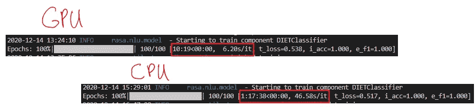
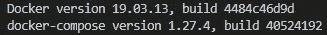
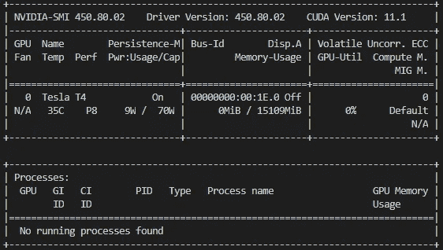
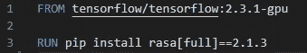
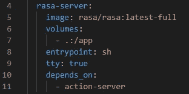
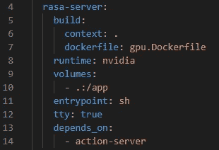
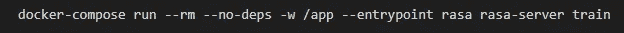
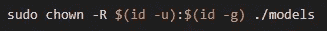

# 我如何使用 Docker 在 GPU 上训练 Rasa 2.1.x 机器人

> 原文：<https://pub.towardsai.net/how-i-use-docker-to-train-rasa-2-1-x-bots-on-a-gpu-442cd9d31d67?source=collection_archive---------0----------------------->

## [机器学习](https://towardsai.net/p/category/machine-learning)，[编程](https://towardsai.net/p/category/programming)

# 介绍

在本文中，我将分享一种基于 Docker 的方法，使用 GPU 来训练基于 Rasa 2.1.x 框架构建的聊天机器人。

设置环境的所有代码都可以在这里找到。

本文建立在我的另一篇名为[My VS Code Setup To Prototype Rasa Chatbots](https://medium.com/towards-artificial-intelligence/my-vs-code-setup-to-prototype-rasa-chatbots-2993062de90)的文章中所描述的设置之上，所以一定要查看更多的上下文。

# 动机

在图形处理器上训练 Rasa 机器人是 Rasa 论坛中的一个热门问题(例如，请参见此处的、此处的、此处的和此处的)。让事情正常运行的一个常见挑战是将 TensorFlow 安装与正确的 NVIDIA 驱动程序相匹配。

我更喜欢基于 Docker 的解决方案，以避免不得不修改机器的配置。我想保持我所有的驱动程序更新，而不是被迫降级，以便我可以使用一个库。如果你是同一个阵营，那么我希望这篇文章对你有所裨益。

# 先决条件

不言而喻，你需要一台安装了 NVIDIA GPU 的机器。你还需要安装 Docker、docker-compose 和 [NVIDIA 容器工具包](https://github.com/NVIDIA/nvidia-docker)。我将在本文中使用的机器是一个 AWS EC2 实例，其规格如下:

*   实例类型:g4dn.xlarge
*   AMI:深度学习 AMI (Ubuntu 18.04)版本 38.0
*   GPU:英伟达特斯拉 T4

这些是我安装的 docker 和 docker-compose 的版本:

图 1:主机上的 docker 和 Docker 合成版本

要验证您是否正确设置了所有内容，您可以运行以下命令:

`docker run --gpus all --rm nvidia/cuda nvidia-smi`

这将为您提供主机中 GPU 的详细信息的打印输出。例如，在我的机器上，它是:

图 2:主机上的 GPU

# 设置

## 概观

和以前一样，我们将有一个 docker compose 文件来描述 Rasa 服务器和 action 服务器。动作服务器的规格将保持不变，而 rasa 服务器将被更新，以允许它使用主机的 GPU。

完成后，我们可以使用 docker compose 来调用 rasa 服务器来执行训练命令，即`rasa train`。

## 定义 Rasa 服务器映像

让我们创建一个名为`gpu.Dockerfile`的文件，它将描述将被用作 rasa 服务器的容器。这两行就足够了:

图 rasa 服务器的图像

图 1 说取 TensorFlow 2.3.1 的 GPU 版本镜像，在里面安装 Rasa 2.1.3。我们构建这个特定的 TensorFlow 映像，因为这是 Rasa 2.1.3 使用的版本，并且这个映像已经正确安装了所有必要的驱动程序。

## 定义 Rasa 服务器服务

这就是在上一篇文章的`docker-compsose.yml`中定义 rasa 服务器服务的方式:

图 4:没有 GPU 支持的 rasa 服务器服务

我们基本上是获取最新的 rasa 映像(我们也可以指定一个特定的版本),并使用该映像作为 rasa 服务器。

为了启用 GPU 支持，我们需要将 rasa 服务器服务的定义修改如下:

图 5:支持 GPU 的 rasa 服务器服务

现在，rasa 服务器服务将基于我们在上一节定义的`gpu.Dockerfile`构建，并使用 NVIDIA 运行时(第 8 行)。

# 培养

完成前面的步骤后，我们可以执行以下命令来训练机器人:

图 6:训练机器人的命令

图 4 中的命令将导致 rasa-server 服务仅在线运行`rasa train`命令。培训结束后，rasa-server 容器将被移除。

培训的输出将存储在`models`文件夹中。

这种方法的一个缺点是`models`文件夹的所有权会在训练后切换到 root 用户和组。幸运的是，修复只需运行以下命令:

图 7:将 models 文件夹重新分配给当前用户的命令

如果您发现自己经常这样做，那么您可以定义一个 VS 代码任务，它将在训练完成后自动重新分配文件夹的权限:

图 8:训练机器人并修复模型文件夹权限的任务

# 基准

我有一个机器人花了大约 80 分钟在一个 [z1d.large](https://aws.amazon.com/ec2/instance-types/z1d/) EC2 实例上训练。同一个机器人在一个 [g4dn.xlarge](https://aws.amazon.com/ec2/instance-types/g4/) EC2 实例上训练只花了 10 分钟。

在撰写本文时，z1d.large 和 g4d.xlarge 实例的按需 Linux 成本分别为每小时 0.186 美元和 0.526 美元。

因此，就总成本和培训时间而言，g4dn.xlarge 显然是赢家。

也就是说，我不确定哪个 CPU 实例可以与 g4dn.xlarge 实例相比较。请在评论中告诉我你的想法。

# 结论

本文描述了一种使用 Docker 容器在 GPU 上训练基于 Rasa 2.1.x 框架构建的机器人的方法。我希望你已经发现这是有用的。