# 我如何使用 VS 代码在 Rasa 中开发和调试定制动作

> 原文：<https://pub.towardsai.net/how-i-use-vs-code-to-develop-and-debug-custom-actions-in-rasa-c94b117865c4?source=collection_archive---------1----------------------->

## [编程](https://towardsai.net/p/category/programming)，[软件工程](https://towardsai.net/p/category/software-engineering)

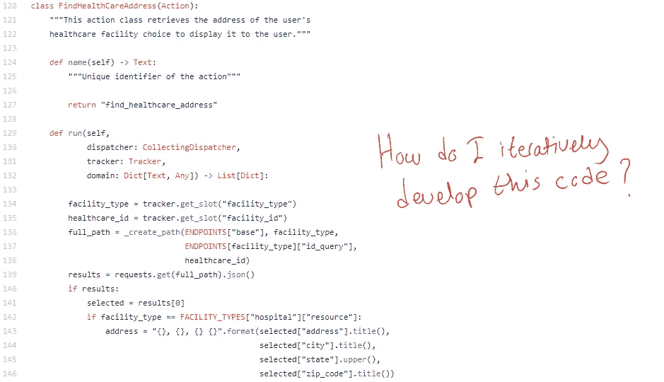

来源:[https://bit.ly/3ihHJKz](https://bit.ly/3ihHJKz)

# **简介**

在这篇文章中，我分享了我如何使用 VS 代码在 Rasa 中迭代开发[自定义动作](https://rasa.com/docs/rasa/custom-actions)。

重现本文所述结果的代码可以在[这里](https://github.com/hsm207/vscode_rasa_custom_action_dev)找到。

我假设读者熟悉 [Rasa](https://rasa.com/) 和 [VS 代码](https://code.visualstudio.com/)。

# 动机

想象一下，你在一家披萨店工作，任务是构建一个聊天机器人来订购披萨。

您已经很好地完成了意图和实体识别部分，现在是时候进入支付处理了。这包括根据对话期间收集的时间段计算总账单金额，并与支付提供商联系以管理支付流程。这是一个复杂的步骤，最好通过自定义操作来实现。

你如何着手开发这样一个定制动作？

我更喜欢的工作流程是在 REPL 的帮助下迭代开发定制动作，以获得即时反馈，并理解聊天机器人在动作被调用时的状态。我不想重复修改自定义动作，重启动作服务器，然后与机器人对话以验证其正确性。

据我所知，没有资源描述这样的工作流程。我读过或看过的所有教程都显示了要实现一个自定义动作要写“什么”,而不是“如何”去做。这就像是假设开发人员第一次就能把事情做好…所以我认为分享一个“如何”实现定制动作的方法是个好主意。

# 先决条件

为了不被问题领域的细节分散注意力，我们将使用`rasa init`的输出作为开发定制动作的起点。

这个模板带有一个名为`action_hello_world` 的自定义动作，在`actions.py`文件中定义，其目的是发出“Hello World”。

# 方法学

## 概观

这些是我们需要遵循的步骤:

*   步骤 1:准备自定义操作的框架
*   步骤 2:确保可以从对话中调用该操作
*   步骤 3:定义一个脚本来启动动作服务器
*   步骤 4:创建启动动作服务器的配置
*   步骤 5:在自定义操作代码中插入断点
*   步骤 6:在调试模式下启动动作服务器
*   第七步:与机器人交谈
*   第八步:触发动作

## 步骤 1:准备自定义操作的框架

这是我们运行`rasa init`后`actions.py`的样子:

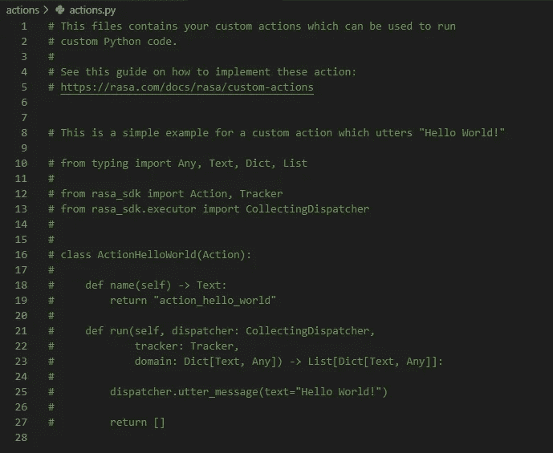

图 1:构建定制动作的模板

它定义了一个名为`action_hello_world`的定制动作，只输出文本“Hello World！”给用户。

让我们假设我们想要扩展这个动作来做一些更复杂的事情。我们需要做的第一件事是取消代码的注释。

## 步骤 2:确保可以从对话中调用该操作

这需要进行一些配置。简而言之，它们是:

*   在`endpoints.yml`中定义一个`action_endpoint`:

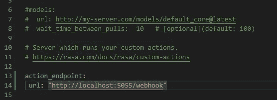

图 2:如何定义一个动作端点

*   定义`domain.yml`中的动作:

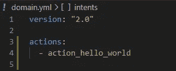

图 3:如何在 domain.yml 中定义定制动作

*   定义将触发自定义操作的对话。你需要已经为此指定了一些意图和故事。例如:

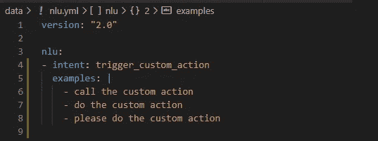

图 4:nlu . yml 中触发定制动作的一些示例意图

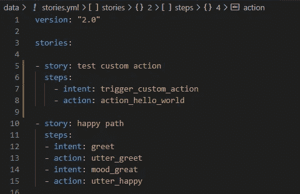

图 5:触发定制动作的示例故事

图 4 和图 5 显示，如果用户说“运行定制动作”，那么名为`action_hello_world`的定制动作将被调用。请务必更新`domain.yml`以包含`trigger_custom_action`意图。

要验证您的设置是否正确，请在终端中执行`rasa run actions`。您将看到一条消息，说明`action_hello_world`已注册:

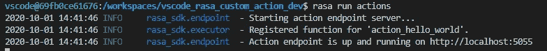

图 6:当一切设置正确时调用动作服务器的输出

## 步骤 3:定义一个脚本来启动动作服务器

让我们创建一个名为`launch_action_server.py`的简单 python 脚本，它将启动动作服务器:

图 7:启动动作服务器的简单 python 脚本

## 步骤 4:创建启动动作服务器的配置

在`.vscode`文件夹中，创建一个名为`launch.json`的文件，内容如下:

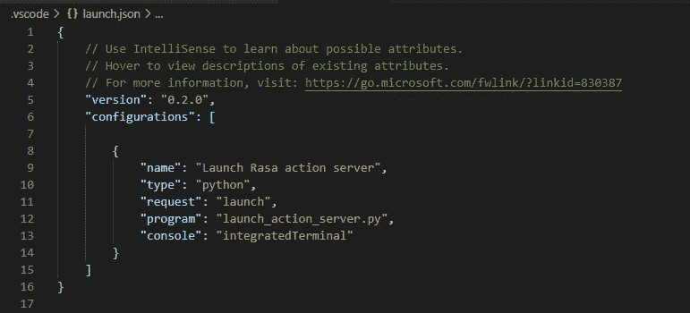

图 8:启动动作服务器的配置

## 步骤 5:在自定义操作代码中插入断点

让我们在自定义操作的`run()`方法中插入一个断点:

图 9:自定义操作的 run()方法中的断点(第 25 行)

## 步骤 6:在调试模式下启动动作服务器

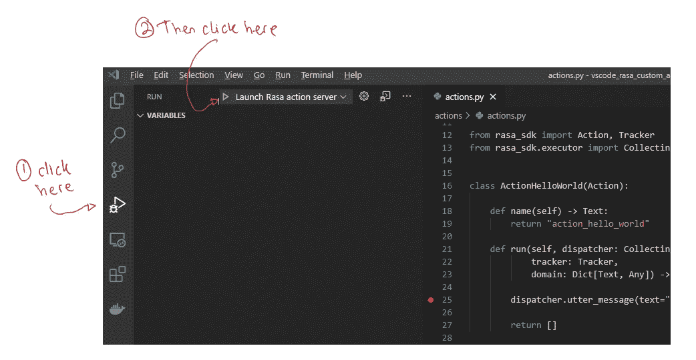

图 10:如何在调试模式下启动动作服务器

## 第七步:与机器人交谈

打开一个综合终端，执行`RASA_SHELL_STREAM_READING_TIMEOUT_IN_SECONDS=3600 rasa shell`:

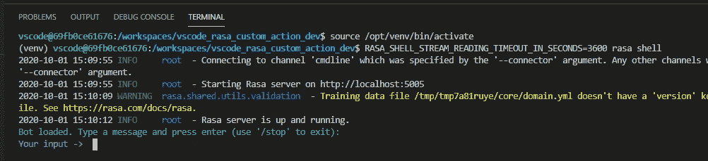

图 11:如何与机器人对话

## 第八步:触发动作

如步骤 2 所述，在本例中，我们只需说“运行自定义操作”就可以触发自定义操作:

# 结果

步骤 8 的结果是在您在步骤 5 中指定的断点处暂停代码执行:

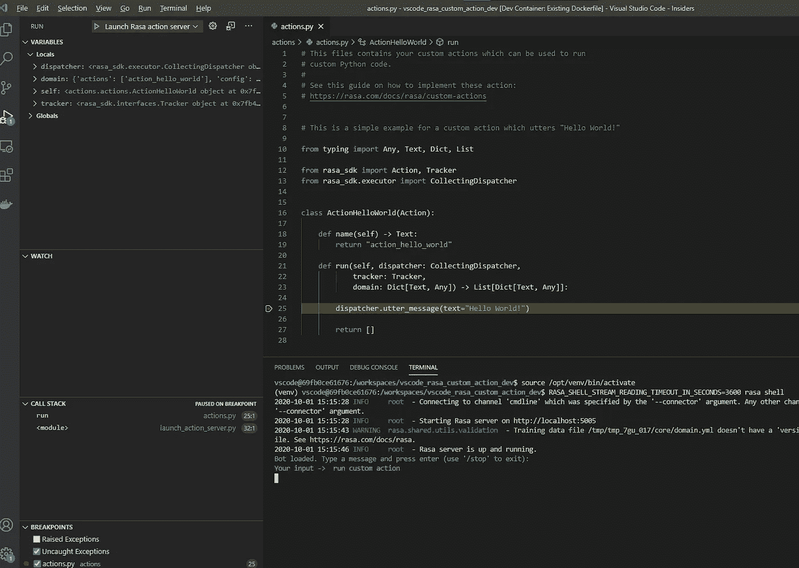

图 11:执行步骤 8 的结果

这给了你什么？

1.  通过查看“变量和调用堆栈”窗格，您可以了解代码运行的环境
2.  通过将变量/表达式包含在监视窗格中，您可以看到它们是如何随着自定义操作的每一行的执行而演变的
3.  您可以在调试控制台中执行任意 python 代码，这对于检查/修改当前状态和试验代码片段来说非常方便，以确保在给定传递给自定义操作的`run()`方法的输入的情况下，代码片段按照您的意图运行。

# 结论

本文描述了一种在 Rasa 中交互式开发定制动作的方法，即在定制动作中间暂停代码执行，并使用 REPL 迭代构建定制动作。

我希望你已经发现这是有用的。

# 更新日期:2020 年 10 月 21 日

我找到了跳过第三步的方法。

您需要做的就是创建一个任务，以 python 模块的形式启动操作服务器。

这仅涉及将步骤 4 更新为:

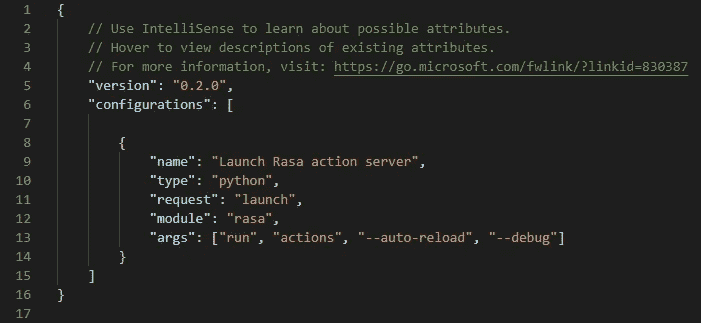

图 12:启动动作服务器的新配置

其余步骤保持不变。