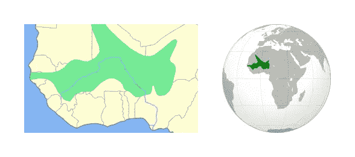
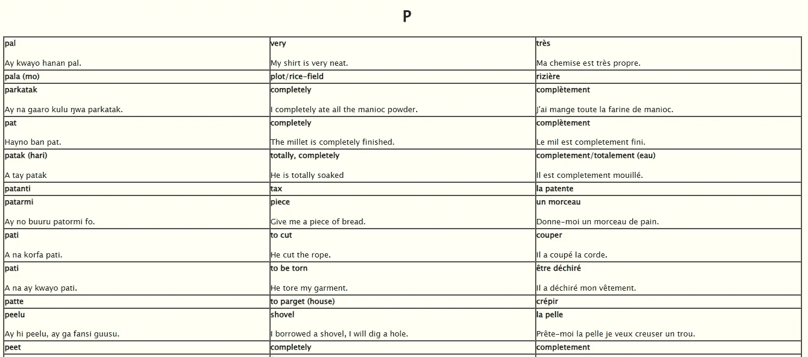
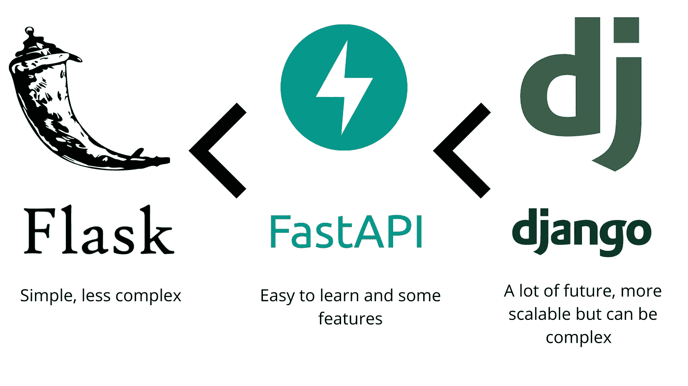
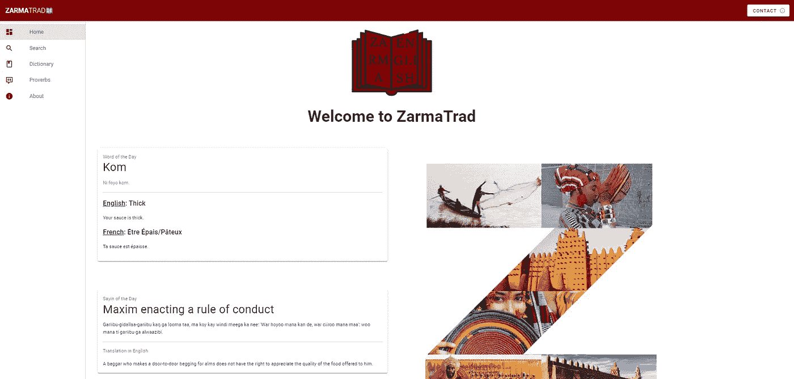
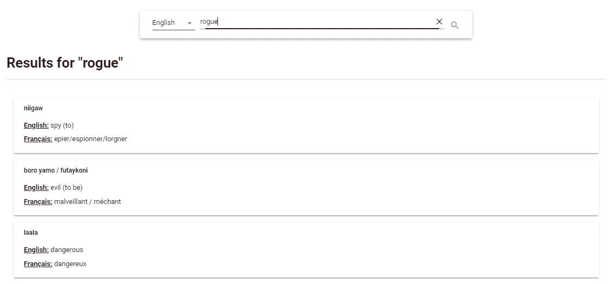

# 我如何使用人工智能创建一个从英语到我的母语的单词翻译器

> 原文：<https://pub.towardsai.net/how-i-used-ai-to-create-a-word-translator-from-english-to-my-native-language-ed4d9663abaa?source=collection_archive---------0----------------------->

## [自然语言处理](https://towardsai.net/p/category/nlp)

*历史上最富有的人曼萨·穆萨和他的军队* [*维基媒体/ HistoryNmoor*](https://commons.wikimedia.org/wiki/File:Empire_mansa_musa.jpeg)

最近我在搜索用我的母语翻译一个英语单词，我去了谷歌翻译，但不幸的是，该语言还不支持，所以我开始在互联网上浏览寻找一个翻译，但没什么。我能找到的只是一个从 Zarma 翻译成英语和法语的单词表，在一个“*老泛非* wiki”网页上。这让我意识到一些重要的事情，因为法语是这个国家的官方语言，这迫使人们成为双语者。法语在学校和各种服务中使用，人们倾向于转而效忠于法语，越来越多的人说法语对 Zarma 不利，这可能导致语言的死亡。在对这个话题做了大量研究后，我了解到语言学家估计每两周，世界上某个地方就会有一种语言消亡。于是我决定创建一个网站，用我所有的知识来帮助社区维护我们这种优秀语言的生存。

# **首先，什么是扎尔玛/宋海语？**

宋海语是非洲历史上最大的国家之一桑海帝国所使用的语言。然后在这个国家衰落后，这种语言继续被使用，它成为著名的马里帝国的语言，由著名的侃侃·穆萨(Mansa Moussa)统治，被称为历史上最富有的人。

宋海帝国的地图 [*维基媒体*](https://commons.wikimedia.org/w/index.php?search=songhai+empire&title=Special:MediaSearch&go=Go&type=image)

# 翻译网站是怎么做出来的？

为了制作这个项目，我决定使用我最熟悉的技术，所以我选择了 ***Vue。js******vuetify***用于前端， ***MongoDB*** 用于数据库， ***python*** 与 ***硒*** 用于数据挖掘，最后，对于后端，我选择 ***python*** 与 ***fast-API* 【T4**

## 数据挖掘技术

为了收集数据，介绍中提到的维基网页上的所有单词都被删除，然后存储在数据库中。由于网站很旧，所以遇到了很多与废弃有关的问题，表格不是同质的，例如，单词有时在与示例相同的 HTML 标签中，有时在另一个子标签中，等等…

作者提供的旧和平队网页图片截图

## **后端**

对于 API 来说，它真的很流畅，fast-API 介于 Flask 和 Django 之间，它有一些有用的工具，并且默认支持 swagger，这节省了很多时间，因为文档是自动生成的，我肯定会继续使用并了解更多。

Flask vs FastApi vs Django 特性和复杂性比较图片作者

## **前端**

我过去常常忽视我所有项目的前端，但是，我决定付出一些努力，做一些在使用时会被享受的东西。前端是用 Vue 创建的。Js 和 vuetify，这个框架太好用了，我太喜欢了！！

作者的 ZarmaTrad 主页图片

## 部署

最后，在最后一部分；我使用 Heroku 来部署我所有的爱好项目，因此它非常用户友好，git 集成工作完美。要部署您的项目，您只需将 Heroku 服务器连接到您的 git repo，然后添加您的 Heroku 配置文件(也称为 Procfile)。

# 我如何使用人工智能来增强翻译？

由于数据库中存储了大约 2500 个翻译单词，因此不可能找到某些单词。假设您想要查找单词“mom ”,因为字典中只有少量单词，所以不会找到结果，搜索必须与数据库中的单词完全匹配。

为了解决这个问题，我决定使用人工智能，因为🤷为什么不😅。

在网上搜索了无数个小时后，我想出了一个解决办法。这非常简单，首先，我们必须转换嵌入中的所有单词，然后当搜索一个单词时，我们只需在嵌入中转换它，并通过检查这些单词之间的距离(余弦相似度)来挑选最接近的单词。

由于该项目部署在一个免费的 Heroku 服务器上，存储是有限的。考虑到这个限制，在嵌入中转换单词的模型必须相当小(RIP 通用语句编码器)。结合 *gensim* 和 *GloVe* 是一条可行之路，根据论文，GloVe 预训练模型比 *google word2vect* 模型更可靠。所选择的预训练单词向量大约有 60 亿个单词，每个单词都被表示为一个 100 维的长向量。但是用这个预先训练好的模型，很多复合词都不行，所以只用了那些的最后一部分，忽略了第一部分。

现在，从单词到嵌入的转换已经完成，下一步是搜索给定向量的最近向量。最常用的方法是使用 Scikit-learn 计算最近邻，但我想使用一些新的方法。

脸书人工智能相似性搜索(FAISS)，是根据脸书的*“更有效的相似性搜索库”*。FAISS 允许我们索引一组向量，然后给定一个向量，我们可以进行查询以找到索引中最相似的向量。它只使用 RAM(随机存取存储器)，非常高效。

因此，FAISS 非常适合这种情况，当服务器启动时，数据库中的所有单词嵌入都被加载，然后存储在 FAISS 中，因此，当从 API 接收到查询时，单词被转换为向量，然后在 FAISS 中进行搜索。结果一点也不差，例如，如果我们搜索“流氓”，数据库中返回的最接近的词是:“邪恶”、“间谍”和“危险”，这些都是非常可以接受的。

按作者排序的 ZarmaTrad 搜索页面图像

# 下一步是什么？

到目前为止，该网站运行良好，但我们仍然可以通过添加更多功能来改进它，使它更加完整和准确。我们可以利用两大改进来提高词典的质量。

首先，用更多的单词来丰富数据库会有很大的帮助。要做到这一点，寻找另一个数据来源或与扎尔玛/宋海语言学家专家交谈将是一条出路。

接下来，通过添加一个音频按钮来朗读不熟悉的单词，让用户更喜欢这个界面。

**感谢您的阅读！**

如果您有任何问题、评论或只是想投稿，请不要犹豫，通过***trapsidanadir@gmail.com***联系我

😊如果你喜欢这篇文章，分享它，并考虑给它一些👏。

🌐您可以使用这个[链接](http://zarmatrad.nadtraps.com/)找到项目