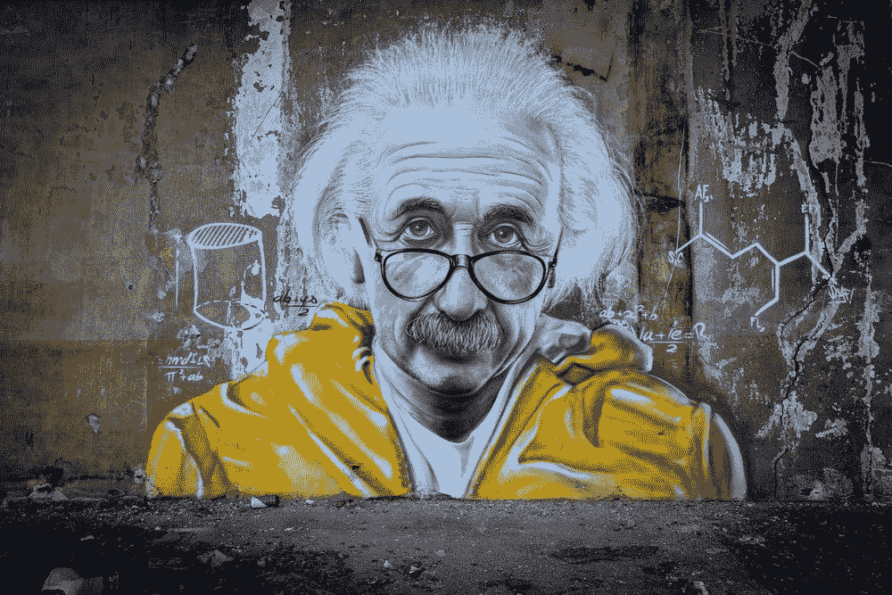
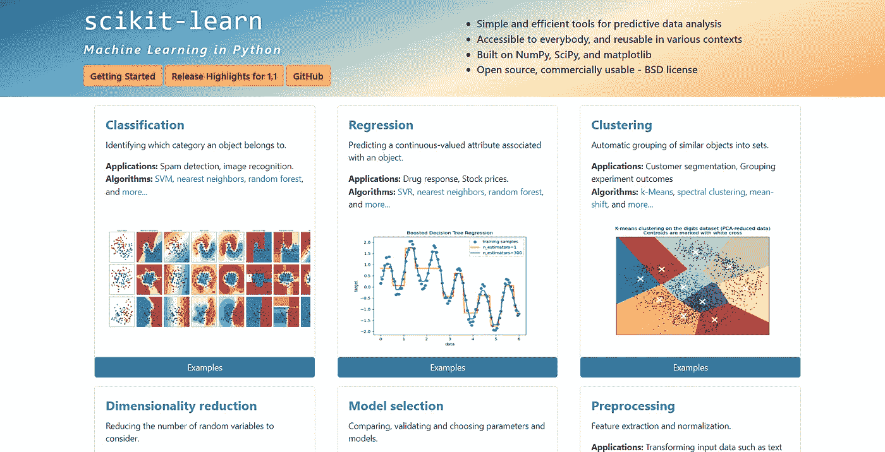
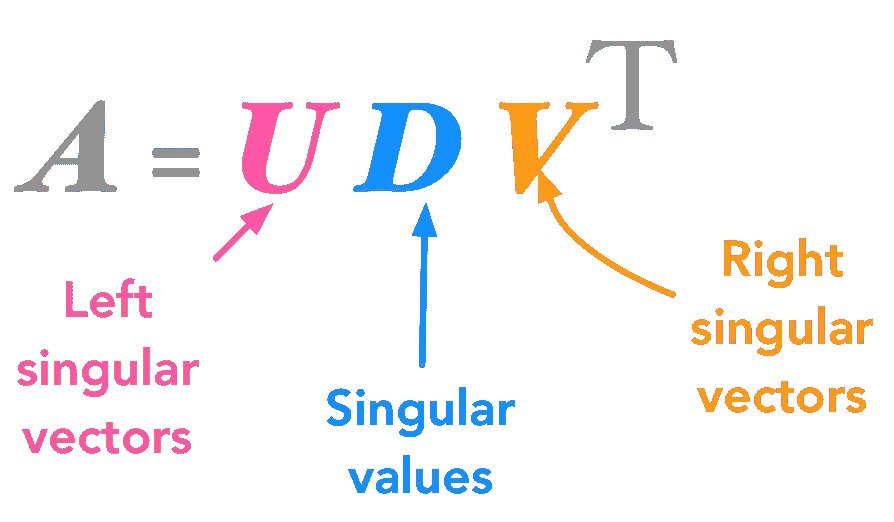

# 我将如何学习机器学习

> 原文：<https://pub.towardsai.net/how-i-would-learn-machine-learning-9ac81631683?source=collection_archive---------2----------------------->

## 如果我能重新开始

作者的形象，由作者创作

只需数据、一些编码技能和谷歌，你就可以创建一个真正塑造世界的 ML 模型，学习机器学习是你对自己最大的潜在投资之一。

如果我能回到过去，让你加快学习机器学习的速度，这篇文章就是我要展示给年轻时的自己的。我们将这篇文章分成 3 个部分，心态，硬技能，以及学习 ML 背后的理论。

这些步骤是要同时完成的，所以更像是三级跳远。如果你不在大学或没有任何很酷的课程，这是一个自学指南，独自学习通常会有点困难，但它也会教你额外的技能。如果你投入工作，你肯定能学会它。

# 心态

ML 从业者对世界和它的问题有不同的想法。我可以自信地说，现在我是一名机器学习工程师，我的日常生活和思维都不同了。机器学习不是一个你永远学不完的话题，它是一个旅程，而不是目的地。我看到许多人被你可能知道的所有架构、技能和数学弄得不知所措。如果你的目标是学习所有的东西，那会很难，但另一方面，如果你一次只专注于学习一件事，那会变得很容易。

凯莉·德·阿桂在 [Unsplash](https://unsplash.com/s/photos/mindset?utm_source=unsplash&utm_medium=referral&utm_content=creditCopyText) 上的照片

## 步骤 1.1 采用数据思维

我的意思是，对于你生活、商业或项目中的每一个具体问题，都可能有数据可以帮助你现在或未来做出决策。而擅长机器学习包括理解数据能告诉你什么。

在考虑做这个项目之前，你必须收集一些数据，开始一些收集过程。如果我足够努力地寻找，每件事都有一个大概的答案。想知道 21 岁的人在佛罗里达能花多少钱？谷歌肯定能引导你找到包含相关信息的数据集。只是要注意偏差，比如数据收集的时间和数据收集的人群子集。

如果你想知道最大曝光的最佳右手打火比例，你可能会拍出更好的照片。我所说的可能听起来显而易见，但了解哪些数据对哪些问题和目标有用是极其困难的。但最终，让我在为期一周的项目中找到最后一块拼图的是，我知道答案会在数据中，如果不是，就早点停止。

## 步骤 1.2 问正确的问题。

> 如果我有一个小时来解决一个问题，而我的生命取决于这个问题的答案，我会用前 55 分钟来决定该问什么问题……因为一旦我知道了正确的问题，我就可以在不到五*分钟的时间内解决问题。—爱因斯坦*

他的话对曼梯·里来说再正确不过了。人们会经常带着奇怪的问题来找你，比如什么能让我们的客户开心？如果你仔细听，并且受过强有力的提问艺术的训练。你可能会注意到，他们想知道一些完全不同的东西。比如，在接下来的 6 个月里，我们能做些什么让我们的客户更开心？然后你需要去找一些领域专家，弄清楚你的公司到底在做什么。一旦你知道了这一点，问题可能会变成客户真正关心的是这些事情中的哪些。

Taton moise 在 [Unsplash](https://unsplash.com/s/photos/einstein?utm_source=unsplash&utm_medium=referral&utm_content=creditCopyText) 上拍摄的照片

最后，问题是我们能做什么最简单最便宜的事情来最大化我们重要客户的快乐。尤其是在真正的旅程刚刚开始的机器学习方面，你能建立一个模型来对真正讨厌 X 或 Y 发生的客户进行分类吗，或者关于客户年龄的简单假设已经 90%完美了吗？相信我，我曾经是第一个在发现我实际上试图实现的目标之前，对我遇到的每个问题都投入花哨的深度学习的人，但理解问题并提出正确的问题才是真正让你成为一名优秀的人工智能专家的东西。

## 1.3 知道自己知道多少？

我们的世界充满了可能性和不确定性。许多人将无法正确地量化它们。你有没有听说过有人承诺这种投资一定会成功，但后来却不了了之？听着，人们极其不擅长估计不确定性，也不擅长在面对不确定性时正确表达自己。

这个营销活动成功的可能性有多大，第一个人可能会说也许，第二个人可能会说也许，因为他们在研究中发现，也许这个词可能意味着 5%到 95%之间的任何东西，这很危险，因为房间里的每个人可能都觉得他们相互理解，但一个人认为 10%，另一个人认为 90%。

这在机器学习中是做不到的。让我们想象一个邮件分类器，他们可能会说，如果它大部分工作就足够好了，现在这可以意味着任何事情。他们认为 1/10 可以被误分类还是 1/100？一些相关的问题是:

*   知道自己知道多少或者标注的数据集中有多少错误？
*   有什么是你永远不会知道的，你的模型的输入会一直有噪音吗？
*   知道你必须知道多少，换句话说，你必须做得多好？

在 Machin Learning 中做任何项目时，这些是你应该经常问自己的一些最重要的事情。

# 第二部分学习硬技能

既然你已经采用了正确的思维模式，那么是时候学习如何将机器学习应用于这个世界了。我不能说这总是很容易，但我保证它会令人满意。机器学习有 3 个基本部分，它们是编程、操作数据，最后将数据输入一个黑盒，也就是 ML 本身。

卡尔·海尔达尔在 [Unsplash](https://unsplash.com/s/photos/hard-skills?utm_source=unsplash&utm_medium=referral&utm_content=creditCopyText) 上拍摄的照片

## 步骤 2.1 学习编程

而你用来学习编程的语言并不那么重要。我强烈建议你先学习编程入门课程。理想情况下，你会学习 Python，但是如果你知道其他语言，你肯定会很好。最后，一旦你学会了你的第一门编程语言，其他的就容易多了。

## 步骤 2.2 学习操作数据

数据是新的石油，而不是机器学习。学习如何加载、分析和聚合数据是关键。在你了解 python 的基础知识之后，理解如何使用 pandas(或者/和其他数据库)是必须的。熊猫是非常强大的，有比你需要的更多的功能。然而，只花几周时间学习它的索引如何工作以及如何查询数据帧肯定会有所收获。这是该领域中每个人都拥有但没有人首先明确学习的技能之一，我认为这是一个错误，如果您尽早了解应用、映射和减少功能，您可以节省大量时间。非常类似的是 SQL，知道如何从任何类似 SQL 的数据库中提取和预聚合数据是非常强大的。例如，在谷歌的大查询中，你甚至可以直接在 SQL 语言中进行机器学习。另外，从长远来看，了解分组依据、分区和窗口函数将为您节省几个月的工作时间。这些是每个从事数据工作的人都应该知道的数据工程的方面，从分析到数据科学家到数据工程师。但也有一部分数据操作是机器学习所特有的，即数据扩充、数据缩放、数据整形和数据平衡等等。然而，我将在下一步学习这些，因为它通常更具可操作性。

## 步骤 2.3 应用机器学习

能够将机器学习应用于数据是人工智能专家与其他数据从业者的区别。现在回顾我自己的学习道路，我会说我可能有点过于强调理解深度学习架构的每个细节，而不是给像 XgBoost 和 Random Forests 这样的算法一个粗略的学习。但仍然学习深度学习的基础知识以及嵌入和损失函数的工作方式是必不可少的。然而，尤其是在早期，不要试图一下子理解它们，这些架构变化非常快，一旦你理解了一个优化算法或架构，下一个就会发布。因此，如果我必须重新开始，我会把更多的重量放在学习经典算法上，从线性回归到树、提升和打包。

# ML 背后的理论

回想起来，这个理论是最让我害怕的。据我所知，这是不合理的，因为老实说，你永远也不会了解每一个细节，而且老实说，考虑到这个领域变化的速度，这也是不可能的。

## 步骤 3.1 先了解一下概况！

截图来自 [Sklearn](https://scikit-learn.org/stable/)

对我来说，最重要的是，在这个阶段，最好先对现有的所有主题有一个大致的了解，一旦你知道有什么，再深入研究。不要花数周时间去理解最新优化程序中的每一个数学细节，要着眼于更大的图景。对我来说，机器学习的基础是

*   分类
*   回归
*   使聚集
*   降维
*   型号选择
*   预处理
*   偏差-方差
*   深度神经网络的基础是密集层，而不是最新的变压器模型
*   合奏
*   最佳化
*   助推
*   制袋材料
*   去偏置
*   一般的超参数调谐

从每一类中大致学习几个不相关的算法，你的进步会远远超过像我一样学习 10 个线性回归算法。我的意思是，当学习分类时，例如学习如何用逻辑回归、支持向量机、K 近邻和决策树来做分类，并在需要时从那里开始构建。

奇异值分解图

## 第 3.2 步热爱你所学！

这是关键，在一个你喜欢的主题上工作 10 个小时比在你讨厌的主题上工作 5 个小时并休息 20 分钟更好。试着让每件事都变得有趣，并与你的其他爱好结合起来。例如，我使用神经网络生成音乐，尽管大多数特定的数据结构和算法对其他任何事情都没有用，因为我房间里的吉他可能表明我非常有动力，学到了很多东西，因为我真的希望模型做得好。更多的教育项目会教会你更多，但是从长远来看，热爱你所做的事情真的会让你投入更多的时间，学到更多的东西。我在这里提到这一点，是因为特别是在学习数学理论或阅读论文时，知道你为什么这样做是很重要的。

## 第 3.3 步深挖数学！

现在你知道 Ml 工程师是做什么的了。深入研究一个领域或项目，这可以是一个大学项目，一个你想付诸实践的个人爱好，或者一场 Kaggle 竞赛。重要的部分是你完成它，学习如何从想法到生产做一个项目。生产意味着它功能齐全，存在于互联网上。这将把你学到的所有东西放在一起，所有的项目生来不同，你永远无法找到完美的一个，所以去解决一个现实世界的问题，你可以向潜在的雇主展示，这正是你应该发布它的原因。建立一个投资组合，也就是一个项目列表，从这里开始扩展这个列表，或者更深入地探索你发现自己缺乏的概念。到目前为止，这是获得机器学习实习或工作的最佳方式，并向他们展示你可以应用我们迄今为止谈论的一切，并建立你的简历，在我关于机器学习工程师面试问题的视频中有更多细节。

关于机器学习理论最可怕的方面数学，我有一整段视频专门讲它。主要的提示是，在开始学习 ML 理论之前，你应该学习线性代数、统计学和微积分的一些基本知识，我觉得只要你在其中的某一点上过基础课，你就可以开始学习了。其余的我会在做机器学习及其应用时学习，线性代数 SVD，微积分损失函数和反向传播，统计当你遇到一个新术语时，总是花 1 个小时来建立你的知识。

这是我对如何学习机器学习的看法。记住这是一个旅程，每一步都让你更接近你的目标，所以保持动力，热爱你的工作。

说到这里，一定要看看我关于机器学习需要多少数学知识的视频。它将解释你需要知道的一切，以及如何接近机器学习理论的这个关键方面。如果你想知道如何做到这一点，请查看我的视频如何成为一名 ml 工程师。

如果你喜欢这篇文章，我会很高兴在 Twitter 或 LinkedIn 上联系你。

一定要看看我的 [YouTube](https://www.youtube.com/channel/UCHD5o0P16usdF00-ZQVcFog?view_as=subscriber) 频道，我每周都会在那里发布新视频。