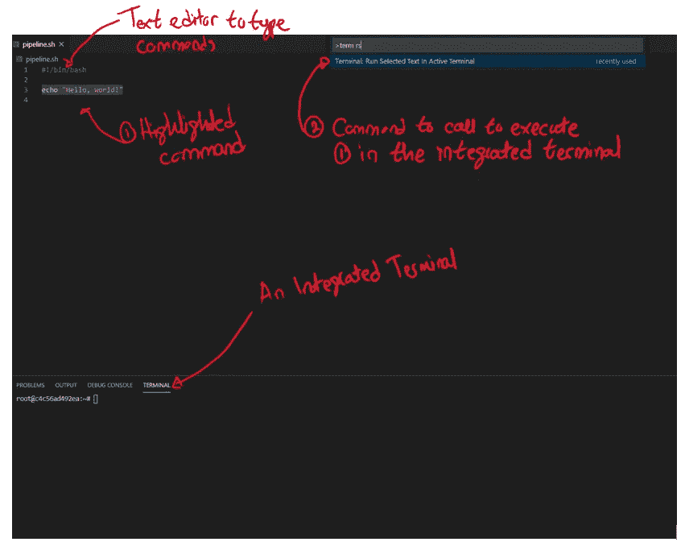
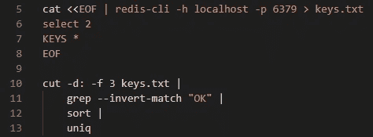
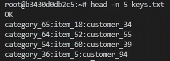
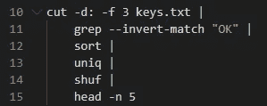
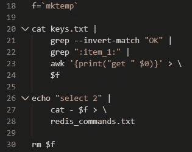
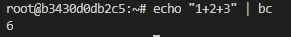
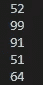
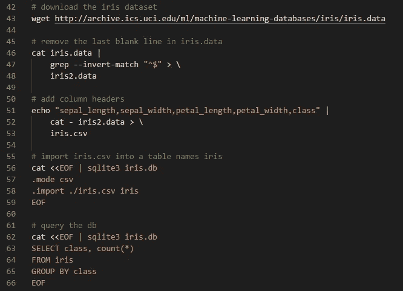

# 我如何在命令行争论数据

> 原文：<https://pub.towardsai.net/how-i-wrangle-data-at-the-command-line-17ad48faf699?source=collection_archive---------1----------------------->

# 介绍

在这篇文章中，我将分享一些在命令行进行数据争论的技巧。本文的目标读者是除了在线复制粘贴命令之外不熟悉命令行的数据科学家。

我将分享我开发 bash 脚本的工作流程，并通过一些示例演示常见的 shell 特性和程序，这些特性和程序使快速编写数据处理管道变得很容易。

让我们从解释为什么知道这些事情是有用的开始。

# 为什么？

当像 Python 和 R 这样的工具如此强大的时候，为什么还要使用命令行来清理数据呢？我认为有两个原因:

*   效率
*   方便

## 效率

本文将展示许多常见的预处理例程，如选择列、过滤、排序、计数等，与在 Python 或 r 中完成相同的操作相比，可以用少得多的代码在命令行中完成。

## 方便

有些时候，你将被迫在一个资源非常有限的环境中工作，特别是如果你还负责生产你的数据科学解决方案。

例如，我曾经不得不检查 Redis 数据库的内容。安全是这样的，唯一的方法是通过一个短暂的跳箱连接到它。在登录 jumpbox 之前，您需要通过几道关卡。jumpbox 只有 4 GB 的 RAM，团队中没有人知道如何 SSH 到其中(登录需要创建一个临时令牌)。

因为我想要执行的检查相对简单，所以实际上通过 jumpbox 的命令行来执行比提交一张请求安全团队打开 jumpbox 以便我可以连接到它并复制我的 Python/R 环境更快。

# 我的工作流程

我更喜欢使用 [VS 代码](https://code.visualstudio.com/)来编写 bash 脚本。这是一个轻量级和跨平台的文本编辑器。

我设置它的方式是，我将首先打开一个集成终端。如果有只能在远程机器上执行的命令，例如通过 jumpbox 访问网络资源，那么我也将使用此终端连接到 jumpbox。

接下来，我将创建一个文件并用扩展名`sh`保存它。这将激活 shell 脚本的语法突出显示和代码格式化。我使用 [shell-format](https://marketplace.visualstudio.com/items?itemName=foxundermoon.shell-format) 扩展进行格式化。

为了在终端中测试脚本，我遵循以下步骤:

1.  突出显示我要测试的命令
2.  调用命令调板(`Ctrl + Shift + P`)
3.  键入`term rs`以选择“终端:在活跃终端中运行所选文本”命令(或将此命令分配给键盘快捷键)
4.  点击`Enter`向终端发送高亮显示的命令

下面是描述我的设置的截图:

图 1:编写 bash 脚本的 VS 代码设置

您可以反复试验脚本的结果，只需突出显示您想要测试的部分，并将它们发送到终端。我发现这比直接在命令行上编写所有内容，然后在历史中循环使用不同的变体更有效率。

现在让我们来看一些在命令行中发生数据冲突的例子。

# 例子

## 得到一份清单

假设您有一个 Redis 数据库，其中包含客户查看某个产品的次数。数据存储在数据库 2 中，其中每个键都是`product_category:item_sku:customer_id`的形式。

您想知道这个 Redis 实例中记录的客户。

下面是使用命令行的方法:

图 2:从 Redis 数据库获取客户列表

Redis 附带了一个名为`redis-cli`的命令行工具，允许您连接到 Redis 服务器。根据[文档](https://redis.io/topics/rediscli#getting-input-from-other-programs)，如果你想给工具一个你想要执行的命令序列，你必须给它一个包含命令序列的文件。

`<<EOF` inline 5 告诉 bash 继续从 stdin 读取输入，直到遇到序列`EOF`。这意味着 bash 将读取第 6 行和第 7 行，就像是我们自己输入的一样。接下来`cat`将显示我们在标准输出中“键入”的内容，即终端，但是由于我们使用管道操作符(`|`到`redis-cli`)对其进行了跟踪，这两行将被传递给 Redis 进行执行。

`>`只是告诉 bash 将 Redis 的输出保存到一个名为`keys.txt`的文件中。

下面是`keys.txt`的内容:

图 3:keys . txt 的内容

“OK”是在 Redis 中运行`select 2`命令的产物。这意味着，要获得客户列表，剩下要做的就是忽略第一行，用“:”分割其余的行，并返回第三个字段中的唯一值，即分割后的客户 id。所有这些都在图 2 中的第 10 到 13 行完成。注意，我们忽略了第一行，使用`grep`返回任何没有文本“OK”的行。

另外，请注意，这种从 Redis 中检索键的方式不应该用在生产环境中，尤其是当您有很多键时，因为它会阻塞对数据库的其他查询，直到它完成执行。

## 得到一个随机列表

如果您想获得一份 5 个随机客户的名单来开始您的 EDA，该怎么办？这里有一种方法可以通过重用`keys.txt`的内容来实现:

图 4:获取随机客户的列表

图 4 基本上获得了所有唯一客户的列表(就像图 2 一样)，对它们进行洗牌(第 14 行)并只返回前 5 个客户(第 15 行)。

## 计算一组事物

如果我们想知道项目 1 的总浏览量呢？

我们需要做的第一件事是生成一个包含 Redis 命令的文件，以便从包含 item 1 的所有键中获取视图。给定键的命令看起来像`get product_category:item_1:customer_id`。

有一种方法可以做到:

图 5:创建一系列 Redis 命令来获取与项目 1 相关的视图

在图 5 中的第 18 行，我们创建了一个临时文件，并将其路径赋给变量`f`。第 20 到 24 行用必要的命令填充这个临时文件。

注意，我们使用了`[awk](https://www.gnu.org/software/gawk/)` 将单词“get”附加到每个键上(第 23 行)。Awk 是一种非常擅长处理文本文件的编程语言。只用几行代码就可以表达复杂的操作。

第 26 到 28 行创建了一个名为`redis_commands.txt`的文件，它只是在`f`的内容上添加了`select 2`。由于我们不再需要这个临时文件，我们在第 30 行删除了它。

现在我们只需要将`redis_commands.txt`的内容馈入 redis，就可以得到每个键的视图，并对值进行求和。

让我们考虑一下如何做这道算术题。

有一个叫做`bc`的工具，它是一个计算器，可以接受来自 stdin 的数学表达式。例如，要计算`1+2+3`，我们可以这样做:

图 6:如何用 bc 计算 1 + 2 + 3

问题是来自`redis-cli`的输出将是一列数字。例如:

图 7:将 redis_commands.txt 传递给 redis 后的示例输出

我们需要把这个翻译成`52+99+91+51+64`。幸运的是，有一个叫做`paste`的工具可以做我们想要的事情:

图 8:使用粘贴将一列数字转换成带有分隔符的一行数字

所以，把所有东西放在一起，我们有:

图 9:计算项目 1 的总视图

请注意，如果您发现自己经常做这种分析，那么可以考虑使用关系数据库。

## 更复杂的计算

在命令行中可以进行的分析种类有限制吗？

嗯，`awk`是图灵完备的，所以你可以在里面写你所有的分析。但是使用`awk`和学习一门新的编程语言是有一个学习曲线的，只是为了让我们在命令行上更高效，对我来说，这听起来不像是一个数据科学家的时间投资。

我建议将数据导入到`sqlite`中，并使用 SQL 对其进行分割，以便进行更复杂的分析，这些分析只能在命令行中完成。下图显示了将 iris 数据集导入为 csv 文件，然后运行 SQL 查询来计算每个类的频率是多么容易:

图 10:如何将 iris 数据集放入 SQLite 数据库

如果在命令行上编写 SQL 变得过于繁重，那么是时候离开命令行，转而使用更强大的工具，如 Python 或 r。

# 后续步骤

本文只是触及了命令行的一些皮毛。如果您想了解更多关于使用命令行进行数据科学工作的信息，那么我强烈推荐以下书籍:

*   [Jason Morris、Chris McCubbin 等人通过命令行实践数据科学](https://www.packtpub.com/big-data-and-business-intelligence/hands-data-science-command-line)
*   [命令行中的数据科学](https://www.datascienceatthecommandline.com/index.html)作者耶鲁安·扬森斯

一旦你习惯了在命令行中工作，看看 [GNU Coreutils](https://www.gnu.org/software/coreutils/) 下的工具。这些程序可以在几乎所有基于 Linux 的操作系统中使用。这些程序非常简单并且高度可组合，因此您应该能够混合和匹配它们来解决您的数据操作问题。

# 结论

本文展示了几个例子，通过编写许多更简单的程序，在命令行上执行常见的数据操作任务。我希望它已经让您相信这是一个有用的工具，可以包含在您的数据科学武库中。