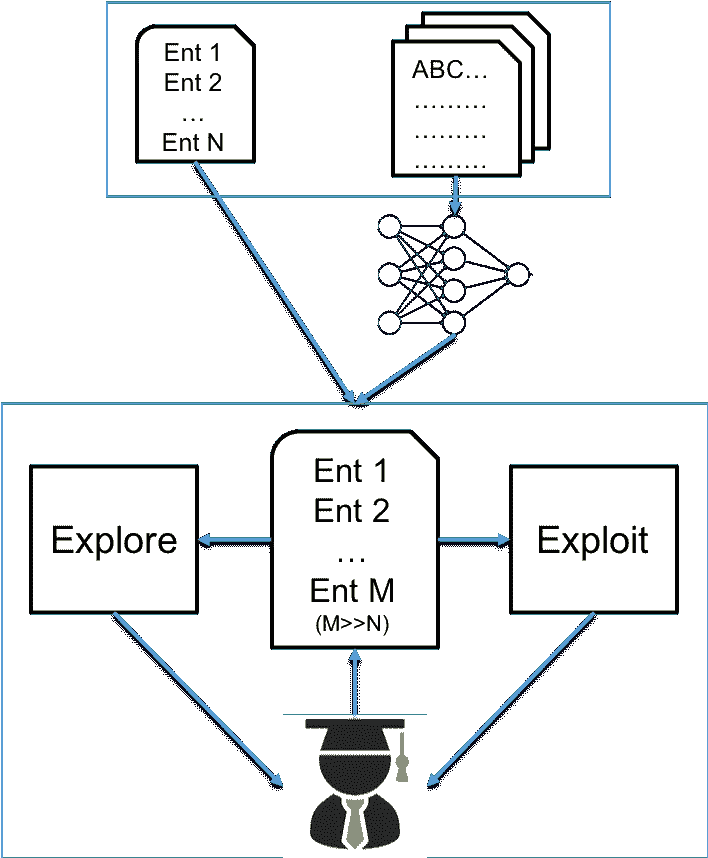
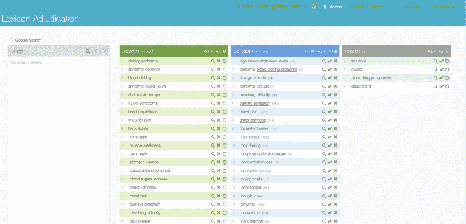
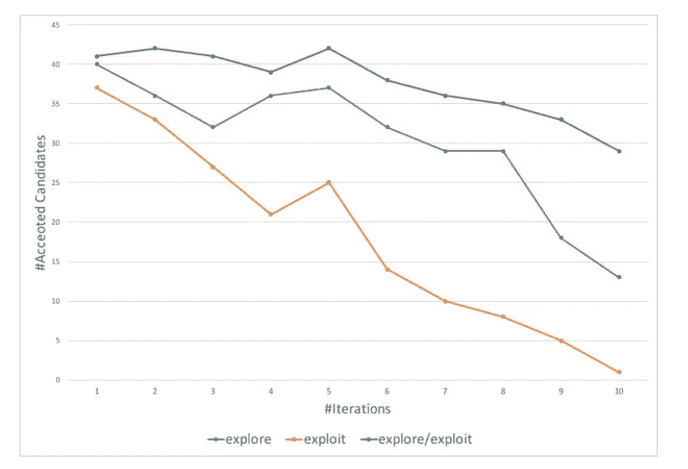

# IBM 如何利用 How 结合人类和神经网络实现更好的语言智能

> 原文：<https://pub.towardsai.net/how-ibm-uses-how-to-combine-humans-and-neural-networks-to-achieve-better-language-intelligence-2736b2bc0c11?source=collection_archive---------3----------------------->

## [深度学习](https://towardsai.net/p/category/machine-learning/deep-learning)

## 人在回路的方法在语言模型中表现出高效率。

来源:https://www.fetcher.ai/blog/human-in-the-loop

> 我最近创办了一份专注于人工智能的教育时事通讯，已经有超过 90，000 名订户。《序列》是一份无废话(意思是没有炒作，没有新闻等)的 ML 导向时事通讯，需要 5 分钟阅读。目标是让你与机器学习项目、研究论文和概念保持同步。请通过订阅以下内容来尝试一下:

 [## 序列

### 订阅人工智能世界中最相关的项目和研究论文。受到 85，000 多人的信任…

thesequence.substack.com](https://thesequence.substack.com/) 

在[的新书《深度思考](https://www.amazon.com/Deep-Thinking-Machine-Intelligence-Creativity/dp/161039786X)中，前国际象棋世界冠军加里·卡斯帕罗夫回顾了他与 IBM 深蓝的第二场比赛，以此来展示一些关于人工智能(AI)空间的挑衅性想法。随着他发展自己的想法，卡斯帕罗夫得出结论，人工智能系统的未来将基于人机合作模型，这些模型将人工智能系统的深度分析能力与直觉和常识等人类认知技能相结合。尽管人工智能方法取得了进步，但今天最有效的人工智能系统需要高度的人工监督。然而，人的因素通常被视为人工智能架构的外部因素。两年前， [IBM Research](http://research.ibm.com/labs/almaden/) [的研究人员发表了一篇论文](http://ceur-ws.org/Vol-2169/paper-02.pdf)，提出了一种将人类认知纳入现代深度学习系统中最常见的任务之一的方法:字典管理。

字典和本体对于许多人工智能(AI)系统是重要的，特别是在自然语言处理(NLP)领域。通常，我们构建字典来指导算法识别非结构化文本中的正确模式。然而，保持词典的更新远不是一件容易的事情，并且经常会随着新内容的到来而失去同步。为了应对这一挑战，IBM 提出了一种技术，该技术采用一种轻量级的神经语言模型，结合严密的人工监督，来帮助用户从输入文本语料库中构建和维护特定领域的词典。他们将这种方法称为人在回路(HumL ),基于一种经典的深度学习技术，称为探索/利用范式。

# HumL

HumL 模型使用由文本语料库和一组特定的字典种子示例组成的输入进行操作。该模型有两个主要阶段:探索和利用。探索阶段尝试使用来自神经语言模型的术语向量来计算相似性得分，以识别与输入文本语料库中存在的字典条目相似的实例。利用阶段试图基于输入字典中已经存在的实例来构造更复杂的多术语短语。

图片来源:IBM Research

## 探索

如前所述，探索阶段的目标是使用输入词典中可用的实例来识别语料库词汇中已经存在的相似候选项。具体来说，IBM 团队依靠 word2vec 算法来检测字典和文本语料库中的条目之间的相似性。从概念上讲，语义相似的词应该在特征空间中彼此靠近出现。因此，计算两个实例之间的相似性的问题是在给定的特征空间中计算两个实例之间的距离。HumL 使用标准的余弦相似性度量，该度量应用于实例的向量。

## 剥削

利用阶段试图通过分析输入词典中实例的结构来识别语料库词汇中不存在的更复杂的短语。HumL 使用两种短语生成算法来实现这一点:

1)第一种算法通过用文本语料库中的相似术语替换单个术语来修改短语，例如，“异常行为”可以被修改为“奇怪行为”；

2)第二种算法利用来自文本语料库的与实例中的术语相关的术语来扩展实例，例如，“异常血液凝固问题”可能不会出现在大型文本语料库中，但是“异常血液计数”、“血液凝固”和“凝固问题”在语料库中出现了几次，并且可以用于构建更复杂的实例。

# 行动中的幽默

IBM 团队在不同的文本分析场景中评估了 HumL，尤其是在医疗保健领域。其中一个测试场景解决了在用户生成的数据中识别药物不良反应的问题。作为输入，该系统使用了来自 http://askapatient.com 的文本语料库，这些博客文章描述了患者使用不同药物的经历。HumL 使用了一个分为 10 次迭代的评估过程，每次迭代后，计算算法在前 50 个推荐候选中发现了多少个新实例。然后将接受的实例添加到字典中，并用于下一次迭代。

图片来源:IBM Research

结果表明，与其他方法相比，使用 explore/exploit 方法，我们能够在每次迭代中发现更多的实例。另一个有趣的观察结果是，使用 explore 方法，随着整个语料库中可用实例的数量在每次迭代中减少，新发现实例的数量迅速减少。

图片来源:IBM

HumL 的研究表明，在文本分析算法中加入人类反馈可以显著提高性能。如果我们考虑到 HumL 使用了一个非常基本的统计方法，只需要简单的符号化，这个结果就更加显著了。我们应该期待看到更复杂版本的 HumL 模型，使用先进的架构，如循环神经网络(RNN)，长短期记忆网络(LSTM)和双向 LSTM。