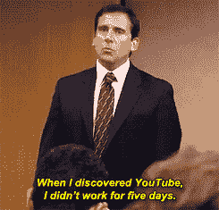
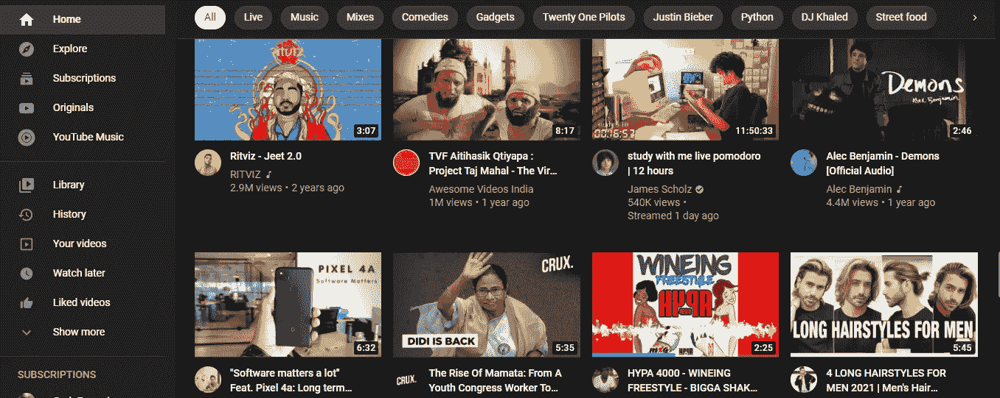
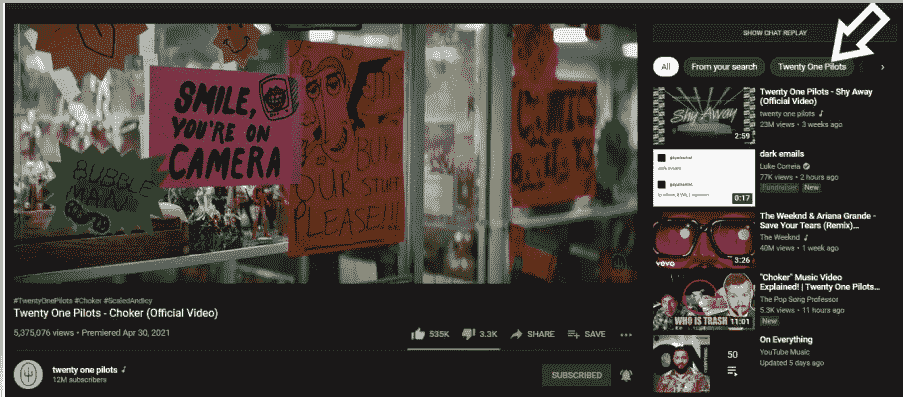
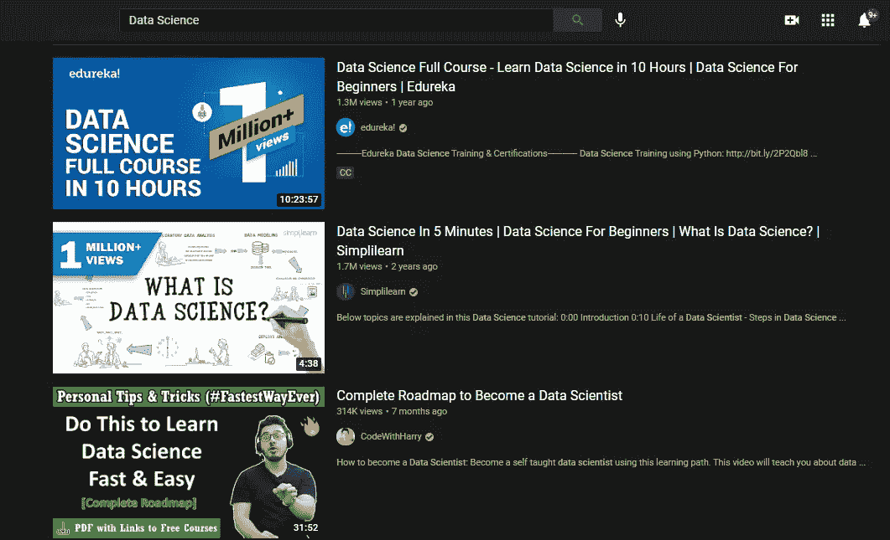
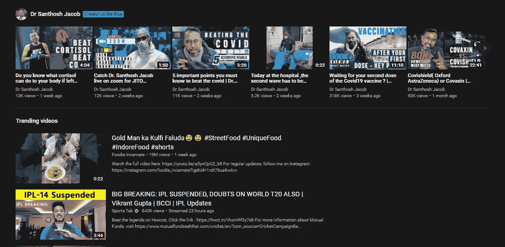
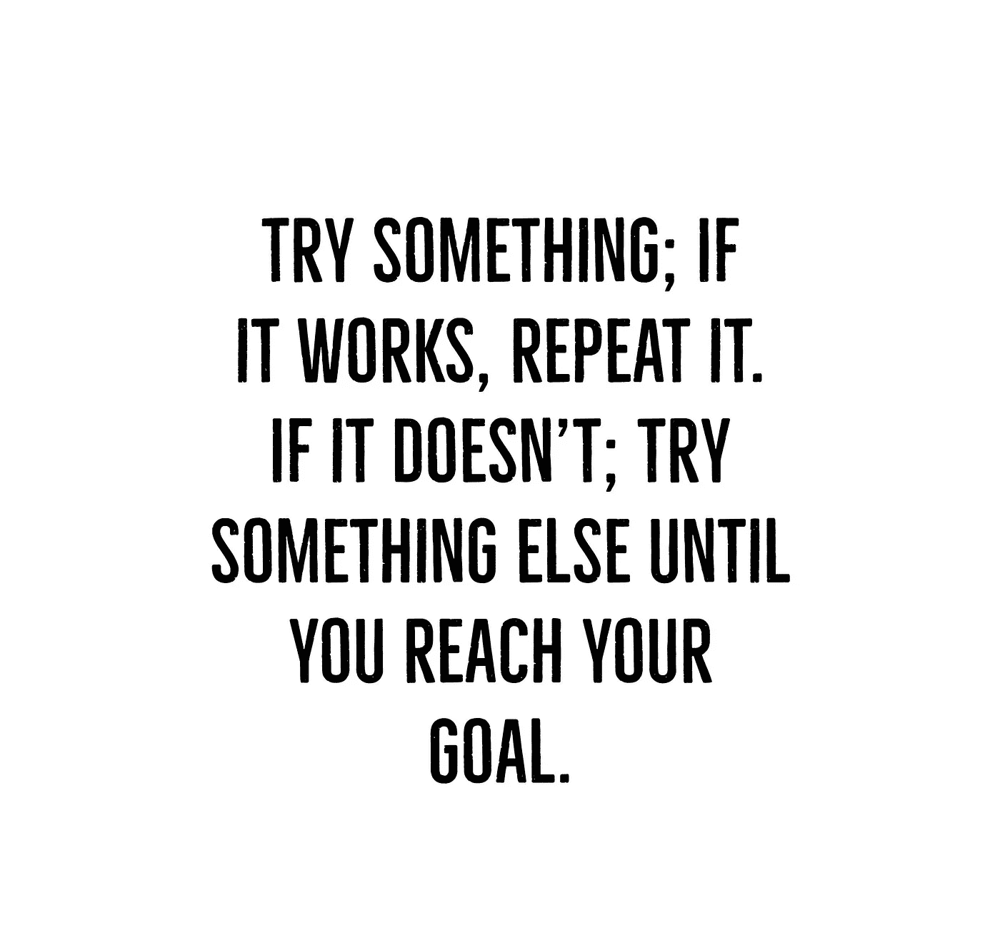
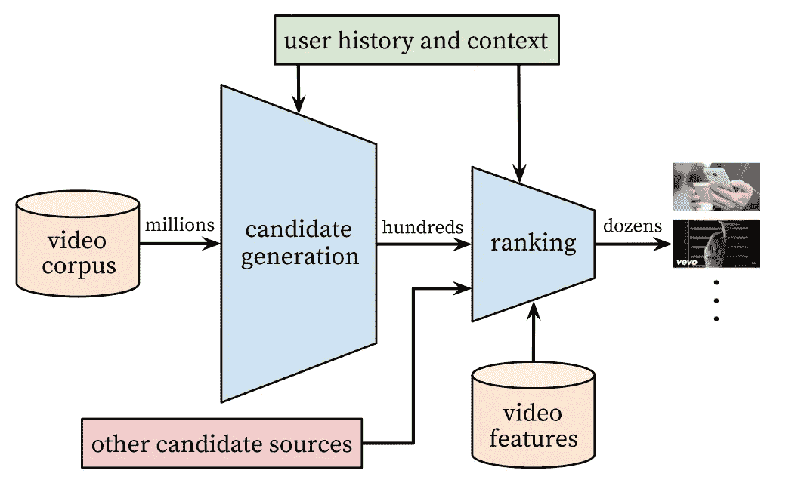
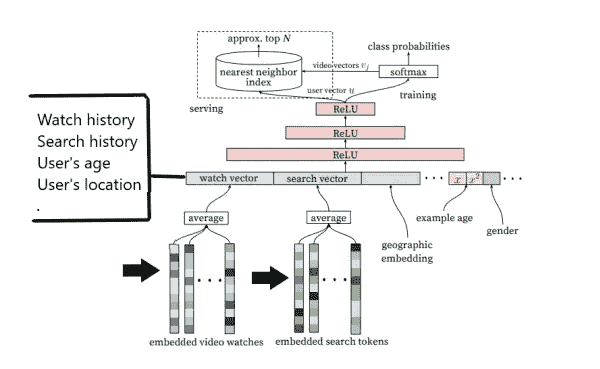
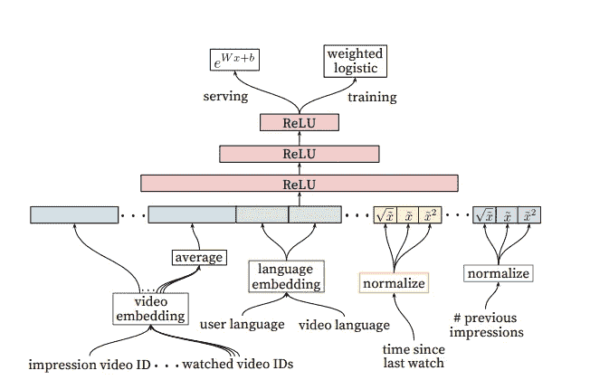
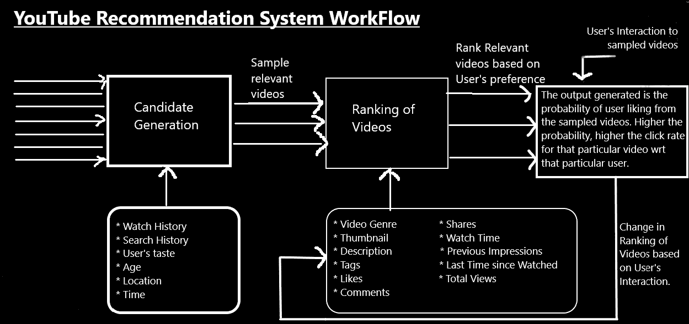

# YouTube 是如何利用 AI 推荐视频的？

> 原文：<https://pub.towardsai.net/how-is-youtube-using-ai-to-recommend-videos-38a142c2d06d?source=collection_archive---------1----------------------->

## [机器学习](https://towardsai.net/p/category/machine-learning)

## 谁是老板？算法还是用户？

来自 nerdschalk via [Pinterest](https://in.pinterest.com/pin/167196204905424539/)

> *有了高用户基数，就有了强大的推荐系统。*

你们知道我的，我喜欢解码有趣的算法。可以查看我的文章*****[***火绒***](/tinder-ai-a-perfect-matchmaking-b0a7b916e271)**[***【GPT-3***](/gpt-3-explained-to-a-5-year-old-1f3cb9fa030b)**[**G*oogle 哼！***](/how-google-made-hum-to-search-865f224b70d0)*********

# *****目录:*****

*   ********YouTube 是什么？有多受欢迎？********
*   ********解码 YouTube 的元素********

*****▹ *主页——给出没有任何查询/导航的建议。******

******▹观察下一步——提高相似内容的参与度。******

******▹搜索选项卡—显示与查询匹配的内容******

******▹趋势 youtube 上最有争议的部分******

******▹一个创作者的成功之路！******

*   ********YouTube 推荐系统的深度学习架构********

******▹协同过滤******

******▹矩阵分解******

******▹深度神经网络******

******▹的工作流程简单地说******

# *****YouTube 是什么？有多受欢迎？*****

*****YouTube 是一个视频分享网站，由三名 PayPal 员工于 2007 年创立:*查德·赫利、陈士骏和贾韦德·卡里姆。******

*****YouTube 从加州城的小餐馆开始，以其简单性和广泛的受众引爆了市场。YouTube 有适合每个人的东西。无论是游戏频道、美容教程、生活窍门、产品评论，还是数小时的实时新闻，YouTube 都有。创作者每分钟上传 500 个小时的内容，由于这种高内容与用户比率，我非常肯定，每分钟都会有一些东西打动你的选择。*****

*****YouTube 现在是**世界第二大搜索引擎**和**仅次于谷歌的第二大访问量网站**，其**日观看时长为 10 亿小时**，比网飞和脸书的总和还要多。一旦登录，它可以钩用户 40 分钟。*****

*****我敢打赌，我们都曾在这个地方，我们进入 YouTube 的世界，以获得一些知识或见解，并最终观看音乐视频几个小时。这就是 **YouTube 推荐系统**的神奇之处。*****

**********

*****YouTube 算法是其成功不可或缺的一部分，**它决定了 70%的时间用户必须观看的内容，美国大约 80%的人会遵循这个建议。*******

# *****YouTube 的解码元素*****

*****YouTube 推荐系统的最终目标是:*****

1.  *******帮助观众找到他们感兴趣的视频。*******
2.  *******吸引用户继续观看视频，从而提高应用的受欢迎程度，吸引更多创作者。*******

*****YouTube 中的推荐系统会考虑各种因素。它分析*用户的历史，他们的活动，地理属性，对于视频，他们分析其流派，缩略图，内容，描述，目标观众，订户，满意度计数(喜欢，评论，分享)，用户调查等。******

*****YouTube 上有几个不同的推荐系统，用于隔离区。*****

## *****主页——给出没有任何查询/导航的建议。*****

**********

*****YouTube 主页*****

*****它对用户来说是一个一站式的目的地，不需要搜索查询，不需要查看订阅/探索等其他标签，打开应用程序后你就可以找到匹配的内容。 ***这有助于轻松钩住用户*** *。******

*****你的主页上展示了哪些视频？*****

*   *****您订阅的频道中最近的视频。*****
*   *****符合你口味的用户看过的视频。*****
*   *****来自您从未看过的频道的几个视频让您发现新的内容和频道增长。*****
*   *****您所观看的内容熟悉的未订阅频道的内容。*****

## *****观看下一个(推荐视频)—提高相似内容的参与度。*****

**********

*****建议视频部分*****

*****它试图显示与你正在观看的视频相似的内容。它可以来自相同的创建者或不同的创建者，但是具有相同的风格/匹配的上下文。*****

*****在上面的视频中，我正在看 21 名飞行员的“ *Choker* ”，他们的最新专辑将于 5 月 21 日发行。推荐系统要求我观看同一张专辑中的另一首歌曲“ *Shy Away* ”、一段解释“*Chokers*”(21 首试点歌曲很难解码)的视频，以及一首名为“ *Save your Tears* ”的歌曲，该歌曲与“ *Choker* ”属于同一流派。*****

*****与主页上建议的视频是个性化的，内容围绕你的口味不同，这里建议的视频是为了增加你在平台上的参与度，并熟悉同一创作者的内容或相关内容。*****

*****简单来说，这里显示的内容是:*****

> ******观看视频的相关资料+为您提供的相关视频******

## *****搜索选项卡—显示与查询匹配的内容*****

**********

*****搜索选项卡*****

*****这里使用的推荐系统是为了提供相关的内容。YouTube 在这方面有更大的优势，因为你以查询的形式提供一些原始输入。*****

*****搜索推荐系统试图找到与搜索框中提到的查询相同的视频。它检查视频的标题，标签，视频的描述。这并不意味着如果我搜索“*数据科学*，它会显示一个标题为“*数据科学* e”的视频，标签和描述为“*数据科学*，但没有相关内容。*****

*****YouTube 还会寻找“**反馈循环**”，即它不仅会寻找元数据，还会查看视频的性能、视频的满意率(浏览量、点赞数、评论数、分享数)、搜索相同查询的人倾向于观看的内容、内容创建者的观众口味。*****

*****这里生成的输出取决于:*****

> ******相关性+反馈回路******

## *****趋势 YouTube 上最有争议的部分*****

**********

*****“趋势”部分*****

*****这是 YouTube 上最有争议和最令人困惑的部分，通常最不被期待的创作者和内容在这里没有太多的观点。*****

*****正如 Tom[2]所提到的，趋势就像 YouTube 的饮水机。*****

*****它是考虑到大多数因素的部分，目标是推广受到各种口味的观众广泛欣赏的视频。它倾向于以广泛吸引人的视频和人们在 YouTube 之外谈论的视频为特色。他们检查视频的速度和浏览量的增加以及视频的吸引力。它关注的只是用户的排名和地理位置。基于居住在那里的人们的品味，不同的地区有不同的趋势视频。*****

*****此外，还有一个“ *Creator on the rise* ”选项，提供各种上升渠道，并免费推广。YouTube 这样做是为了促进小创作者，并为他们提供免费宣传，以根据他们的视频和他们正在制作的内容的表现来增长。*****

## *****一个创造者的成功之路！*****

**********

*****照片由 [Jungwoo Hong](https://unsplash.com/@hjwinunsplsh?utm_source=medium&utm_medium=referral) 在 [Unsplash](https://unsplash.com/?utm_source=medium&utm_medium=referral) 上拍摄*****

*****作为一个创作者成长，有几点是需要注意的。*****

*****YouTube 是一个对创作者友好的平台，但是如果你创作了合理的内容，并且对 YouTube 忠诚。*****

*****制作一个关于“*如何系鞋带的视频？*“行不通，因为 YouTube 已经有 1000 个这样的视频了。尝试制作一个相关的、有意义的、能帮助他人的视频。我今年 21 岁，一直像 10 岁时一样系鞋带，所以这种技术没有改变。*****

*****尝试在竞争中脱颖而出，一旦你获得了知名度，你可以使用相同的概念来扩大和促进你的渠道。*****

> ******永远记住:如果有用，不要碰它！******

*****一定要尝试新的东西，但是不要因为尝试新概念而失去观众。*****

**********

*****YouTube 还会查看您的频道的表现。它分析了你达到 10 万订阅用户和 10 万小时观看时间所用的时间。所以，试着尽早加速你的统计，在适当的时候正确利用你的人气。*****

*****一些衡量成功的统计数据:*****

*   *******50%的观看时间【4】**:至少有 50%的观众观看你的内容，观看时间高。*****
*   *******5%的点击率【4】**:至少有 5%的观众在被建议时点击观看你的视频。*****
*   *****至少在**前 24 小时**检查你视频的统计数据，因为这是你的内容能够获得最大关注的时候。*****
*   *****检查用户的地理位置**并相应地创建内容。*******

# *****YouTube 推荐系统的深度学习架构*****

*****推荐系统是最强大的 ML 用例之一，我们每个人每天都会遇到很多次。*****

*****建立推荐系统有多种方式:*****

*******协作过滤:**这是一种我们倾向于在各种用户和项目(视频)之间建立协作的类型。*****

*   ********用户-用户协同过滤*** —在这里，我们尽量匹配不同用户的口味。它倾向于检查“特定的用户是否会喜欢特定的视频？”*****

*****例如，让我们采用一个只有 10 个用户和 10 个视频的推荐系统，我们试图匹配不同用户的兴趣，并试图在他们之间建立关联。*****

*****但是这种技术扩展性不好，不能用于这么大的数据语料库。*****

*   ********项目-项目协同过滤****——技术同上，但我们尝试关联不同的项目，即视频。它倾向于根据用户喜欢的视频来推荐*相似的视频。这表现得更好，因为我们可以更好地分离视频，而不是根据人们的兴趣来分离，因为他们可能有多种兴趣。这种方式计算量很大，因此不被采用。*******

******矩阵分解(Matrix Factorization):它试图将用户和项目向量融合在一起，从而分解它们并为我们提供更好的比较指标。与项目-项目协同过滤不同，它的计算成本不高，但缺乏可解释性，它缺乏对“*为什么我们推荐这个视频”的回答？*“从而导致低精度。******

********深度学习架构**:2016 年，Google 公开了用于 YouTube 推荐的深度学习架构，成为首批为推荐系统部署生产级深度神经网络的公司之一。******

******根据该论文，获得个性化且相关的输出有两个阶段:******

************

******YouTube 推荐系统的架构，[来源](http://static.googleusercontent.com/media/research.google.com/en//pubs/archive/45530.pdf)******

*   *********候选生成*** :它获取所有可能的信息，这些信息以嵌入的形式提供，预期的输出是任何特定用户观看视频的概率。******

************

******候选生成阶段的架构，[来源](http://static.googleusercontent.com/media/research.google.com/en//pubs/archive/45530.pdf)******

******仔细想想 YouTube 的统计数据，传统架构可以为我们提供每秒至少 10-20 亿个视频的可能性，这不是我们所期望的。为了简化计算，我们对大约**100–200 个与用户相关的视频**进行采样。******

*   *********排名*** *:* 这是为了根据用户的相关性对视频进行排名。较高的相关性分数表示视频具有广泛的吸引力，因此对视频有更多的推送。相关性分数变化非常频繁，并且密切依赖于用户的活动。******

************

******排名阶段架构，[来源](http://static.googleusercontent.com/media/research.google.com/en//pubs/archive/45530.pdf)******

******相关性分数与视频的预期观看时间非常接近。持续时间越长的视频观看时间就越长，这就是为什么他们经常能够欺骗算法并获得高排名/相关性分数。******

******表示用户的上下文和内容属性的特征被合并并输入到逻辑加权回归，其中它**给出每个视频的相关性分数。********

## ******简而言之，推荐工作流程******

************

******YouTube 算法工作流程，由 Daksh Trehan 设计，版权所有******

******在 YouTube，用户每天上传数百万条内容。推荐系统倾向于首先基于用户特征对视频进行分类，然后基于视频的元数据。******

******该算法分析用户的属性，如*观看历史、搜索历史、用户口味、年龄、位置、时间*，然后抽取少量视频并发送给下一阶段。******

******下一阶段通常包括基于视频元数据过滤采样视频，它包括视频的*满意度、流派、缩略图、描述、标签、总浏览量、最后观看次数等。*******

******将候选生成和视频排序阶段的结果连接起来，我们得到了用户观看采样视频的概率。更高的概率意味着用户对那种类型的东西更感兴趣。******

******这个循环继续，算法监控用户与每种视频的交互，并动态地不断改变视频的排名，从而提供个性化而又足够的视频。******

********如果你喜欢这篇文章，请考虑订阅我的简讯:** [**达克什·特雷汉每周简讯**](https://mailchi.mp/b535943b5fff/daksh-trehan-weekly-newsletter) **。********

# ******结论******

******希望这篇文章能让你对 YouTube 推荐系统有所了解。******

******但是，本文中描述的信息仅仅是基于用户体验到的或 YouTube 开发者宣传的一些理论。这个算法可能还有很多我们遗漏的地方，我会在以后的文章中尝试添加进来。******

# ******参考资料:******

******[1] [针对 YouTube 的深度神经网络建议](http://static.googleusercontent.com/media/research.google.com/en//pubs/archive/45530.pdf)******

******[2] [YouTube 搜索&发现:成功秘诀](https://youtube.com/playlist?list=PLpjK416fmKwQK6_REczCaBQ1x1jyHvZAF)******

******【3】[YouTube 如何推荐视频？—艾解释！](https://www.youtube.com/watch?v=wDxTWp3KMMs)******

******[4][2021 年 YouTube 算法如何运作](https://www.youtube.com/watch?v=AI7asbV5A-s)******

******【5】[YouTube 的推荐引擎:讲解](https://hackernoon.com/youtubes-recommendation-engine-explained-40j83183)******

******[6][YouTube 如何推荐你的下一个视频——KD nuggets](https://www.kdnuggets.com/2019/10/youtube-recommending-next-video.html)******

******[7] [YouTube 使用统计](https://www.businessofapps.com/data/youtube-statistics/)******

******请随意连接:******

> *******作品集~*******
> 
> ********LinkedIn ~*[*https://www.linkedin.com/in/dakshtrehan*](https://www.linkedin.com/in/dakshtrehan/)*******

*******关注更多机器学习/深度学习博客。*******

> ********中等~*[*https://medium.com/@dakshtrehan*](https://medium.com/@dakshtrehan)*******

# *******想了解更多？*******

*******[利用深度学习检测新冠肺炎](https://towardsdatascience.com/detecting-covid-19-using-deep-learning-262956b6f981)
[无法逃脱的 AI 算法:抖音](https://towardsdatascience.com/the-inescapable-ai-algorithm-tiktok-ad4c6fd981b8)
[GPT-3 向一个 5 岁的孩子解释。](/gpt-3-explained-to-a-5-year-old-1f3cb9fa030b)
[Tinder+AI:一场完美的牵线搭桥？](https://medium.com/towards-artificial-intelligence/tinder-ai-a-perfect-matchmaking-b0a7b916e271)
[一个圈内人的使用机器学习的卡通化指南](https://medium.com/towards-artificial-intelligence/an-insiders-guide-to-cartoonization-using-machine-learning-ce3648adfe8)
[强化强化学习背后的科学](https://medium.com/towards-artificial-intelligence/reinforcing-the-science-behind-reinforcement-learning-d2643ca39b51)
[解码生成对抗网络背后的科学](https://medium.com/towards-artificial-intelligence/decoding-science-behind-generative-adversarial-networks-4d188a67d863)
[了解 LSTM 和 GRU 的](https://medium.com/towards-artificial-intelligence/understanding-lstms-and-gru-s-b69749acaa35)
[用于假人的递归神经网络](https://medium.com/towards-artificial-intelligence/recurrent-neural-networks-for-dummies-8d2c4c725fbe)
[用于假人的卷积神经网络](https://medium.com/towards-artificial-intelligence/convolutional-neural-networks-for-dummies-afd7166cd9e)*******

> ********欢呼********