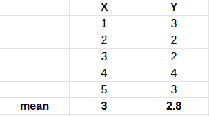
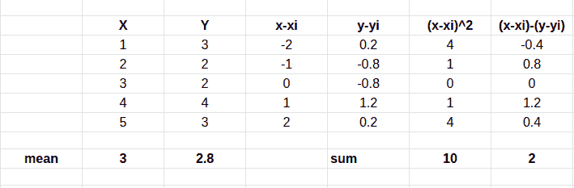
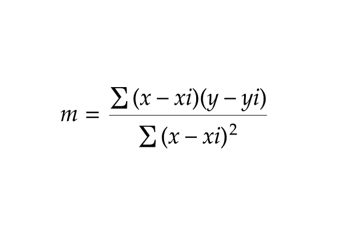
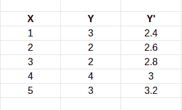
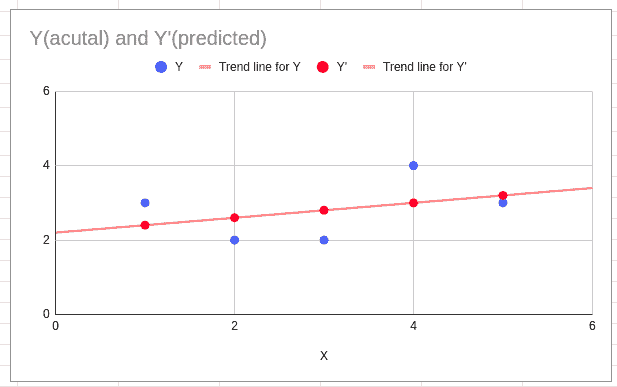

# 线性回归实际工作原理(数学深度直觉)

> 原文：<https://pub.towardsai.net/how-linear-regression-actually-work-maths-in-depth-intuition-93530b1ad071?source=collection_archive---------1----------------------->

## [数学](https://towardsai.net/p/category/mathematics)


由[艾萨克·史密斯](https://unsplash.com/@isaacmsmith?utm_source=unsplash&utm_medium=referral&utm_content=creditCopyText)在 [Unsplash](https://unsplash.com/s/photos/graph?utm_source=unsplash&utm_medium=referral&utm_content=creditCopyText) 上拍摄的照片

让我们从我在 Quora 上发现的一些东西开始吧

```
**Manager**: Okay, we need a system for detecting pedestrians in real time on the road!**Engineer**: I’m sure there’s an R package that does it! Alternatively, we can use Scikit-SelfDrivingCar or something. I bet we can get it done the next week!A few hours of googling later…**Engineer**: Apparently, there’s nothing like that. Let’s do some heavy lifting — we will use Scikit-VisionMagic, download a dataset for it in .csv format from Kaggle, call a bunch of standard methods from tutorial and ship it to production!Next day:**Engineer**: Uuuh, there’s no readily available datasets, no out-of-the-box libraries…Sigh. Alright, let’s use Keras and someone’s project from Github!A few denigrating comments from StackOverflow later…**Engineer**: Okay, I’ve managed to run it on our data, but this model gives us some weird artifacts that were not reported in the instructions…Guess, I’ll have to learn Keras deeper and try to fix that.A few questions on Quora later:**Manager**: Hey, how’s that pedestrian thing going?**Engineer**: Pretty good, just a few more minor fixes!*muffed sound of crash in the background***Engineer**: Turns out this model was good only for demonstration! I’ll have to write my own in TensorFlow…A few days of copy-pasting tutorial code later:**Manager**: Dude, we are in no rush, but you’ve told us that you’d be done by now.**Engineer**: Yeah, there were some complications, need to make sure everything goes smoothly after the release.Do you hear that sound? That’s the sound a gradient makes when it explodes.**Engineer**: This pre-implemented loss function is a mess! And I will have to write a couple of my custom layers, and a loss function, and the regularization that’s not shipped in the available library…so many things to study.One ML course later.**Engineer**: Turns out the receptive field was too narrow…if only I took a class on deep learning…**Engineer**: Oh, that batch normalization thing really rocks! Why don’t they write it in scikit-learn tutorial?One Goodfellow’s book later.**Engineer**: Finally! I’ve broken a ton of things on my own and made a ton of mistakes that could be avoided, but hey, that’s the fun of learning!**Engineer**: Alright, it works, the simulations look pretty good!**Deployment engineer**: Great! But your system requires 24Gb of memory and can’t process more than 2 frames per second on a high-end Titan card. We can’t use it in a car.**Engineer**: Damn it! It looks like I’ll need a fast inference method and reduced memory consumption…if only I knew the computational complexity of every part of my network and the amount of parameters like they teach in the algorithms course…And what’s about that FP16 thing anyway?..**Manager**: We have run out of funding and everyone is fired.**Fin**.The moral of the story is that you can’t outgoogle good fundamental education and relevant technical knowledge.**credit** :- https://www.quora.com/Why-should-one-learn-machine-learning-from-scratch-rather-than-just-learning-to-use-the-available-libraries
```

所以简单来说，机器学习不止于”。适合“和”。预测”的方法。我们可以简单地使用”。适合“和”。预测”方法，但是如果我们不知道这些算法实际上是如何工作的，我们就不能对这些预先构建的方法进行调整...

**我们将在本文中讨论的内容**

*   什么是机器学习？
*   什么是线性回归？
*   线性回归背后的数学。

> **什么是机器学习？**

M**achine learning**(**ML**)是对能够通过经验和使用数据自动改进的计算机算法的研究。它被视为人工智能的一部分。机器学习算法基于样本数据(称为训练数据)建立模型，以便在没有明确编程的情况下进行预测或决策。机器学习算法用于各种各样的应用中，例如在医学、电子邮件过滤、语音识别和计算机视觉中，在这些应用中，开发常规算法来执行所需的任务是困难的或不可行的。[维基]

我们主要有 3 种机器学习技术

**监督学习** - >在监督收益中我们有- >分类和回归

**无监督学习** - >在无监督中我们有- >降维- >聚类

**强化学习**

> **什么是线性回归？**

线性回归是一种用来模拟观察变量之间关系的技术。简单线性回归背后的思想是将两个变量的观察值“拟合”成它们之间的线性关系。它提供了预测(称之为‘Y’)和输入(称之为‘X’)之间的线性关系。预测变量也称为因变量，输入 X 称为自变量。

如果只有一个自变量，它被称为简单线性回归，如果有一个以上的自变量，那么它被称为多元线性回归。

> **让我们学习线性回归背后的数学**

S 假设我们将‘X’作为自变量，将‘Y’作为因变量。

```
X = [1,2,3,4,5]Y = [3,2,2,4,5]
```


x 和 Y 坐标图

现在我们需要找到 X 和 y 的平均值

```
**Mean = sum of total observation / total no of observation**
```

****

**x 和 y 的平均值**

```
**Now Xi = 3 and Yi = 2.8**
```

**我们都知道直线的方程式是**

```
**y = mx + c** 
```

**为了找到 m 和 x 的值，我们需要做一些计算**

****

**一点计算**

**为了找到 m 的值**

****

**为了找到 m 的值**

**所以如果你在我们的方程中放入数值，我们得到**

```
**m = 2/10 = 0.2**
```

> **为了找到 c，我们有 y = mx + c**

**将 x，y 和 m 的值放入我们得到的等式中**

```
y = mx + c2.8 = 0.2 * 3 + c2.8 = 0.6 + cc = 2.8–0.6c = 2.2
```

**所以我们有 c= 2.2，我们的平均值是(3，2.8)，让我们用这些点画一条线。**

**现在我们有了 m 和 c 的值，所以我们可以找到我们的初始回归线**

****

**初始回归线**

**现在让我们用上面的等式来预测 y '的值**

**给定 X = [1，2，3，4，5]，c = 2.2，m = 0.2，我们需要预测 y '(预测 y 的值)**

```
**For x = 1**y’1 = mx + c=> y’1 = (0.2 * 1) + 2.2=> y’1 = 2.4**For x = 2**y’2 = mx + c=> y’2 = (0.2 * 2) + 2.2=> y’2 = 2.6**For x = 3**y’3 = mx + c=> y’3 = (0.2 * 3) + 2.2=> y’3 = 2.8**For x = 4**y’4 = mx + c=> y’4 = (0.2 * 4) + 2.2=> y’4 = 3**For x = 5**y’5 = mx + c=> y’5 = (0.2 * 5) + 2.2=> y’5 = 3.2
```

**所以在计算 y '的值后**

****

**预测 y 值**

**如果我们绘制这些数据，我们会得到**

****

**实际值(y)和预测值(y’)之间的图**

**如你所见，我们已经得到了预测的 y '，**现在我们的目标是缩小实际 y '值和预测 y '值之间的距离。****

**有很多方法可以最小化实际值和预测值之间的距离，如“误差平方和”、“绝对误差”、“均方根误差”、“梯度下降”等**

**我不打算在本文中讨论这些方法，但是在我以后的文章中，我们肯定会了解这些方法。**

**查看本文的[部分-2](/how-linear-regression-actually-work-maths-in-depth-intuition-part-2-c49a8db03013) ,在这里我们用 Python 实现了迄今为止我们学到的任何东西**

**[](/how-linear-regression-actually-work-maths-in-depth-intuition-part-2-c49a8db03013) [## 线性回归如何实际工作(数学深度直觉)-第 2 部分

### 让我们从头开始实现线性回归……

pub.towardsai.net](/how-linear-regression-actually-work-maths-in-depth-intuition-part-2-c49a8db03013) 

就这样吧，下一篇文章再见。

> **看看我以前的文章:**

[](/dimensional-reduction-feature-selection-part-1-d5e4fac63a11) [## 降维—特征选择第 1 部分

### 特征选择是一个过程，在这个过程中，我们试图减少特征的数量，只找到相关的特征…

pub.towardsai.net](/dimensional-reduction-feature-selection-part-1-d5e4fac63a11) [](/lets-learn-about-dimensionality-reduction-df4622f30c84) [## 让我们来学习降维

### 降维，或称降维，是将数据从高维空间转换到多维空间

pub.towardsai.net](/lets-learn-about-dimensionality-reduction-df4622f30c84) [](https://medium.com/nerd-for-tech/machine-learning-automation-1c112e099005) [## 机器学习自动化…

### "仅仅因为你能使某件事自动化，并不意味着它就应该自动化."

medium.com](https://medium.com/nerd-for-tech/machine-learning-automation-1c112e099005) [](https://medium.com/@iamhimanshutripathi0/product-recommendation-based-on-visual-similarity-on-the-web-machine-learning-project-end-to-end-6d38d68d414f) [## 基于网页视觉相似性的产品推荐:机器学习项目…

### 众所周知，谷歌、亚马逊、网飞等大型科技公司都在使用推荐系统…

medium.com](https://medium.com/@iamhimanshutripathi0/product-recommendation-based-on-visual-similarity-on-the-web-machine-learning-project-end-to-end-6d38d68d414f) [](https://medium.com/datadriveninvestor/natural-langauge-processing-nlp-for-indian-language-hindi-on-web-64d83f16544a) [## Web 上印度语言(印地语)的自然语言处理(NLP)

### "语言是一个秘密，每个人都可以处理，对我来说，这是美丽的."

medium.com](https://medium.com/datadriveninvestor/natural-langauge-processing-nlp-for-indian-language-hindi-on-web-64d83f16544a) [](https://medium.com/analytics-vidhya/what-is-balance-and-imbalance-dataset-89e8d7f46bc5) [## 什么是平衡和不平衡数据集？

### 不平衡数据集到平衡数据集的转换技术及其比较

medium.com](https://medium.com/analytics-vidhya/what-is-balance-and-imbalance-dataset-89e8d7f46bc5) [](https://medium.com/analytics-vidhya/brain-tumor-classification-transfer-learning-e04f84f96443) [## 基于迁移学习的脑肿瘤分类

### 迁移学习的详细解释以及如何使用它进行分类

medium.com](https://medium.com/analytics-vidhya/brain-tumor-classification-transfer-learning-e04f84f96443) [](https://medium.com/analytics-vidhya/different-type-of-feature-engineering-encoding-techniques-for-categorical-variable-encoding-214363a016fb) [## 用于分类变量编码的不同类型的特征工程编码技术

### "让我们从现有的功能创建新的功能."

medium.com](https://medium.com/analytics-vidhya/different-type-of-feature-engineering-encoding-techniques-for-categorical-variable-encoding-214363a016fb) 

如果你觉得这篇文章有趣，有帮助，如果你从这篇文章中学到了什么，请鼓掌(👏👏)**并留下反馈。**

**我们连线上**[**Linkedin**](https://www.linkedin.com/in/iamhimanshu0/)**，**[**Twitter**](https://twitter.com/iam_himanshu0)**，**[**insta gram**](https://instagram.com/iamhimanshu0/)**，**[**Github**](https://github.com/iamhimanshu0)**，以及** [**脸书**](https://www.facebook.com/iamhimanshu0) **。**

**感谢阅读！****