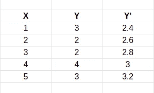
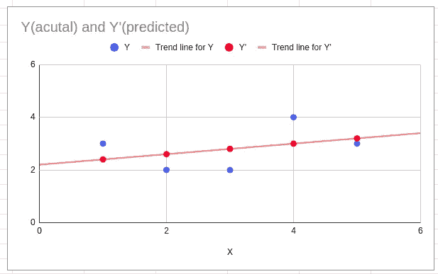
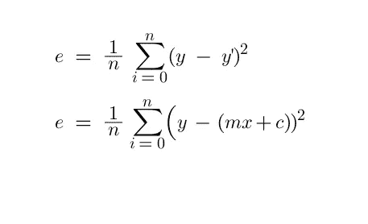
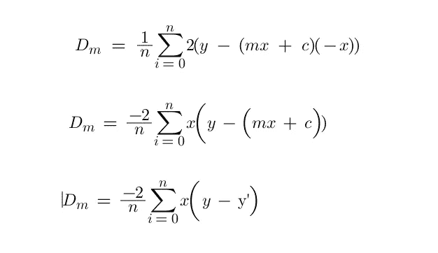
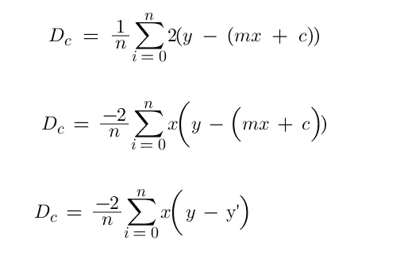
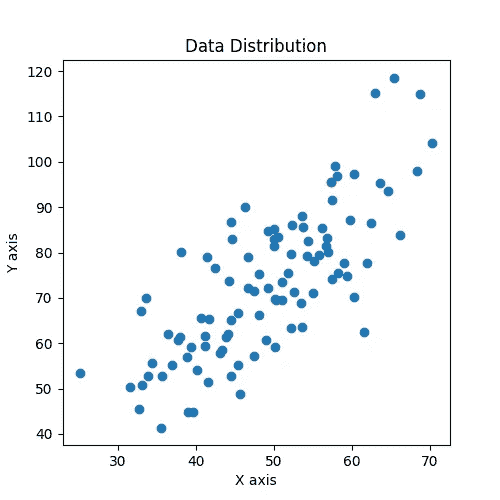
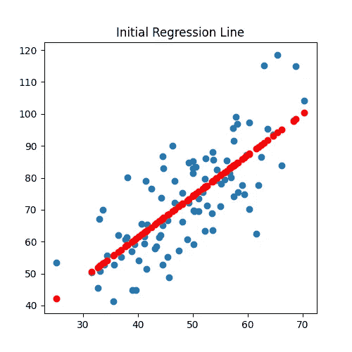
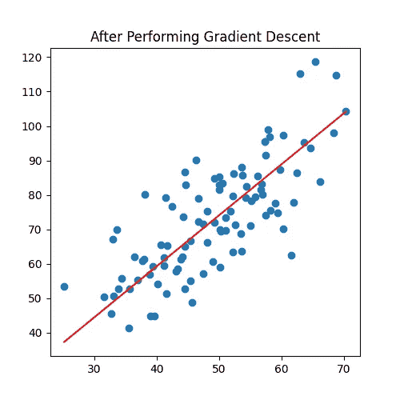

# 线性回归如何实际工作(数学深度直觉)-第 2 部分

> 原文：<https://pub.towardsai.net/how-linear-regression-actually-work-maths-in-depth-intuition-part-2-c49a8db03013?source=collection_archive---------1----------------------->

## [机器学习](https://towardsai.net/p/category/machine-learning)


由[王思然·哈德森](https://unsplash.com/@hudsoncrafted?utm_source=unsplash&utm_medium=referral&utm_content=creditCopyText)在 [Unsplash](https://unsplash.com/s/photos/pen-paper-computer?utm_source=unsplash&utm_medium=referral&utm_content=creditCopyText) 上拍摄的照片

欢迎来到第 2 部分“线性回归实际上是如何工作的(数学深度直觉)”……在[上一篇文章](/how-linear-regression-actually-work-maths-in-depth-intuition-93530b1ad071)中，我们已经了解了实现线性回归需要知道的一切，在本文中，我们将学习最重要的主题，称为“**梯度下降算法**”，我们将仅使用 NumPy 和明显的数学在 python 中实现线性回归算法。

**我们将在本文中讨论的内容**

*   线性回归的误差是多少？
*   什么是梯度下降算法(数学解释)…

在阅读本文之前，我强烈建议您阅读本文的第 1 部分，这样我们就能达成共识。

> 我们开始吧

> **什么是线性回归中的误差？**



实际值(y)和预测值(y’)

所以在我们之前的文章中，我们已经用公式预测了 y '的值

```
y = mx + c
```

画出了实际值(y)和预测值(y’)之间的图表，我们得到了这种图表



y 和 y '之间的图形

正如我们可以看到的，我们的预测值(y’)不同于实际值(y)，所以我们的任务是减少实际值和预测值之间的距离。

> **我们先来了解一下什么是损失函数？**

线性回归最常用的损失函数是最小二乘误差，其代价函数也称为均方误差(MSE)。

那么我们如何找到 **MSE**

*   找出实际值(y)和预测值(y’)之间的差异
*   求差额的平方
*   求平均值



均方误差

> **什么是梯度下降算法(数学解释)**

梯度下降是机器学习中使用的迭代优化算法，用于最小化损失函数。损失函数描述了在给定当前参数集(权重和偏差)的情况下模型的表现，梯度下降用于找到最佳参数集

> 数学上我们需要做什么？

计算损失函数相对于‘m’和‘c’的**偏导数，并更新数值。**

*   损失函数关于“m”的偏导数



偏导数

*   损失函数关于“c”的偏导数



偏导数

因此，在得到“Dm”(偏导数 w.r.t 'm ')和“Dc”(偏导数 w.r.t 'c ')的值后，我们只需更新变量“m”和“c”

所以最初 m=0，c=0，学习率(l)

```
m = m - l * Dm
c = c - l * Dc
```

基本上，这就是我们实现梯度下降算法所需要的。

现在让我们对目前为止所学的内容进行编码，我将使用一个假数据集进行演示。

你可以从我的 [Github](https://github.com/iamhimanshu0/Ml_Linear_Regression_Gradient_Descent) 下载数据集和代码

**导入库**

预处理输入数据并将数据分成因变量(y)和自变量(x)



数据分布

寻找(x-xi)、(y-yi)、(x-xi)和(y-yi)的值，如果这些变量没有任何意义，请查看[以前的文章](/how-linear-regression-actually-work-maths-in-depth-intuition-93530b1ad071)。

**寻找 m 和 c 的值**

**让我们绘制初始回归线**



初始回归线

让我们执行**梯度下降法并初始化数值**

**梯度计算**

**预测并可视化梯度计算后的回归线**



**那么让我们比较一下结果**


正如我们可以看到的，我们的回归线略有移动，并猜测该数据集的最佳拟合线

所以我希望这能帮助你理解线性回归实际上是如何工作的，以及我们如何应用梯度下降算法来解决回归问题。

就这样吧，下一篇文章再见。

**感谢阅读！**