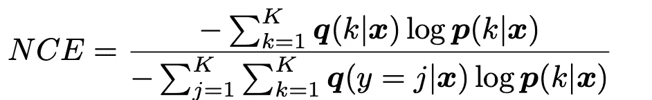
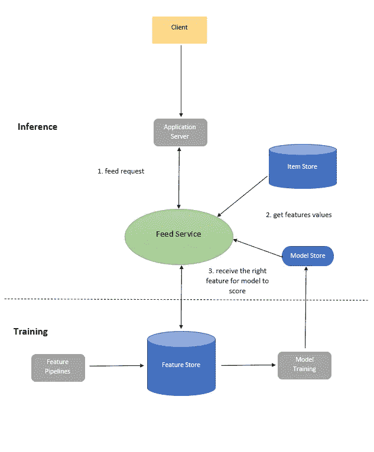
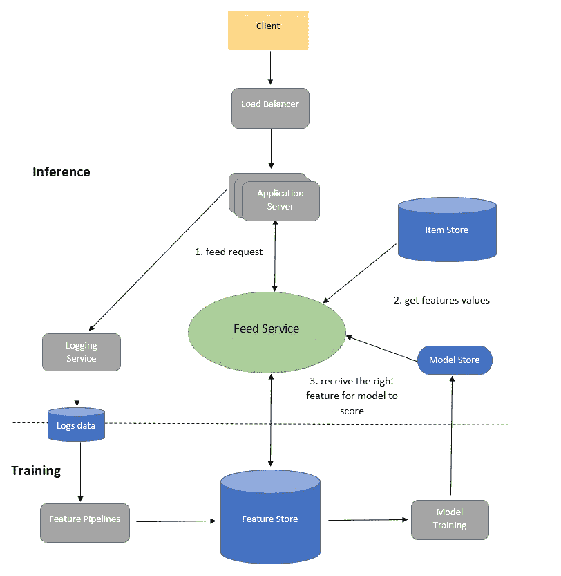

# LinkedIn 如何使用机器学习对你的订阅进行排名

> 原文：<https://pub.towardsai.net/how-linkedin-uses-machine-learning-to-rank-your-feed-95dac90f11c9?source=collection_archive---------0----------------------->

inkedIn feed 是这个网站上数百万用户的起点，它为用户建立了第一印象，正如你所知，这种印象将会持续下去。为每个用户提供有趣的个性化订阅源将传递 LinkedIn 最重要的核心价值，即让用户与他们的网络和活动保持联系，并建立职业身份和网络。

LinkedIn 的个性化订阅源为用户提供了方便，让他们能够快速、高效、准确地看到来自其联系人的更新。除此之外，它还会过滤掉你的垃圾邮件、不专业和不相关的内容，让你参与其中。为了做到这一点，LinkedIn 通过应用一套规则来实时过滤你的新闻提要，根据一系列可操作的指标和预测信号来确定内容的类型。这个解决方案由机器学习和深度学习算法提供支持。

在本文中，我们将介绍 LinkedIn 如何使用机器学习来反馈用户的排名。我们将遵循之前这两篇文章中所涵盖的传统机器学习项目的工作流程:

 [## 端到端机器学习工作流[第 1 部分]

### 如何利用机器学习解决现实世界的商业问题？

medium.com](https://medium.com/mlearning-ai/end-to-end-machine-learning-workflow-part-1-b5aa2e3d30e2)  [## 端到端机器学习工作流[第 2 部分]

### 如何利用机器学习解决现实世界的商业数据

medium.com](https://medium.com/mlearning-ai/end-to-end-machine-learning-workflow-part-2-e7b6d3fb1d53) 

机器学习项目工作流程从业务问题陈述和定义约束开始。然后是数据收集和数据准备。然后是建模部分，最后是部署和将模型投入生产。这些步骤将在对 LinkedIn 提要进行排名的上下文中讨论。

LinkedIn /图片由 [Alexander Shatov](https://unsplash.com/@alexbemore?utm_source=medium&utm_medium=referral) 在 [Unsplash](https://unsplash.com?utm_source=medium&utm_medium=referral) 上提供

# 目录:

1.  **澄清业务问题&约束
    1.1。问题陈述
    1.2。评估指标设计
    1.3。技术要求
    1.4。技术挑战**
2.  **数据收集**
3.  **数据准备**
4.  **建模**
5.  **高层系统设计**
6.  **参考文献**

**如果你想免费学习数据科学和机器学习，看看这些资源:**

*   免费互动路线图，自学数据科学和机器学习。从这里开始:[https://aigents.co/learn/roadmaps/intro](https://aigents.co/learn/roadmaps/intro)
*   数据科学学习资源搜索引擎(免费)。将你最喜欢的资源加入书签，将文章标记为完整，并添加学习笔记。[https://aigents.co/learn](https://aigents.co/learn)
*   想要在导师和学习社区的支持下从头开始学习数据科学吗？免费加入这个学习圈:【https://community.aigents.co/spaces/9010170/】T2

**如果你想在数据科学& AI 领域开始职业生涯，但你不知道如何开始。我提供数据科学指导课程和长期职业指导:**

*   长期师徒:[https://lnkd.in/dtdUYBrM](https://lnkd.in/dtdUYBrM)
*   辅导课程:[https://lnkd.in/dXeg3KPW](https://lnkd.in/dXeg3KPW)

***加入*** [***中等会员***](https://youssefraafat57.medium.com/membership) ***计划，只需 5 美元，继续无限制学习。如果你使用下面的链接，我会收到一小部分会员费，不需要你额外付费。***

 [## 加入我的介绍链接媒体-优素福胡斯尼

### 阅读 Youssef Hosni(以及媒体上成千上万的其他作家)的每一个故事。您的会员费直接支持…

youssefraafat57.medium.com](https://youssefraafat57.medium.com/membership) 

# 1.澄清业务问题和限制

## **1.1。问题陈述**

设计个性化的 LinkedIn feed，最大化用户的长期参与度。因为 LinkedIn 提要应该为每个用户提供有益的专业内容，以增加他的长期参与度。因此，开发剔除低质量内容、只留下高质量专业内容的模式非常重要。然而，重要的是，不要过分热衷于过滤提要中的内容，否则最终会有很多误报。因此，分类模型应该以高精度和高召回率为目标。

我们可以通过测量点击概率或所谓的**点击率** (CTR)来衡量用户参与度。在 LinkedIn feed 上，有不同的活动，每个活动都有不同的 CTR 在收集数据和训练模型时，应该考虑到这一点。有五种主要的活动类型:

*   **建立连接:**成员连接或跟随另一个成员或公司，或页面。
*   **信息:**分享帖子、文章或图片
*   **基于个人资料的活动:**与个人资料相关的活动，如更改个人资料图片、添加新体验、更改个人资料标题等。
*   **观点特定活动:**与会员观点相关的活动，如点赞、评论或转发某个帖子、文章或图片。
*   **特定站点活动**:特定于 LinkedIn 的活动，如背书和求职。

## 1.2.评估指标设计

有两种主要类型的指标:离线和在线评估指标。在训练和建模阶段，我们使用离线指标来评估我们的模型。下一步是转移到暂存/沙盒环境，测试一小部分真实流量。在此步骤中，在线指标用于评估模型对业务指标的影响。如果与收入相关的业务指标显示出持续的改进，那么将模型暴露给更大比例的真实流量是安全的。

**离线指标**

最大化 CTR 可以形式化为训练有监督的二元分类器模型。因此，对于离线度量，可以使用归一化交叉熵，因为它有助于模型对背景 CTR 不太敏感:

**在线指标**

由于在线指标应该反映模型部署时用户的参与程度，因此我们可以使用转换率，即每个提要的点击率。

## **1.3。技术要求**

技术要求将分为两大类:在**训练**期间和在**推理**期间。**培训**时的技术要求是:

*   **大型训练集**:训练期间的主要需求之一是能够处理大型训练数据集。这需要分布式训练设置。
*   **数据转移**:在社交网络中，从离线训练数据到在线数据的数据分布转移非常普遍。这个问题的一个可能的解决方案是每天多次递增地重新训练模型。

推理过程中的技术要求是:

*   **可扩展性:**能够为超过 3 亿用户提供定制的用户订阅源。
*   **延迟:**为了能够在 250 毫秒之内为用户提供经过排名的订阅源，短延迟是非常重要的。由于在将活动馈送到排名模型之前，多个管道需要从多个来源提取数据，因此所有这些步骤都需要在 200 毫秒之内完成。因此
*   **数据新鲜度**:重要的是模型要知道用户已经看到了什么，否则提要会显示重复的内容，这会降低用户的参与度。因此，数据需要运行得非常快。

## 1.4.技术挑战

有四个主要的技术挑战:

*   **可伸缩性:**主要的技术挑战之一是系统的**可伸缩性**。因为需要服务的 LinkedIn 用户数量非常大，大约有 3 亿用户。每个用户平均每次访问看到 40 个活动，每个用户平均每月访问 10 次。因此，我们有大约 1200 亿个观察或样本。
*   存储:另一个技术挑战是巨大的数据量。假设每月点击率为 1%。因此，收集的正面数据将是大约 10 亿个数据点，而负面标签将是 1100 亿个负面。我们可以假设对于每个数据点，有 500 个特征，并且为了简化计算，我们可以假设每行特征将需要 500 个字节来存储。因此，一个月内，将有 1200 亿行，每行 500 字节，因此，总大小将为 60tb。因此，我们只能将过去六个月或去年的数据保存在数据湖中，并将其余数据存档在冷存储中。
*   **个性化:**另一个技术挑战是**个性化**因为你会有不同兴趣的用户，所以你需要确保每个用户的模型都是个性化的。
*   **内容质量评估**:由于没有完美的分类器。因此，一些内容会落入灰色地带，即使是两个人也很难就向用户显示的内容是否合适达成一致。因此，结合人机解决方案进行内容质量评估变得非常重要。

# 2.数据收集

在训练机器学习分类器之前，我们首先需要收集标记数据，以便对模型进行训练和评估。数据收集是数据科学项目中的一个关键步骤，因为我们需要收集我们试图解决的问题的代表性数据，并与模型投入生产时的预期结果相似。在本案例研究中，目标是收集不同类型帖子和内容的大量数据，如 1.1 小节所述。

在我们的例子中，我们想要收集的标签数据将点击或不点击来自用户提要的标签数据。收集点击和非点击数据有三种主要方法:

*   对用户的 feed 进行长期排名:将从用户 feed 中收集数据，并对其进行长期排名。这种方法可以用来收集数据。但是，它会根据用户的注意力会被吸引到前几个饲料。此外，这种方法会导致数据稀疏问题，因为与其他活动相比，一些活动(如工作变动)很少发生，所以它们在您的数据中不会得到充分体现。
*   随机提供:第二种方法是随机提供提要，并收集点击和非点击数据。这种方法不是首选的，因为它将导致糟糕的用户体验和不具代表性的数据，并且它也无助于解决数据稀疏问题。
*   使用算法对提要进行排序:我们可以使用的最后一种方法是使用算法对用户的提要进行排序，然后使用 permutation 对排名靠前的提要进行随机排序。这将为提要提供一些随机性，并有助于从不同的活动中收集数据。

# 3.数据预处理和特征工程

第三步是为建模步骤准备数据。这一步包括数据清理、数据预处理和特征工程。数据清理将处理缺失数据、异常值和有噪声的文本数据。数据预处理将包括标准化或规范化、处理文本数据、处理不平衡数据以及其他取决于数据的预处理技术。特征工程将包括特征选择和降维。这一步主要取决于数据探索步骤，因为您将获得更多的理解，并对数据和如何进行这一步有更好的直觉。

可以从数据中提取的特征有:

*   **用户资料特征:**这些特征包括职位、用户行业、人口统计、教育、以前的经验等。这些特征是分类特征，因此必须将其转换为数值，因为大多数模型无法处理分类特征。对于较高的基数，我们可以使用特性嵌入，对于较低的基数，我们可以使用一种热编码。
*   **连接强度特征:**这些特征代表了用户之间的相似性。我们可以为用户使用嵌入，并测量他们之间的距离来计算相似性。
*   **活动年龄特征:**这些特征代表每个活动的年龄。这可以作为一个连续的特征来处理，或者可以根据点击目标的灵敏度来进行分类。
*   **活动特征:**这些特征代表活动的类型。比如标签、媒体、文章等等。这些特征也将是分类的，而且和以前一样，它们必须使用特征嵌入或一个热编码转换成数字，这取决于基数的级别。
*   **亲和特征:**这些特征代表了用户和活动之间的相似性。
*   **观点特征:**这些特征代表用户对帖子、文章、图片、工作变动、s 等活动的喜欢/评论。

由于 CTR 通常非常小(小于 1%)，这将导致不平衡的数据集。因此，数据预处理阶段的关键步骤是确保数据平衡。因此，我们必须对数据进行重新采样，以增加代表性不足的类别。

**然而，这应该只对训练集进行，而不是对验证和测试集，因为它们应该代表预期在生产中看到的数据。**

# 4.建模

现在建模部分的数据已经准备好了，是时候选择和训练模型了。如前所述，这是一个分类问题，这个分类问题中的目标值就是点击量。对于这个分类任务，我们可以使用逻辑回归模型。由于数据非常大，因此我们可以使用 Spark 中的逻辑回归或使用乘数法进行分布式训练。

我们也可以在分布式设置中使用深度学习模型。其中完全连接的层将与应用于最终层的 sigmoid 激活函数一起使用。

对于评估，我们可以遵循两种方法，第一种是将数据分为训练集和验证集的传统方法。避免有偏见的离线评估的另一种方法是使用重放评估，如下所示:

*   假设我们有截至时间点 T 的训练数据。验证数据将从 T+1 开始，我们将使用训练好的模型对它们进行排序。
*   然后将模型的输出与实际点击进行比较，计算匹配的预测点击数。

有许多超参数需要优化，其中之一是训练数据的大小和保留模型的频率。为了保持模型更新，我们可以用例如最近六个月的训练数据来微调现有的深度学习模型。

# 5.高层设计

我们可以用图 1 所示的高级设计来总结提要排序的整个过程。

让我们看看 feed 排名流程是如何发生的，如下图所示:

*   当用户访问 LinkedIn 主页时，请求被发送到**应用服务器**以获取提要。
*   **应用服务器**向**提要服务发送提要请求。**
*   **Feed Service** 然后从**模型库**获取最新的模型，从**特征库获取正确的特征。**
*   **特征存储:**特征存储，存储特征值。在推断过程中，评分前访问特征的延迟应该很低。
*   **提要服务**接收来自**项目商店的所有提要。**
*   **物品商店:**物品商店存储用户产生的所有活动。除此之外，它还为不同的用户存储模型。因为通过为每个用户提供相同的订阅源排名方法来维护一致的用户体验是很重要的。ItemStore 为合适的用户提供合适的模型。
*   **Feed Service** 然后将为模型提供获得预测的特性。这里的提要服务表示检索和排序服务，以便更好地可视化。
*   该模型将返回按 CTR 可能性排序的提要，然后返回给**应用服务器**。

图一。LinkedIn feed 排名高层设计。

为了扩展 feed 排名系统，我们可以在**应用服务器**的前面放置一个**负载平衡器**。这将在系统中的几个应用服务器之间平衡和分配负载。

图二。缩放的 LinkedIn feed 排名高级设计。

# 6.参考

1.  [保持 LinkedIn Feed 相关性的策略](https://engineering.linkedin.com/blog/2017/03/strategies-for-keeping-the-linkedin-feed-relevant)

2.机器学习设计面试

***喜欢文章？成为*** [***中等会员***](https://youssefraafat57.medium.com/membership) ***继续无限制的学习。如果你使用下面的链接，我会收到一小部分会员费，不需要你额外付费。***

 [## 加入我的介绍链接媒体-优素福胡斯尼

### 阅读 Youssef Hosni(以及媒体上成千上万的其他作家)的每一个故事。您的会员费直接支持…

youssefraafat57.medium.com](https://youssefraafat57.medium.com/membership) 

***感谢阅读！如果你喜欢这篇文章，一定要鼓掌(高达 50！)并在***[***LinkedIn***](https://www.linkedin.com/in/youssef-hosni-b2960b135/)***上与我联系，并在*** [***上关注我，以保持对我的新文章的更新。***](https://youssefraafat57.medium.com/)