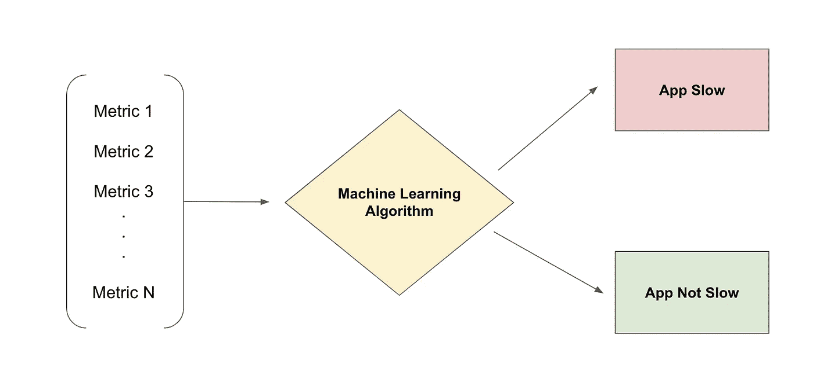
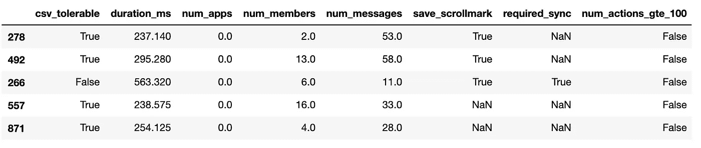
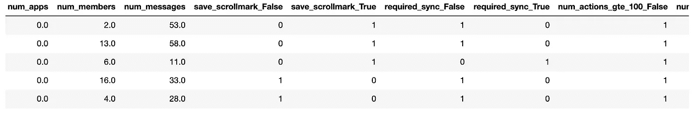
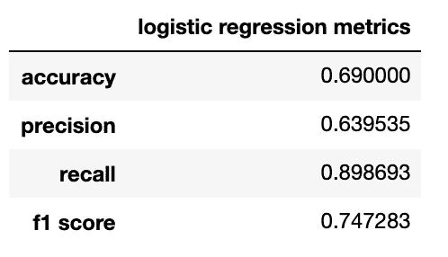
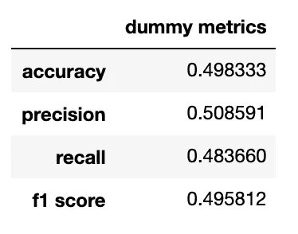
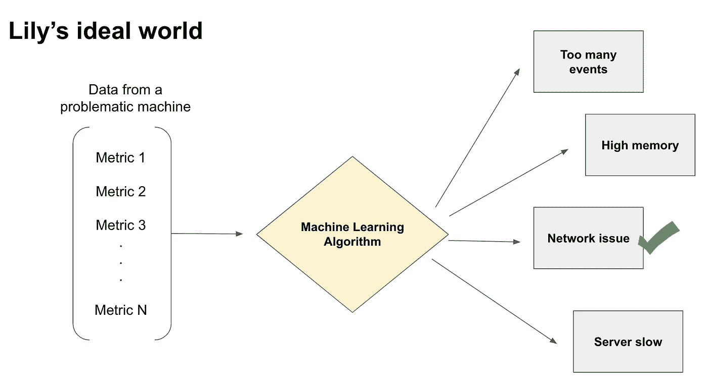

# 机器学习如何用于预测应用程序性能

> 原文：<https://pub.towardsai.net/how-machine-learning-can-be-used-to-predict-application-performance-3e98a61c1694?source=collection_archive---------3----------------------->

## [机器学习](https://towardsai.net/p/category/machine-learning)，[编程](https://towardsai.net/p/category/programming)

## 预测速度和响应度的机器学习案例



作者图片

作为一家大型科技公司前端基础设施团队的工程师，我每天都要处理 web 应用程序的性能。

性能是至关重要的，但在我的职业生涯中，我看到一些团队一直在追求性能，直到他们再也无法逃脱。

我知道性能意味着很多事情。在本文中，我用它来表示响应性，或者说用户与应用程序交互时的速度。

我认为性能受到影响有两个主要原因。一、表演工作辛苦。二、对客户价值影响不大，直到变穷。因此，性能通常是被动处理的。

必须有一个更好的系统！

从性能角度来看，我们能否主动预测发布或拉取请求是否会有问题？

我想答案是肯定的。

但是首先要做的是。什么是“性能好？”

如果一个客户来找你说“我的应用程序很慢”，他们是从他们的主观角度来说的。我不是说不要相信他们，但是我们确实需要首先建立客观的标准来衡量什么是“坏”或“好”的表现。

这些指标取决于应用程序本身；但应该是慢的时候会极大影响用户体验的东西。比如从点击按钮 A 到看到页面 b 的缓冲时间。

在下面的例子中，我将使用一个名为`"csv"`的度量(csv 在本文中是一个度量，不是文件扩展名)。在我目前的工作中，csv 用于衡量应用程序在从一个“对话线程”导航到另一个“对话线程”时的速度。注意:我大大简化了术语，使其易于理解。

因为 csv 是一个重要的指标，所以我的团队花了很多时间追踪可能影响 csv 的东西。我们跟踪了在导航过程中触发的 [redux 动作](https://redux.js.org/tutorials/fundamentals/part-1-overview)的列表；我们测量了对话中有多少成员，安装了多少外部应用，缓存了多少消息，等等。

需要注意的重要一点是**这些指标(不同于 csv)是开发人员或产品决策者可以直接控制的。**例如，工程师可以重构代码以减少 redux 操作的数量，或者限制缓存的消息数量，等等。

现在我们有了所有这些指标，我们是否可以使用它们来预测特定的部署(每个部署都有一个我们可以跟踪的唯一标识符)是否会导致更差的性能？

为了回答这个问题，我用 csv 数据做了一些初步的机器学习。

我分析了 2000 个样本。以下是前 5 个培训示例:



`csv_tolerable`(第一列)是我们想要训练模型来预测的。True 表示 csv 可以接受，false 表示不可以接受。

`duration_ms`是导航花费的时间。这是用来确定`csv_tolerable`的。最后一列，`num_actions_gte_100`表示导航期间触发的 redux 动作的数量是否大于 100。

这 2000 个训练样本中，1000 个有可容忍 csv，1000 个不可容忍 csv。

**这里的目标是训练一个模型，根据员工可以控制的其他指标来预测 csv 是否可以容忍——这是员工无法控制的。**

在训练模型之前，我进行了基本的数据处理，以:

1.  单独的目标列(即 csv _ tolerable)。
2.  移除`duration_ms`,因为它决定 csv_tolerable。
3.  填写缺失值(NaN => False)。
4.  用一键编码转换分类变量。

这是最终输入数据帧的样子。



前 5 个培训示例

然后，我将 2000 个样本分成训练集和测试集。

现在我们准备训练一个模型。我使用 Scikit-Learn 的 [RandomizedSearchCV](https://scikit-learn.org/stable/modules/generated/sklearn.model_selection.RandomizedSearchCV.html) 来为我的模型寻找最佳超参数。

```
from sklearn.model_selection import RandomizedSearchCV
from scipy.stats import uniformX_train, X_test, y_train, y_test = train_test_split(X, y, test_size=0.3, random_state=42)logistic = LogisticRegression(max_iter=50000, random_state=0, solver='liblinear')distributions = dict(C=uniform(loc=0, scale=10), penalty=['l2', 'l1'])random_search = RandomizedSearchCV(logistic, n_iter=100, param_distributions=distributions, random_state=2)random_search.fit(X_train, y_train)result = random_search.cv_results_
estimator = random_search.best_estimator_
score = random_search.best_score_
params = random_search.best_params_
```

最佳参数和分数为:

```
best score 0.666
best params {'C': 4.3532239261827685, 'penalty': 'l2'}
```

训练之后，我使用测试集来评估我的模型的预测能力。

```
from sklearn.metrics import f1_score
from sklearn.metrics import accuracy_score
from sklearn.metrics import recall_score
from sklearn.metrics import precision_scoreclassifier = LogisticRegression(max_iter=50000, random_state=1000, penalty='l2', C=4.3532239261827685, solver='liblinear')classifier.fit(X_train, y_train)y_pred = classifier.predict(X_test)data = {
    'accuracy': [accuracy_score(y_test, y_pred)],
    'precision': [precision_score(y_test, y_pred)],
    'recall': [recall_score(y_test, y_pred)],
    'f1 score': [f1_score(y_test, y_pred)]
}pd.DataFrame.from_dict(data, orient='index', columns=['metrics'])
```



训练模型的准确度、精确度、召回率和 f1 分数

我将它与一个虚拟模型进行了比较，该模型基于我们标签的分布进行预测。正如预期的那样，准确率在 50%左右，因为我们 50%的训练数据都有可容忍的 csv。



假人模型的准确度、精确度、召回率和 f1 分数

经过训练的模型表现明显好于虚拟模型。因此，我的结论是，工程师和产品经理可以直接控制的指标可以用来预测性能。

我知道 60 多的精确度并不好。理想情况下，我想要一个精度在 80 多的模型。我确实认为有可能到达那里。

此示例仅为**概念验证(POC)** 。我走了很多捷径。首先，我使用了逻辑回归。当输入变量呈正态分布时，逻辑回归效果最佳。实际上，自变量如`num_members`或`num_messages`可能不具有正态分布。

此外，我没有对该数据集进行任何特征选择。我也没有标准化数据或寻找异常值。我在本次概念验证中使用了最容易获得的指标。我们还有其他需要更多处理和查询才能获得的指标。这里有一个[便捷指南](https://www.keboola.com/blog/logistic-regression-machine-learning)，包含逻辑回归的数据处理步骤。

有了更好的数据和更好的算法，也许我们可以训练一个精确度在 80 多的模型。

我个人坚信，大数据与机器学习相结合可以解决无数的性能问题，从预测拉请求是否会导致更差的性能指标，到对导致性能问题的原因进行分类。

在理想的世界中，工程师很少需要花时间去弄清楚为什么一个应用程序很慢；他们可以很快解决问题本身！



作者图片