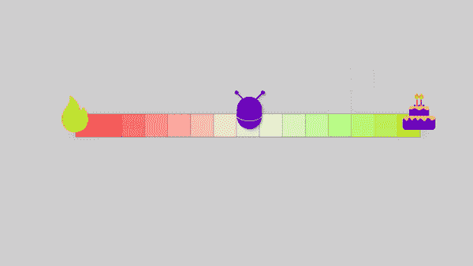

# 机器如何在所有方面打败人类

> 原文：<https://pub.towardsai.net/how-machines-beat-humans-at-everything-9d25eafdf256?source=collection_archive---------0----------------------->

## [人工智能](https://towardsai.net/p/category/artificial-intelligence)，[机器学习](https://towardsai.net/p/category/machine-learning)

## 发现机器如何在它们使用强化学习攻击的大多数领域中变成超人。

> 最初发表于 [louisbouchard.ai](https://www.louisbouchard.ai/reinforcement-learning-icjai-21/) ，前两天在[我的博客](https://www.louisbouchard.ai/reinforcement-learning-icjai-21/)上看到的！

听听这个故事…

你大概听说过国际象棋、围棋，甚至一些像 Dota 这样的电子游戏的世界冠军都是机器。人工智能的最新进展使研究人员能够在这些游戏中击败世界上最好的人类玩家，这要归功于一种叫做**强化学习**的技术。同样的技术也允许机器人行走、开门，甚至踢足球。但是这种技术到底是什么？这篇短文旨在介绍这项技术的基础知识，并概述其工作原理。

## 它是如何工作的

强化学习受到生物的启发:优化正负奖励。

强化学习是一种受生物启发的技术。一般来说，生物正在学习某些行为以获得奖励或避免惩罚。如果你正在吃好吃的东西，你可能会想再吃一次。如果你正在触摸一个热炉子，很可能你不想再做一次。强化学习就是做同样的事情:教会机器如何获得积极的回报，避免消极的回报。我们称这些机器为“代理”

在其环境(足球场)中进化的智能体。

这些代理在一个环境中进化。他们将观察这个环境，并根据这些观察采取行动。根据他们行动的结果，他们将得到奖励，无论是正面的还是负面的。一开始代理会随机表现，但是通过试错会越来越好。换句话说，他们正在学习最大化他们一生中得到的奖励。

## 一个简单的例子…

让我们看一个简单的例子。你在一条假想的线上，一边是一个可以吃的蛋糕，另一边是燃烧的火堆。在这种情况下你会怎么做？通常，你的答案会是径直走向蛋糕。否则在火堆里走会受伤的。但是计算机如何知道这些并学习同样的决策过程呢？通过反复试验！

正如我们所讨论的，首先，代理人会随机行动。一半的时间，它会去左边，另一半去右边。但在某个时刻，它会达到其中一个回报，无论是积极的还是消极的。

一个简单的强化学习的例子，代理探索它的环境以获得最大的回报。

这时，代理人知道往左会痛，或者反过来，如果足够幸运，它会知道蛋糕有多好吃。就是这样！一旦它了解到这些奖励，它就可以在这种环境中有最佳的行为，每次都直接去吃蛋糕。

这是一个简单的例子，因为代理的唯一可能性是向右或向左。然而，通常它会有更多可能的路径。即使它已经在如此复杂的环境中找到了好的回报，它还需要继续寻找更好的回报。换句话说，也许下一个拐角处有一个更大的蛋糕在等着我们，所以我们需要时不时地抓住机会看一看。

我们可以和现实世界做一个比较。如果你像我一样，习惯了定期在同一家披萨店点同样的披萨，但如果你偶尔尝试一家新的呢？你可能会更加欣赏它，并认为它是你的新宠。如果不尝试新的东西，你永远不会发现这种改进，即使你已经享受了第一次的味道。

## 结论

当然，不是每个场景都这么简单，但是在强化学习中，每个问题都可以这么看。对于每个新的挑战，代理人将面临的唯一变化是它将进化的环境类型。无论是棋盘、电子游戏，甚至是学习如何行走的机器人的马达状态，逻辑都是一样的:代理人尝试事物，观察环境对他的行动的反应，并适应未来做得更好。你可以把强化学习看作是机器以达尔文主义的方式学习。

如果这对你有意义，那么恭喜你！您现在了解了什么是强化学习以及它是如何工作的。当然，还有更多技术细节，但这是这一惊人技术的要点，具有惊人的能力

## 文章作者

——马利克·科斯坦蒂尼，[领英](https://www.linkedin.com/in/malrick-costantini-25316687/)，[网站](http://www.malrickcostantini.com/)

—伊莱亚斯·伊尔马里，[领英](https://www.linkedin.com/in/eliasliinamaa/)，[网站](https://nordicgrit.com/)

—路易-弗朗索瓦·布沙尔，[领英](https://www.linkedin.com/in/whats-ai/)，[网站](https://www.louisbouchard.ai/)

如果你喜欢我的工作，并想与人工智能保持同步，你绝对应该关注我的其他社交媒体账户( [LinkedIn](https://www.linkedin.com/in/whats-ai/) 、 [Twitter](https://twitter.com/Whats_AI) )并订阅我的每周人工智能[简讯](http://eepurl.com/huGLT5) ！

## 支持我:

*   支持我的最好方式是成为这个网站的成员，或者如果你喜欢视频格式，在[**YouTube**](https://www.youtube.com/channel/UCUzGQrN-lyyc0BWTYoJM_Sg)**上订阅我的频道。**
*   **在经济上支持我在 T21 的工作**
*   **跟我来这里上 [**中**](https://whats-ai.medium.com/)**